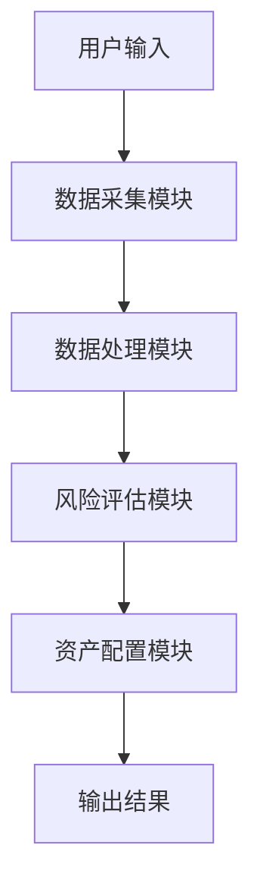

                 


# 资产配置的价值：在高波动市场中平衡风险与回报

> 关键词：资产配置、高波动市场、风险与回报、现代投资组合理论、动态再平衡、风险管理

> 摘要：本文深入探讨了资产配置在高波动市场中的重要性，分析了如何通过科学的资产配置策略平衡风险与回报。从理论基础到实战应用，本文结合现代投资组合理论（MPT）、风险管理策略、动态再平衡方法，详细阐述了在复杂多变的市场环境中实现稳健投资的方法。通过系统化的资产配置架构设计和实际案例分析，本文为投资者提供了实用的指导和建议。

---

# 第一部分: 资产配置的背景与基础

---

# 第1章: 资产配置的基本概念

## 1.1 资产配置的定义与分类

### 1.1.1 资产配置的定义

资产配置是指将资金分配到不同资产类别（如股票、债券、房地产、现金等）中的过程，旨在在风险可控的前提下实现收益最大化。资产配置的核心在于通过多样化投资降低风险，同时捕捉不同资产类别在不同市场环境下的收益机会。

### 1.1.2 资产配置的分类

资产配置可以分为以下几类：

1. **战略资产配置**：基于长期投资目标和市场预期，确定各类资产的配置比例。
2. **战术资产配置**：根据短期市场环境的变化，动态调整资产配置比例。
3. **被动型资产配置**：按照固定比例分配资产，较少调整。
4. **主动型资产配置**：根据市场变化频繁调整资产配置比例。

### 1.1.3 资产配置的重要性

资产配置是投资组合管理的核心，直接影响投资组合的收益与风险。合理的资产配置可以帮助投资者在不同市场环境下优化风险收益比，避免单一资产的剧烈波动对整体投资组合的影响。

---

## 1.2 高波动市场的特点

### 1.2.1 市场波动的定义

市场波动通常指资产价格在短期内的剧烈波动，可以用波动率来衡量。波动率越高，市场波动越大。

### 1.2.2 高波动市场的特征

1. 资产价格短期波动剧烈。
2. 市场情绪化，投资者行为容易受到市场情绪影响。
3. 市场参与者对风险的敏感性增加。

### 1.2.3 高波动市场对资产配置的影响

在高波动市场中，资产配置需要更加谨慎。投资者需要通过多样化配置、动态调整和风险管理来应对市场的不确定性。

---

## 1.3 资产配置的基本原理

### 1.3.1 投资组合理论概述

投资组合理论（Portfolio Theory）是资产配置的理论基础。通过合理分配资产，投资者可以在风险可控的前提下获得最大收益。

### 1.3.2 风险与收益的平衡

资产配置的核心在于在风险与收益之间找到平衡点。通过分散投资，投资者可以降低非系统性风险，同时捕捉不同资产类别的收益机会。

### 1.3.3 资产配置的目标

1. 实现投资收益最大化。
2. 控制整体投资组合的风险。
3. 适应不同市场环境的变化。

---

## 1.4 本章小结

本章介绍了资产配置的基本概念、高波动市场的特点以及资产配置的基本原理。资产配置是投资组合管理的核心，尤其是在高波动市场中，科学的资产配置策略可以帮助投资者在风险与收益之间找到最佳平衡点。

---

# 第2章: 现代投资组合理论（MPT）基础

## 2.1 MPT的核心思想

### 2.1.1 风险与收益的关系

投资组合理论认为，收益与风险之间存在正相关关系。通过合理配置资产，投资者可以在一定风险水平下获得最大收益。

### 2.1.2 投资组合理论的数学模型

现代投资组合理论的核心是通过优化模型确定最优资产配置比例。

### 2.1.3 有效前沿的概念

有效前沿是指在给定风险水平下，能够提供最高收益的所有投资组合的集合。

---

## 2.2 MPT的数学公式

### 2.2.1 均值-方差优化模型

投资组合理论的核心是均值-方差优化模型。通过最小化投资组合的方差（即风险），在给定收益下找到最优配置比例。

$$
\text{目标函数：} \quad \min_w \sigma^2 = w^T \Sigma w
$$

$$
\text{约束条件：} \quad w^T \mu = \text{目标收益}, \quad w^T 1 = 1
$$

其中：
- \( w \) 是资产权重向量。
- \( \Sigma \) 是资产之间的协方差矩阵。
- \( \mu \) 是资产的预期收益向量。

### 2.2.2 马科维茨优化模型

马科维茨优化模型是均值-方差优化的扩展，考虑了投资者的风险偏好。

$$
\text{目标函数：} \quad \min_w \lambda \sigma^2 - \mu^T w
$$

### 2.2.3 投资组合的风险调整收益

风险调整收益可以通过夏普比率（Sharpe Ratio）衡量：

$$
\text{夏普比率} = \frac{E[r_p] - r_f}{\sigma_p}
$$

其中：
- \( E[r_p] \) 是投资组合的预期收益。
- \( r_f \) 是无风险利率。
- \( \sigma_p \) 是投资组合的波动率。

---

## 2.3 MPT在高波动市场中的应用

### 2.3.1 高波动市场中的资产配置策略

在高波动市场中，投资者需要通过动态调整资产配置比例，降低投资组合的波动率。

### 2.3.2 MPT在实践中的挑战

1. 市场波动率难以准确预测。
2. 资产之间的协方差矩阵不稳定。

### 2.3.3 MPT的局限性与改进方向

MPT的核心假设（如资产收益的正态分布）在高波动市场中可能不成立，需要引入更复杂的模型（如非线性模型）。

---

## 2.4 本章小结

本章介绍了现代投资组合理论的核心思想和数学模型，重点分析了MPT在高波动市场中的应用及其挑战。尽管MPT在理论上具有重要价值，但在实践中需要结合实际情况进行调整。

---

# 第3章: 资产配置的核心策略

## 3.1 风险管理策略

### 3.1.1 风险分散化

通过投资不同资产类别和行业，降低非系统性风险。

### 3.1.2 风险对冲

利用衍生工具（如期货、期权）对冲市场风险。

### 3.1.3 风险预算

设定整体投资组合的风险承受上限。

---

## 3.2 波动率管理策略

### 3.2.1 波动率的定义与测量

波动率是资产价格短期波动程度的指标，通常用标准差衡量。

### 3.2.2 波动率的预测与分析

通过历史数据和统计模型预测未来波动率。

### 3.2.3 波动率在资产配置中的应用

根据波动率预测结果，动态调整资产配置比例。

---

## 3.3 动态再平衡策略

### 3.3.1 再平衡的定义与作用

再平衡是指定期调整投资组合的资产配置比例，以维持既定目标。

### 3.3.2 动态再平衡的原理

根据市场环境变化，实时调整资产配置比例。

### 3.3.3 动态再平衡的实施步骤

1. 确定目标配置比例。
2. 定期评估实际配置比例。
3. 根据偏差进行调整。

---

## 3.4 本章小结

本章介绍了资产配置的核心策略，包括风险管理、波动率管理和动态再平衡。这些策略在高波动市场中尤为重要，可以帮助投资者有效控制风险并捕捉收益机会。

---

# 第4章: 资产配置的系统分析

## 4.1 资产配置系统的功能模块

### 4.1.1 数据采集与处理

收集和整理资产的历史数据和实时数据。

### 4.1.2 风险评估与分析

计算资产的风险指标（如波动率、VaR）。

### 4.1.3 资产配置模型设计

基于优化模型确定资产配置比例。

### 4.1.4 系统输出与反馈

生成资产配置报告，并根据市场反馈进行调整。

---

## 4.2 资产配置系统的架构设计

### 4.2.1 系统架构图（Mermaid）



---

## 4.3 资产配置系统的交互流程

### 4.3.1 用户需求分析

用户输入投资目标和风险承受能力。

### 4.3.2 系统输入处理

系统接收用户输入并进行数据处理。

### 4.3.3 系统计算与输出

系统根据优化模型计算资产配置比例并输出结果。

### 4.3.4 用户反馈与优化

用户根据市场反馈调整输入参数，系统重新计算。

---

## 4.4 本章小结

本章从系统架构的角度分析了资产配置的过程，展示了如何通过模块化设计实现科学的资产配置。

---

# 第5章: 资产配置的项目实战

## 5.1 环境安装与数据准备

### 5.1.1 环境安装

安装Python和相关库（如NumPy、Pandas、Plotly）。

### 5.1.2 数据准备

收集股票、债券等资产的历史数据。

---

## 5.2 系统核心实现源代码

### 5.2.1 数据处理代码

```python
import pandas as pd
import numpy as np

# 假设我们有一个包含股票和债券的数据框
data = pd.DataFrame({
    '股票': [100, 90, 110, 120],
    '债券': [102, 105, 103, 104]
})

# 计算资产的收益
returns = data.pct_change().dropna()
print(returns)
```

### 5.2.2 优化模型实现

```python
import numpy as np

def portfolio_optimization(returns, weights):
    # 计算协方差矩阵
    covariance_matrix = np.cov(returns.T)
    # 计算最优权重
    mu = returns.mean()
    Sigma = covariance_matrix
    # 使用均值-方差优化模型
    # 这里简化为等权重配置
    optimized_weights = np.array([1/len(weights)] * len(weights))
    return optimized_weights

# 示例：计算优化权重
weights = portfolio_optimization(returns, data.columns)
print(weights)
```

---

## 5.3 实际案例分析

### 5.3.1 案例背景

假设我们有两只资产：股票和债券，目标是通过资产配置实现稳健收益。

### 5.3.2 模型实现与结果分析

```python
import matplotlib.pyplot as plt

# 绘制资产的收益分布
returns.plot(kind='box')
plt.title('资产收益分布')
plt.show()
```

---

## 5.4 优化建议

根据优化结果，建议投资者将资产分配到不同类别，以降低整体风险。

---

## 5.5 本章小结

本章通过实际案例展示了资产配置的系统实现，从数据准备到模型优化，再到结果分析，为投资者提供了实用的指导。

---

# 第6章: 总结与展望

## 6.1 总结

资产配置是投资组合管理的核心，尤其是在高波动市场中，科学的资产配置策略可以帮助投资者平衡风险与收益。本文从理论到实践，详细探讨了资产配置的各个方面。

---

## 6.2 展望

未来，随着人工智能和大数据技术的发展，资产配置将更加智能化。投资者可以利用更复杂的模型和工具，实现更精准的资产配置。

---

# 作者

作者：AI天才研究院/AI Genius Institute & 禅与计算机程序设计艺术 /Zen And The Art of Computer Programming

---

# 结语

本文系统地探讨了资产配置在高波动市场中的价值，从理论基础到系统实现，为投资者提供了全面的指导。希望本文能帮助读者在复杂多变的市场环境中，找到平衡风险与回报的最佳策略。

