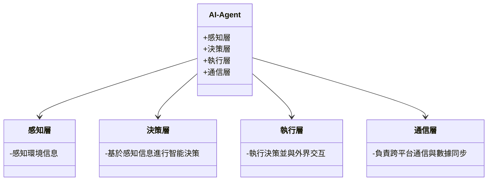

                 

# 跨平台AI Agent：PC、移動端和IoT設備的統一體驗

## 文章關鍵詞

- 跨平台AI Agent
- PC、移動端和IoT設備
- 統一體驗
- 智能協同
- 跨平台通信
- AI-Agent架構

## 摘要

在當今的數位化時代，跨平台AI Agent已成為實現PC、移動端和IoT設備統一體驗的核心技術。本文將探討跨平台AI Agent的核心概念、架構設計、算法原理，並通過實際案例展示如何實現跨平台的智能協同。文章從背景介紹開始，逐步深入分析AI Agent的定義、跨平台特性，探討其在不同設備上的應用場景，並詳細解讀實現跨平台AI Agent所需的算法與架構設計。最後，通過實戰項目展示如何在實際中應用這些技術，並提供最佳實踐建議。

---

# 第一部分：跨平台AI Agent的背景與核心概念

## 第1章：跨平台AI Agent概述

### 1.1 AI Agent的基本概念

#### 1.1.1 AI Agent的定義與特點

AI Agent（人工智能代理）是指能夠感知環境、自主決策並執行操作的智能體。與傳統軟件相比，AI Agent具有以下三個核心特點：

1. **智能性**：AI Agent能夠感知環境並基於感知信息做出智能決策。
2. **自主性**：AI Agent可以在無人干預的情況下自主運行。
3. **反應性**：AI Agent能夠根據環境變化快速反應並調整行為。

#### 1.1.2 跨平台AI Agent的背景與意義

隨著智能設備的普及，用戶希望在不同平台（PC、移動端、IoT設備）上獲得統一的智能體驗。然而，不同平台的硬件能力、操作系統和交互方式存在差異，這導致AI Agent在不同平台上的實現具有挑戰性。跨平台AI Agent的出現，為實現統一智能體驗提供了技術解決方案。

跨平台AI Agent的意義在於：

1. **降低開發成本**：通過統一的架構設計，可以在多平台上重複使用核心功能。
2. **提升用戶體驗**：用戶可以在不同設備上享受一致的智能服務。
3. **擴展應用場景**：跨平台支持使AI Agent能夠應用於更廣泛的場景。

#### 1.1.3 跨平台AI Agent的應用場景

跨平台AI Agent主要應用於以下場景：

1. **PC端**：用於智能助手、自動化工具等。
2. **移動端**：用於智能手機應用、移動助手等。
3. **IoT設備**：用於智能家電、智能家居等IoT應用。

### 1.2 跨平台AI Agent的核心概念

#### 1.2.1 跨平台AI Agent的定義

跨平台AI Agent是指能夠在不同平台（PC、移動端、IoT設備）上運行，並提供統一智能體驗的代理體。其核心在於實現跨平台的通信、數據同步和智能協同。

#### 1.2.2 跨平台AI Agent的特點

跨平台AI Agent具有以下特點：

1. **跨平台兼容性**：能夠在不同平台上運行並提供一致的功能。
2. **統一用戶體驗**：用戶在不同平台上獲得一致的智能服務。
3. **智能協同**：能夠在不同平台上進行數據同步和智能決策。

#### 1.2.3 跨平台AI Agent的架構

跨平台AI Agent的架構通常包括以下組件：

1. **感知層**：負責感知環境信息。
2. **決策層**：負責基於感知信息做出決策。
3. **執行層**：負責執行決策並與外界交互。
4. **通信層**：負責跨平台的通信與數據同步。

---

## 第2章：跨平台AI Agent的核心概念與聯系

### 2.1 核心概念原理

#### 2.1.1 AI Agent的核心原理

AI Agent的核心原理包括以下三個方面：

1. **智能感知**：基於多模態數據（如文本、圖像、語音等）感知環境。
2. **自主決策**：基於感知信息進行智能決策。
3. **交互執行**：通過人機交互或自動化方式執行決策。

#### 2.1.2 跨平台AI Agent的通信機制

跨平台AI Agent的通信機制包括以下三個方面：

1. **跨平台通信協議**：用於不同平台之間的數據傳遞。
2. **數據同步機制**：確保不同平台之間的數據一致性。
3. **事件驅動機制**：基於事件進行跨平台的協同操作。

### 2.2 核心概念屬性特徵對比

以下表格展示了AI Agent與傳統軟件的核心特徵對比：

| 特性         | AI Agent                     | 傳統軟件                     |
|--------------|------------------------------|------------------------------|
| **智能性**    | 高                           | 低                           |
| **自主性**    | 高                           | 低                           |
| **反應性**    | 高                           | 中                           |
| **學習能力**  | 高                           | 低                           |
| **適應性**    | 高                           | 中                           |
| **交互方式**  | 多模態（文本、圖像、語音等） | 基於界面或命令行             |

---

## 第3章：跨平台AI Agent的算法原理

### 3.1 跨平台AI Agent的核心算法

跨平台AI Agent的核心算法包括以下三個方面：

1. **多模態數據融合算法**：基於多源數據進行智能決策。
2. **跨平台通信算法**：實現不同平台之間的數據傳遞與同步。
3. **智能決策算法**：基於感知信息進行智能決策。

---

# 第二部分：跨平台AI Agent的算法原理與實現

## 第4章：跨平台AI Agent的算法原理

### 4.1 多模態數據融合算法

多模態數據融合算法是跨平台AI Agent的核心算法之一。以下是其實現步驟：

1. **數據采集**：采集多源數據（如文本、圖像、語音等）。
2. **數據預處理**：對數據進行 normalization 和 feature extraction。
3. **數據融合**：基於多模態數據進行融合，生成最終的決策輸出。

以下是多模態數據融合的數學模型：

$$ y = f(x_1, x_2, \ldots, x_n) $$

其中，$x_i$ 表示不同模態的數據，$y$ 表示融合後的輸出。

---

## 第5章：跨平台AI Agent的系統架構設計

### 5.1 系統功能設計

跨平台AI Agent的系統功能設計包括以下三個方面：

1. **感知功能**：負責感知環境信息。
2. **決策功能**：負責基於感知信息進行智能決策。
3. **執行功能**：負責執行決策並與外界交互。

以下是系統功能的領域模型：

---

## 第6章：跨平台AI Agent的項目實戰

### 6.1 環境安裝

要實現跨平台AI Agent，需要安裝以下環境：

1. **開發工具**：建議使用VS Code或PyCharm。
2. **编程語言**：建議使用Python。
3. **AI庫**：建議使用TensorFlow或PyTorch。

---

## 第7章：最佳實踐與小結

### 7.1 最佳實踐

1. **模塊化設計**：將系統分為感知、決策、執行和通信四個模塊，便於管理和維護。
2. **數據同步**：確保不同平台之間的數據同步，避免數據孤島。
3. **安全性考慮**：注意跨平台通信的安全性，防止數據洩漏。

---

### 作者信息

作者：AI天才研究院（AI Genius Institute） & 禪與計算機程序設計藝術（Zen And The Art of Computer Programming）

---

以上是文章的完整結構與內容，歡迎大家分享與討論！

