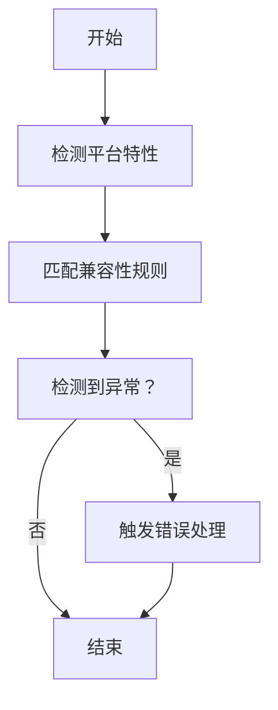
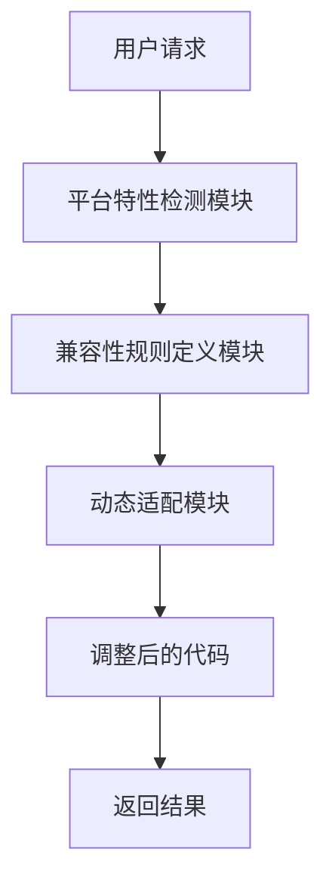
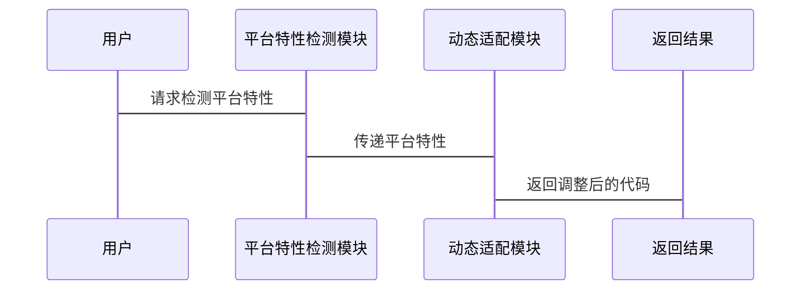

                 


# 跨平台兼容性

## 关键词：跨平台兼容性，软件开发，系统架构，兼容性测试，跨平台技术，系统设计

## 摘要：  
跨平台兼容性是软件开发中的一个重要问题，它涉及到不同平台之间的兼容性和适配性。随着技术的发展，跨平台兼容性的实现方式也在不断演变。本文将从跨平台兼容性的背景、核心概念、技术实现、系统架构设计、项目实战以及最佳实践等方面进行详细探讨，帮助读者全面理解跨平台兼容性的技术原理和实现方法。

---

# 第1章 跨平台兼容性概述

## 1.1 跨平台兼容性的定义  
跨平台兼容性指的是软件在不同的操作系统、硬件架构或运行环境中能够正常运行并提供一致功能的能力。它是软件开发中的一个重要特性，能够降低开发和维护成本，提高软件的适用性和市场竞争力。

## 1.2 跨平台兼容性的问题背景  
在软件开发中，由于不同平台之间的差异（如操作系统、硬件架构、API接口等），软件在不同平台上运行时可能会出现功能异常、性能问题或用户体验不一致的情况。这些问题直接影响了软件的可用性和用户体验。

## 1.3 跨平台兼容性的现状分析  
目前，跨平台技术已经取得了长足的发展，但仍然面临一些挑战，如平台差异、API不一致、性能优化等问题。随着技术的进步，跨平台工具链和框架（如React Native、Flutter等）逐渐成熟，为跨平台开发提供了更多的选择。

## 1.4 跨平台兼容性的重要性  
跨平台兼容性的重要性体现在多个方面：  
1. **降低开发成本**：通过一次开发、多端运行的方式，可以显著降低开发和维护成本。  
2. **提高市场竞争力**：跨平台应用可以在多个平台上运行，覆盖更广泛的用户群体。  
3. **提升用户体验**：通过适配不同平台的特点，可以为用户提供更好的使用体验。  

---

# 第2章 跨平台兼容性的核心概念与联系  

## 2.1 跨平台兼容性的技术原理  
跨平台兼容性的实现依赖于多种技术手段，包括：  
1. **跨平台框架**：如React Native、Flutter等，通过抽象平台差异，提供统一的开发接口。  
2. **虚拟化技术**：如WebAssembly，通过将代码编译为平台无关的中间层，实现跨平台运行。  
3. **动态适配**：通过检测平台特性并动态调整代码，实现不同平台的兼容性适配。  

## 2.2 跨平台兼容性的实现方式对比  
以下是几种常见的跨平台实现方式的对比：

| 实现方式      | 优点                                | 缺点                                  |
|---------------|-------------------------------------|---------------------------------------|
| React Native  | 开源免费，支持JavaScript开发       | 学习曲线较高，部分组件需要原生实现     |
| Flutter       | 热重载、高性能，支持多种平台       | 初期配置复杂，资源消耗较大             |
| Xamarin       | 跨平台支持好，代码复用性高         | 社区支持不如React Native和Flutter活跃   |
| Electron      | 易于快速开发，支持桌面应用         | 性能相对较差，资源消耗较高             |

## 2.3 跨平台兼容性的ER实体关系图  
以下是跨平台兼容性的核心实体关系图：

```mermaid
e
```

---

# 第3章 跨平台兼容性的算法原理  

## 3.1 跨平台兼容性检测算法  
跨平台兼容性检测算法的目标是通过检测不同平台的特性，确定是否存在兼容性问题。以下是一个简单的检测流程：

1. **平台检测**：检测当前运行环境的操作系统、硬件架构等信息。  
2. **特性匹配**：将检测到的平台特性与预定义的兼容性规则进行匹配。  
3. **异常处理**：如果检测到不兼容的特性，触发相应的错误处理机制。  

以下是一个简单的兼容性检测算法示例：



## 3.2 跨平台兼容性适配算法  
跨平台兼容性适配算法的目标是根据检测到的平台特性，动态调整代码以适应不同平台。以下是适配算法的流程：

1. **平台特性分析**：分析当前平台的特性，如屏幕分辨率、API支持等。  
2. **代码动态调整**：根据分析结果，动态调整代码逻辑或资源加载方式。  
3. **结果验证**：验证调整后的代码是否能够在目标平台上正常运行。  

以下是一个适配算法的数学模型示例：

$$ \text{兼容性得分} = \sum_{i=1}^{n} w_i \cdot x_i $$

其中，$w_i$ 是第$i$个平台特性的权重，$x_i$ 是第$i$个平台特性的匹配程度。

---

# 第4章 跨平台兼容性的系统架构设计  

## 4.1 问题场景介绍  
在实际开发中，跨平台兼容性问题通常表现为：  
- 应用在不同平台上运行时出现崩溃或功能异常。  
- UI界面在不同平台上显示不一致。  
- API调用在不同平台上返回不同的结果。  

## 4.2 系统功能设计  
为了实现跨平台兼容性，我们可以设计一个通用的兼容性管理系统，包括以下功能模块：  
1. **平台特性检测模块**：检测运行环境的平台特性。  
2. **兼容性规则定义模块**：定义不同平台的兼容性规则。  
3. **动态适配模块**：根据检测结果动态调整代码逻辑。  

## 4.3 系统架构设计  
以下是系统的架构图：



## 4.4 系统交互设计  
以下是系统交互的序列图：



---

# 第5章 跨平台兼容性的项目实战  

## 5.1 环境安装  
为了实现跨平台兼容性，我们需要安装以下工具：  
- 开发环境：Visual Studio、IntelliJ IDEA等。  
- 跨平台框架：React Native、Flutter等。  
- 测试工具：Selenium、Appium等。  

## 5.2 系统核心实现  
以下是跨平台兼容性的核心代码实现：

```python
def check_compatibility(platform_info):
    # platform_info 包含操作系统、硬件架构等信息
    compatible = True
    for key in platform_info:
        if platform_info[key] not in compatible_list[key]:
            compatible = False
            break
    return compatible
```

## 5.3 代码解读与分析  
上述代码实现了一个简单的兼容性检测函数，通过检测平台信息是否符合预定义的兼容性规则，判断是否兼容。代码逻辑简单，但实际应用中可能需要更复杂的处理逻辑。

## 5.4 实际案例分析  
以下是一个跨平台兼容性问题的实际案例分析：  
某应用在iOS和Android平台上运行时出现UI显示异常。通过分析，发现是由于不同平台的屏幕分辨率差异导致的。通过动态调整UI布局算法，最终解决了兼容性问题。

## 5.5 项目小结  
通过本项目，我们了解了跨平台兼容性的实现方法，掌握了兼容性检测和动态适配的技巧，为后续的开发工作打下了坚实的基础。

---

# 第6章 跨平台兼容性的最佳实践  

## 6.1 小结  
跨平台兼容性是软件开发中的一个重要问题，通过合理的技术选型和系统的架构设计，可以有效降低兼容性问题对开发和维护的影响。

## 6.2 注意事项  
1. **充分测试**：在不同平台上进行全面测试，确保兼容性问题得到充分暴露。  
2. **动态适配**：根据平台特性动态调整代码逻辑，提高兼容性。  
3. **工具支持**：充分利用跨平台开发工具和测试工具，提高开发效率。  

## 6.3 拓展阅读  
1. 《跨平台开发的艺术》  
2. 《React Native 入门与实战》  
3. 《Flutter 开发指南》  

---

# 作者：AI天才研究院/AI Genius Institute & 禅与计算机程序设计艺术 /Zen And The Art of Computer Programming  

---

通过以上内容，我们对跨平台兼容性有了全面的理解。从理论到实践，从技术实现到系统设计，本文为读者提供了一个完整的跨平台兼容性解决方案。希望本文能够为您的软件开发工作提供有价值的参考和启发。

