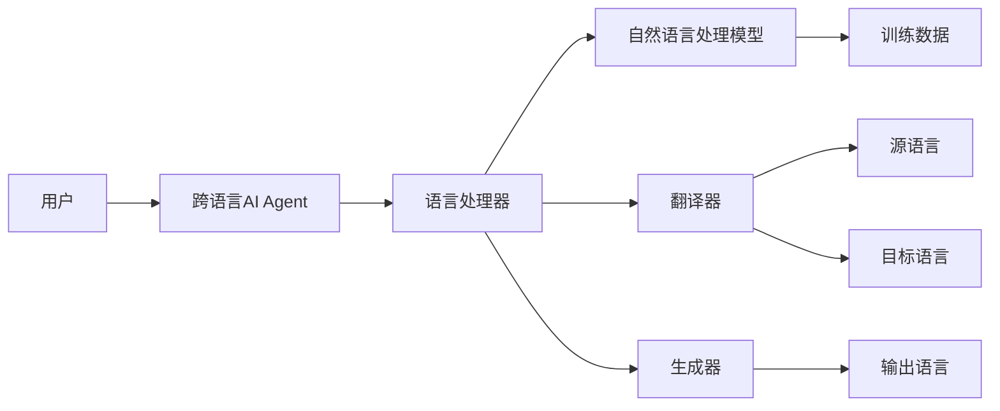
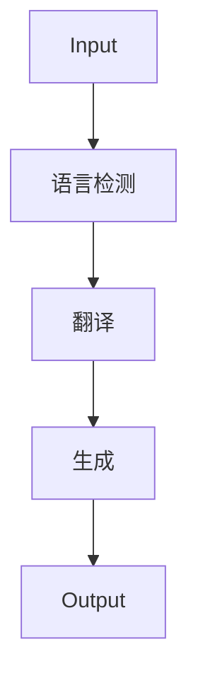
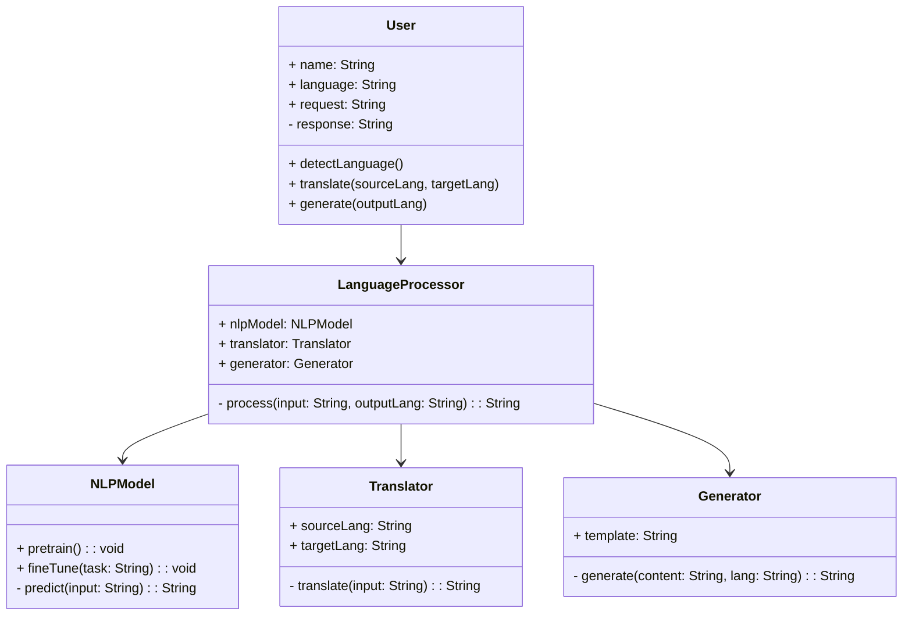
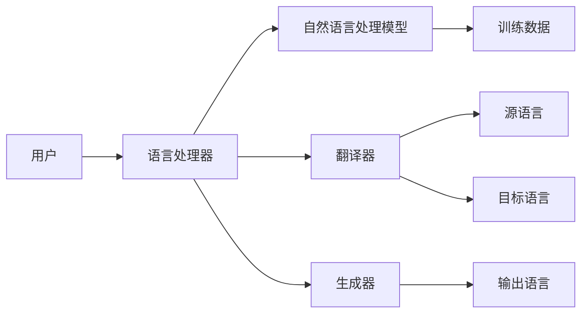
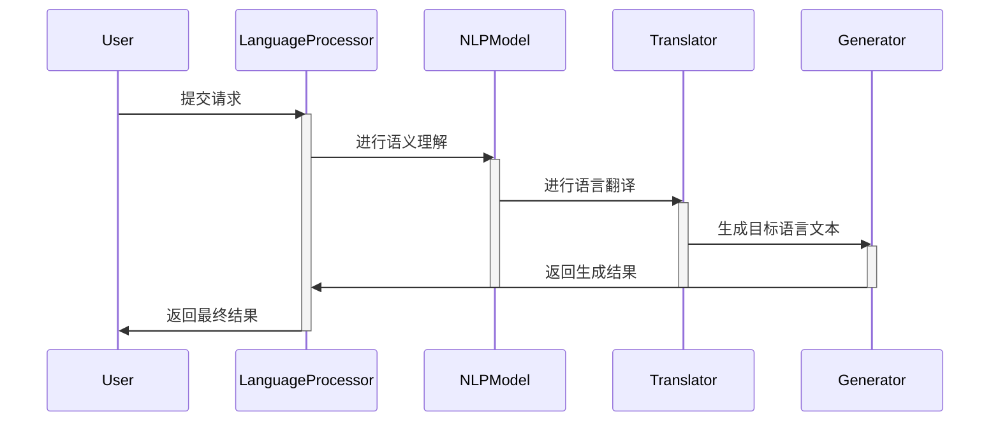

                 


# 跨语言AI Agent：突破语言障碍的智能助手

> 关键词：跨语言AI Agent, 多语言处理, 跨语言理解, 語言生成, NLP, 語言障碍, AI智能助手

> 摘要：本文探讨了跨语言AI Agent的核心概念、算法原理、系统架构及实际应用。通过分析多语言处理模型，结合跨语言理解与生成机制，详细阐述了构建跨语言AI Agent的技术挑战与解决方案。文章还通过实际案例，展示了如何在不同场景下应用跨语言AI Agent，以克服语言障碍，提升用户体验。

---

## 第一部分：跨语言AI Agent的背景与核心概念

### 第1章：背景与问题背景

#### 1.1 问题背景

在当今全球化和信息化的背景下，语言障碍已成为跨文化交流和信息传递的主要障碍之一。随着人工智能技术的快速发展，AI在自然语言处理（NLP）领域的应用日益广泛。然而，现有的语言处理技术主要集中在单一语言的处理上，难以满足跨语言交流的需求。跨语言AI Agent作为一种能够理解、生成和处理多种语言的智能助手，正在成为解决语言障碍的重要工具。

#### 1.2 问题描述

跨语言AI Agent的核心目标是实现多语言环境下的智能交互，包括语言理解、语言生成和语言转换等功能。然而，现有的技术在跨语言处理中仍面临诸多挑战，例如：

1. **多语言模型的训练与优化**：如何在多语言环境下训练通用且高效的模型。
2. **跨语言语义理解**：如何准确理解不同语言之间的语义关系。
3. **实时语言转换与生成**：如何快速实现语言之间的转换和生成。

#### 1.3 解决方案

跨语言AI Agent通过整合多语言处理模型和跨语言理解与生成机制，能够在多种语言环境下实现智能交互。其主要解决方案包括：

- 使用预训练的多语言模型进行微调。
- 引入跨语言迁移学习技术。
- 结合语言检测和语言生成技术，实现多语言环境下的智能助手功能。

### 第2章：核心概念与联系

#### 2.1 多语言处理模型

多语言处理模型是跨语言AI Agent的核心组件之一。这类模型能够在多种语言环境下进行语言理解和生成。常见的多语言处理模型包括：

- **多任务学习模型**：在同一模型中同时处理多种语言任务，如翻译、摘要、问答等。
- **多语言预训练模型**：基于大规模多语言语料库进行预训练，能够适应多种语言的上下文。

#### 2.2 跨语言理解与生成机制

跨语言理解与生成机制是实现跨语言AI Agent的关键技术。理解机制包括语言检测和语义分析，生成机制则包括翻译和语言生成。通过结合这两种机制，跨语言AI Agent能够实现多种语言之间的智能交互。

#### 2.3 多语言模型与单语言模型的对比

| 对比维度 | 单语言模型 | 多语言模型 |
|----------|------------|------------|
| 适用场景 | 单一语言环境 | 多语言环境 |
| 训练数据 | 单一语言语料库 | 多种语言语料库 |
| 模型参数 | 较少 | 较多 |
| 性能 | 高 | 较低（需要优化） |

#### 2.4 ER实体关系图



### 第3章：算法原理

#### 3.1 跨语言模型的训练方法

跨语言模型的训练方法主要包括：

1. **多任务学习**：在同一模型中同时学习多种语言任务，如翻译、摘要和问答。
2. **预训练模型的微调**：在大规模多语言语料库上预训练模型后，针对特定任务进行微调。
3. **跨语言迁移学习**：利用一种语言的模型参数初始化另一种语言模型的训练。

#### 3.2 算法流程图



#### 3.3 数学模型与公式

跨语言模型的损失函数通常采用交叉熵损失函数：

$$ L = -\sum_{i=1}^{n} \log p(y_i|x_i) $$

其中，$x_i$ 是输入序列，$y_i$ 是对应的标签。

模型训练的优化过程可以表示为：

$$ \theta = \theta - \eta \cdot \frac{\partial L}{\partial \theta} $$

其中，$\theta$ 是模型参数，$\eta$ 是学习率，$\frac{\partial L}{\partial \theta}$ 是损失函数对参数的梯度。

---

## 第二部分：系统分析与架构设计

### 第4章：系统分析

#### 4.1 问题场景介绍

跨语言AI Agent需要在多种语言环境下实现智能交互，应用场景包括：

1. **多语言客服系统**：支持多种语言的客户咨询。
2. **跨语言信息检索**：在不同语言的数据库中检索信息。
3. **多语言内容生成**：自动生成多语言内容，如新闻报道。

#### 4.2 系统功能设计

系统功能模块包括：

1. **语言处理器**：负责语言检测、翻译和生成。
2. **自然语言处理模型**：用于语义理解。
3. **翻译器**：实现多种语言之间的翻译。
4. **生成器**：生成目标语言的文本。

#### 4.3 领域模型类图



### 第5章：架构设计

#### 5.1 系统架构设计

跨语言AI Agent的系统架构主要包括以下几个部分：

1. **用户界面**：接收用户输入并显示输出结果。
2. **语言处理器**：负责语言检测、翻译和生成。
3. **自然语言处理模型**：用于语义理解。
4. **翻译器**：实现多种语言之间的翻译。
5. **生成器**：生成目标语言的文本。

#### 5.2 架构图



#### 5.3 系统交互序列图



---

## 第三部分：项目实战

### 第6章：实战环境搭建

#### 6.1 环境与工具

- **编程语言**：Python 3.8+
- **深度学习框架**：TensorFlow或PyTorch
- **NLP库**：spaCy、transformers
- **环境配置**：虚拟环境，安装必要的库。

#### 6.2 安装指南

```bash
pip install python>=3.8
pip install transformers
pip install torch
pip install numpy
```

### 第7章：代码实现与案例分析

#### 7.1 核心代码实现

```python
from transformers import AutoTokenizer, AutoModelForSeq2Seq
import torch

class CrossLanguageAI:
    def __init__(self, model_name):
        self.tokenizer = AutoTokenizer.from_pretrained(model_name)
        self.model = AutoModelForSeq2Seq.from_pretrained(model_name)
        
    def detect_language(self, text):
        # 简单的语言检测（基于语言模型）
        pass
    
    def translate(self, text, source_lang, target_lang):
        # 翻译功能
        inputs = self.tokenizer(text, return_tensors="pt", language=source_lang)
        outputs = self.model.generate(inputs.input_ids, max_length=50)
        return self.tokenizer.decode(outputs[0], skip_special_tokens=True, language=target_lang)
    
    def generate(self, text, language):
        # 生成功能
        inputs = self.tokenizer(text, return_tensors="pt", language=language)
        outputs = self.model.generate(inputs.input_ids, max_length=50)
        return self.tokenizer.decode(outputs[0], skip_special_tokens=True, language=language)
```

#### 7.2 实际案例分析

案例：跨语言客服系统

```python
ai = CrossLanguageAI("facebook/m2m100")
user_input = "I need help with my order."
response = ai.translate(user_input, source_lang="en", target_lang="zh")
print(response)  # 输出：我需要帮助处理我的订单。
```

---

## 第四部分：最佳实践与小结

### 总结

跨语言AI Agent通过整合多语言处理模型和跨语言理解与生成机制，能够有效克服语言障碍，提升用户体验。本文详细探讨了跨语言AI Agent的核心概念、算法原理、系统架构及实际应用。

### 开发建议

- **选择合适的模型**：根据具体需求选择适合的多语言模型。
- **优化语言处理器**：提升语言检测和生成的准确率。
- **结合上下文**：考虑上下文信息，提高语义理解能力。

### 未来方向

- **多模态跨语言处理**：结合视觉、听觉等多模态信息，提升AI Agent的智能性。
- **实时跨语言交互**：优化模型的实时处理能力，降低延迟。
- **个性化服务**：根据用户偏好提供个性化语言服务。

---

## 作者

作者：AI天才研究院/AI Genius Institute & 禅与计算机程序设计艺术/Zen And The Art of Computer Programming

---

本文内容涵盖了跨语言AI Agent的核心技术与实际应用，通过系统的分析和详细的代码示例，为读者提供了从理论到实践的全面指导。希望本文能为跨语言AI Agent的研究与应用提供有价值的参考。

