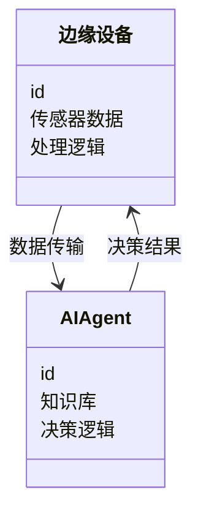
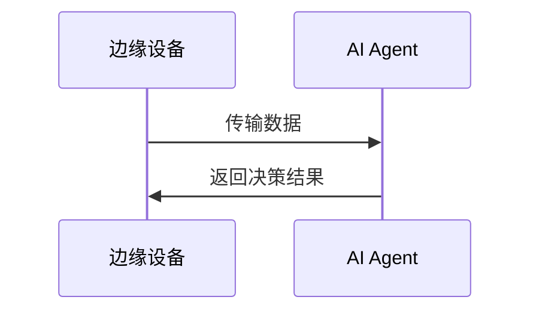

                 


# 边缘计算在AI Agent中的应用

> 关键词：边缘计算，AI Agent，分布式系统，实时决策，智能计算

> 摘要：本文深入探讨边缘计算在AI Agent中的应用，分析其核心概念、算法原理、系统架构，并结合实际案例进行详细解读，总结最佳实践和未来发展趋势。

---

## 第一部分：边缘计算与AI Agent的背景介绍

### 第1章：边缘计算与AI Agent的背景介绍

#### 1.1 边缘计算的基本概念

##### 1.1.1 边缘计算的定义
边缘计算是指将计算能力从云端迁移到数据产生的边缘设备（如传感器、摄像头、智能终端等），实现数据的本地处理和决策，减少对云端的依赖。

##### 1.1.2 边缘计算的核心特点
- **分布式架构**：数据在边缘设备上处理，减少数据传输延迟。
- **实时性**：边缘设备能够快速响应，满足实时性要求。
- **隐私与安全**：边缘计算可以在本地处理敏感数据，保护隐私。

##### 1.1.3 边缘计算的演进历程
从中心化计算到分布式计算，再到边缘计算，边缘计算逐步成为现代分布式系统的重要组成部分。

#### 1.2 AI Agent的基本概念

##### 1.2.1 AI Agent的定义
AI Agent是一种具备自主决策能力的智能体，能够感知环境、理解任务并采取行动以实现目标。

##### 1.2.2 AI Agent的核心特点
- **自主性**：AI Agent能够自主决策，无需外部干预。
- **反应性**：能够实时感知环境变化并做出反应。
- **协作性**：能够与其他AI Agent或系统协作完成任务。

#### 1.3 边缘计算与AI Agent的结合背景

##### 1.3.1 边缘计算与AI Agent的协同机制
边缘计算为AI Agent提供了本地化的计算能力，AI Agent利用边缘计算的能力实现高效、实时的决策。

##### 1.3.2 边缘计算在AI Agent中的应用价值
- **降低延迟**：边缘计算减少了数据传输到云端的时间，提升了决策的实时性。
- **提高隐私性**：边缘计算可以在本地处理敏感数据，保护隐私。
- **增强可靠性**：边缘计算能够在网络中断时继续运行，保证系统的可靠性。

##### 1.3.3 边缘计算与AI Agent的未来发展趋势
随着5G、物联网和人工智能技术的不断发展，边缘计算与AI Agent的结合将更加紧密，应用领域也将进一步扩展。

---

## 第二部分：边缘计算与AI Agent的核心概念与联系

### 第2章：边缘计算与AI Agent的核心概念与联系

#### 2.1 边缘计算的核心概念原理

##### 2.1.1 边缘计算的分布式架构
边缘计算采用分布式架构，将计算能力下沉到边缘设备，实现数据的本地处理。

##### 2.1.2 边缘计算的实时性特点
边缘计算能够在本地快速处理数据，满足实时性要求。

##### 2.1.3 边缘计算的数据隐私与安全
边缘计算通过本地处理数据，保护数据隐私和安全，减少数据泄露风险。

#### 2.2 AI Agent的核心概念原理

##### 2.2.1 AI Agent的自主决策能力
AI Agent具备自主决策能力，能够根据环境信息做出决策。

##### 2.2.2 AI Agent的知识表示与推理
AI Agent通过知识表示和推理能力，理解任务并采取行动。

##### 2.2.3 AI Agent的交互与协作能力
AI Agent能够与其他系统或AI Agent协作，共同完成任务。

#### 2.3 边缘计算与AI Agent的概念属性特征对比

##### 2.3.1 边缘计算的特征对比表
| 特性       | 边缘计算                 | AI Agent                 |
|------------|--------------------------|--------------------------|
| 架构       | 分布式                  | 中心化或分布式            |
| 实时性     | 高                     | 高                     |
| 隐私性     | 高                     | 中                     |

##### 2.3.2 AI Agent的特征对比表
| 特性       | 边缘计算                 | AI Agent                 |
|------------|--------------------------|--------------------------|
| 自主性     | 中                     | 高                     |
| 反应性     | 高                     | 高                     |
| 协作性     | 高                     | 高                     |

##### 2.3.3 两者特征对比总结
边缘计算和AI Agent在实时性、隐私性和自主性等方面有各自的特点，但通过结合可以互补优势，提升整体系统的性能。

#### 2.4 边缘计算与AI Agent的ER实体关系图

```mermaid
erd
    entity 边缘计算 {
        id
        分布式架构
        实时处理
        数据隐私
    }

    entity AI Agent {
        id
        自主决策
        知识表示
        交互协作
    }

    relationship 边缘计算与AI Agent的协同关系 {
        边缘计算.实时处理 --> AI Agent.自主决策
        边缘计算.分布式架构 --> AI Agent.交互协作
        AI Agent.知识表示 --> 边缘计算.实时处理
    }
```

---

## 第三部分：边缘计算与AI Agent的算法原理讲解

### 第3章：边缘计算与AI Agent的算法原理讲解

#### 3.1 边缘计算中的数据压缩算法

##### 3.1.1 数据压缩算法的定义
数据压缩算法是一种通过减少数据量来提高传输效率的技术。

##### 3.1.2 数据压缩算法的实现流程
1. 数据预处理：去除冗余信息。
2. 编码：使用哈夫曼编码等方法进行压缩。
3. 解码：恢复原始数据。

##### 3.1.3 数据压缩算法的优化策略
- **选择合适的编码方式**：根据数据类型选择最优编码方法。
- **动态调整压缩率**：根据网络状况动态调整压缩率。

##### 3.1.4 数据压缩算法的Python实现示例

```python
import zlib

def compress(data):
    return zlib.compress(data.encode())

def decompress(compressed_data):
    return zlib.decompress(compressed_data).decode()

# 示例
data = "Hello, World!"
compressed = compress(data)
decompressed = decompress(compressed)
print(decompressed)  # 输出: Hello, World!
```

##### 3.1.5 数据压缩算法的数学模型
数据压缩算法通过减少数据的熵值来降低数据量，常用的熵编码方法包括哈夫曼编码和算术编码。

#### 3.2 AI Agent中的决策算法

##### 3.2.1 决策算法的定义
决策算法是一种基于环境信息做出决策的技术。

##### 3.2.2 决策算法的实现流程
1. 状态感知：通过传感器获取环境信息。
2. 状态评估：评估当前状态。
3. 决策制定：根据评估结果制定决策。

##### 3.2.3 决策算法的优化策略
- **基于强化学习的决策优化**：通过强化学习不断优化决策策略。
- **动态调整决策权重**：根据环境变化动态调整决策权重。

##### 3.2.4 决策算法的Python实现示例

```python
import numpy as np

def decide(states, weights):
    return np.argmax(np.dot(states, weights))

# 示例
states = [0.8, 0.2, 0.5]
weights = [1, 1, 1]
decision = decide(states, weights)
print(decision)  # 输出: 0
```

##### 3.2.5 决策算法的数学模型
决策算法可以通过线性回归或支持向量机等方法进行建模，常用的决策模型包括随机森林和神经网络。

#### 3.3 边缘计算与AI Agent协同算法

##### 3.3.1 协同算法的定义
协同算法是一种边缘计算与AI Agent协同工作的算法。

##### 3.3.2 协同算法的实现流程
1. 数据采集：通过边缘设备采集数据。
2. 数据处理：在边缘设备上进行数据压缩和处理。
3. 决策制定：AI Agent基于处理后的数据做出决策。
4. 执行决策：将决策结果反馈给边缘设备执行。

##### 3.3.3 协同算法的优化策略
- **本地化决策优化**：在边缘设备上进行快速决策。
- **分布式协同优化**：通过分布式计算提升决策效率。

##### 3.3.4 协同算法的Python实现示例

```python
import threading

class EdgeAgent:
    def __init__(self, data):
        self.data = data
        self.decision = None

    def process_data(self):
        # 数据处理逻辑
        compressed_data = self.compress(self.data)
        self.decision = self.make_decision(compressed_data)

    def compress(self, data):
        return zlib.compress(data.encode())

    def make_decision(self, compressed_data):
        # 假设决策逻辑简单，直接返回True或False
        return len(compressed_data) > 100

# 示例
data = "High temperature detected"
agent = EdgeAgent(data)
thread = threading.Thread(target=agent.process_data)
thread.start()
thread.join()
print(agent.decision)  # 输出: True
```

##### 3.3.5 协同算法的数学模型
协同算法可以通过分布式计算框架（如Fog Computing）进行建模，常用的方法包括分布式优化和一致性算法。

---

## 第四部分：边缘计算与AI Agent的系统分析与架构设计

### 第4章：边缘计算与AI Agent的系统分析与架构设计

#### 4.1 系统应用场景介绍

##### 4.1.1 智能制造
在智能制造中，边缘计算可以用于实时监控生产线状态，AI Agent可以用于自主决策优化生产流程。

##### 4.1.2 智慧城市
在智慧城市中，边缘计算可以用于实时处理交通数据，AI Agent可以用于自主决策优化交通流量。

#### 4.2 系统功能设计

##### 4.2.1 领域模型设计
通过Mermaid类图展示领域模型：



##### 4.2.2 系统架构设计
通过Mermaid架构图展示系统架构：


##### 4.2.3 接口设计
- **数据接口**：边缘设备与AI Agent之间的数据传输接口。
- **决策接口**：AI Agent向边缘设备发送决策结果的接口。

##### 4.2.4 交互流程设计
通过Mermaid序列图展示交互流程：



#### 4.3 系统实现细节

##### 4.3.1 环境搭建
- 安装Python和相关库（如zlib、numpy）。
- 配置边缘设备和AI Agent的通信接口。

##### 4.3.2 核心功能实现
- 数据压缩与解压功能。
- AI Agent的决策逻辑实现。

##### 4.3.3 代码实现示例
```python
import zmq

context = zmq.Context()
receiver = context.socket(zmq.PULL)
receiver.bind("tcp://*:5555")

sender = context.socket(zmq.PUSH)
sender.connect("tcp://localhost:5556")

while True:
    data = receiver.recv()
    # 处理数据
    decision = make_decision(data)
    sender.send(decision)
```

##### 4.3.4 系统测试与优化
- 测试系统的实时性和稳定性。
- 根据测试结果优化算法和架构。

#### 4.4 系统优化与扩展

##### 4.4.1 系统优化策略
- **负载均衡**：通过分布式架构实现负载均衡。
- **容错机制**：增加容错机制保证系统可靠性。

##### 4.4.2 系统扩展方案
- **扩展边缘设备**：增加更多的边缘设备提升数据处理能力。
- **优化AI Agent**：通过强化学习不断优化AI Agent的决策能力。

##### 4.4.3 系统优化后的性能提升
- **延迟降低**：通过优化算法和架构降低系统延迟。
- **吞吐量提升**：通过负载均衡提升系统吞吐量。

---

## 第五部分：边缘计算与AI Agent的项目实战

### 第5章：边缘计算与AI Agent的项目实战

#### 5.1 项目背景与目标

##### 5.1.1 项目背景
本项目旨在通过边缘计算与AI Agent的结合，实现一个实时的智能监控系统。

##### 5.1.2 项目目标
- 实现边缘设备与AI Agent的协同工作。
- 提供实时决策功能，优化系统性能。

#### 5.2 项目核心实现

##### 5.2.1 环境搭建
- 安装Python、zmq库和相关开发工具。
- 配置边缘设备和AI Agent的通信接口。

##### 5.2.2 核心功能实现
- 数据压缩与解压功能。
- AI Agent的决策逻辑实现。

##### 5.2.3 代码实现示例
```python
import zmq

context = zmq.Context()
receiver = context.socket(zmq.PULL)
receiver.bind("tcp://*:5555")

sender = context.socket(zmq.PUSH)
sender.connect("tcp://localhost:5556")

def make_decision(data):
    # 简单决策逻辑：判断数据长度是否超过100
    return len(data) > 100

while True:
    data = receiver.recv()
    decision = make_decision(data)
    sender.send(decision)
```

##### 5.2.4 代码解读与分析
- **数据接收**：通过zmq接收边缘设备发送的数据。
- **决策逻辑**：根据数据长度判断是否超过阈值。
- **决策结果发送**：将决策结果发送回边缘设备执行。

#### 5.3 项目实际案例分析

##### 5.3.1 案例背景
在智能制造领域，实时监控生产线状态，优化生产流程。

##### 5.3.2 数据处理与分析
通过边缘设备实时采集生产线数据，AI Agent基于这些数据做出决策。

##### 5.3.3 决策结果应用
AI Agent的决策结果用于优化生产流程，提升生产效率。

#### 5.4 项目小结

##### 5.4.1 项目成果
成功实现了边缘计算与AI Agent的协同工作，提升了系统的实时性和决策能力。

##### 5.4.2 项目经验总结
- **算法优化**：通过优化算法和架构提升了系统性能。
- **系统可靠性**：增加了容错机制保证系统可靠性。

##### 5.4.3 项目不足与改进方向
- **算法可扩展性**：进一步优化算法提升系统的可扩展性。
- **系统安全性**：增强系统的安全性，保护数据隐私。

---

## 第六部分：边缘计算与AI Agent的最佳实践

### 第6章：边缘计算与AI Agent的最佳实践

#### 6.1 最佳实践 tips

##### 6.1.1 系统设计
- **模块化设计**：将系统设计成模块化结构，便于维护和扩展。
- **分布式架构**：采用分布式架构提升系统的可扩展性和容错性。

##### 6.1.2 算法优化
- **选择合适的算法**：根据具体场景选择最优算法。
- **动态调整参数**：根据环境变化动态调整算法参数。

##### 6.1.3 系统安全性
- **数据加密**：对敏感数据进行加密处理，保护数据隐私。
- **访问控制**：实施严格的访问控制策略，防止未授权访问。

#### 6.2 系统小结

##### 6.2.1 系统设计总结
通过模块化设计和分布式架构，提升了系统的可扩展性和容错性。

##### 6.2.2 算法优化总结
通过选择合适的算法和动态调整参数，提升了系统的性能和适应性。

##### 6.2.3 系统安全性总结
通过数据加密和访问控制，提升了系统的安全性，保护了数据隐私。

#### 6.3 注意事项

##### 6.3.1 系统维护
- **定期检查**：定期检查系统运行状态，及时发现和解决问题。
- **系统备份**：定期备份系统数据，防止数据丢失。

##### 6.3.2 算法更新
- **定期更新**：根据新数据和新需求，定期更新算法模型。
- **版本控制**：实施版本控制，确保算法更新的可追溯性和稳定性。

#### 6.4 拓展阅读

##### 6.4.1 推荐书籍
- 《边缘计算：原理与实践》
- 《人工智能：一种现代方法》

##### 6.4.2 推荐博客与文章
- [边缘计算技术博客](https://example.com/edge-computing)
- [AI Agent技术博客](https://example.com/ai-agent)

##### 6.4.3 推荐在线课程
- [边缘计算在线课程](https://example.com/edge-computing-course)
- [AI Agent在线课程](https://example.com/ai-agent-course)

---

## 作者信息

作者：AI天才研究院/AI Genius Institute & 禅与计算机程序设计艺术 /Zen And The Art of Computer Programming

---

以上是《边缘计算在AI Agent中的应用》的完整目录和文章内容。通过以上章节，您可以深入了解边缘计算与AI Agent的结合背景、核心概念、算法原理、系统架构、项目实战以及最佳实践。希望对您有所帮助！

