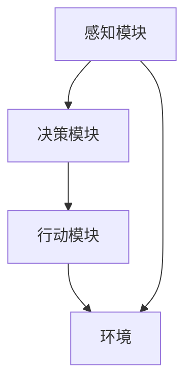
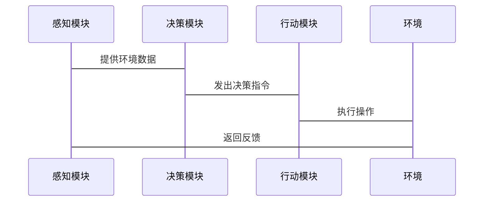

                 


# 迁移学习在AI Agent领域适应中的应用

> 关键词：迁移学习、AI Agent、深度学习、领域适应、自适应系统

> 摘要：本文系统阐述了迁移学习在AI Agent领域适应中的应用，探讨了迁移学习的基本原理、核心算法及其在AI Agent中的具体应用。通过理论分析和实际案例，本文展示了如何利用迁移学习提升AI Agent的适应性，特别是在处理领域迁移、任务迁移和环境变化等方面的解决方案。本文还结合深度学习技术，提出了基于迁移学习的AI Agent系统架构，并通过实际项目案例详细介绍了系统的实现过程和优化方法。

---

## 第1章: 迁移学习与AI Agent的基本概念

### 1.1 迁移学习的定义与核心概念

#### 1.1.1 迁移学习的定义
迁移学习是一种机器学习技术，其核心思想是将从一个任务或领域中学到的知识迁移到另一个相关但不同的任务或领域中。与传统的监督学习不同，迁移学习强调知识的跨任务或跨领域的共享和适应。

#### 1.1.2 迁移学习的核心要素
- **源领域（Source Domain）**：提供训练数据的领域或任务。
- **目标领域（Target Domain）**：需要适应的新领域或任务。
- **特征表示（Feature Representation）**：数据的表示方式，直接影响迁移效果。
- **适应策略（Adaptation Strategy）**：将源领域知识迁移到目标领域的具体方法。

#### 1.1.3 迁移学习的特点
- **领域差异性**：源领域和目标领域的数据分布可能不同。
- **任务相关性**：源任务和目标任务之间存在某种关联。
- **自适应性**：通过调整模型或特征，使模型适应目标领域。

### 1.2 AI Agent的基本概念

#### 1.2.1 AI Agent的定义
AI Agent（人工智能代理）是一种能够感知环境、自主决策并采取行动以实现目标的智能实体。AI Agent可以是软件程序、机器人或其他智能系统。

#### 1.2.2 AI Agent的核心功能
- **感知环境**：通过传感器或数据输入获取环境信息。
- **决策制定**：基于感知信息，利用算法做出决策。
- **行动执行**：根据决策结果执行具体操作。

#### 1.2.3 AI Agent的应用场景
- 智能助手（如Siri、Alexa）
- 自动驾驶系统
- 智能推荐系统
- 智能客服

### 1.3 迁移学习在AI Agent中的作用

#### 1.3.1 迁移学习如何增强AI Agent的适应性
AI Agent需要在不同的环境中运行，面对多样化的任务和数据分布。迁移学习通过共享跨任务的知识，帮助AI Agent快速适应新环境。

#### 1.3.2 迁移学习在AI Agent中的具体应用
- **领域迁移**：将一个领域的知识迁移到另一个领域（如将图像识别任务从室内场景迁移到室外场景）。
- **任务迁移**：将一个任务的知识迁移到另一个相关任务（如将语音识别任务迁移到语音翻译任务）。
- **环境适应**：帮助AI Agent在不同环境下保持稳定性能。

---

## 第2章: 迁移学习的理论基础

### 2.1 迁移学习的基本原理

#### 2.1.1 迁移学习的核心思想
迁移学习的核心思想是通过共享特征或调整模型参数，使模型能够适应新的任务或领域。其关键在于找到源领域和目标领域之间的共同特征或结构。

#### 2.1.2 迁移学习的数学模型
迁移学习的数学模型通常涉及两个分布：源分布$P_s$和目标分布$P_t$。目标是通过某种方式对齐$P_s$和$P_t$，使模型能够同时适应两者。

#### 2.1.3 迁移学习的假设空间
迁移学习的假设空间包括所有可能的函数$f$，这些函数在源领域和目标领域上都表现良好。

### 2.2 迁移学习的分类

#### 2.2.1 监督迁移学习
- **定义**：在源领域和目标领域都标注数据的情况下进行迁移学习。
- **特点**：适用于数据标注成本较高的场景。

#### 2.2.2 无监督迁移学习
- **定义**：在无标注数据的情况下进行迁移学习。
- **特点**：适用于数据标注不可行的场景。

#### 2.2.3 半监督迁移学习
- **定义**：结合了监督和无监督学习的迁移学习方法。
- **特点**：适用于部分标注数据的场景。

### 2.3 迁移学习的挑战与解决方案

#### 2.3.1 数据分布差异的问题
- **问题**：源领域和目标领域的数据分布差异可能导致模型过拟合源领域数据，影响目标领域的性能。
- **解决方案**：通过对抗训练、特征对齐等方法减少分布差异。

#### 2.3.2 特征空间对齐的方法
- **方法**：通过将源领域和目标领域的特征空间对齐，使模型能够更好地迁移知识。
- **示例**：使用最大均值差异（MMD）等方法。

#### 2.3.3 迁移学习的评估指标
- **指标**：常用的评估指标包括准确率、F1分数、迁移性能指标（如迁移损失）等。

---

## 第3章: 迁移学习的核心算法

### 3.1 基于特征对齐的迁移学习算法

#### 3.1.1 最大均值差异（Maximum Mean Discrepancy）

**定义**：MMD是一种衡量两个样本集之间差异性的方法，常用于无监督迁移学习。

**公式**：
$$
\text{MMD}(P_s, P_t) = \mathbb{E}_{x\sim P_s}[f(x)] - \mathbb{E}_{x\sim P_t}[f(x)]
$$

**应用场景**：用于对齐源领域和目标领域的特征空间。

#### 3.1.2 超球面特征映射（Hyper-spherical Feature Mapping）

**定义**：HFM通过将数据映射到超球面上，使源领域和目标领域的数据分布对齐。

**优点**：能够处理高维数据，具有良好的鲁棒性。

#### 3.1.3 基于核的方法（Kernel-based Methods）

**定义**：通过使用核函数将数据映射到高维空间，利用核技巧进行迁移学习。

**优点**：适用于非线性数据分布。

---

## 第4章: 迁移学习在AI Agent中的系统架构

### 4.1 AI Agent的系统功能设计

#### 4.1.1 系统模块划分
- **感知模块**：负责数据输入和环境感知。
- **决策模块**：基于感知数据进行分析和决策。
- **行动模块**：执行决策操作。

#### 4.1.2 系统功能流程
1. **感知环境**：通过传感器或接口获取环境数据。
2. **特征提取**：对数据进行预处理和特征提取。
3. **迁移学习**：利用迁移学习算法对模型进行适应。
4. **决策制定**：基于迁移后的模型做出决策。
5. **执行操作**：根据决策结果执行具体操作。

### 4.2 系统架构设计

#### 4.2.1 系统架构图



#### 4.2.2 系统交互序列图



---

## 第5章: 项目实战——基于迁移学习的智能客服系统

### 5.1 项目背景

#### 5.1.1 项目目标
构建一个能够处理多种客户咨询的智能客服系统，利用迁移学习提升系统在不同领域的适应能力。

### 5.2 系统实现

#### 5.2.1 环境配置
```bash
pip install -r requirements.txt
```

#### 5.2.2 核心实现代码

```python
import torch
import torch.nn as nn

class TransferNetwork(nn.Module):
    def __init__(self, input_size, hidden_size, output_size):
        super(TransferNetwork, self).__init__()
        self.fc1 = nn.Linear(input_size, hidden_size)
        self.fc2 = nn.Linear(hidden_size, output_size)
    
    def forward(self, x):
        x = torch.relu(self.fc1(x))
        x = self.fc2(x)
        return x

# 初始化模型
model = TransferNetwork(input_size=10, hidden_size=20, output_size=5)
criterion = nn.CrossEntropyLoss()
optimizer = torch.optim.Adam(model.parameters(), lr=0.001)
```

#### 5.2.3 代码解读
- **TransferNetwork**：定义了一个简单的迁移学习网络，包含两个全连接层。
- **优化过程**：使用Adam优化器和交叉熵损失函数进行训练。

### 5.3 实际案例分析

#### 5.3.1 案例描述
智能客服系统需要处理多个领域的客户咨询，如技术支持、售后服务等。

#### 5.3.2 案例分析
通过迁移学习，系统能够快速适应新的领域，提升回答准确率。

### 5.4 项目小结

#### 5.4.1 成果总结
- 系统实现了基于迁移学习的智能客服功能。
- 提高了系统在不同领域的适应能力。

#### 5.4.2 优化建议
- 进一步优化迁移学习算法，提升迁移效果。
- 增加数据预处理模块，提高数据质量。

---

## 第6章: 未来展望

### 6.1 技术发展趋势
- **多领域迁移学习**：研究如何同时适应多个领域的知识。
- **自适应增强学习**：结合增强学习，提升动态环境中的适应能力。
- **无监督迁移学习**：探索在无标注数据下的迁移学习方法。

### 6.2 挑战与机遇
- **挑战**：数据分布差异、模型泛化能力、计算资源需求。
- **机遇**：应用于更多领域，如自动驾驶、智能医疗等。

---

## 作者：AI天才研究院/AI Genius Institute & 禅与计算机程序设计艺术 /Zen And The Art of Computer Programming

