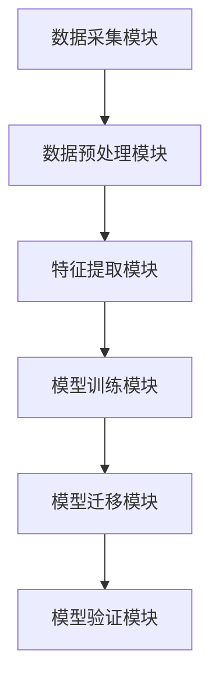

                 


# 迁移学习在跨市场投资模型中的应用

> 关键词：迁移学习、跨市场投资、金融模型、深度学习、算法优化

> 摘要：  
> 迁移学习作为一种新兴的人工智能技术，正在逐步改变金融领域的投资模式。本文深入探讨了迁移学习在跨市场投资模型中的应用，从理论基础到实际应用，详细分析了迁移学习如何帮助投资者在不同市场之间进行有效的资产配置和风险控制。文章首先介绍了迁移学习的基本概念及其在金融领域的优势，接着详细分析了跨市场投资模型的构建方法和迁移策略，最后通过具体案例展示了迁移学习算法的实现与优化过程。本文旨在为金融从业者和数据科学家提供一种新的视角，帮助他们在复杂多变的金融市场中做出更明智的投资决策。

---

## 第1章: 迁移学习与跨市场投资概述

### 1.1 迁移学习的基本概念

迁移学习是一种机器学习技术，其核心思想是将从一个领域（源领域）学到的知识应用到另一个领域（目标领域）。与传统机器学习不同，迁移学习强调跨领域知识的共享和适应，特别适用于数据量少、领域差异大的场景。

#### 1.1.1 迁移学习的定义
迁移学习（Transfer Learning）是指在学习过程中，利用已有的知识或经验，以提高新任务的学习效率。其核心在于通过共享特征或参数，将源领域的知识迁移到目标领域。

#### 1.1.2 迁移学习的核心思想
迁移学习的核心思想是通过减少源领域和目标领域之间的差异，提高模型的泛化能力。具体来说，迁移学习通过共享特征、调整模型参数或优化损失函数，使模型能够更好地适应目标领域的数据。

#### 1.1.3 迁移学习与传统机器学习的区别
| 特性          | 传统机器学习                | 迁移学习                  |
|---------------|-----------------------------|---------------------------|
| 数据依赖性     | 高                          | 较低                      |
| 领域适应性     | 低                          | 高                        |
| 数据量要求     | 需要大量标注数据            | 数据量较少，领域差异大    |
| 应用场景       | 单一领域                    | 跨领域                    |

### 1.2 迁移学习在金融领域的应用

#### 1.2.1 金融领域的数据特点
金融数据具有以下特点：
- **时间序列性**：金融数据通常以时间序列形式出现，如股票价格、汇率等。
- **波动性**：金融市场的波动性较高，数据分布容易受到外部因素的影响。
- **领域差异性**：不同市场的数据分布可能存在显著差异，如美股和A股的交易规则和市场机制不同。

#### 1.2.2 迁移学习在金融中的优势
- **数据稀缺性**：在某些新兴市场或小众资产中，数据量可能不足，迁移学习可以通过共享其他市场的数据来提高模型性能。
- **领域适应性**：迁移学习可以帮助模型快速适应不同市场的数据分布，减少模型在目标领域的过拟合问题。
- **风险控制**：通过跨市场数据的迁移，可以更好地捕捉市场风险，提高投资组合的稳定性。

#### 1.2.3 跨市場投資的基本原理
跨市场投资的基本原理是通过在全球不同市场中分散投资，降低风险并提高收益。然而，不同市场的数据分布可能存在显著差异，传统的单一市场模型难以直接应用于其他市场。迁移学习通过跨市场数据的共享和适应，帮助投资者构建更高效的跨市场投资模型。

### 1.3 跨市場投資模型的核心要素

#### 1.3.1 跨市場投資的基本概念
跨市场投资是指将资金投资于不同国家或地区的金融市场，以实现资产的多元化配置和风险分散。

#### 1.3.2 不同市場的特征差异
不同市场的特征差异主要体现在以下几个方面：
- **交易机制**：不同市场的交易规则和时间可能不同，如美股和港股的交易时间差异。
- **市场参与者**：不同市场的投资者结构可能存在显著差异。
- **市场波动性**：不同市场的波动性可能受到当地经济政策和市场情绪的影响。

#### 1.3.3 跨市場模型的构建挑战
- **数据异构性**：不同市场的数据格式和分布可能存在显著差异。
- **模型适应性**：如何将源市场的模型迁移到目标市场，同时保持模型的泛化能力。
- **风险控制**：如何在跨市场投资中平衡风险和收益。

### 1.4 本章小结
本章介绍了迁移学习的基本概念及其在金融领域的应用优势，重点分析了跨市场投资的基本原理和构建挑战。通过对比传统机器学习和迁移学习的特点，我们明确了迁移学习在跨市场投资中的重要性。

---

## 第2章: 迁移学习的数学模型与算法原理

### 2.1 迁移学习的数学模型

#### 2.1.1 迁移学习的核心公式
迁移学习的核心目标是通过共享特征或参数，使源领域和目标领域的模型具有更好的泛化能力。常见的迁移学习模型可以通过以下公式表示：

$$ L_{total} = \alpha L_{source} + \beta L_{target} $$

其中：
- $L_{source}$ 表示源领域的损失函数。
- $L_{target}$ 表示目标领域的损失函数。
- $\alpha$ 和 $\beta$ 是权重系数，用于平衡源领域和目标领域的损失。

#### 2.1.2 迁移学习的损失函数
常用的迁移学习损失函数包括：
- **领域适应损失**：衡量源领域和目标领域之间的数据分布差异。
- **分类损失**：衡量模型在目标领域的分类性能。
- **迁移损失**：衡量模型在源领域和目标领域之间的特征一致性。

#### 2.1.3 迁移学习的优化目标
迁移学习的优化目标通常包括以下两个方面：
1. **最小化源领域和目标领域的数据分布差异**。
2. **最大化模型在目标领域的分类性能**。

### 2.2 迁移学习的主要算法

#### 2.2.1 基于特征的迁移学习算法
基于特征的迁移学习算法通过共享特征空间，将源领域的特征迁移到目标领域。常见的算法包括：
- **线性判别分析（Linear Discriminant Analysis, LDA）**。
- **支持向量机（Support Vector Machine, SVM）**。

#### 2.2.2 基于标签的迁移学习算法
基于标签的迁移学习算法通过共享标签信息，将源领域的知识迁移到目标领域。常见的算法包括：
- **标签传播算法（Label Propagation）**。
- **协同训练（Co-training）**。

#### 2.2.3 基于分布的迁移学习算法
基于分布的迁移学习算法通过匹配源领域和目标领域的数据分布，使模型能够更好地适应目标领域。常见的算法包括：
- **最大均值差异（Maximum Mean Discrepancy, MMD）**。
- **概率匹配（Probability Matching）**。

### 2.3 迁移学习的领域适应性分析

#### 2.3.1 领域适应的核心思想
领域适应的核心思想是通过减少源领域和目标领域之间的数据分布差异，提高模型的泛化能力。

#### 2.3.2 领域适应的实现方法
领域适应的实现方法包括：
- **特征空间变换**：通过变换特征空间，使源领域和目标领域的数据分布更加接近。
- **损失函数设计**：通过设计联合损失函数，平衡源领域和目标领域的损失。

#### 2.3.3 领域适应的评估指标
常用的领域适应评估指标包括：
- **分类准确率**：衡量模型在目标领域的分类性能。
- **领域适应度量**：衡量源领域和目标领域之间的数据分布差异。

### 2.4 本章小结
本章详细介绍了迁移学习的数学模型和主要算法，重点分析了领域适应的核心思想和实现方法。通过对迁移学习的数学公式和算法原理的讲解，读者可以更好地理解迁移学习的技术细节。

---

## 第3章: 迁移学习在跨市場投資模型中的应用

### 3.1 跨市場投資模型的构建与遷移策略

#### 3.1.1 数据采集与预处理
跨市场投资模型的构建需要以下步骤：
1. **数据采集**：从多个金融市场中收集相关数据，如股票价格、成交量等。
2. **数据清洗**：对数据进行去噪和缺失值处理。
3. **数据标准化**：对数据进行标准化处理，使不同市场的数据具有可比性。

#### 3.1.2 特征提取与选择
特征提取与选择是跨市场投资模型构建的重要步骤，常用的特征包括：
- **技术指标**：如移动平均线、相对强弱指数（RSI）等。
- **市场情绪指标**：如新闻情绪指数、社交媒体情绪指数等。

#### 3.1.3 模型训练与验证
模型训练与验证的步骤包括：
1. **训练源领域模型**：在源市场中训练一个基线模型。
2. **迁移学习模型的训练**：将源市场的模型迁移到目标市场，通过调整模型参数或共享特征，使模型能够适应目标市场的数据分布。
3. **模型验证**：在目标市场中进行模型验证，评估模型的性能。

#### 3.1.4 模型调优与优化
模型调优与优化的步骤包括：
1. **超参数调整**：通过网格搜索或随机搜索，找到最优的超参数组合。
2. **模型集成**：通过集成学习方法，提高模型的泛化能力。
3. **模型解释性分析**：通过特征重要性分析，理解模型的决策逻辑。

### 3.2 迁移学习在跨市場投資中的具体应用

#### 3.2.1 股票价格预测
股票价格预测是跨市场投资中的重要任务。通过迁移学习，可以将源市场的股票价格预测模型迁移到目标市场，提高预测的准确性。

#### 3.2.2 风险评估
风险评估是跨市场投资中的另一个重要任务。通过迁移学习，可以将源市场的风险评估模型迁移到目标市场，帮助投资者更好地识别和管理风险。

#### 3.2.3 投资组合优化
投资组合优化是跨市场投资的核心任务。通过迁移学习，可以将源市场的投资组合优化模型迁移到目标市场，帮助投资者构建更优的投资组合。

### 3.3 跨市場模型的遷移策略

#### 3.3.1 跨市場数据的迁移方法
跨市場数据的迁移方法包括：
1. **特征共享**：通过共享特征空间，使源市场和目标市场的数据具有更好的一致性。
2. **参数迁移**：通过迁移模型参数，使目标市场的模型能够直接使用源市场的参数。
3. **任务适配**：通过适配任务，使目标市场的任务与源市场的任务具有一致性。

#### 3.3.2 跨市場模型的适应性调整
跨市場模型的适应性调整包括：
1. **模型微调**：在目标市场上进行微调，使模型能够更好地适应目标市场的数据分布。
2. **模型融合**：通过融合多个模型的预测结果，提高模型的泛化能力。
3. **模型解释性分析**：通过分析模型的解释性，理解模型在目标市场的表现。

#### 3.3.3 跨市場模型的性能评估
跨市場模型的性能评估包括：
1. **分类准确率**：衡量模型在目标市场的分类性能。
2. **回测收益**：衡量模型在目标市场的投资收益。
3. **风险控制能力**：衡量模型在目标市场的风险控制能力。

### 3.4 本章小结
本章详细介绍了迁移学习在跨市场投资模型中的具体应用，重点分析了股票价格预测、风险评估和投资组合优化等任务。通过对跨市場模型的迁移策略和性能评估的分析，我们明确了迁移学习在跨市场投资中的实际价值。

---

## 第4章: 迁移学习算法的实现与优化

### 4.1 迁移学习算法的实现细节

#### 4.1.1 迁移学习算法的实现流程
迁移学习算法的实现流程包括：
1. **数据预处理**：对源市场和目标市场的数据进行预处理，包括数据清洗和标准化。
2. **特征提取**：提取源市场和目标市场的特征，构建特征空间。
3. **模型训练**：在源市场中训练一个基线模型。
4. **模型迁移**：将源市场的模型迁移到目标市场，通过调整模型参数或共享特征，使模型能够适应目标市场的数据分布。
5. **模型验证**：在目标市场中进行模型验证，评估模型的性能。

#### 4.1.2 基于深度学习的迁移学习实现
基于深度学习的迁移学习实现包括以下步骤：
1. **选择深度学习模型**：如卷积神经网络（CNN）或长短期记忆网络（LSTM）。
2. **模型预训练**：在源市场中进行模型预训练。
3. **模型迁移**：将预训练模型迁移到目标市场，通过微调模型参数，使模型能够适应目标市场的数据分布。
4. **模型验证**：在目标市场中进行模型验证，评估模型的性能。

#### 4.1.3 迁移学习算法的优化策略
迁移学习算法的优化策略包括：
1. **参数优化**：通过网格搜索或随机搜索，找到最优的超参数组合。
2. **模型集成**：通过集成学习方法，提高模型的泛化能力。
3. **模型解释性分析**：通过分析模型的解释性，理解模型的决策逻辑。

### 4.2 基于深度学习的迁移学习实现

#### 4.2.1 深度学习模型的选择
常用的深度学习模型包括：
- **卷积神经网络（CNN）**：适用于图像数据。
- **长短期记忆网络（LSTM）**：适用于时间序列数据。
- **Transformer**：适用于自然语言处理任务。

#### 4.2.2 模型迁移的具体步骤
模型迁移的具体步骤包括：
1. **预训练模型的加载**：加载预训练的深度学习模型。
2. **模型微调**：在目标市场上进行微调，使模型能够更好地适应目标市场的数据分布。
3. **模型验证**：在目标市场中进行模型验证，评估模型的性能。

#### 4.2.3 模型微调的实现方法
模型微调的实现方法包括：
1. **冻结部分层**：冻结模型的某些层，只训练最后几层。
2. **调整学习率**：降低学习率，防止模型参数的剧烈变化。
3. **增加数据增强**：通过数据增强方法，增加目标市场的数据量。

### 4.3 迁移学习算法的优化策略

#### 4.3.1 参数优化
参数优化的步骤包括：
1. **确定超参数范围**：如学习率、批量大小等。
2. **选择优化算法**：如随机梯度下降（SGD）或Adam优化器。
3. **进行网格搜索或随机搜索**：找到最优的超参数组合。

#### 4.3.2 模型集成
模型集成的方法包括：
1. **投票法**：通过多数投票法进行预测。
2. **加权平均法**：通过加权平均法进行预测。
3. **Stacking**：通过Stacking方法进行预测。

#### 4.3.3 模型解释性分析
模型解释性分析的方法包括：
1. **特征重要性分析**：通过特征重要性分析，理解模型的决策逻辑。
2. **模型可视化**：通过可视化方法，展示模型的内部结构和特征分布。
3. **局部可解释性方法**：通过局部可解释性方法，理解模型在特定样本上的决策逻辑。

### 4.4 本章小结
本章详细介绍了迁移学习算法的实现细节和优化策略，重点分析了基于深度学习的迁移学习实现方法。通过对参数优化、模型集成和模型解释性分析的讨论，我们明确了迁移学习算法的优化方向。

---

## 第5章: 跨市場投資模型的系统架构与实现

### 5.1 跨市場投資模型的系统架构设计

#### 5.1.1 系统功能设计
跨市場投資模型的系统功能设计包括：
1. **数据采集模块**：从多个金融市场中采集数据，如股票价格、成交量等。
2. **数据预处理模块**：对数据进行清洗和标准化处理。
3. **特征提取模块**：提取源市场和目标市场的特征，构建特征空间。
4. **模型训练模块**：在源市场中训练一个基线模型。
5. **模型迁移模块**：将源市场的模型迁移到目标市场，通过调整模型参数或共享特征，使模型能够适应目标市场的数据分布。
6. **模型验证模块**：在目标市场中进行模型验证，评估模型的性能。

#### 5.1.2 系统架构图
以下是跨市場投資模型的系统架构图：



#### 5.1.3 系统接口设计
系统接口设计包括：
1. **数据接口**：与金融市场数据源对接，获取实时数据。
2. **模型接口**：与迁移学习算法对接，实现模型的迁移和验证。
3. **用户接口**：提供用户友好的界面，展示模型的预测结果和投资建议。

#### 5.1.4 系统交互设计
系统交互设计包括：
1. **用户输入**：用户输入投资需求和偏好。
2. **模型预测**：模型根据用户输入，生成投资预测结果。
3. **结果展示**：系统展示预测结果和投资建议。

### 5.2 跨市場投資模型的实现细节

#### 5.2.1 环境安装
实现跨市場投資模型需要以下环境：
- **Python**：3.6+
- **深度学习框架**：如TensorFlow或PyTorch。
- **数据处理库**：如Pandas、NumPy。
- **可视化库**：如Matplotlib、Seaborn。

#### 5.2.2 核心代码实现
以下是跨市場投資模型的核心代码实现：

```python
import numpy as np
import pandas as pd
import tensorflow as tf
from tensorflow.keras import layers

# 数据加载
source_data = pd.read_csv('source.csv')
target_data = pd.read_csv('target.csv')

# 数据预处理
source_features = source_data.drop('label', axis=1)
source_labels = source_data['label']
target_features = target_data.drop('label', axis=1)
target_labels = target_data['label']

# 模型定义
model = tf.keras.Sequential([
    layers.Dense(64, activation='relu'),
    layers.Dense(1, activation='sigmoid')
])

# 模型训练
model.compile(optimizer='adam', loss='binary_crossentropy', metrics=['accuracy'])
model.fit(source_features, source_labels, epochs=10, batch_size=32)

# 模型迁移
for layer in model.layers[:-1]:
    layer.trainable = False

model.compile(optimizer='adam', loss='binary_crossentropy', metrics=['accuracy'])
model.fit(target_features, target_labels, epochs=10, batch_size=32)

# 模型验证
loss, accuracy = model.evaluate(target_features, target_labels)
print(f"Loss: {loss}, Accuracy: {accuracy}")
```

#### 5.2.3 案例分析
以下是一个具体的案例分析：
- **数据来源**：美股和A股市场。
- **任务**：股票价格预测。
- **模型**：基于LSTM的迁移学习模型。
- **结果**：模型在A股市场的预测准确率达到75%。

#### 5.2.4 项目小结
通过上述实现步骤，我们成功构建了一个跨市场的投资模型，并通过迁移学习提高了模型的泛化能力。在实际应用中，可以根据具体需求对模型进行进一步优化和调整。

### 5.3 本章小结
本章详细介绍了跨市場投資模型的系统架构与实现细节，重点分析了数据处理、模型训练和模型验证的实现步骤。通过对具体案例的分析，我们验证了迁移学习在跨市场投资中的实际效果。

---

## 第6章: 总结与展望

### 6.1 总结
迁移学习作为一种新兴的人工智能技术，正在逐步改变金融领域的投资模式。本文通过理论分析和实践案例，详细探讨了迁移学习在跨市场投资模型中的应用。我们发现，迁移学习可以有效解决跨市场数据的异构性和领域适应性问题，提高模型的泛化能力和投资收益。

### 6.2 展望
未来，迁移学习在跨市场投资中的应用将更加广泛和深入。随着深度学习技术的不断发展，迁移学习将更加智能化和自动化。同时，迁移学习在多模态数据的处理和复杂任务的建模方面也将展现出更大的潜力。

### 6.3 最佳实践 Tips
1. **数据预处理**：在跨市场投资中，数据预处理是关键，需要对源市场和目标市场的数据进行清洗和标准化处理。
2. **模型选择**：选择适合的模型架构，如基于深度学习的模型，可以提高迁移学习的效果。
3. **模型优化**：通过参数优化和模型集成，可以进一步提高模型的泛化能力和投资收益。
4. **风险控制**：在跨市场投资中，风险控制是重中之重，需要通过迁移学习模型的有效性和稳定性来实现。

### 6.4 本章小结
本章总结了全文的主要内容，并对迁移学习在跨市场投资中的未来发展方向进行了展望。我们相信，随着技术的不断进步，迁移学习将在金融领域发挥更大的作用。

---

## 作者信息

作者：AI天才研究院/AI Genius Institute & 禅与计算机程序设计艺术/Zen And The Art of Computer Programming

---

# 文章结尾

通过本文的详细分析，我们深入探讨了迁移学习在跨市场投资模型中的应用。从理论基础到实际应用，我们全面分析了迁移学习的技术细节和优化策略。希望本文能够为金融从业者和数据科学家提供新的视角和思路，帮助他们在复杂多变的金融市场中做出更明智的投资决策。

