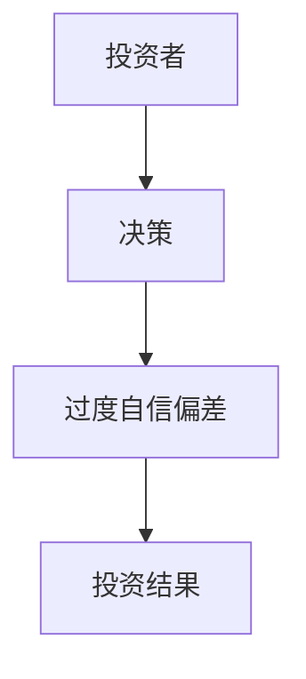

                 


# 过度自信偏差：如何客观评估投资能力

**关键词**：过度自信偏差，投资能力，认知偏差，投资决策，心理学

**摘要**：本文探讨了过度自信偏差在投资决策中的表现及其对投资结果的影响。通过分析偏差的成因、检测算法、数学模型和系统设计，提供客观评估投资能力的方法，帮助投资者避免因过度自信导致的决策失误。

---

# 第一部分：过度自信偏差与投资决策

## 第1章：过度自信偏差概述

### 1.1 过度自信偏差的定义与表现
#### 1.1.1 过度自信偏差的定义
过度自信偏差是一种认知偏差，表现为个体高估自己的能力、知识或判断的准确性。

#### 1.1.2 过度自信偏差的表现形式
- 过度相信自己的分析能力。
- 高估自己预测的准确性。
- 忽略外部信息或专家意见。

#### 1.1.3 过度自信偏差的成因分析
- 信息处理偏差。
- 过度自信的心理机制。
- 社会认同与自我价值维护。

### 1.2 过度自信偏差在投资中的体现
#### 1.2.1 投资决策中的过度自信现象
投资者可能过高估计自己的选股能力，忽视市场波动。

#### 1.2.2 过度自信偏差对投资结果的影响
可能导致错误决策，增加投资风险。

#### 1.2.3 投资者如何识别过度自信偏差
通过反思和自我评估，识别过度自信的迹象。

### 1.3 过度自信偏差的边界与外延
#### 1.3.1 过度自信偏差与其他认知偏差的区别
与确认偏向、选择性记忆等偏差的区别。

#### 1.3.2 过度自信偏差的适用范围
主要影响个体决策，但也存在于团队决策中。

#### 1.3.3 过度自信偏差的潜在风险
可能导致投资损失和决策失误。

### 1.4 过度自信偏差的核心要素
#### 1.4.1 个体认知偏差的核心要素
- 自我评估偏差。
- 信息处理偏差。

#### 1.4.2 投资决策中的关键因素
- 分析能力。
- 风险评估。

#### 1.4.3 过度自信偏差的结构化分析
- 逻辑分析。
- 数理分析。

### 1.5 本章小结

---

## 第2章：过度自信偏差的核心概念与联系

### 2.1 过度自信偏差的原理分析
#### 2.1.1 认知偏差的基本原理
认知偏差是大脑对信息的处理方式。

#### 2.1.2 过度自信偏差的形成机制
- 自我服务倾向。
- 社会认同需求。

#### 2.1.3 投资决策中的心理因素
- 自信心的影响。
- 情感因素的作用。

### 2.2 过度自信偏差的核心属性特征对比
#### 2.2.1 行为偏差的特征对比
| 偏差类型 | 特征 |
|----------|------|
| 过度自信 | 高估能力 |
| 确认偏向 | 过滤信息 |

#### 2.2.2 认知偏差的特征对比
- 自我中心性。
- 选择性处理。

#### 2.2.3 投资行为中的属性特征
- 高估收益。
- 低估风险。

### 2.3 过度自信偏差的ER实体关系图


### 2.4 本章小结

---

## 第3章：过度自信偏差的算法原理讲解

### 3.1 过度自信偏差的检测算法
#### 3.1.1 算法原理概述
通过统计分析检测过度自信行为。

#### 3.1.2 算法流程图


#### 3.1.3 算法实现代码
```python
import numpy as np

def detect_overconfidence(portfolio_return, benchmark_return):
    excess = portfolio_return - benchmark_return
    if excess > 0:
        return "可能存在过度自信"
    else:
        return "无过度自信"

# 示例
print(detect_overconfidence(10, 8))
```

### 3.2 过度自信偏差的数学模型
#### 3.2.1 数学模型概述
$$ \text{投资能力} = \text{真实能力} + \text{过度自信偏差} $$

#### 3.2.2 数学公式推导
$$ \text{过度自信度} = \frac{\text{预测收益} - \text{实际收益}}{\text{实际收益}} $$

#### 3.2.3 数学公式解释
计算预测与实际收益的差异，评估过度自信程度。

### 3.3 本章小结

---

## 第4章：系统分析与架构设计方案

### 4.1 问题场景介绍
投资者需要评估自身投资能力，避免过度自信。

### 4.2 系统功能设计
#### 4.2.1 领域模型


#### 4.2.2 系统架构设计


### 4.3 系统接口设计
- 输入接口：投资数据。
- 输出接口：评估结果。

### 4.4 系统交互设计


### 4.5 本章小结

---

## 第5章：项目实战

### 5.1 环境安装
安装Python和相关库。

### 5.2 系统核心实现
#### 5.2.1 核心代码实现
```python
def evaluate_portfolio(portfolio, benchmark):
    # 计算收益差异
    excess = portfolio - benchmark
    # 判断是否过度自信
    if excess > 0:
        return "可能存在过度自信"
    else:
        return "无过度自信"

# 示例
portfolio = 12
benchmark = 10
print(evaluate_portfolio(portfolio, benchmark))
```

### 5.3 代码实现解读
通过代码实现对投资组合的评估，检测过度自信偏差。

### 5.4 实际案例分析
分析一个投资案例，展示如何应用算法检测过度自信。

### 5.5 本章小结

---

## 第6章：总结与建议

### 6.1 总结
过度自信偏差在投资中的表现及其影响。

### 6.2 最佳实践
- 定期反思投资决策。
- 依赖数据和事实，减少主观判断。
- 采用系统化方法评估投资能力。

### 6.3 注意事项
- 避免过度依赖直觉。
- 结合市场反馈调整策略。
- 定期评估和优化投资组合。

### 6.4 拓展阅读
推荐书籍和资源，进一步深入学习。

### 6.5 本章小结

---

# 作者：AI天才研究院 & 禅与计算机程序设计艺术

---

通过本文的详细分析，读者可以理解过度自信偏差在投资中的影响，并掌握客观评估投资能力的方法，从而做出更理性的投资决策。

