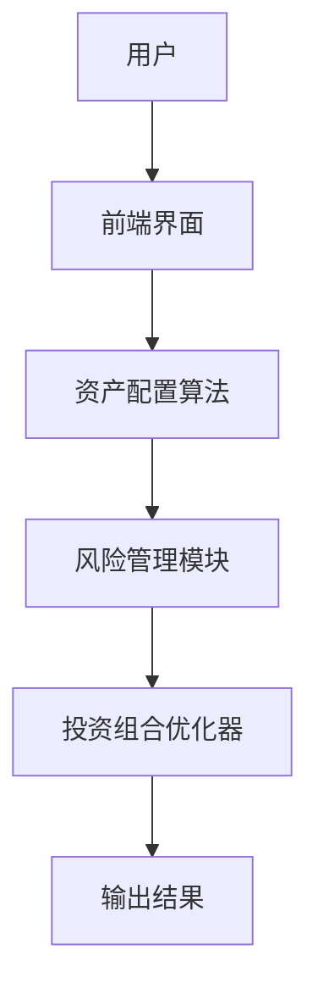

                 


# 退休投资规划：如何在市场波动中保持长期视角

> 关键词：退休投资规划、市场波动、长期视角、风险管理、资产配置、复利效应、技术分析

> 摘要：本文将探讨如何在市场波动中制定有效的退休投资规划，通过技术分析和系统设计，帮助投资者在长期视角下实现稳健的投资回报。文章从背景介绍、核心概念、数学模型、系统架构、项目实战等多方面展开，详细讲解退休投资规划的原理、方法和实践技巧。

---

## 第一部分: 退休投资规划的背景与重要性

### 第1章: 退休投资规划概述

#### 1.1 退休投资规划的定义与重要性

退休投资规划是指为确保退休后生活质量而进行的财务安排和投资管理。随着人口老龄化加剧和退休金制度的不确定性，个人需要通过科学的投资策略来保障退休后的收入来源。

**1.1.1 退休投资规划的定义**  
退休投资规划是通过合理配置资产、分散风险和长期投资，确保在退休后能够维持或提高生活水平的一系列财务安排。

**1.1.2 退休投资规划的重要性**  
退休后的生活开支通常不会减少，但收入来源可能受限。通过科学的投资规划，可以弥补养老金不足，应对通货膨胀，并提高生活质量。

**1.1.3 退休投资规划的目标**  
- 确保退休后有足够的资金来源。  
- 应对市场波动和经济变化带来的风险。  
- 实现资产保值与增值的平衡。

---

#### 1.2 市场波动对退休投资的影响

**1.2.1 市场波动的定义与特征**  
市场波动是指资产价格在短时间内频繁变动，通常由市场供需、经济政策、投资者情绪等多种因素引起。波动性高的市场通常伴随着高风险和高回报的双重特性。

**1.2.2 市场波动对退休投资的影响**  
市场波动可能导致投资组合的价值短期下降，影响退休后的资金稳定性。然而，长期视角下的波动可能被平滑，从而带来更高的回报。

**1.2.3 长期视角在市场波动中的重要性**  
长期视角有助于投资者忽略短期波动，专注于长期目标的实现。通过分散投资和时间的积累，市场波动对整体投资组合的影响可以被有效降低。

---

#### 1.3 退休投资规划的核心要素

**1.3.1 投资目标的设定**  
明确退休后的收入需求，合理规划投资目标，确保资金的可持续性。

**1.3.2 风险承受能力的评估**  
根据个人的风险偏好和财务状况，评估能够承受的市场波动范围，避免过度冒险或保守。

**1.3.3 投资时间跨度的影响**  
长期投资能够通过复利效应和市场波动的平滑，实现资产的稳步增长。

---

## 第二部分: 退休投资规划的核心概念与联系

### 第2章: 资产配置与风险分散

#### 2.1 资产配置的定义与作用

**2.1.1 资产配置的定义**  
资产配置是将资金分配到不同资产类别（如股票、债券、房地产等）的过程，以实现风险分散和收益最大化。

**2.1.2 资产配置的作用**  
- 分散风险：通过多样化投资降低单一资产带来的波动风险。  
- 优化收益：根据不同资产类别的风险收益特征，实现收益的最大化。  
- 灵活调整：根据市场变化和个人目标，动态调整资产配置比例。

---

#### 2.2 风险分散的原理与方法

**2.2.1 风险分散的原理**  
通过投资不同类型资产，降低单一资产价格波动带来的风险。  
$$ \text{分散风险} = \sum_{i=1}^{n} w_i \times \text{资产i的风险} $$  
其中，\( w_i \) 是资产i的权重，\( n \) 是资产种类数。

**2.2.2 风险分散的方法**  
- **股票与债券配置**：股票具有高增长潜力，债券提供稳定收益。  
- **地域分散**：投资不同地区的资产，降低地域性风险。  
- **行业分散**：投资不同行业的资产，降低行业周期性波动的影响。

---

#### 2.3 资产配置与风险分散的案例分析

**2.3.1 案例一：股票与债券的配置比例**  
假设投资者的风险承受能力为中等，可以将资产配置为60%股票和40%债券。  
$$ \text{股票权重} = 60\% \\ \text{债券权重} = 40\% $$  
这种配置在市场波动中能够平衡风险和收益。

**2.3.2 案例二：不同风险承受能力下的资产配置**  
- 高风险承受能力：股票70%，债券30%。  
- 低风险承受能力：股票30%，债券70%。

---

## 第三部分: 数学模型与算法原理

### 第3章: 现代投资组合理论（MPT）与退休投资

#### 3.1 现代投资组合理论（MPT）概述

**3.1.1 MPT的定义与核心思想**  
MPT是由哈里·马科维茨提出的，认为最优投资组合是能够提供最高预期收益的组合，其风险低于任意单一资产的风险。

---

#### 3.2 均值-方差优化模型

**3.2.1 模型的数学表达**  
$$ \text{目标函数：} \min \sigma^2 \\ \text{约束条件：} \sum_{i=1}^{n} w_i = 1 \\ \sum_{i=1}^{n} w_i r_i = \text{目标收益} $$  
其中，\( \sigma^2 \) 是投资组合的方差，\( w_i \) 是资产i的权重，\( r_i \) 是资产i的预期收益。

**3.2.2 模型的求解方法**  
通过拉格朗日乘数法求解上述优化问题，得到最优权重分配。

---

#### 3.3 夏普比率与投资组合评估

**3.3.1 夏普比率的定义与计算公式**  
夏普比率衡量投资组合的超额收益相对于其风险的高低。  
$$ \text{夏普比率} = \frac{r_p - r_f}{\sigma_p} $$  
其中，\( r_p \) 是投资组合的预期收益，\( r_f \) 是无风险利率，\( \sigma_p \) 是投资组合的收益标准差。

**3.3.2 夏普比率在退休投资中的应用**  
通过夏普比率，投资者可以评估不同投资组合的风险调整后收益，选择最优的投资策略。

---

## 第四部分: 系统分析与架构设计

### 第4章: 退休投资规划系统的构建

#### 4.1 系统需求分析

**4.1.1 系统目标**  
构建一个能够根据市场波动和投资者需求，自动调整资产配置的退休投资规划系统。

**4.1.2 系统功能需求**  
- 用户输入：风险承受能力、投资期限、目标收益。  
- 系统输出：最优资产配置方案、风险评估报告、投资组合模拟结果。

---

#### 4.2 系统架构设计

**4.2.1 系统架构图**  


**4.2.2 系统模块划分**  
- 前端界面：用户输入需求和查看结果。  
- 资产配置算法：计算最优资产配置比例。  
- 风险管理模块：评估投资组合的风险并进行调整。  
- 投资组合优化器：根据市场变化动态优化投资组合。

---

## 第五部分: 项目实战

### 第5章: 退休投资规划系统的实现

#### 5.1 环境配置

**5.1.1 环境要求**  
- Python 3.8及以上版本。  
- 安装必要的库：numpy、pandas、scipy、matplotlib。

#### 5.2 核心实现源代码

**5.2.1 资产配置算法**  
```python
import numpy as np
import scipy.optimize as opt

def portfolio_return(weights, returns):
    return np.sum(weights * returns)

def portfolio_variance(weights, covariance_matrix):
    return np.dot(weights.T, np.dot(covariance_matrix, weights))

def portfoliooptimizer(returns, covariance_matrix, target_return):
    n = len(weights)
    constraints = [{'type': 'eq', 'fun': lambda w: np.sum(w) - 1},
                   {'type': 'eq', 'fun': lambda w: portfolio_return(w, returns) - target_return}]
    result = opt.minimize(portfolio_variance, np.ones(n)/n, 
                          args=(covariance_matrix,), 
                          method='SLSQP', 
                          constraints=constraints)
    return result.x
```

#### 5.3 案例分析与解读

**5.3.1 案例分析**  
假设投资者有100万元，风险承受能力为中等，目标收益为8%。  
通过上述算法，系统会计算出最优的资产配置比例，并生成风险评估报告。

---

## 第六部分: 总结与展望

### 6.1 最佳实践 tips

- 定期审视和调整投资组合。  
- 根据市场变化和个人需求，动态优化资产配置。  
- 选择专业的投资顾问或使用成熟的退休投资规划系统。

### 6.2 小结

退休投资规划是一个复杂但重要的任务，需要结合市场波动、资产配置、风险管理等多种因素。通过技术分析和系统设计，投资者可以在市场波动中保持长期视角，实现稳健的投资回报。

### 6.3 注意事项

- 投资有风险，需谨慎决策。  
- 避免过度依赖单一投资策略。  
- 定期评估投资组合的绩效。

### 6.4 拓展阅读

- 哈里·马科维茨的《投资学原理》。  
- 现代投资组合理论的最新发展与应用。

---

作者：AI天才研究院/AI Genius Institute & 禅与计算机程序设计艺术 /Zen And The Art of Computer Programming

