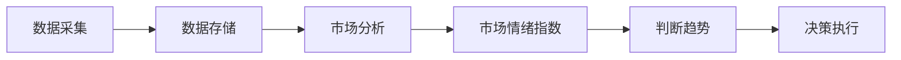

                 


# 逆向投资思维：为什么要与市场趋势相反操作

## 关键词：逆向投资、市场趋势、反向策略、投资思维、风险管理

## 摘要：逆向投资是一种在市场趋势相反方向进行操作的投资策略，其核心在于利用市场无效性和投资者心理偏差，寻找被低估的投资机会。本文详细分析逆向投资的背景、理论基础、算法模型、系统架构，并通过实战案例和最佳实践提供全面的指导。

---

## 第一部分：逆向投资思维的背景与概念

### 第1章：逆向投资思维的起源与发展

#### 1.1 逆向投资思维的起源
逆向投资思维起源于20世纪中期，由投资家约翰·邓普勒首次提出。它是一种基于市场无效性和投资者心理偏差的投资策略。与传统投资思维不同，逆向思维强调在市场低谷时买入，在市场高点时卖出，利用市场的非理性波动获取超额收益。

#### 1.2 逆向投资思维的定义与特点
逆向投资是一种在市场趋势相反方向进行操作的投资策略。其核心特点包括：
1. **逆周期性**：在市场低谷时买入，市场高点时卖出。
2. **非理性利用**：利用市场参与者心理偏差，寻找价格与价值的偏离点。
3. **长期视角**：关注长期价值，而非短期波动。

---

## 第二部分：逆向投资思维的理论基础

### 第2章：市场无效性与逆向思维的逻辑

#### 2.1 市场无效性理论
市场无效性是指市场价格未能完全反映其真实价值的情况。逆向投资策略利用这种无效性，寻找价格被低估的资产。市场无效性主要表现在以下几个方面：
1. **信息不对称**：投资者掌握的信息不一致，导致价格波动。
2. **情绪驱动**：投资者情绪往往过度反应，导致价格偏离价值。

#### 2.2 行为金融学视角下的逆向思维
行为金融学研究投资者心理偏差对市场的影响。常见的偏差包括：
1. **过度自信**：投资者倾向于过度自信，导致错误决策。
2. **从众心理**：投资者跟随市场趋势，忽视独立判断。

逆向思维利用这些偏差，逆市场趋势进行操作。例如，在市场恐慌时买入，在市场狂热时卖出。

---

## 第三部分：逆向投资策略的数学模型与算法

### 第3章：逆向投资策略的数学模型

#### 3.1 逆向投资的数学模型
逆向投资的数学模型基于市场情绪指数的计算。假设市场情绪指数（Market Sentiment Index, MSI）由多个指标组成，包括成交量、价格波动率和投资者情绪调查。公式如下：

$$ MSI = \alpha \times V + \beta \times P + \gamma \times S $$

其中：
- $V$ 表示成交量
- $P$ 表示价格波动率
- $S$ 表示投资者情绪调查结果
- $\alpha, \beta, \gamma$ 为权重系数

#### 3.2 逆向投资策略的算法实现
逆向投资的算法步骤如下：

1. **数据采集**：获取历史市场数据。
2. **计算市场情绪指数**：使用上述公式计算MSI。
3. **判断趋势**：根据MSI判断市场是否处于高估或低估状态。
4. **执行决策**：当MSI高于阈值时卖出，低于阈值时买入。

代码实现（Python）：

```python
import pandas as pd
import numpy as np

# 数据采集
data = pd.read_csv('market_data.csv')

# 计算市场情绪指数
def calculate_msi(data):
    V = data['volume'].mean()
    P = data['price'].std()
    S = data['sentiment'].mean()
    alpha = beta = gamma = 0.3
    return alpha * V + beta * P + gamma * S

msi = calculate_msi(data)

# 判断趋势并执行决策
threshold = 0.5
if msi > threshold:
    print("卖出")
elif msi < threshold:
    print("买入")
else:
    print("观望")
```

---

## 第四部分：逆向投资策略的系统架构

### 第4章：系统架构设计

#### 4.1 数据采集模块
负责收集市场数据，包括价格、成交量等。数据来源可以是API或数据库。

#### 4.2 市场分析模块
计算市场情绪指数，判断市场趋势。模块包含特征提取和模型计算。

#### 4.3 决策执行模块
根据分析结果生成买卖信号，执行交易。

系统架构图（Mermaid）：



---

## 第五部分：项目实战

### 第5章：逆向投资策略的实战应用

#### 5.1 实战环境
安装Python和相关库（pandas, numpy）。

#### 5.2 代码实现
如前所述，计算市场情绪指数并执行决策。

#### 5.3 案例分析
2008年金融危机期间，逆向投资者在市场低谷时买入，随后市场复苏获得收益。

---

## 第六部分：最佳实践与小结

### 第6章：逆向投资的注意事项

#### 6.1 风险管理
逆向投资需严格控制风险，避免过度杠杆和集中投资。

#### 6.2 长期视角
逆向投资需要耐心，关注长期价值，而非短期波动。

#### 6.3 独立思考
避免随波逐流，保持独立判断。

---

## 总结

逆向投资思维是一种有效的投资策略，通过市场趋势的反向操作获取超额收益。然而，投资者需具备深入的市场分析能力、严格的风控意识和独立的判断力。结合数学模型和系统架构，逆向投资可以更科学地实施。未来，随着大数据和人工智能的发展，逆向投资策略将更加精准和高效。

---

## 作者：AI天才研究院 & 禅与计算机程序设计艺术

---

**感谢您的阅读！如果这篇文章对您有帮助，请点赞、收藏并分享。**

