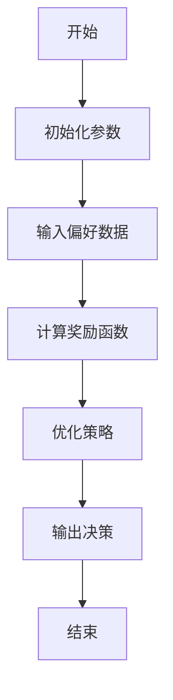
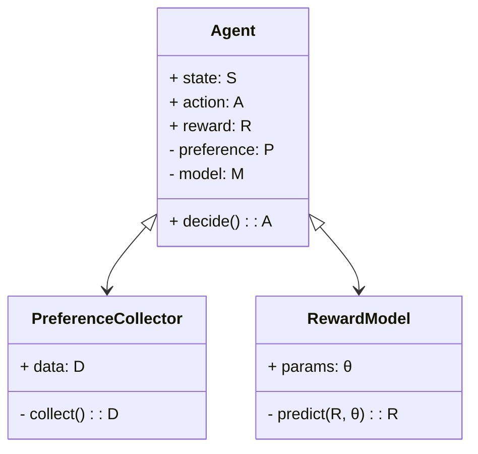

                 


```markdown
# 逆强化学习：理解人类偏好的AI Agent

> 关键词：逆强化学习、AI Agent、人类偏好、奖励建模、强化学习、偏好建模

> 摘要：逆强化学习是一种通过观察人类行为或偏好，推断其背后奖励函数的方法，从而使得AI Agent能够更好地理解并遵循人类的意图。本文将从逆强化学习的基本概念出发，逐步深入分析其原理、算法、系统架构设计以及实际应用案例，帮助读者全面理解如何通过逆强化学习构建能够理解人类偏好的AI Agent。

---

## 第1章：逆强化学习概述

### 1.1 逆强化学习的基本概念

#### 1.1.1 逆强化学习的定义
逆强化学习（Inverse Reinforcement Learning, IRL）是一种机器学习技术，旨在通过观察人类行为或偏好，推断出一个奖励函数，使得AI Agent能够根据这个奖励函数进行决策，从而表现出与人类一致或符合人类偏好的行为。

#### 1.1.2 逆强化学习与传统强化学习的区别
| **对比项** | **传统强化学习** | **逆强化学习** |
|------------|------------------|----------------|
| 输入数据   | 奖励信号         | 行为或偏好数据 |
| 目标       | 学习最优策略      | 推断奖励函数    |
| 应用场景   | 控制机器人、游戏AI | 理解人类偏好、个性化推荐等 |

#### 1.1.3 逆强化学习的核心问题与挑战
- **问题**：如何从有限的观测数据中准确推断出奖励函数？
- **挑战**：奖励函数可能存在多个解，如何选择最符合人类偏好的解？

### 1.2 人类偏好与AI决策的关系

#### 1.2.1 人类偏好的定义与特征
- **定义**：人类在特定情境下对行为或决策的偏好倾向。
- **特征**：主观性、多样性、动态性。

#### 1.2.2 AI决策中的偏好建模
- **目标**：将人类偏好转化为可计算的数学模型。
- **方法**：通过数据驱动的方式，学习人类偏好的模式。

#### 1.2.3 逆强化学习在理解人类偏好中的作用
- **作用**：通过逆强化学习，AI Agent能够从人类行为中学习偏好，从而做出更符合人类期望的决策。

---

## 第2章：逆强化学习的核心概念与联系

### 2.1 逆强化学习的原理

#### 2.1.1 状态空间与动作空间
- **状态空间**：所有可能的状态的集合。
- **动作空间**：所有可能的动作的集合。

#### 2.1.2 奖励函数的逆向推导
- **定义**：逆强化学习的核心是通过观察行为，推断出奖励函数。
- **过程**：从行为数据中学习奖励函数的参数。

#### 2.1.3 偏好建模的数学框架
$$ R(s,a) = \sum_{i=1}^{n} \lambda_i f_i(s,a) $$
其中，$R(s,a)$ 是状态动作对的奖励值，$\lambda_i$ 是偏好权重，$f_i(s,a)$ 是偏好函数。

### 2.2 核心概念对比与ER实体关系图

#### 2.2.1 基于表格的核心概念对比
| **概念** | **描述** |
|----------|----------|
| 状态     | 当前环境的描述 |
| 动作     | 可执行的行为 |
| 奖励     | 行为的价值评估 |
| 偏好     | 人类对行为的偏好倾向 |

#### 2.2.2 逆强化学习的ER实体关系图
```mermaid
er
    actor(Agent, "决策主体")
    actor(Preference, "偏好主体")
    actor(Reward, "奖励主体")
    relation(Agent, Reward, "基于偏好的奖励函数")
    relation(Preference, Reward, "定义偏好")
```

---

## 第3章：逆强化学习的算法原理

### 3.1 算法流程与数学模型

#### 3.1.1 算法流程


#### 3.1.2 数学模型
$$ R(s,a) = \sum_{i=1}^{n} \lambda_i f_i(s,a) $$

### 3.2 逆强化学习的实现细节

#### 3.2.1 偏好数据的采集与处理
- **数据采集**：通过用户交互或行为日志获取偏好数据。
- **数据处理**：对数据进行清洗、归一化处理。

#### 3.2.2 奖励函数的参数估计
- **方法**：使用最大似然估计或贝叶斯方法。
- **公式**：$$ \theta = \arg\max_{\theta} \sum_{i=1}^{N} \log P(d_i | \theta) $$

#### 3.2.3 策略优化的数学推导
- **目标函数**：$$ J(\theta) = \mathbb{E}[R(s,a)] $$
- **优化方法**：使用梯度下降或动态规划。

---

## 第4章：系统分析与架构设计

### 4.1 问题场景介绍

#### 4.1.1 问题背景
- **目标**：构建一个能够理解人类偏好的AI Agent。
- **约束**：数据有限、偏好动态变化。

### 4.2 系统架构设计

#### 4.2.1 系统功能设计


---

## 第5章：项目实战

### 5.1 环境安装与配置

#### 5.1.1 环境要求
- Python 3.8+
- NumPy、TensorFlow等库。

#### 5.1.2 安装依赖
```bash
pip install numpy tensorflow matplotlib
```

### 5.2 核心代码实现

#### 5.2.1 偏好数据采集
```python
import numpy as np

def collect_preference_data():
    # 示例：从用户输入中获取偏好数据
    data = []
    while True:
        user_input = input("请输入偏好数据（输入'exit'退出）：")
        if user_input == 'exit':
            break
        data.append(float(user_input))
    return np.array(data)
```

#### 5.2.2 奖励模型训练
```python
import tensorflow as tf

def train_reward_model(data):
    model = tf.keras.Sequential([
        tf.keras.layers.Dense(64, activation='relu'),
        tf.keras.layers.Dense(1, activation='linear')
    ])
    model.compile(optimizer='adam', loss='mse')
    model.fit(data, np.random.randn(len(data)), epochs=100, batch_size=32)
    return model
```

### 5.3 案例分析与结果解读

#### 5.3.1 实验结果展示
```python
import matplotlib.pyplot as plt

def visualize_results(true_rewards, predicted_rewards):
    plt.plot(true_rewards, label='True Rewards')
    plt.plot(predicted_rewards, label='Predicted Rewards')
    plt.xlabel('Time Step')
    plt.ylabel('Reward Value')
    plt.legend()
    plt.show()
```

---

## 第6章：最佳实践与总结

### 6.1 小结
逆强化学习通过理解和建模人类偏好，使得AI Agent能够更自然地与人类交互。其核心在于奖励函数的逆向推导，这为AI系统赋予了理解人类偏好的能力。

### 6.2 注意事项
- 数据质量：偏好数据的准确性和代表性直接影响模型性能。
- 模型选择：选择合适的逆强化学习算法和模型结构。
- 实验验证：通过实验验证模型的性能和效果。

### 6.3 拓展阅读
- "Inverse Reinforcement Learning: A Survey"，提供逆强化学习的全面综述。
- "Preference-based Reinforcement Learning: A Review and New Directions"，探讨基于偏好的强化学习前沿研究。

---

## 作者：AI天才研究院/AI Genius Institute & 禅与计算机程序设计艺术 /Zen And The Art of Computer Programming

---

通过以上思考和编写，我们详细分析了逆强化学习的基本概念、算法原理、系统架构设计以及实际应用案例，为读者提供了一个全面理解逆强化学习的框架。
```

