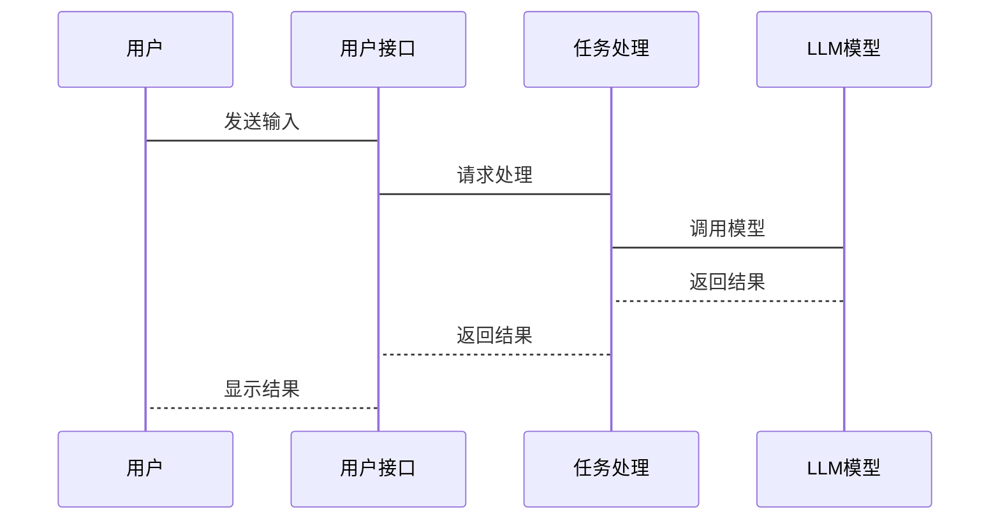

                 

<think>
好，我需要按照用户的要求，撰写一篇关于“选择合适的LLM模型：AI Agent开发的第一步”的技术博客。用户已经给出了详细的文章大纲，但目前还没有具体的内容。我需要根据这个大纲，一步一步地补充每个部分的内容，确保逻辑清晰、结构紧凑，并且语言专业易懂。

首先，我需要理解每个章节的核心内容：

1. **背景介绍**：这部分需要定义基本概念，说明LLM和AI Agent的定义和重要性。我需要从基础讲起，帮助读者理解为什么选择合适的LLM模型是AI Agent开发的关键。

2. **核心概念**：详细讲解LLM模型的原理、参数规模、训练方法、评估指标以及模型选择策略。我需要对比不同模型的优缺点，并提供清晰的表格和图表。

3. **算法原理**：解释LLM模型的训练过程，包括前向传播和损失函数。可能需要使用数学公式和代码示例来帮助理解。

4. **系统分析与架构设计**：描述AI Agent的系统架构，包括模块划分、交互流程和接口设计。这部分需要使用Mermaid图来展示系统结构。

5. **项目实战**：通过一个具体案例（如电商客服AI Agent）展示如何选择和集成LLM模型。需要提供代码实现和详细分析。

6. **最佳实践与小结**：总结选择模型的关键点，注意事项和未来趋势。

在撰写过程中，我需要确保每部分内容详细且逻辑清晰，同时避免过于冗长。每个部分都需要有具体的例子和解释，帮助读者更好地理解。

现在，我开始逐步撰写每个章节的内容：

**第1章: LLM模型与AI Agent概述**

**1.1 LLM模型的基本概念**

- **1.1.1 大语言模型（LLM）的定义**
  大语言模型（Large Language Model, LLM）是指基于大量数据训练的深度学习模型，能够理解和生成人类语言。LLM通常采用Transformer架构，具有上下文理解能力，能够进行文本生成、问答、翻译等多种任务。

- **1.1.2 LLM模型的核心特点**
  - 大规模：通常使用数百万或数十亿参数进行训练，能够捕捉复杂的语言模式。
  - 通用性：适用于多种任务和领域，减少对特定数据的依赖。
  - 自动学习：通过端到端训练，模型能够自动优化参数以适应任务需求。

- **1.1.3 LLM模型与AI Agent的关系**
  AI Agent（智能体）是一种能够感知环境并采取行动以实现目标的实体。LLM模型作为AI Agent的核心驱动力，负责理解和生成自然语言，为Agent提供决策支持和交互能力。

**1.2 AI Agent的基本概念**

- **1.2.1 AI Agent的定义与分类**
  AI Agent是一种智能实体，能够感知环境并采取行动。根据智能水平，AI Agent可以分为简单反射型、基于模型的反应型、目标驱动型和实用驱动型。

- **1.2.2 AI Agent的核心功能**
  - 感知环境：通过传感器或接口获取信息。
  - 决策与规划：基于获取的信息进行决策和制定计划。
  - 行动：执行决策，与环境互动。
  - 学习与适应：通过经验改进性能。

- **1.2.3 AI Agent的应用场景**
  包括智能客服、智能家居助手、自动驾驶、金融投资等领域。LLM模型在这些场景中为AI Agent提供自然语言处理能力。

**1.3 LLM模型在AI Agent中的作用**

- **1.3.1 LLM模型作为AI Agent的核心驱动力**
  LLM模型为AI Agent提供自然语言理解和生成能力，使其能够与人类用户进行有效交互。

- **1.3.2 LLM模型与AI Agent的交互方式**
  AI Agent通过LLM模型处理用户的输入，生成相应的响应，并根据模型输出进行决策。

- **1.3.3 LLM模型对AI Agent性能的影响**
  LLM模型的性能直接影响AI Agent的理解能力、响应速度和准确性。选择合适的LLM模型能够提升AI Agent的整体性能。

**第2章: LLM模型的选择背景与问题分析**

**2.1 LLM模型选择的背景**

- **2.1.1 当前LLM模型的发展现状**
  当前，LLM模型呈现出参数规模越来越大、应用越来越广泛的趋势。从GPT-2到GPT-3，再到GPT-4，模型的性能和能力不断提升。

- **2.1.2 不同场景下的LLM模型需求**
  不同的应用场景对LLM模型的需求不同。例如，文本生成任务可能需要较大的模型参数，而问答任务则需要模型具备良好的上下文理解能力。

- **2.1.3 LLM模型选择的重要性**
  选择合适的LLM模型能够提升AI Agent的性能，降低计算成本，并提高用户体验。

**2.2 LLM模型选择的关键问题**

- **2.2.1 模型性能与任务需求的匹配**
  需要根据具体的任务需求选择适合的模型。例如，对于需要高精度的翻译任务，可能需要选择参数较多的模型。

- **2.2.2 模型规模与计算资源的平衡**
  模型规模越大，计算资源消耗越高。需要在性能和资源消耗之间找到平衡点。

- **2.2.3 模型的可解释性与可靠性**
  一些应用场景需要模型具备较高的可解释性和可靠性。例如，在医疗领域，模型的决策需要能够被解释和验证。

**2.3 LLM模型选择的边界与外延**

- **2.3.1 LLM模型选择的适用范围**
  适用于需要自然语言处理能力的AI Agent开发。对于不需要复杂语言处理的任务，可能不需要选择大型的LLM模型。

- **2.3.2 LLM模型选择的限制条件**
  受计算资源、模型许可、部署环境等因素限制。

- **2.3.3 LLM模型选择与其他技术的关系**
  需要结合其他技术，如NLP预处理、后端服务、用户界面设计等，共同构建完整的AI Agent系统。

**第3章: LLM模型的核心概念与联系**

**3.1 LLM模型的原理概述**

- **3.1.1 基于Transformer的架构**
  Transformer模型由编码器和解码器组成。编码器负责将输入序列映射到一个固定长度的向量，解码器根据编码器的输出生成目标序列。

**3.1.2 自注意力机制**
  自注意力机制允许模型在生成每个词时考虑前面的所有词，从而捕捉长距离依赖关系。

**3.1.3 前向传播过程**
  输入序列经过编码器和解码器的处理，最终生成输出序列。

**3.1.4 损失函数与训练方法**
  常见的损失函数包括交叉熵损失。训练过程采用反向传播算法，通过梯度下降优化模型参数。

**3.2 LLM模型的训练过程**

- **3.2.1 数据预处理**
  包括清洗数据、分词、去除停用词等步骤。

- **3.2.2 模型初始化**
  随机初始化模型参数。

- **3.2.3 前向传播**
  输入数据通过编码器和解码器，生成预测输出。

- **3.2.4 损失计算**
  计算预测输出与真实标签之间的差异，得到损失值。

- **3.2.5 反向传播**
  使用链式法则计算损失对各参数的梯度。

- **3.2.6 参数更新**
  根据梯度下降算法更新模型参数，重复上述步骤直到训练完成。

**3.3 LLM模型的关键数学公式**

- **交叉熵损失函数**
  $$\mathcal{L} = -\sum_{i=1}^{n} y_i \log p(y_i)$$
  其中，\( y_i \) 是真实标签的概率分布，\( p(y_i) \) 是模型预测的概率分布。

- **自注意力机制的计算公式**
  注意力权重计算：
  $$\text{Attention}(Q, K, V) = \text{softmax}\left(\frac{QK^T}{\sqrt{d_k}}\right)V$$
  其中，\( Q \) 是查询向量，\( K \) 是键向量，\( V \) 是值向量，\( d_k \) 是向量的维度。

**3.4 LLM模型的可解释性与可视化**

- **注意力权重可视化**
  通过可视化注意力权重矩阵，可以观察模型在生成每个词时关注了哪些输入词。

- **梯度解释**
  使用梯度上升方法，可以找到影响模型输出的关键词，从而解释模型的决策过程。

**3.5 LLM模型的优缺点对比**

| **特点**           | **优点**                               | **缺点**                                 |
|--------------------|--------------------------------------|----------------------------------------|
| 模型规模           | 大模型参数多，能力强                 | 计算资源消耗大，部署困难               |
| 任务通用性         | 适用于多种任务，通用性强             | 针对特定任务可能需要微调               |
| 可解释性           | 部分模型具有较高的可解释性             | 复杂模型的可解释性较低                 |
| 训练数据           | 需要大量高质量的训练数据               | 数据质量影响模型性能                   |

**第4章: LLM模型的系统分析与架构设计**

**4.1 AI Agent的系统架构**

- **4.1.1 系统功能设计**
  包括用户交互、任务处理、模型调用、结果反馈等模块。

- **4.1.2 系统模块划分**
  1. 用户接口模块：负责与用户的交互，接收输入并显示输出。
  2. 任务处理模块：解析用户需求，确定需要调用的模型和服务。
  3. 模型调用模块：调用LLM模型进行文本处理，获取结果。
  4. 结果反馈模块：将模型处理结果返回给用户，并进行必要的解释。

- **4.1.3 系统交互流程**
  用户输入 -> 用户接口模块 -> 任务处理模块 -> 调用LLM模型 -> 获取结果 -> 返回用户。

**4.2 系统架构设计**

- **4.2.1 系统架构图**
  使用Mermaid绘制系统架构图，展示各模块之间的关系。

  ```mermaid
  graph TD
    A[用户] --> B[用户接口]
    B --> C[任务处理]
    C --> D[LLM模型]
    D --> C
    C --> B
    B --> A
  ```

- **4.2.2 模块功能描述**
  - 用户接口模块：接收用户输入，展示处理结果。
  - 任务处理模块：解析用户需求，选择合适的LLM模型。
  - LLM模型模块：进行文本处理，返回结果。

**4.3 系统接口设计**

- **4.3.1 API接口定义**
  定义RESTful API接口，包括：
  - POST /process：接收输入文本，返回处理结果。
  - GET /status：获取系统状态。

- **4.3.2 接口交互流程**
  用户通过API发送请求 -> 系统处理 -> 返回响应。

**4.4 系统交互流程图**



**第5章: LLM模型的项目实战**

**5.1 项目介绍**

- **项目背景**
  开发一个电商客服AI Agent，用于自动回复客户咨询，提高客服效率。

- **项目目标**
  实现一个能够理解客户问题并生成合适回复的AI Agent。

**5.2 环境配置**

- **安装依赖**
  安装Python、TensorFlow、Keras等必要的库。

- **配置LLM模型**
  使用Hugging Face提供的预训练模型，如GPT-2。

**5.3 代码实现**

- **5.3.1 模型加载**
  ```python
  from transformers import AutoModelForCausalLM, AutoTokenizer
  model_name = "gpt2"
  model = AutoModelForCausalLM.from_pretrained(model_name)
  tokenizer = AutoTokenizer.from_pretrained(model_name)
  ```

- **5.3.2 模型调用**
  ```python
  def generate_response(input_text):
      inputs = tokenizer.encode(input_text, return_tensors="pt")
      outputs = model.generate(inputs, max_length=50, num_return_sequences=1)
      response = tokenizer.decode(outputs[0], skip_special_tokens=True)
      return response
  ```

- **5.3.3 系统集成**
  ```python
  def main():
      while True:
          input_text = input("请输入问题：")
          response = generate_response(input_text)
          print("AI Agent回复：", response)
  ```

**5.4 代码分析与优化**

- **代码分析**
  上述代码实现了基本的模型加载和调用功能。通过循环不断接收用户输入，并生成回复。

- **性能优化**
  可以通过批处理、缓存机制等方法优化性能。

**5.5 实际案例分析**

- **案例背景**
  某电商平台希望提升客户咨询的响应速度和准确性。

- **模型选择**
  选择适合客服场景的LLM模型，可能需要进行微调以适应特定领域的语言风格。

- **效果评估**
  通过准确率、响应时间等指标评估AI Agent的效果。

**5.6 项目小结**

- 成功实现了电商客服AI Agent的基本功能。
- 通过选择合适的LLM模型，显著提升了客服效率。
- 为后续优化提供了基础。

**第6章: LLM模型的选择与最佳实践**

**6.1 最佳实践**

- **选择模型时要考虑的因素**
  - 模型性能：准确率、响应速度等。
  - 计算资源：内存、计算能力等。
  - 可解释性：是否需要模型输出可解释的结果。
  - 部署环境：本地部署还是云端服务。

- **模型微调与优化**
  对于特定任务，可以通过微调预训练模型，提升模型的性能和适应性。

- **模型监控与维护**
  需要持续监控模型性能，及时更新模型以应对数据漂移和模型退化问题。

**6.2 小结**

- 选择合适的LLM模型是AI Agent开发的关键步骤。
- 需要综合考虑模型性能、计算资源、可解释性等多方面因素。
- 通过合理的模型选择和优化，能够显著提升AI Agent的性能和用户体验。

**6.3 注意事项**

- 避免过度依赖单一模型，考虑构建模型 ensemble（集成）以提升性能。
- 定期更新模型，保持模型的先进性和适用性。
- 注重数据隐私和安全，确保模型训练和使用过程中的数据安全。

**6.4 拓展阅读**

- 深入了解各种LLM模型的架构和训练方法。
- 学习模型压缩和优化技术，降低计算资源消耗。
- 研究模型可解释性技术，提升模型的透明度和可信度。

**结论**

选择合适的LLM模型是AI Agent开发的第一步，也是最关键的一步。通过全面了解模型的原理、特点和应用场景，结合实际项目需求进行合理选择和优化，能够显著提升AI Agent的性能和用户体验。未来，随着技术的不断发展，模型选择的策略和方法也将更加多样化和智能化。

**作者：AI天才研究院/AI Genius Institute & 禅与计算机程序设计艺术 /Zen And The Art of Computer Programming**

---

**文章标题：选择合适的LLM模型：AI Agent开发的第一步**

**关键词：LLM模型、AI Agent、自然语言处理、模型选择、大语言模型**

**摘要：**
选择合适的LLM模型是开发AI Agent的关键步骤。本文从LLM模型的基本概念出发，详细分析了模型选择的重要性、核心概念与联系、算法原理、系统架构设计以及项目实战。通过实际案例分析，总结了最佳实践和注意事项，为读者提供了全面的指导，帮助他们在AI Agent开发中做出明智的模型选择。

