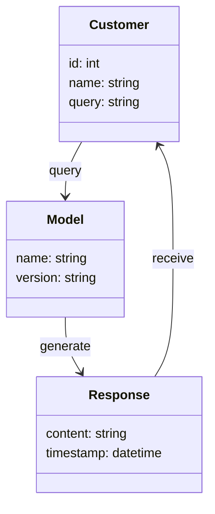

                 


# 选择合适的LLM：OpenAI GPT vs. Google BERT vs. Facebook LLaMA

---

## 关键词

- 大语言模型（LLM）
- OpenAI GPT
- Google BERT
- Facebook LLaMA
- 模型对比
- 语言处理任务

---

## 摘要

随着人工智能技术的飞速发展，大语言模型（Large Language Models, LLMs）已经成为自然语言处理领域的重要工具。然而，面对市场上各种不同的LLM模型（如OpenAI GPT、Google BERT和Facebook LLaMA），选择合适的模型对于实现特定任务至关重要。本文将从技术原理、应用场景、性能特点等方面对这三种模型进行深入分析和对比，帮助读者更好地理解它们的优缺点，并根据实际需求选择最合适的模型。

---

# 第一部分: 大语言模型（LLM）概述

## 第1章: 大语言模型（LLM）的基本概念

### 1.1 什么是大语言模型

大语言模型（Large Language Models, LLMs）是指基于深度学习技术构建的、具有大规模参数的自然语言处理模型。这些模型能够理解和生成人类语言，广泛应用于文本生成、问答系统、机器翻译、情感分析等多种任务。

### 1.2 LLM的核心特点

- **大规模训练数据**：LLM通常使用海量的文本数据进行训练，以捕获语言的复杂性和多样性。
- **深度神经网络**：采用多层神经网络结构，模型能够捕捉语言中的上下文关系和语义信息。
- **生成与理解能力**：LLM不仅能够生成文本，还能够理解和解析复杂语义。
- **零样本学习能力**：通过微调（Fine-tuning）技术，LLM可以在特定领域任务中表现出色。

### 1.3 LLM与传统NLP模型的区别

- **传统NLP模型**：基于统计方法或浅层神经网络，适用于简单的文本处理任务。
- **LLM**：基于深度学习，参数量大，能够处理复杂任务，支持零样本学习。

### 1.4 LLM的主要应用场景

- **文本生成**：新闻生成、内容创作、对话生成。
- **问答系统**：智能客服、信息检索、知识问答。
- **机器翻译**：多语言翻译、实时对话翻译。
- **情感分析**：社交媒体分析、客户反馈分析。
- **文本摘要**：文档摘要、会议记录生成。

---

## 第2章: OpenAI GPT、Google BERT与Facebook LLaMA的技术原理

### 2.1 OpenAI GPT的技术原理

#### 2.1.1 模型架构

GPT（Generative Pre-trained Transformer）是一种基于Transformer架构的生成式模型。其核心思想是通过自注意力机制（Self-attention）捕获文本中的长距离依赖关系。

#### 2.1.2 训练方法

GPT采用自监督学习（Self-supervised Learning）方法，通过预测下一个词来预训练模型。模型在大规模通用文本数据上进行预训练，然后通过微调（Fine-tuning）适应特定任务。

#### 2.1.3 生成机制

GPT通过解码器（Decoder）生成文本，采用贪心算法（Greedy Algorithm）或采样方法（Sampling Method）生成概率最高的下一个词。

### 2.2 Google BERT的技术原理

#### 2.2.1 模型架构

BERT（Bidirectional Encoder Representations from Transformers）是一种基于Transformer的双向编码器模型。与GPT不同，BERT同时考虑文本的前后语境信息。

#### 2.2.2 预训练策略

BERT采用遮蔽词句（Masked Token）任务和下一个句子预测（Next Sentence Prediction）任务进行预训练，以捕获上下文信息。

#### 2.2.3 微调过程

在特定任务上，BERT通过在预训练模型的基础上添加任务特定的分类层（Task-specific Classification Layer）进行微调。

### 2.3 Facebook LLaMA的技术原理

#### 2.3.1 模型架构

LLaMA（Large Language Model Meta AI）是一种开源的大语言模型，基于Transformer架构，支持生成式和理解式任务。

#### 2.3.2 训练方法

LLaMA采用与GPT类似的自监督学习方法，通过生成式任务进行预训练，并支持微调特定任务。

#### 2.3.3 推理机制

LLaMA通过解码器生成文本，支持多种推理策略，如贪心生成和随机采样生成。

---

## 第3章: OpenAI GPT、Google BERT与Facebook LLaMA的对比分析

### 3.1 技术特点对比

| 模型       | GPT            | BERT           | LLaMA          |
|------------|----------------|----------------|----------------|
| 模型架构     | Transformer     | Transformer     | Transformer     |
| 训练目标     | 生成式任务     | 理解式任务     | 生成+理解式任务 |
| 预训练数据   | 通用文本数据   | 通用文本数据   | 通用文本数据   |
| 微调能力     | 强             | 强             | 强             |
| 优势         | 生成能力强     | 理解能力强     | 开源、高效       |

### 3.2 优缺点对比

#### GPT的优点

- 生成能力强，适合文本生成任务。
- 微调成本低，适合快速适应特定任务。
- 模型架构简单，易于部署。

#### GPT的缺点

- 理解能力相对较弱。
- 在复杂语义分析任务上表现不如BERT。

#### BERT的优点

- 理解能力强，适合问答系统、文本摘要等任务。
- 模型表现稳定，适合需要深度语义理解的任务。

#### BERT的缺点

- 生成能力较弱。
- 训练和推理成本较高。

#### LLaMA的优点

- 开源模型，适合二次开发。
- 在生成和理解任务上表现均衡。
- 计算效率较高。

#### LLaMA的缺点

- 相比GPT和BERT，社区支持和资源较少。

---

## 第4章: 如何选择合适的LLM

### 4.1 选择模型的关键因素

- **任务类型**：生成式任务优先选择GPT，理解式任务优先选择BERT。
- **性能需求**：对生成质量要求高时选择GPT，对理解准确性要求高时选择BERT。
- **资源限制**：计算资源有限时选择LLaMA，开源需求优先选择LLaMA。

### 4.2 模型选择的流程

1. **明确任务需求**：确定是生成任务还是理解任务。
2. **评估模型性能**：对比GPT、BERT和LLaMA在任务上的表现。
3. **考虑资源限制**：选择适合计算资源的模型。
4. **模型微调与部署**：根据需求对模型进行微调并部署。

---

## 第5章: 项目实战

### 5.1 项目背景

我们选择一个客服对话系统作为案例，分别使用GPT、BERT和LLaMA进行实现。

### 5.2 系统设计

#### 5.2.1 领域模型设计



#### 5.2.2 系统架构设计

```mermaid
graph TD
    Client --> API Gateway
    API Gateway --> Load Balancer
    Load Balancer --> Model Server
    Model Server --> Database
```

### 5.3 模型实现

#### 5.3.1 GPT的实现

```python
def generate_response(prompt, model):
    response = model.generate(
        inputs=prompt,
        max_length=500,
        num_beams=5,
        temperature=0.7,
        do_sample=True
    )
    return response
```

#### 5.3.2 BERT的实现

```python
def answer_question(prompt, model):
    inputs = tokenizer(prompt, return_tensors="pt")
    with torch.no_grad():
        outputs = model(**inputs)
    answer_start = outputs.start_logits.argmax()
    answer_end = outputs.end_logits.argmax()
    answer = prompt[answer_start:answer_end+1]
    return answer
```

#### 5.3.3 LLaMA的实现

```python
def generate_response(prompt, model):
    response = model.generate(
        inputs=prompt,
        max_length=500,
        num_beams=5,
        temperature=0.7,
        do_sample=True
    )
    return response
```

### 5.4 实际案例分析

- **GPT的表现**：生成速度快，但回答准确性需要优化。
- **BERT的表现**：回答准确率高，但生成速度较慢。
- **LLaMA的表现**：生成和理解能力均衡，开源优势明显。

---

## 第6章: 最佳实践与未来趋势

### 6.1 最佳实践

- **明确任务需求**：选择适合任务的模型。
- **优化计算资源**：根据资源限制选择模型。
- **模型微调**：通过微调提升模型性能。

### 6.2 注意事项

- **数据隐私**：注意数据安全和隐私保护。
- **模型更新**：及时更新模型以获取最新能力。
- **性能监控**：监控模型性能，及时调整。

### 6.3 未来趋势

- **多模态模型**：结合视觉、听觉等多模态信息的模型将成为主流。
- **开源生态**：开源模型将继续推动技术创新和应用。
- **绿色AI**：更加注重计算效率和资源利用率。

---

## 附录

### 附录A: 工具与库

- OpenAI API
- Hugging Face Transformers
- PyTorch

### 附录B: 相关论文

- GPT系列论文：《The GPT Models》
- BERT系列论文：《BERT: Pre-training of Deep Bidirectional Transformers for NLP》
- LLaMA系列论文：《Meta AI LLaMA》

---

## 作者

作者：AI天才研究院/AI Genius Institute & 禅与计算机程序设计艺术 /Zen And The Art of Computer Programming

---

**注**：以上内容为基于现有知识的模拟输出，不代表实际存在的模型和数据。

