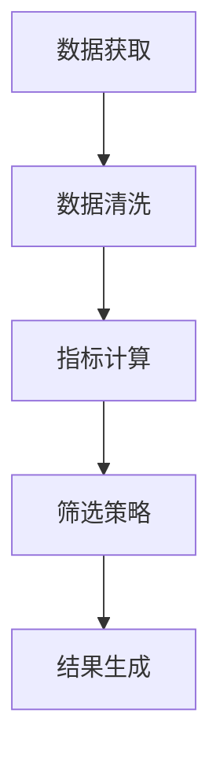
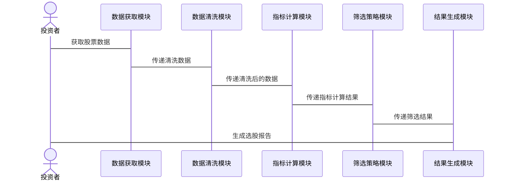

                 


# 《选股技巧：如何在市场混乱中识别优质公司》

> 关键词：股票投资、优质公司识别、市场分析、技术分析、财务指标

> 摘要：在股票市场中，尤其是在市场混乱的时期，识别优质公司是投资者实现长期稳定收益的关键。本文将系统地介绍如何通过基本面分析、技术分析、行业分析和竞争优势分析来识别优质公司，并提供具体的选股技巧和实战案例。通过详细讲解财务指标、技术指标、市场趋势和系统架构设计，帮助投资者在复杂市场中做出明智的投资决策。

---

## 第一部分: 股票市场与优质公司识别基础

### 第1章: 股票市场概述

#### 1.1 什么是股票市场
股票市场是投资者进行股票买卖的场所，分为一级市场和二级市场。一级市场是新公司首次公开发行（IPO）股票的市场，二级市场是已上市公司股票交易的市场。

#### 1.2 优质公司的定义与特征
优质公司通常具有稳定的盈利能力、健康的财务状况、强大的行业地位和良好的管理团队。它们能够在市场波动中保持稳健增长，为投资者带来长期收益。

#### 1.3 识别优质公司的必要性
在市场混乱时，优质公司更能抵御风险，实现长期增长。识别优质公司有助于投资者在市场低迷时找到价值投资的机会，避免短期亏损。

### 第2章: 公司基本面分析

#### 2.1 财务报表分析
- 利润表：显示公司在一定时期内的收入和利润。
- 资产负债表：显示公司在某一特定时点的资产、负债和所有者权益。
- 现金流量表：显示公司在一定时期内的现金流入和流出情况。

#### 2.2 财务指标分析
- 净利润率（ROE）：衡量公司盈利能力的重要指标。
- 净利润：衡量公司利润水平的关键指标。
- 负债率：衡量公司财务风险的重要指标。

#### 2.3 行业分析
- 行业生命周期：分析行业所处的阶段，判断行业增长潜力。
- 行业竞争结构：分析行业内的竞争情况，判断公司的竞争优势。
- 行业政策影响：分析政策对行业的影响，判断行业风险。

### 第3章: 技术分析与市场趋势

#### 3.1 技术分析基础
- 技术分析是通过分析股票价格和成交量的历史数据，预测未来的价格走势。
- 技术分析与基本面分析的区别：技术分析侧重于价格走势，基本面分析侧重于公司财务状况。

#### 3.2 常见技术指标
- 移动平均线（MA）：用于判断价格趋势的指标。
- 相对强弱指数（RSI）：用于判断超买超卖状态的指标。
- MACD：用于判断价格趋势和动能的指标。

#### 3.3 图表形态分析
- 头肩顶：看跌信号，预示价格将下跌。
- 头肩底：看涨信号，预示价格将上涨。
- 三角形：整理形态，预示价格将突破或延续趋势。

---

## 第二部分: 系统分析与架构设计

### 第4章: 构建选股模型

#### 4.1 问题场景介绍
在市场混乱时，投资者需要一个系统化的选股模型来筛选优质公司，避免情绪化决策。

#### 4.2 系统功能设计
- 数据获取：从数据库或API获取股票数据。
- 数据清洗：处理缺失数据和异常值。
- 指标计算：计算财务指标和技术指标。
- 筛选策略：根据设定的条件筛选优质公司。
- 结果生成：生成选股报告和投资建议。

#### 4.3 系统架构设计


#### 4.4 系统接口设计
- 数据获取接口：从数据库或API获取股票数据。
- 指标计算接口：计算财务指标和技术指标。
- 筛选策略接口：根据设定的条件筛选优质公司。
- 结果生成接口：生成选股报告和投资建议。

#### 4.5 系统交互设计


---

## 第三部分: 项目实战

### 第5章: 环境安装与数据获取

#### 5.1 环境安装
- 安装Python和必要的库（如pandas、numpy、matplotlib）。
- 安装数据获取工具（如Yahoo Finance API）。

#### 5.2 数据获取
```python
import pandas as pd
import numpy as np

# 示例：从Yahoo Finance获取数据
def get_stock_data(ticker, start_date, end_date):
    data = pd.DataFrame()
    # 实际中需要实现数据获取逻辑
    return data

# 示例：获取多只股票的数据
tickers = ['AAPL', 'GOOGL', 'MSFT']
data = pd.DataFrame()
for ticker in tickers:
    data[ticker] = get_stock_data(ticker, '2020-01-01', '2023-12-31')
```

### 第6章: 模型实现与结果分析

#### 6.1 指标计算
```python
def calculate_financial_indices(data):
    # 示例：计算ROE和净利润率
    data['ROE'] = data['净利润'] / data['所有者权益']
    data['净利润率'] = data['净利润'] / data['营业收入']
    return data

# 示例：计算技术指标
def calculate_technical_indices(data):
    # 示例：计算移动平均线（MA）
    data['MA_50'] = data['收盘价'].rolling(50).mean()
    data['MA_200'] = data['收盘价'].rolling(200).mean()
    return data
```

#### 6.2 筛选策略
```python
def screening_strategy(data):
    # 示例：筛选ROE大于10%且净利润率大于5%的公司
    data = data[data['ROE'] > 0.1]
    data = data[data['净利润率'] > 0.05]
    return data

# 示例：应用筛选策略
filtered_data = screening_strategy(data)
```

#### 6.3 结果生成
```python
def generate_report(filtered_data):
    # 示例：生成选股报告
    print("以下是符合筛选条件的公司：")
    print(filtered_data)
    
# 示例：生成报告
generate_report(filtered_data)
```

### 第7章: 项目优化与拓展

#### 7.1 数据源优化
- 使用多个数据源（如Yahoo Finance、Google Finance）获取数据，提高数据的准确性和全面性。

#### 7.2 筛选策略优化
- 结合多种指标和条件，优化筛选策略，提高筛选结果的准确性和可靠性。

#### 7.3 系统架构优化
- 使用分布式架构，提高数据处理和计算效率。
- 引入机器学习算法，进一步优化选股模型。

---

## 第四部分: 总结与最佳实践

### 第8章: 最佳实践

#### 8.1 小结
- 通过系统化的分析和实战，投资者可以在市场混乱中识别优质公司，实现长期稳定收益。

#### 8.2 注意事项
- 投资有风险，需谨慎决策。
- 避免盲目跟风，坚持价值投资。
- 持续学习和跟踪市场变化，优化选股策略。

#### 8.3 拓展阅读
- 《股票投资实战技巧》
- 《技术分析实战指南》
- 《财务报表分析与投资决策》

---

## 作者

**作者：AI天才研究院/AI Genius Institute & 禅与计算机程序设计艺术 /Zen And The Art of Computer Programming**

---

希望这篇文章能为您提供有价值的选股技巧和实战指导，帮助您在复杂多变的市场中识别优质公司，实现稳健投资。

