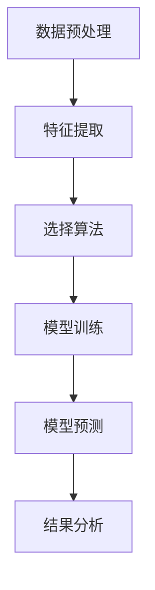

                 

# 选股时机：市场波动如何创造投资机会

## 关键词：市场波动，投资机会，技术分析，风险管理，投资策略

## 摘要：  
市场波动是投资世界中不可忽视的现象，它既是挑战也是机遇。通过技术分析和策略优化，投资者可以利用市场波动捕捉投资机会。本文将深入探讨市场波动的核心概念、技术分析工具、数学模型、投资策略以及风险管理方法，帮助投资者更好地理解如何在市场波动中获利。

---

## 第1章：市场波动的核心概念

### 1.1 市场波动的定义与特征

#### 1.1.1 市场波动的定义  
市场波动是指股票价格在短时间内偏离其长期趋势的波动现象。这种波动通常由市场情绪、供需变化、新闻事件等多种因素引起。

#### 1.1.2 市场波动的主要特征  
- **短期性**：市场波动通常发生在较短的时间内，如几小时或几天。
- **不规则性**：波动的幅度和频率没有固定的规律。
- **不可预测性**：尽管存在一定的技术分析方法，但市场波动仍具有一定的不可预测性。

#### 1.1.3 市场波动的分类与度量  
- **短期波动**：由市场情绪和交易行为引起的短期价格波动。
- **中期波动**：由宏观经济因素或行业动态引起的中期内价格波动。
- **长期波动**：由基本面变化或结构性调整引起的长期价格波动。

### 1.2 投资机会与市场波动的关系

#### 1.2.1 市场波动如何创造投资机会  
市场波动为投资者提供了低买高卖的机会。例如，在市场下跌时，投资者可以逢低吸纳优质股票；在市场上涨时，投资者可以高位卖出获利。

#### 1.2.2 投资者如何利用市场波动  
- **技术分析**：通过分析价格走势和成交量变化，预测未来的价格波动。
- **基本面分析**：通过分析公司财务状况和行业前景，选择在波动中具有抗跌能力的股票。
- **套利机会**：利用不同市场或资产之间的价格差异，进行无风险或低风险套利。

#### 1.2.3 市场波动对不同类型投资者的影响  
- **短期投资者**：市场波动对其影响较大，需要频繁调整投资组合。
- **长期投资者**：市场波动对其影响较小，注重长期趋势和基本面分析。

---

## 第2章：技术分析与市场波动预测

### 2.1 技术分析的核心假设

#### 2.1.1 市场价格反映所有信息  
技术分析认为，市场价格已经反映了所有可获得的信息，因此投资者可以通过分析价格走势来预测未来的价格变化。

#### 2.1.2 市场价格的趋势性  
技术分析认为，价格走势具有趋势性，即价格会沿着某一方向持续移动一段时间。

#### 2.1.3 历史走势会重复  
技术分析认为，市场走势会重复出现，因此可以通过分析历史价格走势来预测未来的市场走势。

### 2.2 技术分析的主要工具

#### 2.2.1 移动平均线（MA）
- **定义**：移动平均线是将过去一段时间内的收盘价进行平均，用于平滑价格走势。
- **用途**：用于识别价格趋势和支撑/阻力位。
- **示例**：计算5日移动平均线。

#### 2.2.2 相对强弱指数（RSI）
- **定义**：RSI是衡量股票相对于市场的强弱程度的指标，范围在0到100之间。
- **用途**：用于识别超买或超卖状态。
- **公式**：$$ RSI = \frac{100 \times (\text{平均上涨幅度})}{\text{平均上涨幅度} + \text{平均下跌幅度}} $$

#### 2.2.3 MACD指标
- **定义**：MACD指标由两条移动平均线和一个柱状图组成，用于识别价格趋势和力量变化。
- **用途**：用于识别趋势变化和潜在的买卖信号。

#### 2.2.4 K线图与形态分析
- **K线图**：通过绘制开盘价、收盘价、最高价和最低价，形成一种柱状图，用于分析价格走势。
- **形态分析**：通过识别K线图中的形态（如头肩顶、双底等），预测未来的价格走势。

### 2.3 技术分析的优缺点

#### 2.3.1 技术分析的优点
- **简单易学**：技术分析方法相对简单，易于投资者掌握。
- **实时性强**：技术分析可以实时指导交易决策。

#### 2.3.2 技术分析的局限性
- **主观性**：技术分析的结果往往受到分析师主观判断的影响。
- **不可预测性**：技术分析无法完全预测市场的未来走势。

---

## 第3章：市场波动的数学模型与算法

### 3.1 时间序列分析模型

#### 3.1.1 ARIMA模型
- **定义**：ARIMA（自回归积分移动平均模型）是一种广泛应用于时间序列预测的模型。
- **公式**：$$ ARIMA(p, d, q) $$
  其中，p为自回归阶数，d为差分阶数，q为移动平均阶数。
- **用途**：用于预测具有趋势性和季节性的市场波动。

#### 3.1.2 GARCH模型
- **定义**：GARCH（广义自回归条件异方差模型）用于预测金融时间序列的波动性。
- **公式**：$$ GARCH(p, q) $$
  其中，p为自回归阶数，q为移动平均阶数。
- **用途**：用于预测金融资产的波动性。

#### 3.1.3 模型的优缺点对比

| 模型 | 优点 | 缺点 |
|------|------|------|
| ARIMA | 能够捕捉趋势和季节性 | 对异常值敏感 |
| GARCH | 能够捕捉波动性 | 参数较多，计算复杂 |

### 3.2 机器学习在市场波动预测中的应用

#### 3.2.1 支持向量机（SVM）
- **定义**：SVM是一种监督学习算法，用于分类和回归问题。
- **用途**：用于预测股票价格的上涨或下跌趋势。

#### 3.2.2 随机森林（Random Forest）
- **定义**：随机森林是一种基于决策树的集成学习算法。
- **用途**：用于分类和回归问题，能够处理高维数据。

#### 3.2.3 神经网络（ANN）
- **定义**：ANN是一种模仿人脑神经网络结构的算法，用于处理非线性关系。
- **用途**：用于预测复杂的市场波动模式。

### 3.3 市场波动预测的算法流程图

### 3.4 本章小结

---

## 第4章：投资策略与风险管理

### 4.1 趋势跟踪策略

#### 4.1.1 趋势跟踪策略的定义
- **定义**：趋势跟踪策略是通过跟随价格趋势进行买卖决策的投资策略。

#### 4.1.2 趋势跟踪策略的实现步骤
1. **识别趋势**：通过技术分析工具（如移动平均线）识别价格趋势。
2. **设定买卖信号**：当价格突破趋势线时，发出买入或卖出信号。
3. **风险管理**：设置止损点，控制风险。

### 4.2 均值回归策略

#### 4.2.1 均值回归策略的定义
- **定义**：均值回归策略是假设价格会回归到其历史平均值的投资策略。

#### 4.2.2 均值回归策略的实现步骤
1. **计算历史平均值**：计算股票价格的历史平均值。
2. **识别偏离**：当价格偏离平均值时，进行买卖决策。
3. **风险管理**：设置止损点，控制风险。

### 4.3 动态资产配置策略

#### 4.3.1 动态资产配置策略的定义
- **定义**：动态资产配置策略是根据市场波动动态调整资产配置的投资策略。

#### 4.3.2 动态资产配置策略的实现步骤
1. **分析市场波动**：通过技术分析或数学模型分析市场波动。
2. **调整资产配置**：根据市场波动情况，调整股票、债券等资产的比例。
3. **风险管理**：定期评估和调整投资组合，控制风险。

### 4.4 本章小结

---

## 第5章：风险管理与投资组合优化

### 5.1 风险管理的核心原则

#### 5.1.1 风险分散
- **定义**：通过投资不同资产或行业，分散投资风险。

#### 5.1.2 风险控制
- **定义**：通过设定止损点或限制投资比例，控制投资风险。

#### 5.1.3 风险评估
- **定义**：通过分析投资组合的波动性和相关性，评估投资风险。

### 5.2 投资组合优化的数学模型

#### 5.2.1 马科维茨均值-方差模型
- **定义**：马科维茨均值-方差模型是一种优化投资组合风险和收益的模型。
- **公式**：$$ \text{最小化} \ \sigma^2 \ \text{在} \ \text{给定} \ \mu \ \text{的条件下} $$

#### 5.2.2 风险平价模型
- **定义**：风险平价模型是通过分配投资组合的风险，而非资产权重，来优化投资组合。
- **公式**：$$ \text{风险贡献} = \text{资产波动性} \times \text{资产相关性} \times \text{资产权重} $$

### 5.3 本章小结

---

## 第6章：项目实战与案例分析

### 6.1 环境安装与数据准备

#### 6.1.1 环境安装
- **工具**：Python、Pandas、Matplotlib、Scikit-learn、TensorFlow。

#### 6.1.2 数据准备
- **数据来源**：从Yahoo Finance或Google Finance获取股票数据。
- **数据格式**：将数据存储为CSV文件，包含日期、开盘价、收盘价、最高价、最低价和成交量。

### 6.2 系统功能设计与实现

#### 6.2.1 系统功能设计
- **功能模块**：数据预处理、特征提取、模型训练、结果分析。
- **领域模型**：绘制领域模型类图。

#### 6.2.2 系统架构设计
- **架构图**：绘制系统架构图。

#### 6.2.3 系统接口设计
- **接口定义**：定义数据输入和输出接口。

### 6.3 项目小结

---

## 第7章：总结与展望

### 7.1 本章总结
- **核心内容回顾**：市场波动的核心概念、技术分析工具、数学模型、投资策略和风险管理方法。

### 7.2 投资建议
- **长期投资者**：注重基本面分析，选择优质股票长期持有。
- **短期投资者**：利用技术分析捕捉短期波动机会。
- **风险管理**：无论何种策略，都要注重风险控制，避免重大损失。

### 7.3 展望
- **技术进步**：随着人工智能和大数据技术的发展，市场波动预测将更加精确。
- **策略优化**：投资者将更加注重策略的动态调整和风险管理。

---

## 作者：AI天才研究院/AI Genius Institute & 禅与计算机程序设计艺术 /Zen And The Art of Computer Programming

