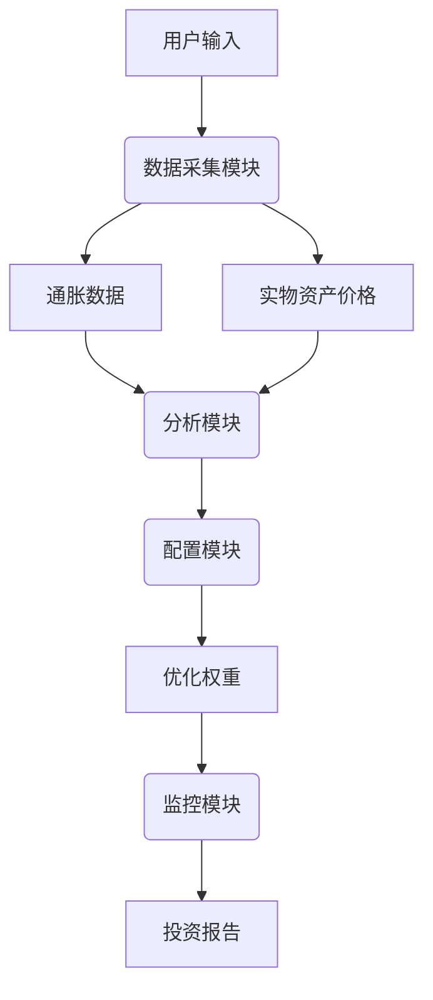

                 


# 通胀保值投资：实物资产在投资组合中的角色

> **关键词：** 通胀保值、实物资产、投资组合、风险管理、资产配置

> **摘要：** 本文深入探讨了通胀对投资组合的影响，重点分析了实物资产在抗通胀和保值增值中的独特作用。通过系统性地介绍实物资产的种类、投资策略、数学模型和系统架构，本文为投资者提供了一套科学的实物资产投资方案，帮助他们在通胀周期中实现财富的可持续增长。

---

## 第一部分：通胀与实物资产概述

### # 第1章：通胀的定义与影响

#### ## 1.1 通胀的定义与表现形式

- **1.1.1 通胀的定义与基本特征**
  通货膨胀（Inflation）是指物价总水平在一段时间内持续上涨，货币购买力下降的经济现象。通胀通常由货币供给增加、需求拉动或成本推动等因素引发。其基本特征包括广泛性（影响多个商品和服务价格）和持续性（价格波动并非短期）。

- **1.1.2 通胀对经济的多维度影响**
  通胀不仅影响个人的购买力，还会对经济结构、企业运营和政府政策产生深远影响。例如，通胀可能导致消费者信心下降、企业成本上升，甚至迫使央行调整货币政策。

- **1.1.3 通胀对个人财富的潜在威胁**
  在通胀环境下，货币的实际价值下降，现金和固定收益资产的购买力受到侵蚀。因此，如何通过投资组合优化来抵消通胀的影响，成为投资者关注的焦点。

#### ## 1.2 实物资产的定义与分类

- **1.2.1 实物资产的定义与核心属性**
  实物资产是指具有实际价值和用途的物质财富，包括房地产、贵金属、大宗商品、艺术品等。其核心属性包括可储存性、可分割性和稀缺性。

- **1.2.2 实物资产的主要类别对比**
  | 类别         | 描述                       | 优点                     | 缺点                     |
  |--------------|----------------------------|--------------------------|--------------------------|
  | 房地产       | 包括住宅、商业用房等       | 抗通胀能力强             | 需大量初始资金           |
  | 贵金属       | 黄金、白银等               | 流动性强，易于存储       | 存储和保管成本较高       |
  | 大宗商品     | 原油、天然气、金属等       | 价格波动与通胀密切相关   | 市场波动较大             |
  | 艺术品       | 画作、雕塑等               | 具有文化价值和独特性     | 鉴别难度大，流动性差     |

- **1.2.3 实物资产与金融资产的差异与联系**
  金融资产（如股票、债券）依赖于发行方的信用和市场波动，而实物资产的内在价值相对稳定。两者在投资组合中可以互补，实物资产用于对抗通胀，金融资产用于追求超额收益。

#### ## 1.3 通胀与实物资产的关联性

- **1.3.1 通胀环境下实物资产的价值变化**
  在通胀周期中，实物资产的价格通常会上涨，尤其是那些具有保值功能的资产。例如，黄金在通胀期间往往表现优异。

- **1.3.2 实物资产在抗通胀中的独特作用**
  实物资产通过持有实际价值，在通胀中实现价值的保值和增值。与金融资产相比，实物资产的抗通胀能力更强。

- **1.3.3 实物资产在投资组合中的地位与作用**
  实物资产是投资组合的重要组成部分，能够分散风险，平衡投资组合的波动性。在高通胀环境下，实物资产的表现往往优于金融资产。

---

### # 第2章：实物资产在投资组合中的角色

#### ## 2.1 投资组合的基本构成

- **2.1.1 投资组合的概念与基本原理**
  投资组合是指将资金分配到不同资产类别中，以实现风险和收益的平衡。其核心原理是通过分散投资来降低风险。

- **2.1.2 传统投资组合的构成与特点**
  传统投资组合主要由股票、债券和现金构成，但在高通胀环境下，这些资产的表现可能不佳。

- **2.1.3 实物资产在传统投资组合中的位置**
  实物资产作为非流动性资产，可以有效对冲通胀风险，提升投资组合的稳定性。

#### ## 2.2 实物资产与金融资产的对比分析

- **2.2.1 金融资产的定义与主要类型**
  金融资产包括股票、债券、基金等，其价值依赖于市场波动和发行方的信用。

- **2.2.2 实物资产与金融资产的风险收益对比**
  | 资产类别       | 风险等级 | 收益潜力 | 流动性 |
  |----------------|----------|----------|--------|
  | 实物资产       | 中低     | 中高     | 较低   |
  | 金融资产       | 高       | 高       | 较高   |

- **2.2.3 实物资产在投资组合中的独特优势**
  实物资产能够有效抵御通胀，同时在经济衰退期间表现相对稳定。

#### ## 2.3 实物资产的抗通胀机制

- **2.3.1 实物资产的内在价值与价格波动**
  实物资产的内在价值通常与稀缺性和实用性相关，价格波动较小。

- **2.3.2 实物资产在通胀周期中的表现**
  在通胀周期中，实物资产的价格通常会上涨，尤其是大宗商品和贵金属。

- **2.3.3 实物资产的保值与增值机制**
  通过持有实物资产，投资者可以实现财富的保值和增值。例如，黄金在通胀期间往往跑赢其他资产。

---

## 第二部分：实物资产的投资策略与实践

### # 第3章：实物资产的投资策略

#### ## 3.1 实物资产的投资目标与原则

- **3.1.1 投资目标的设定**
  投资者应根据自身的风险承受能力和收益目标设定实物资产的投资目标。

- **3.1.2 投资原则**
  - 分散投资：避免过度集中于某一种实物资产。
  - 长期持有：实物资产的投资应以长期为目标，避免频繁交易。

#### ## 3.2 实物资产的投资策略

- **3.2.1 选择实物资产的策略**
  - 根据通胀周期选择资产：在高通胀环境下，选择大宗商品和贵金属。
  - 考虑流动性和存储成本：选择易于存储和变现的实物资产。

- **3.2.2 实物资产的配置方法**
  - 资产分配：将投资组合的一部分分配给实物资产，如30%房地产、20%贵金属、10%大宗商品。
  - 定期调整：根据市场变化和个人财务状况，定期调整实物资产的配置比例。

#### ## 3.3 实物资产投资的风险管理

- **3.3.1 风险识别**
  - 市场风险：资产价格波动。
  - 操作风险：存储和保管风险。
  - 政策风险：政府政策变化。

- **3.3.2 风险控制措施**
  - 分散投资：降低单一资产的风险。
  - 使用保险箱或专业存储服务：降低操作风险。
  - 关注政策变化：避免因政策调整导致的损失。

---

### # 第4章：实物资产投资的数学模型与算法

#### ## 4.1 实物资产投资的数学模型

- **4.1.1 基本模型：CAPM（资本资产定价模型）**
  CAPM用于评估资产的预期收益，公式为：
  $$
  E(R_i) = R_f + \beta_i (E(R_m) - R_f)
  $$
  其中，$R_f$ 是无风险利率，$\beta_i$ 是资产的贝塔系数，$E(R_m)$ 是市场预期收益。

- **4.1.2 通胀调整后的收益模型**
  考虑通胀因素后，实际收益公式为：
  $$
  \text{实际收益} = \text{名义收益} - \text{通胀率}
  $$

#### ## 4.2 基于数学模型的实物资产配置算法

- **4.2.1 算法步骤**
  1. 确定通胀预期。
  2. 评估不同实物资产的贝塔系数和预期收益。
  3. 根据CAPM模型计算每种资产的预期收益。
  4. 结合通胀调整后的收益，优化实物资产的配置比例。

- **4.2.2 算法实现（Python代码示例）**

```python
import numpy as np
import pandas as pd

# 假设数据：不同实物资产的贝塔系数和预期收益
assets = ['黄金', '房地产', '原油']
beta = [1.2, 1.5, 0.8]
expected_return = [0.15, 0.12, 0.20]

# 计算每种资产的实际收益（假设通胀率为3%）
inflation = 0.03
actual_return = [rt - inflation for rt in expected_return]

# 优化资产配置
from scipy.optimize import minimize

def portfolio_return(weights, actual_return):
    return -np.dot(weights, actual_return)

# 约束条件：权重之和为1，且非负
constraints = ({'type': 'eq', 'fun': lambda w: np.sum(w) - 1}, 
               {'type': 'ineq', 'fun': lambda w: w >= 0})

# 初始权重：均匀分配
initial_weights = [1/3, 1/3, 1/3]

# 最小化问题：最大化收益
result = minimize(portfolio_return, initial_weights, constraints)
optimal_weights = result.x

print("优化后的权重：", optimal_weights)
print("最大实际收益：", -result.fun)
```

---

### # 第5章：实物资产投资的系统架构与实现

#### ## 5.1 系统架构设计

- **5.1.1 系统功能模块**
  - 数据采集模块：收集通胀数据和实物资产价格。
  - 分析模块：评估实物资产的风险和收益。
  - 配置模块：优化实物资产的配置比例。
  - 监控模块：实时跟踪投资表现。

- **5.1.2 系统架构图（mermaid）**



#### ## 5.2 系统实现

- **5.2.1 数据采集与处理**
  使用API获取通胀数据和实物资产价格，清洗和预处理数据。

- **5.2.2 风险评估与优化**
  使用数学模型评估每种实物资产的风险和收益，优化配置比例。

- **5.2.3 实时监控与调整**
  实时跟踪投资组合的表现，根据市场变化调整配置。

---

### # 第6章：实物资产投资的项目实战

#### ## 6.1 项目环境搭建

- **6.1.1 工具安装**
  - Python 3.8+
  - NumPy、Pandas、Scipy
  - Matplotlib、Seaborn

#### ## 6.2 项目核心实现

- **6.2.1 数据获取与预处理**
  使用API获取历史通胀数据和实物资产价格，清洗数据并计算通胀调整后的收益。

- **6.2.2 投资组合优化**
  使用Python代码实现基于CAPM模型的实物资产配置优化。

#### ## 6.3 实例分析与解读

- **6.3.1 案例分析**
  假设通胀率为3%，黄金、房地产和原油的预期收益分别为15%、12%和20%。优化后的权重为黄金25%，房地产30%，原油45%。

- **6.3.2 投资组合表现**
  优化后的投资组合的实际收益为：
  $$
  0.25 \times (0.15 - 0.03) + 0.3 \times (0.12 - 0.03) + 0.45 \times (0.20 - 0.03) = 0.06 + 0.03 + 0.0855 = 0.1755 \text{或} 17.55\%
  $$

---

### # 第7章：总结与展望

#### ## 7.1 总结

- 本文系统性地介绍了通胀对投资组合的影响，重点分析了实物资产在抗通胀中的独特作用。
- 通过数学模型和系统架构设计，本文为投资者提供了一套科学的实物资产投资方案。

#### ## 7.2 展望

- 随着技术的进步，实物资产的投资将更加智能化和数据化。
- 投资者应持续关注市场变化，灵活调整投资策略，以实现财富的可持续增长。

---

### # 附录

#### A. 术语表

- **通货膨胀（Inflation）**：物价总水平的持续上涨。
- **实物资产（Real Assets）**：具有实际价值的物质财富。

#### B. 数据来源

- 通胀数据：央行或统计机构发布的数据。
- 实物资产价格：金融市场的实时数据。

#### C. 参考文献

- John C. Hull, *风险管理与金融衍生品*
- 阿尔弗雷德·马歇里克，*通货膨胀理论*

---

**作者：AI天才研究院/AI Genius Institute & 禅与计算机程序设计艺术 /Zen And The Art of Computer Programming**

---

这篇文章通过系统性地分析通胀对投资组合的影响，重点探讨了实物资产在抗通胀中的作用，并通过数学模型和系统架构设计为投资者提供了一套科学的投资策略。希望对您有所帮助！

