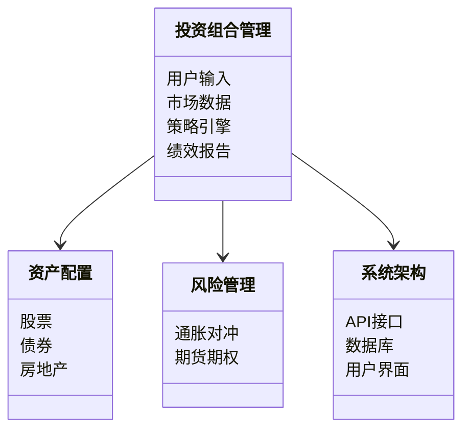
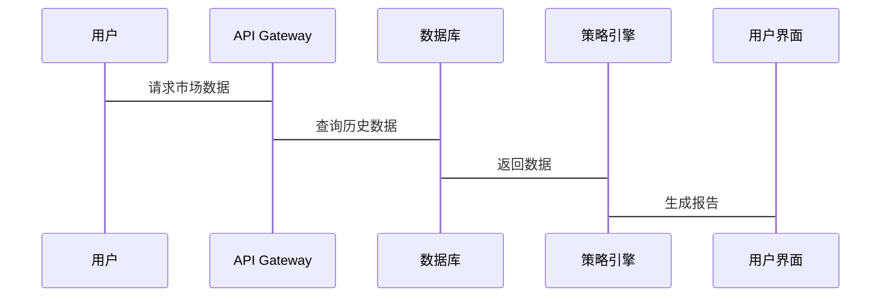

                 


# 通货膨胀对投资组合的影响：应对8%通胀率的策略

> **关键词**：通货膨胀，投资组合，通胀率，风险管理，资产配置，对冲策略

> **摘要**：本文探讨了通货膨胀对投资组合的影响，特别是在通胀率达到8%的情况下，分析了其对资产价格、风险收益和投资策略的具体影响。通过数学建模、系统架构设计和项目实战，提出了应对高通胀的优化策略和风险管理方法，帮助投资者在高通胀环境下保护和增加资产价值。

---

## 第1章：通货膨胀的背景与影响

### 1.1 通货膨胀的定义与分类

#### 1.1.1 通货膨胀的定义
通货膨胀是指物价总水平在一段时间内持续上涨，货币购买力下降的经济现象。通常用消费者价格指数（CPI）或生产者价格指数（PPI）来衡量。

#### 1.1.2 通货膨胀的分类与度量
通货膨胀可以分为温和通胀（2%-3%）、成本推动型通胀、需求拉动型通胀和恶性通胀。CPI和PPI是常用的度量指标，其中CPI反映终端消费者的价格变化，PPI反映生产环节的价格变化。

#### 1.1.3 通货膨胀对经济的影响
通货膨胀可能导致货币贬值、购买力下降、资产价格波动和经济不稳定。在8%的通胀率下，货币购买力可能每年下降显著，影响个人和企业的财务规划。

### 1.2 通货膨胀的成因分析

#### 1.2.1 货币供应量的变化
货币供应量的增加（如量化宽松政策）可能导致通货膨胀。货币供应与物价水平之间存在正相关关系。

#### 1.2.2 经济周期的影响
经济过热或复苏阶段可能导致需求拉动型通胀，而衰退阶段可能缓解通胀压力。

#### 1.2.3 价格波动与市场预期
市场预期和供给瓶颈（如原材料短缺）也可能引发通货膨胀。

### 1.3 通货膨胀对投资的影响

#### 1.3.1 通货膨胀对资产价格的影响
通货膨胀可能导致股票、房地产等资产价格上涨，但也可能引发市场波动和泡沫。

#### 1.3.2 通货膨胀对投资组合的挑战
通胀可能导致固定收益资产（如债券）的实际回报下降，增加投资组合的风险。

#### 1.3.3 通货膨胀对个人财富的影响
高通胀可能侵蚀个人的购买力，影响消费能力和投资回报。

---

## 第2章：投资组合的基本概念与风险管理

### 2.1 投资组合的定义与目标

#### 2.1.1 投资组合的定义
投资组合是指将不同资产（如股票、债券、房地产等）按一定比例配置在一起的投资组合，以分散风险并优化收益。

#### 2.1.2 投资组合的目标与特征
投资组合的目标包括最大化收益、最小化风险、保持流动性等。其特征包括分散性、风险收益匹配和灵活性。

#### 2.1.3 投资组合的风险与收益
投资组合的风险包括市场风险、流动性风险和通胀风险。收益与风险正相关，高通胀可能导致收益下降。

### 2.2 投资组合的风险管理

#### 2.2.1 投资组合的风险类型
- **市场风险**：市场波动对资产价格的影响。
- **通胀风险**：通胀导致购买力下降。
- **流动性风险**：资产难以快速变现的风险。

#### 2.2.2 投资组合的风险评估方法
使用波动率、VaR（Value at Risk）和夏普比率等指标评估投资组合的风险。

#### 2.2.3 投资组合的风险控制策略
- **分散投资**：通过配置不同资产降低风险。
- **对冲策略**：利用衍生工具（如期货、期权）对冲通胀风险。
- **定期再平衡**：根据市场变化调整资产配置。

---

## 第3章：通货膨胀对投资组合的数学模型分析

### 3.1 通货膨胀与资产定价的数学模型

#### 3.1.1 资产定价模型（CAPM）
CAPM模型用于计算资产的预期回报率，考虑了无风险利率、市场风险溢价和资产的β系数。

$$ R_i = R_f + β_i (R_m - R_f) $$

其中：
- \( R_i \)：资产i的预期回报率
- \( R_f \)：无风险利率
- \( β_i \)：资产i的β系数
- \( R_m \)：市场预期回报率

#### 3.1.2 通货膨胀对资产回报的影响
在高通胀环境下，实际回报率可能为负，导致资产贬值。

#### 3.1.3 通货膨胀与投资组合收益的关系
通胀可能导致债券的实际收益下降，而股票和房地产可能表现较好。

### 3.2 通货膨胀对投资组合风险的数学分析

#### 3.2.1 通胀对波动性的影响
通胀增加市场波动性，导致投资组合的波动率上升。

#### 3.2.2 风险调整后的回报模型
使用夏普比率衡量投资组合的风险调整后收益：

$$ \text{夏普比率} = \frac{R_p - R_f}{\sigma_p} $$

其中：
- \( R_p \)：投资组合的平均回报率
- \( R_f \)：无风险利率
- \( σ_p \)：投资组合的波动率

---

## 第4章：投资组合优化策略

### 4.1 投资组合优化的目标
在高通胀环境下，优化投资组合的目标是最大化实际回报率并最小化通胀风险。

### 4.2 资产配置策略

#### 4.2.1 股票配置
- 投资具有较强通胀对冲能力的股票，如能源、原材料和周期性行业。
- 配置成长型股票，以利用通胀期间的企业盈利增长。

#### 4.2.2 债券配置
- 选择短期债券，避免长期债券的高通胀风险。
- 配置通胀联结债券，其本金和利息与通胀挂钩。

#### 4.2.3 房地产配置
- 房地产通常能较好地对冲通胀，但需注意区域市场的差异。

### 4.3 对冲策略

#### 4.3.1 通胀对冲工具
- 使用商品期货（如黄金、原油）对冲通胀风险。
- 投资通胀保值债券（TIPS）。

#### 4.3.2 衍生工具的应用
- 使用期权和期货对冲市场波动风险。

### 4.4 定期再平衡

#### 4.4.1 再平衡的必要性
定期调整投资组合，以适应市场变化和通胀环境。

#### 4.4.2 再平衡的频率
建议每季度或每年进行一次再平衡，避免频繁调整带来的交易成本。

---

## 第5章：系统分析与架构设计方案

### 5.1 问题场景介绍
在高通胀环境下，投资组合管理系统需要实时监控市场变化，调整资产配置，并提供对冲策略建议。

### 5.2 系统功能设计

#### 5.2.1 领域模型（Mermaid类图）


### 5.3 系统架构设计

#### 5.3.1 系统架构图（Mermaid架构图）


### 5.4 系统接口设计

#### 5.4.1 API接口
- 数据接口：获取实时市场数据。
- 计算接口：计算资产配置和对冲策略。

### 5.5 系统交互设计（Mermaid序列图）



---

## 第6章：项目实战

### 6.1 环境安装

#### 6.1.1 安装Python环境
使用Anaconda安装Python 3.8及以上版本。

#### 6.1.2 安装依赖库
安装numpy、pandas、scipy等数据分析库。

### 6.2 核心实现源代码

#### 6.2.1 投资组合优化代码

```python
import numpy as np
import pandas as pd

# 示例数据：资产收益矩阵
returns = pd.DataFrame({
    '股票': [0.1, 0.05, 0.08],
    '债券': [0.03, 0.04, 0.02],
    '房地产': [0.06, 0.07, 0.05]
})

# 计算最优资产配置
def optimize_portfolio(returns, risk_free_rate=0.02):
    n = returns.shape[1]
    returns_mean = returns.mean()
    returns_cov = returns.cov()
    
    # 使用拉格朗日乘数法求解
    inv_cov = np.linalg.inv(returns_cov)
    weights = inv_cov @ np.ones(n)
    weights = weights / weights.sum()
    return weights * 100

weights = optimize_portfolio(returns)
print("最优资产配置权重：", weights)
```

### 6.3 案例分析

#### 6.3.1 案例背景
假设当前通胀率为8%，投资者希望构建一个抗通胀的投资组合。

#### 6.3.2 案例实现
使用上述代码计算最优资产配置，并模拟投资组合在高通胀环境下的表现。

### 6.4 项目总结
通过实战项目，验证了投资组合优化策略的有效性，并展示了如何在高通胀环境下应用这些策略。

---

## 第7章：总结与展望

### 7.1 总结
本文系统地分析了通货膨胀对投资组合的影响，并提出了应对8%通胀率的优化策略。通过数学建模、系统设计和项目实战，为投资者提供了实用的指导。

### 7.2 未来展望
未来研究可以进一步探索更复杂的对冲工具和动态再平衡策略，以应对更高通胀率的挑战。

---

**作者：AI天才研究院/AI Genius Institute & 禅与计算机程序设计艺术 /Zen And The Art of Computer Programming**

