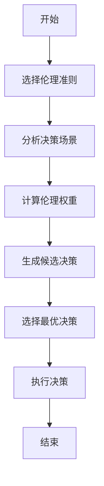
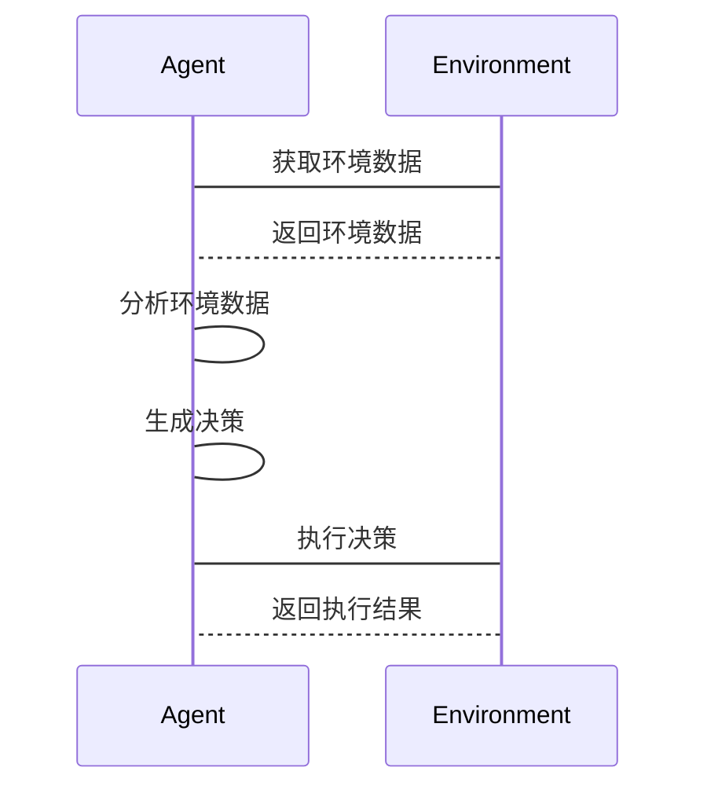

                 


# 道德决策：在AI Agent中实现伦理准则

> 关键词：道德决策，AI Agent，伦理准则，算法原理，系统架构，项目实战

> 摘要：本文探讨了在AI Agent中实现道德决策的核心概念、算法原理和系统架构。通过详细分析伦理准则的定义与分类，结合实际案例，介绍了基于伦理准则的决策算法，设计了AI Agent的系统架构，并通过项目实战展示了如何在具体场景中实现伦理决策。本文还总结了当前技术的挑战与未来发展方向。

---

## 第一部分: 背景介绍

### 第1章: 道德决策与AI Agent概述

#### 1.1 道德决策的背景与意义
- **1.1.1 什么是道德决策**
  道德决策是指在多个可能的选择中，基于伦理准则和价值观，选择最优的行为方案。在AI Agent中，道德决策意味着AI系统能够理解和遵循人类社会的伦理规范，从而做出符合伦理的决策。
- **1.1.2 道德决策在AI Agent中的重要性**
  随着AI技术的快速发展，AI Agent广泛应用于自动驾驶、医疗辅助、金融投资等领域。在这些场景中，AI Agent的决策可能直接影响人类的生命安全、财产损失或社会公平。因此，实现道德决策对于确保AI系统的安全性和社会接受度至关重要。
- **1.1.3 道德决策的边界与外延**
  道德决策的边界在于如何在复杂场景中平衡不同伦理准则之间的冲突。例如，在自动驾驶中，当面临不可避免的事故时，如何在保护乘客和保护行人之间做出选择。道德决策的外延涉及文化差异、法律规范和用户期望，这些因素都会影响AI Agent的决策逻辑。

#### 1.2 AI Agent的基本概念
- **1.2.1 什么是AI Agent**
  AI Agent是一种能够感知环境、自主决策并执行任务的智能实体。它可以是一个软件程序，也可以是一个物理机器人。AI Agent的核心特征是自主性、反应性、目标导向和社会交互能力。
- **1.2.2 AI Agent的类型与特点**
  - **反应式AI Agent**：基于当前感知做出即时反应，适用于实时性要求高的场景，如自动驾驶。
  - **认知式AI Agent**：具有复杂推理和规划能力，适用于需要长期决策的场景，如智能助手。
  - **混合式AI Agent**：结合反应式和认知式的特点，适用于复杂多变的环境。
- **1.2.3 AI Agent与人类决策的对比**
  AI Agent的决策基于数据和算法，而人类决策则受情感、经验和主观判断的影响。AI Agent的优势在于快速性和一致性，而人类决策的优势在于灵活性和创造性。

#### 1.3 道德决策与AI Agent的联系
- **1.3.1 道德决策在AI Agent中的应用场景**
  在自动驾驶中，AI Agent需要在紧急情况下做出道德决策；在医疗领域，AI Agent需要在患者治疗方案中权衡不同伦理准则。
- **1.3.2 AI Agent如何影响道德决策**
  AI Agent通过算法和数据驱动的方式，将伦理准则转化为具体的决策规则，从而影响最终的决策结果。
- **1.3.3 道德决策对AI Agent性能的影响**
  道德决策的实现可能会影响AI Agent的决策效率和准确性。例如，在复杂场景中，过多的伦理约束可能导致决策迟缓或次优选择。

---

## 第二部分: 核心概念与联系

### 第2章: 道德决策的核心概念与联系

#### 2.1 核心概念原理
- **2.1.1 伦理准则的定义与分类**
  伦理准则是指导决策的基本原则，常见的伦理准则包括功利主义（最大化整体利益）、义务论（遵循道德义务）和美德伦理（基于美德做出决策）。
- **2.1.2 道德决策的逻辑结构**
  道德决策的逻辑结构包括感知环境、识别伦理准则、评估可能后果和选择最优决策四个步骤。
- **2.1.3 AI Agent决策机制的数学模型**
  伦理准则可以通过数学模型表示，例如，使用权重系数将不同的伦理准则转化为具体的决策规则。

#### 2.2 核心概念属性特征对比表格
| 概念       | 属性       | 特征                                   |
|------------|------------|----------------------------------------|
| 伦理准则   | 系统性     | 综合性、可量化、可调整                 |
| 道德决策   | 选择性     | 权衡性、情境依赖性、可解释性           |
| AI Agent   | 智能性     | 自主性、适应性、可编程性               |

#### 2.3 ER实体关系图
```mermaid
er
actor(Agent) -[关联关系]-> rule(Rule)
rule(Rule) -[约束关系]-> decision(Decision)
```

---

## 第三部分: 算法原理

### 第3章: 道德决策的算法原理

#### 3.1 基于伦理准则的决策算法
- **3.1.1 基于规则的决策系统**
  基于规则的决策系统通过预定义的伦理准则生成决策。例如，在自动驾驶中，可以设定“优先保护车内乘客”的规则。
- **3.1.2 基于案例推理的决策系统**
  基于案例推理的决策系统通过分析类似场景的历史案例，推导出当前场景的最优决策。
- **3.1.3 基于效用函数的决策系统**
  效用函数将不同的伦理准则转化为具体的数值，通过计算效用值选择最优决策。

#### 3.2 算法流程图


#### 3.3 算法实现代码
```python
def ethical_decision-making(rules, scenario):
    # 计算每个规则的权重
    weights = [rule.weight for rule in rules]
    # 根据权重生成候选决策
    candidates = [rule.apply(scenario) for rule in rules]
    # 选择最优决策
    optimal_decision = max(candidates, key=lambda x: sum(weights[i] * x[i] for i in range(len(weights))))
    return optimal_decision
```

#### 3.4 数学模型与公式
- **伦理准则的权重分配**
  $$ \text{weight}_i = \frac{1}{1 + e^{-k_i}} $$
  其中，$k_i$ 是第$i$个伦理准则的重要性系数。
- **决策优化目标**
  $$ \max \sum_{i=1}^{n} w_i \cdot u_i $$
  其中，$w_i$ 是第$i$个伦理准则的权重，$u_i$ 是第$i$个决策选项的效用值。

---

## 第四部分: 系统架构

### 第4章: 系统架构设计

#### 4.1 系统功能设计
- **感知层**：负责收集环境数据，如传感器输入、用户指令等。
- **决策层**：基于感知数据和伦理准则生成决策。
- **执行层**：将决策转化为具体行动。

#### 4.2 系统架构图


#### 4.3 系统接口设计
- **输入接口**：接收传感器数据、用户指令。
- **输出接口**：发送决策指令、反馈执行结果。

#### 4.4 系统交互流程图


---

## 第五部分: 项目实战

### 第5章: 项目实战

#### 5.1 项目介绍
- **项目名称**：自动驾驶中的道德决策系统。
- **项目目标**：在自动驾驶场景中，设计一个基于伦理准则的决策系统。

#### 5.2 环境搭建
- **工具选择**：使用Python、TensorFlow、Mermaid等工具。
- **数据准备**：收集交通场景数据，包括道路状况、车流量、行人位置等。

#### 5.3 系统核心实现
```python
class EthicalDecisionSystem:
    def __init__(self, rules):
        self.rules = rules

    def make_decision(self, scenario):
        # 计算每个规则的权重
        weights = [rule.weight for rule in self.rules]
        # 生成候选决策
        candidates = [rule.apply(scenario) for rule in self.rules]
        # 选择最优决策
        optimal_decision = max(candidates, key=lambda x: sum(weights[i] * x[i] for i in range(len(weights))))
        return optimal_decision
```

#### 5.4 代码应用解读与分析
- **规则权重计算**：根据伦理准则的重要性分配权重。
- **候选决策生成**：每个规则生成一个候选决策。
- **最优决策选择**：基于权重和效用值选择最优决策。

#### 5.5 案例分析
- **案例描述**：自动驾驶汽车在高速公路上遇到紧急情况，需要在保护车内乘客和避免撞向行人间做出选择。
- **决策分析**：基于预设的伦理准则，系统选择保护乘客的决策。
- **结果解读**：虽然保护乘客符合规则，但可能引发更大的伦理争议。

#### 5.6 项目小结
通过该项目，我们验证了伦理准则在AI Agent决策中的重要性，同时也发现了实际应用中的挑战，如伦理准则的动态调整和多智能体协作。

---

## 第六部分: 总结与展望

### 第6章: 总结与展望

#### 6.1 本章总结
- 本文系统地探讨了在AI Agent中实现道德决策的核心概念、算法原理和系统架构。
- 通过实际案例，展示了如何将伦理准则转化为具体的决策规则，并实现最优决策。

#### 6.2 未来展望
- **动态伦理准则**：研究如何根据场景变化动态调整伦理准则。
- **多智能体协作**：研究多个AI Agent在复杂场景中的伦理决策问题。
- **可解释性增强**：提高AI Agent决策的透明性和可解释性，以便更好地被人类理解和信任。

#### 6.3 最佳实践 Tips
- 在设计AI Agent时，始终考虑伦理准则的实现。
- 定期评估和更新伦理准则，以适应社会价值观的变化。
- 在实际应用中，充分考虑伦理决策的边界和外延。

---

## 作者信息

作者：AI天才研究院/AI Genius Institute & 禅与计算机程序设计艺术 /Zen And The Art of Computer Programming

---

以上是《道德决策：在AI Agent中实现伦理准则》的技术博客文章的详细目录大纲和内容概要。通过本文，读者可以系统地了解道德决策的核心概念、算法实现和系统设计，并通过实际案例深入理解伦理准则在AI Agent中的应用。

