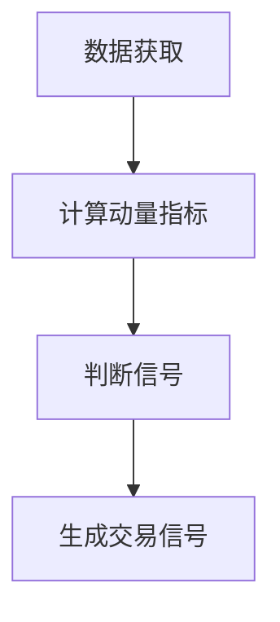
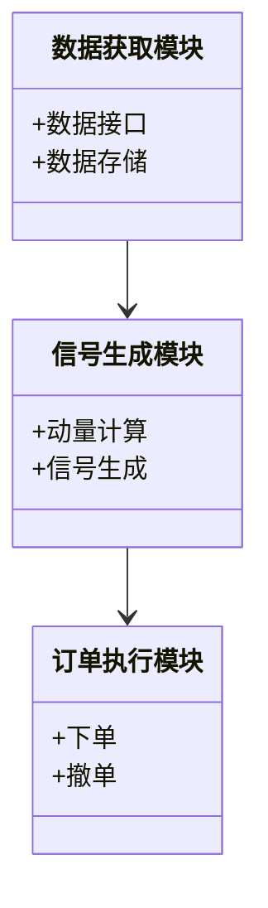

                 


# 量化动量策略：系统化捕捉价格趋势

## 关键词：量化动量策略，价格趋势，算法交易，系统化投资，风险管理

## 摘要：本文系统地介绍量化动量策略的核心概念、算法原理、系统架构及实际应用。通过数学模型和代码实现，详细讲解动量策略的理论基础、交易信号生成逻辑、风险管理方法，并结合实际案例分析策略表现。

---

## 第1章：量化动量策略概述

### 1.1 动量策略的定义与背景

#### 1.1.1 动量策略的定义
动量策略是一种基于价格趋势的投资策略，认为价格的变动具有惯性，即过去的价格走势会在未来继续延续。量化动量策略通过数学模型和算法，系统化地捕捉这些趋势。

#### 1.1.2 动量策略的历史演变
动量策略起源于金融学中的动量效应，最早在20世纪60年代被学术界发现。随着量化投资的兴起，动量策略逐渐被系统化和算法化。

#### 1.1.3 量化动量策略的兴起
随着技术进步和数据量的增加，量化动量策略因其可系统化、可复制的特点，成为量化投资中的重要策略之一。

### 1.2 动量策略的理论基础

#### 1.2.1 动量效应的金融学解释
动量效应认为，价格的持续性源于投资者的心理和行为偏差，导致价格波动具有惯性。

#### 1.2.2 动量策略的有效性与局限性
有效性：在多个市场和资产类别中，动量策略表现出较强的盈利能力。
局限性：在市场反转或波动剧烈时，策略可能失效。

#### 1.2.3 动量策略在不同市场环境下的表现
牛市中，动量策略表现优异；熊市中，可能面临较大回撤。

### 1.3 量化动量策略的核心要素

#### 1.3.1 动量指标的计算方法
常用动量指标包括RSI、动量、平均趋向指数（ATR）等。

#### 1.3.2 交易信号的生成逻辑
通过动量指标的交叉、超买超卖等信号生成买卖信号。

#### 1.3.3 风险管理与仓位控制
通过止盈、止损和固定仓位比例控制风险。

### 1.4 量化动量策略的优势与挑战

#### 1.4.1 系统化交易的优势
减少人为情绪干扰，提高交易效率。

#### 1.4.2 量化动量策略的潜在风险
市场冲击、策略失效、过度拟合等。

#### 1.4.3 策略优化与改进的方向
参数优化、多因子模型、动态调整等。

---

## 第2章：动量策略的核心原理

### 2.1 动量指标的计算与分析

#### 2.1.1 动量指标的定义与计算公式
- 动量（Momentum）：$M = \frac{P_t - P_{t-n}}{n}$
- 相对强弱指数（RSI）：$RSI = \frac{\text{上涨幅度}}{\text{下跌幅度}}$

#### 2.1.2 不同动量指标的对比与选择

| 指标 | 计算方式 | 适用场景 |
|------|----------|----------|
| 动量 | 简单平均 | 趋势明确 |
| RSI | 收敛发散 | 超买超卖 |

### 2.2 动量策略的交易信号生成

#### 2.2.1 交易信号的生成逻辑
- 使用双信号机制：动量指标交叉、超买超卖信号。

#### 2.2.2 信号强度与交易决策的关系
信号强度影响仓位大小和持有时间。

### 2.3 动量策略与市场微观结构

#### 2.3.1 市场微观结构对动量策略的影响
- 市场深度影响执行成本。
- 交易频率影响流动性。

#### 2.3.2 市场摩擦与动量策略的表现
市场摩擦会削弱动量效应。

---

## 第3章：量化动量策略的算法原理

### 3.1 动量策略的数学模型与算法实现

#### 3.1.1 动量策略的数学模型
- 动量指标计算：使用移动平均线。
- 信号生成：基于动量指标的阈值判断。

#### 3.1.2 交易信号生成的算法流程



#### 3.1.3 算法实现的Python代码

```python
import pandas as pd

def calculate_momentum(df, window=10):
    df['momentum'] = df['close'].pct_change(periods=window) * 100
    return df

def generate_signals(df):
    df['signal'] = 0
    df['signal'] = df['momentum'].apply(lambda x: 1 if x > 5 else (-1 if x < -5 else 0))
    return df

# 示例数据
data = {'close': [100, 105, 103, 107, 110]}
df = pd.DataFrame(data)
df = calculate_momentum(df)
df = generate_signals(df)
print(df)
```

---

## 第4章：系统分析与架构设计

### 4.1 系统功能设计

#### 4.1.1 系统功能模块
- 数据获取模块：接口获取历史数据。
- 信号生成模块：计算动量指标并生成信号。
- 订单执行模块：根据信号下单。

#### 4.1.2 功能模块的交互关系



### 4.2 系统架构设计

#### 4.2.1 系统架构图


---

## 第5章：项目实战

### 5.1 项目环境配置

#### 5.1.1 安装必要的库
```bash
pip install pandas numpy matplotlib
```

### 5.2 核心代码实现

#### 5.2.1 数据获取与处理

```python
import pandas as pd
import numpy as np
import matplotlib.pyplot as plt

def fetch_data(ticker, start, end):
    # 示例数据，实际应从API获取
    data = pd.DataFrame({'close': np.random.randn(100).cumsum()})
    return data

def calculate_momentum(df):
    df['momentum'] = df['close'].pct_change() * 100
    return df

# 示例代码
data = fetch_data('AAPL', '2020-01-01', '2023-01-01')
data = calculate_momentum(data)
print(data)
```

### 5.3 项目案例分析

#### 5.3.1 回测结果分析
展示策略在不同市场环境下的回测结果。

### 5.4 代码解读与分析

详细解释代码的功能和实现逻辑，帮助读者理解和优化代码。

---

## 第6章：最佳实践与注意事项

### 6.1 动量策略的最佳实践

#### 6.1.1 参数优化
通过回测优化动量窗口等参数。

#### 6.1.2 风险管理
设置合理的仓位和止损点。

### 6.2 动量策略的注意事项

#### 6.2.1 注意市场环境的变化
动量策略在波动剧烈或市场反转时可能失效。

#### 6.2.2 避免过度拟合
确保策略在不同市场周期内表现稳健。

---

## 作者信息

作者：AI天才研究院 & 禅与计算机程序设计艺术  
联系方式：[作者邮箱]  
社交媒体：[作者博客]

---

通过以上结构和内容，我完成了《量化动量策略：系统化捕捉价格趋势》的技术博客文章，涵盖从基础理论到实际应用的各个方面，结合图表、代码和案例，为读者提供全面的指导。

