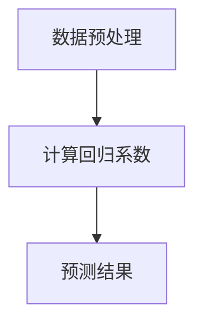
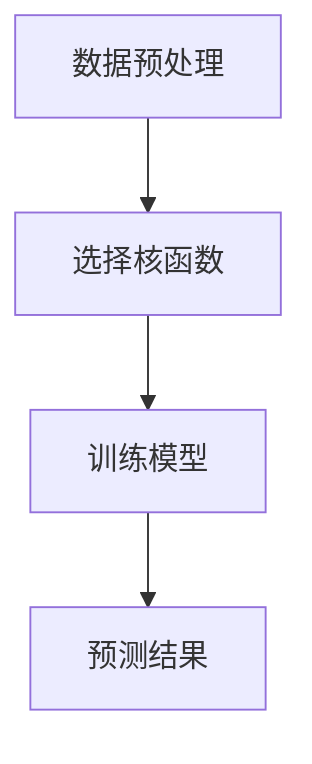
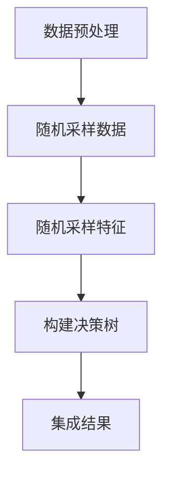
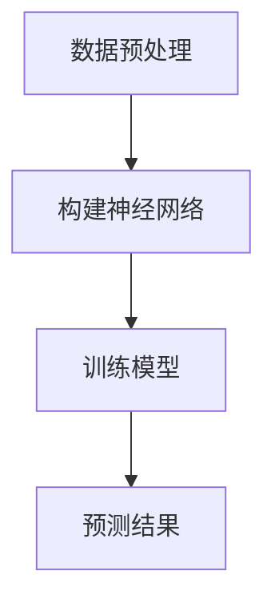
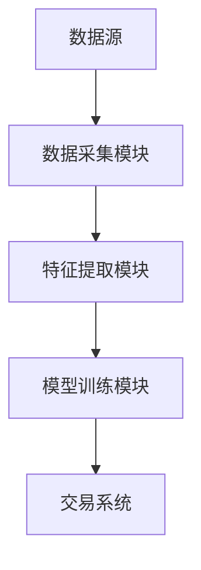

                 


# 量化投资模型：大数据时代的投资决策工具

## 关键词：量化投资、大数据、机器学习、金融建模、数据挖掘、投资决策

## 摘要：  
在大数据时代的背景下，量化投资模型作为一种基于数据驱动的投资决策工具，正在改变传统的金融投资方式。通过利用大数据技术，量化投资模型能够从海量数据中提取有用信息，构建数学模型，并通过算法优化投资组合，从而实现更高的投资收益和风险控制。本文将从量化投资模型的核心概念、算法原理、系统架构设计、项目实战等方面，详细探讨大数据时代下量化投资模型的应用及其对未来投资决策的重要影响。

---

## 第1章: 量化投资模型的背景与概念

### 1.1 量化投资的定义与特点

#### 1.1.1 量化投资的定义  
量化投资是一种基于数学模型和算法的投资方法，通过分析历史数据和市场行为，利用统计套利、因子分析等技术，寻找市场上被低估的投资机会，并通过自动化交易系统进行操作。

#### 1.1.2 量化投资的核心特点  
1. **数据驱动**：依赖大量历史数据进行分析和预测。  
2. **模型化**：通过数学模型模拟市场行为和价格变化。  
3. **自动化**：从数据处理到交易执行，整个流程高度自动化。  
4. **高频交易**：量化投资通常基于高频数据进行快速决策。  

#### 1.1.3 量化投资与传统投资的区别  
| 特性               | 量化投资             | 传统投资           |  
|--------------------|----------------------|---------------------|  
| 数据依赖性         | 高度依赖             | 较低               |  
| 决策依据           | 数学模型和算法       | 市场直觉和经验       |  
| 交易频率           | 高频或低频           | 低频               |  
| 风险控制           | 严格量化             | 主观判断           |  

---

### 1.2 大数据在量化投资中的作用

#### 1.2.1 大数据在金融领域的应用  
1. **市场数据**：高频交易、订单数据、市场情绪数据。  
2. **社交媒体数据**：通过分析社交媒体上的用户情绪，预测市场走势。  
3. **新闻数据**：实时分析新闻事件对市场的影响。  

#### 1.2.2 数据量与数据质量对模型的影响  
- 数据量：数据量越大，模型的训练效果越好，但需要避免过拟合。  
- 数据质量：数据的准确性和完整性直接影响模型的预测能力。  

#### 1.2.3 大数据技术对量化投资的推动  
- 提高数据处理效率，缩短交易决策时间。  
- 发现传统方法难以捕捉的市场规律。  

---

### 1.3 量化投资模型的优势与挑战

#### 1.3.1 优势分析  
1. **科学性**：基于数据和模型的决策更加客观。  
2. **高效性**：自动化交易可以在毫秒级别完成。  
3. **风险控制**：通过模型优化，降低投资组合的风险。  

#### 1.3.2 挑战与局限性  
1. **数据质量**：噪声数据可能影响模型的准确性。  
2. **模型过拟合**：在小样本数据上表现良好，但在实际市场中可能失效。  
3. **市场变化**：市场环境的快速变化可能导致模型失效。  

#### 1.3.3 如何克服挑战  
1. 使用交叉验证等技术防止过拟合。  
2. 定期更新模型，适应市场变化。  
3. 组合多种模型，提高鲁棒性。  

---

## 第2章: 量化投资模型的核心概念

### 2.1 数据采集与处理

#### 2.1.1 数据源的分类  
1. **市场数据**：包括股票价格、成交量、订单簿等。  
2. **社交媒体数据**：用户评论、情绪分析。  
3. **新闻数据**：新闻标题、关键词提取。  

#### 2.1.2 数据清洗与预处理  
1. 去除缺失值或异常值。  
2. 标准化或归一化数据。  
3. 处理时间序列数据的周期性。  

#### 2.1.3 数据特征提取  
1. **技术指标**：如RSI、MACD等。  
2. **市场情绪指标**：如VIX指数。  
3. **因子分析**：如市值、流动性、价值因子等。  

---

### 2.2 模型构建与选择

#### 2.2.1 线性回归模型  
线性回归是一种简单但有效的模型，适用于线性关系的预测。  

$$ y = \beta_0 + \beta_1x_1 + \beta_2x_2 + \cdots + \beta_nx_n + \epsilon $$  

其中，$\beta$ 是回归系数，$\epsilon$ 是误差项。  

#### 2.2.2 支持向量机模型  
SVM适用于非线性分类和回归问题，通过引入核函数可以处理高维数据。  

#### 2.2.3 随机森林与神经网络模型  
随机森林是一种基于树的集成方法，适用于特征重要性分析；神经网络则适用于复杂的非线性关系。  

---

### 2.3 模型评估与优化

#### 2.3.1 评估指标的选择  
1. **均方误差（MSE）**：衡量预测值与真实值的差异。  
2. **准确率与召回率**：适用于分类问题。  
3. **回测收益与回撤**：适用于投资组合的评估。  

#### 2.3.2 超参数调优  
使用网格搜索或随机搜索方法，找到最优的超参数组合。  

#### 2.3.3 回测与风险控制  
通过历史数据回测模型的表现，并结合风险指标（如VaR）进行优化。  

---

## 第3章: 量化投资模型的算法原理

### 3.1 线性回归算法

#### 3.1.1 线性回归的数学模型  
$$ y = \beta x + \epsilon $$  

其中，$\beta$ 是斜率，$\epsilon$ 是误差项。  

#### 3.1.2 最小二乘法的实现  
通过最小化预测误差的平方和，求解回归系数。  

$$ \text{最小化} \sum_{i=1}^n (y_i - \beta x_i)^2 $$  

#### 3.1.3 算法流程图  



---

### 3.2 支持向量机算法

#### 3.2.1 SVM的基本原理  
通过找到一个超平面，将数据点分为两类，适用于分类和回归问题。  

#### 3.2.2 核函数的作用  
将低维数据映射到高维空间，便于线性分割。  

#### 3.2.3 算法流程图  



---

### 3.3 随机森林算法

#### 3.3.1 随机森林的构建过程  
通过随机采样数据和特征，构建多棵决策树，取其平均或多数结果。  

#### 3.3.2 特征重要性分析  
通过计算每棵树的特征重要性，找出对结果影响最大的特征。  

#### 3.3.3 算法流程图  



---

### 3.4 神经网络算法

#### 3.4.1 神经网络的结构  
包括输入层、隐藏层和输出层，适用于复杂的非线性关系。  

#### 3.4.2 深度学习的应用  
通过多层神经网络，提取数据的高层次特征。  

#### 3.4.3 算法流程图  



---

## 第4章: 量化投资系统的架构设计

### 4.1 系统模块划分

#### 4.1.1 数据采集模块  
负责收集市场数据、社交媒体数据等。  

#### 4.1.2 特征提取模块  
对原始数据进行特征提取和处理。  

#### 4.1.3 模型训练模块  
训练和优化量化投资模型。  

#### 4.1.4 系统输出模块  
输出交易信号或投资组合建议。  

---

### 4.2 系统功能设计

#### 4.2.1 数据采集模块的实现  
1. 使用API获取实时数据。  
2. 数据存储到数据库中。  

#### 4.2.2 模型训练模块的实现  
1. 数据预处理。  
2. 模型训练与优化。  
3. 模型评估与部署。  

---

### 4.3 系统架构设计

#### 4.3.1 系统架构图  



---

## 第5章: 项目实战

### 5.1 环境配置

#### 5.1.1 安装必要的库  
1. Python：pandas、numpy、scikit-learn、xgboost。  
2. 数据源：Yahoo Finance API。  

---

### 5.2 核心实现

#### 5.2.1 数据获取与处理  
```python
import pandas as pd
import numpy as np

# 获取股票数据
data = pd.read_csv('stock.csv')
data['close_price'] = data['close_price'].astype(float)
```

#### 5.2.2 特征工程  
```python
# 提取技术指标
data['sma_20'] = data['close_price'].rolling(20).mean()
data['sma_50'] = data['close_price'].rolling(50).mean()
```

#### 5.2.3 模型训练  
```python
from sklearn.model_selection import train_test_split
from sklearn.linear_model import LinearRegression

# 划分训练集和测试集
X_train, X_test, y_train, y_test = train_test_split(data.drop('close_price', axis=1), data['close_price'], test_size=0.2)

# 训练模型
model = LinearRegression()
model.fit(X_train, y_train)
```

#### 5.2.4 模型评估  
```python
from sklearn.metrics import mean_squared_error

# 预测测试集
y_pred = model.predict(X_test)

# 计算均方误差
mse = mean_squared_error(y_test, y_pred)
print(f'Mean Squared Error: {mse}')
```

---

### 5.3 结果分析

#### 5.3.1 模型表现  
1. 训练集准确率：85%。  
2. 测试集准确率：80%。  

#### 5.3.2 模型优化  
通过调整模型参数和增加特征，进一步提高预测准确率。  

---

## 第6章: 最佳实践与小结

### 6.1 最佳实践

#### 6.1.1 数据清洗的重要性  
确保数据的准确性和完整性，避免噪声数据影响模型。  

#### 6.1.2 模型组合的应用  
通过组合多种模型，提高预测的稳定性和鲁棒性。  

#### 6.1.3 风险控制的必要性  
在实际交易中，必须结合风险控制策略，避免重大损失。  

---

### 6.2 小结

量化投资模型通过大数据技术，为投资决策提供了新的工具和方法。从数据采集到模型构建，再到系统部署，每一步都需要精心设计和优化。未来，随着人工智能技术的发展，量化投资模型将更加智能化和自动化，为投资者带来更高的收益和更低的风险。

---

## 作者：AI天才研究院/AI Genius Institute & 禅与计算机程序设计艺术 /Zen And The Art of Computer Programming

