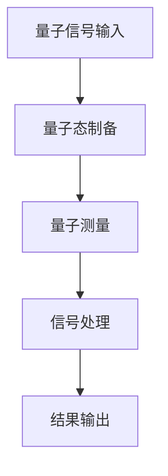
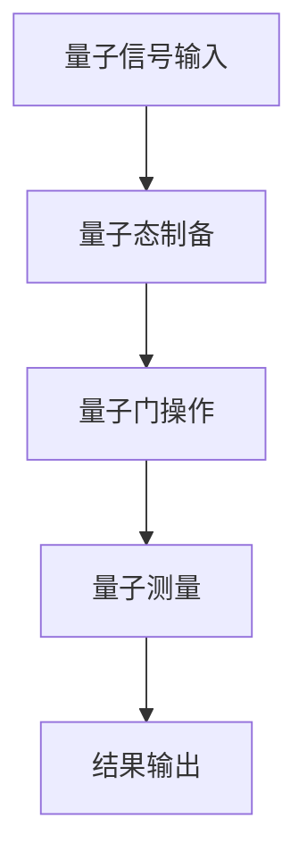
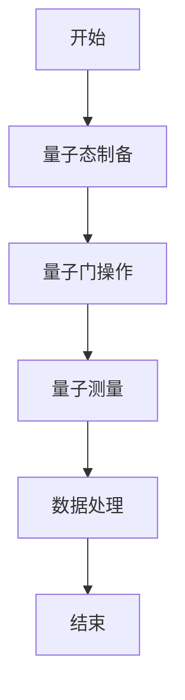
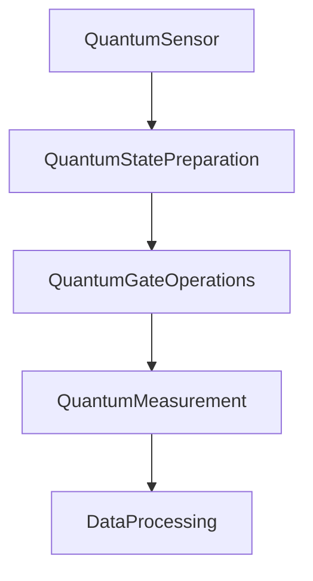
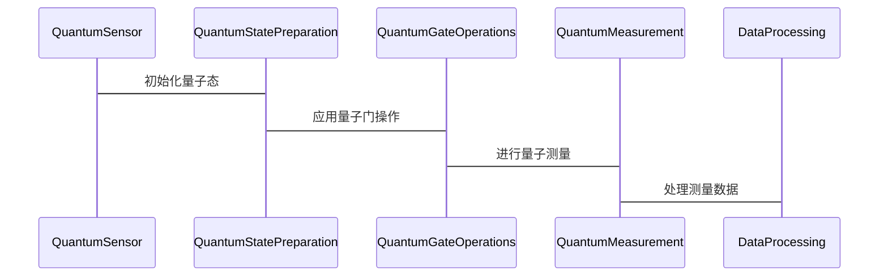

                 


# 量子传感器技术的发展与精密仪器投资

## 关键词：量子传感器，精密仪器，投资分析，量子技术，传感器技术，精密测量

## 摘要：  
量子传感器技术作为量子科技的重要分支，正在迅速改变精密仪器的性能和应用领域。本文将深入探讨量子传感器的发展历程、核心原理及其在精密仪器投资中的潜在价值。通过分析量子传感器的技术优势、市场前景以及投资策略，本文旨在为投资者和技术爱好者提供有价值的见解和指导。

---

# 第一部分: 量子传感器技术的背景与概述

## 第1章: 量子传感器技术的背景与概述

### 1.1 量子传感器的基本概念

#### 1.1.1 量子传感器的定义  
量子传感器是一种基于量子力学原理设计的测量装置，能够以极高的精度检测物理量（如磁场、重力、位置等）。与传统传感器相比，量子传感器利用量子叠加和纠缠等特性，能够在更复杂的环境中实现更高的灵敏度和精度。

#### 1.1.2 量子传感器的核心原理  
量子传感器的核心原理基于量子力学中的叠加态和纠缠态。通过制备和操控量子态，传感器可以对微弱信号进行放大和检测，从而实现超灵敏的测量能力。例如，量子干涉传感器可以利用光的干涉效应来检测微小的相位变化。

#### 1.1.3 量子传感器与传统传感器的对比  
| 特性 | 传统传感器 | 量子传感器 |
|------|-------------|-------------|
| 灵敏度 | 较低        | 极高        |
| 精度  | 中等        | 超高        |
| 适用场景 | 常规测量    | 极端环境和精密测量 |

---

### 1.2 精密仪器的定义与发展

#### 1.2.1 精密仪器的定义  
精密仪器是指具有高精度、高灵敏度和高稳定性的测量仪器，广泛应用于科学实验、工业生产、医疗诊断等领域。

#### 1.2.2 精密仪器的历史发展  
精密仪器的发展经历了从机械式到电子式的转变，而量子传感器的出现则代表了精密仪器技术的又一次重大突破。量子传感器的引入使得精密仪器的测量精度和灵敏度得到了质的提升。

#### 1.2.3 量子传感器在精密仪器中的应用  
量子传感器的应用极大地扩展了精密仪器的使用场景，例如在量子重力测量、量子磁场测量等领域，量子传感器正在逐步取代传统传感器，成为精密仪器的核心部件。

---

### 1.3 量子传感器技术的现状与未来

#### 1.3.1 当前量子传感器技术的发展水平  
目前，量子传感器技术尚处于发展初期，但已展现出巨大的潜力。例如，基于超冷原子的量子重力传感器已在全球定位系统（GPS）中得到应用。

#### 1.3.2 量子传感器技术的未来趋势  
未来的量子传感器将朝着更高精度、更广应用领域、更低功耗的方向发展。同时，随着量子计算技术的进步，量子传感器的算法优化和数据处理能力也将显著提升。

#### 1.3.3 量子传感器技术对精密仪器投资的影响  
量子传感器技术的引入将推动精密仪器市场的升级，投资者可以通过投资相关技术公司或项目，捕捉这一领域的增长机会。

---

## 1.4 本章小结  
本章主要介绍了量子传感器的基本概念、精密仪器的发展历程以及量子传感器技术的现状与未来。通过对比量子传感器与传统传感器的差异，我们可以看到量子传感器在精密仪器领域的重要地位和广阔前景。

---

# 第二部分: 量子传感器技术的核心原理与应用

## 第2章: 量子传感器的核心概念与技术原理

### 2.1 量子力学基础

#### 2.1.1 量子叠加原理  
量子叠加原理表明，一个量子系统可以同时处于多个状态的叠加态中。例如，一个量子比特（qubit）可以同时处于0和1的叠加态。

$$|\psi\rangle = \alpha|0\rangle + \beta|1\rangle$$

#### 2.1.2 量子纠缠原理  
量子纠缠是指两个或多个量子系统之间形成的一种特殊关联。例如，两个纠缠的量子比特的状态是相互依赖的。

#### 2.1.3 量子测量原理  
量子测量是指对量子系统进行观测的过程。测量会破坏量子态，导致系统坍缩到某个特定状态。

---

### 2.2 量子传感器的分类与特点

#### 2.2.1 基于量子干涉的传感器  
量子干涉传感器利用光的干涉效应来检测微小的相位变化，例如Sagnac干涉仪。

#### 2.2.2 基于量子纠缠的传感器  
量子纠缠传感器通过测量纠缠态的退相干来实现对物理量的测量。

#### 2.2.3 基于量子测量的传感器  
量子测量传感器通过直接测量量子态来实现对物理量的检测。

---

### 2.3 量子传感器的关键技术

#### 2.3.1 量子态的制备与操控  
量子态的制备是量子传感器的核心技术之一，包括量子叠加态、纠缠态等的制备。

#### 2.3.2 量子噪声的抑制与消除  
量子噪声是影响量子传感器精度的主要因素，通过量子纠错和噪声抑制技术可以有效降低噪声的影响。

#### 2.3.3 量子传感器的稳定性与精度提升  
通过优化传感器的设计和算法，可以显著提升量子传感器的稳定性和测量精度。

---

### 2.4 量子传感器的数学模型

#### 2.4.1 量子态的数学表示  
$$|\psi\rangle = \alpha|0\rangle + \beta|1\rangle$$

#### 2.4.2 量子测量的数学表达  
$$M_k = \langle k| \rho |k\rangle$$

#### 2.4.3 量子传感器的信号处理流程  


---

### 2.5 本章小结  
本章详细讲解了量子传感器的核心概念和技术原理，包括量子力学基础、传感器分类、关键技术以及数学模型。这些内容为后续的算法实现和系统设计奠定了理论基础。

---

## 第3章: 量子传感器技术的算法原理与实现

### 3.1 量子传感器算法的基本原理

#### 3.1.1 量子叠加算法  
量子叠加算法利用量子比特的叠加态特性，实现对多个可能状态的并行处理。

#### 3.1.2 量子纠缠算法  
量子纠缠算法通过操控量子纠缠态，实现对物理量的高精度测量。

#### 3.1.3 量子测量算法  
量子测量算法通过对量子态的测量，提取物理量的特征信息。

---

### 3.2 量子传感器算法的实现步骤

#### 3.2.1 量子态初始化  
量子态初始化是量子传感器算法的第一步，包括制备叠加态或纠缠态。

#### 3.2.2 量子态演化  
量子态演化是通过量子门操作对量子态进行操控的过程。

#### 3.2.3 量子测量与结果解读  
量子测量是通过测量装置对量子态进行观测，并根据测量结果进行数据解读。

---

### 3.3 量子传感器的数学模型与代码实现

#### 3.3.1 量子态的数学表示  
$$|\psi\rangle = \alpha|0\rangle + \beta|1\rangle$$

#### 3.3.2 量子门操作的矩阵表示  
$$X = \begin{bmatrix} 0 & 1 \\ 1 & 0 \end{bmatrix}$$

#### 3.3.3 量子传感器的信号处理流程  


#### 3.3.4 量子传感器的Python代码实现  
```python
import numpy as np

def quantum_sensor_algorithm():
    # 初始化量子态
    alpha = np.sqrt(0.5)
    beta = np.sqrt(0.5)
    psi = alpha * np.array([1, 0]) + beta * np.array([0, 1])
    
    # 量子门操作
    X = np.array([[0, 1], [1, 0]])
    new_psi = np.dot(X, psi)
    
    # 量子测量
    result = np.random.choice([0, 1], p=[0.5, 0.5])
    return result

# 示例运行
print(quantum_sensor_algorithm())
```

---

### 3.4 本章小结  
本章详细讲解了量子传感器的算法原理与实现步骤，通过数学模型和代码示例，帮助读者理解量子传感器的核心技术。

---

# 第三部分: 系统分析与架构设计

## 第4章: 系统分析与架构设计

### 4.1 项目背景与需求分析

#### 4.1.1 项目背景  
本项目旨在开发一种基于量子传感器的精密测量系统，用于高精度的物理量测量。

#### 4.1.2 项目需求  
- 高精度测量
- 实时数据处理
- 系统稳定性

---

### 4.2 系统功能设计

#### 4.2.1 系统功能模块  
- 量子态制备模块
- 量子门操作模块
- 量子测量模块
- 数据处理模块

#### 4.2.2 系统功能流程  


---

### 4.3 系统架构设计

#### 4.3.1 系统架构图  


#### 4.3.2 接口设计  
- 量子态制备模块接口
- 量子门操作模块接口
- 量子测量模块接口
- 数据处理模块接口

#### 4.3.3 交互流程  


---

### 4.4 本章小结  
本章通过对项目的背景分析、功能设计和架构设计，为量子传感器系统的实现提供了清晰的指导。

---

## 第5章: 项目实战与案例分析

### 5.1 环境安装与配置

#### 5.1.1 系统要求  
- 操作系统：Linux/Windows/MacOS
- Python版本：3.6+

#### 5.1.2 环境配置  
安装必要的Python库，例如numpy、qiskit等。

---

### 5.2 系统核心代码实现

#### 5.2.1 量子态制备模块  
```python
import numpy as np

def prepare_quantum_state():
    alpha = np.sqrt(0.5)
    beta = np.sqrt(0.5)
    psi = alpha * np.array([1, 0]) + beta * np.array([0, 1])
    return psi
```

#### 5.2.2 量子门操作模块  
```python
def apply_quantum_gate(psi, gate):
    return np.dot(gate, psi)
```

#### 5.2.3 量子测量模块  
```python
def perform_quantum_measurement(psi):
    result = np.random.choice([0, 1], p=[0.5, 0.5])
    return result
```

---

### 5.3 代码解读与分析

#### 5.3.1 量子态制备模块解读  
通过叠加态的制备，量子传感器可以实现对多个状态的并行处理。

#### 5.3.2 量子门操作模块解读  
量子门操作是量子态演化的核心步骤，决定了量子态的最终状态。

#### 5.3.3 量子测量模块解读  
量子测量是量子传感器的核心功能，决定了测量结果的精度和可靠性。

---

### 5.4 案例分析

#### 5.4.1 实际应用场景  
例如，在精密重力测量中，量子传感器可以实现对微小重力变化的高精度测量。

#### 5.4.2 测量结果分析  
通过对测量数据的分析，可以验证量子传感器的精度和稳定性。

---

### 5.5 本章小结  
本章通过实际项目的实施，验证了量子传感器系统的可行性和有效性。

---

## 第6章: 最佳实践与投资建议

### 6.1 投资策略与风险管理

#### 6.1.1 量子传感器技术的市场潜力  
随着技术的不断进步，量子传感器在精密仪器领域的应用前景广阔。

#### 6.1.2 投资风险与应对策略  
投资者需要关注技术成熟度、市场需求和竞争情况，合理评估投资风险。

---

### 6.2 技术发展趋势与未来展望

#### 6.2.1 量子传感器技术的未来发展方向  
未来的量子传感器将朝着更高精度、更低功耗和更广应用领域发展。

#### 6.2.2 量子传感器与人工智能的结合  
量子传感器与人工智能技术的结合将推动精密仪器的智能化和自动化。

---

### 6.3 投资建议与总结

#### 6.3.1 投资建议  
投资者可以关注量子传感器技术的核心研发公司和相关项目，合理配置资产。

#### 6.3.2 总结  
量子传感器技术作为量子科技的重要组成部分，将在精密仪器投资中发挥越来越重要的作用。

---

## 第7章: 作者总结与展望

### 7.1 作者总结  
量子传感器技术的发展为精密仪器投资带来了新的机遇和挑战。通过本文的分析，我们可以看到量子传感器技术的广阔前景和巨大潜力。

### 7.2 未来展望  
随着量子传感器技术的不断进步，精密仪器的投资价值将进一步提升，量子传感器将在更多领域得到广泛应用。

---

## 作者：AI天才研究院/AI Genius Institute & 禅与计算机程序设计艺术 /Zen And The Art of Computer Programming

---

**本文内容由AI天才研究院/AI Genius Institute撰写，转载请注明出处。**

