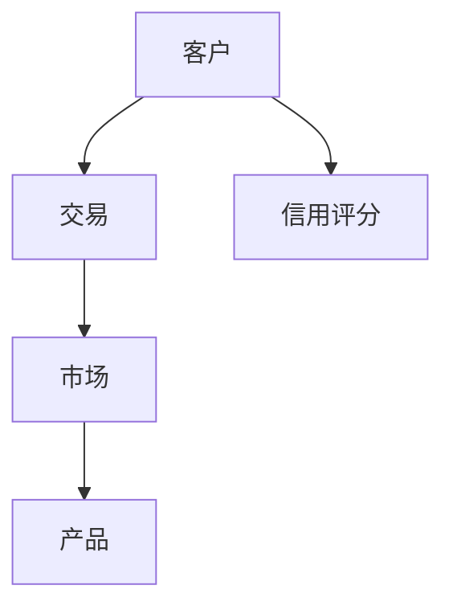
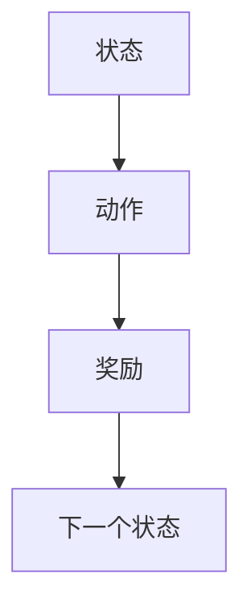
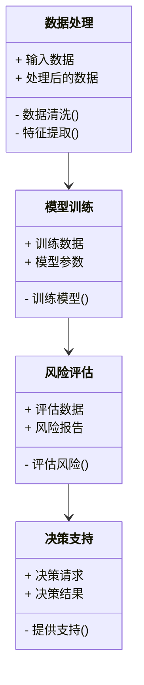
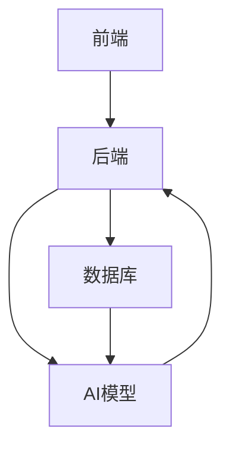
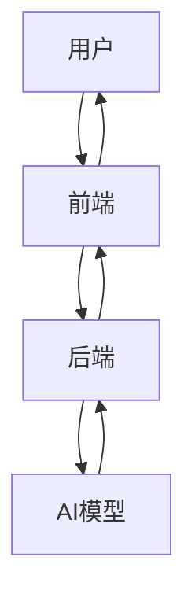

                 


# 《金融AI Agent：风险评估与决策支持》

## 关键词：金融AI Agent, 风险评估, 决策支持, 人工智能, 机器学习

## 摘要：  
本文系统阐述了金融AI Agent在风险评估与决策支持中的应用，详细分析了其核心概念、算法原理、系统架构，并通过实际案例展示了其在金融领域的应用价值。文章从背景、概念、算法、数学模型、系统设计到项目实战，全面探讨了金融AI Agent的实现与优化，为读者提供了深入的技术洞察与实践指导。

---

# 第1章: 金融AI Agent概述

## 1.1 金融AI Agent的定义与背景

### 1.1.1 人工智能在金融领域的应用背景  
随着金融市场的复杂化和数据的爆炸式增长，传统的金融分析方法逐渐显现出局限性。人工智能技术的引入，为金融行业带来了新的可能性。金融AI Agent作为一种智能代理，能够自主进行数据处理、风险评估和决策支持，极大地提升了金融分析的效率和精准度。

### 1.1.2 金融AI Agent的核心概念  
金融AI Agent是一种结合人工智能技术的智能代理，能够通过感知、认知和决策三个层次，实现对金融数据的深度分析和智能化决策。它不仅能够处理结构化数据，还能分析非结构化数据，如文本、图像等。

### 1.1.3 金融AI Agent的边界与外延  
金融AI Agent的应用范围广泛，包括风险评估、投资决策、欺诈检测等领域。其边界主要在于数据的可获取性、模型的可解释性以及系统的稳定性。外延则涉及多模态数据处理、实时决策支持等前沿技术。

---

## 1.2 金融AI Agent的核心要素与结构

### 1.2.1 金融AI Agent的组成要素  
金融AI Agent的核心要素包括：  
1. **感知层**：负责数据的采集与特征提取。  
2. **认知层**：对数据进行建模与分析。  
3. **决策层**：基于分析结果制定决策策略。  

### 1.2.2 核心要素的属性特征对比表  
| 要素 | 属性 | 特征 |  
|------|------|------|  
| 感知层 | 数据来源 | 结构化与非结构化数据 |  
| 认知层 | 分析方法 | 机器学习、深度学习 |  
| 决策层 | 决策策略 | 基于模型预测的优化策略 |  

### 1.2.3 ER实体关系图架构（Mermaid图）  


---

# 第2章: 金融AI Agent的风险评估与决策支持

## 2.1 风险评估的基本原理

### 2.1.1 风险评估的定义与方法  
风险评估是通过分析潜在风险因素，评估其对金融资产或投资的影响。常用方法包括定量分析、定性分析和情景分析。

### 2.1.2 金融风险的主要类型  
1. **市场风险**：资产价格波动导致的损失。  
2. **信用风险**：债务人违约导致的损失。  
3. **流动性风险**：资产难以变现导致的损失。  
4. **操作风险**：操作失误或系统故障导致的损失。  

### 2.1.3 AI在风险评估中的作用  
AI通过机器学习算法，能够快速处理大量数据，发现潜在风险，并提供实时风险预警。

---

## 2.2 决策支持的实现机制

### 2.2.1 决策支持系统的定义  
决策支持系统是一种通过数据和模型辅助决策者做出更明智决策的系统。

### 2.2.2 AI在决策支持中的应用场景  
1. **投资组合优化**：基于市场数据，优化投资组合的风险与收益。  
2. **信用评估**：通过机器学习模型，评估客户的信用风险。  
3. **欺诈检测**：实时检测异常交易行为，防止欺诈发生。  

### 2.2.3 决策支持系统的优化策略  
1. **动态调整模型参数**：根据市场变化，实时优化模型。  
2. **实时数据更新**：确保模型基于最新数据进行分析。  
3. **多模型集成**：结合多种算法，提升决策的准确性和稳定性。  

---

# 第3章: 金融AI Agent的算法原理

## 3.1 强化学习算法

### 3.1.1 强化学习的基本原理（Mermaid流程图）  


### 3.1.2 强化学习在金融决策中的应用  
强化学习适用于需要动态决策的场景，如股票交易和投资组合管理。

### 3.1.3 Python实现强化学习算法示例  
```python
import numpy as np
import gym

env = gym.make('CartPole-v0')
model = DQN(env.observation_space.shape[0], env.action_space.n)
for episode in range(1000):
    state = env.reset()
    while True:
        action = model.act(state)
        next_state, reward, done, _ = env.step(action)
        model.remember(state, action, reward, next_state, done)
        model.replay()
        state = next_state
        if done:
            break
```

---

## 3.2 监督学习算法

### 3.2.1 监督学习的基本原理  
监督学习通过标注的数据训练模型，预测新数据的标签。

### 3.2.2 监督学习在风险评估中的应用  
监督学习常用于信用评分和欺诈检测。

### 3.2.3 Python实现监督学习算法示例  
```python
from sklearn.linear_model import LogisticRegression

# 数据预处理
X_train, y_train = preprocess_data()

# 模型训练
model = LogisticRegression()
model.fit(X_train, y_train)

# 模型预测
y_pred = model.predict(X_test)
```

---

## 3.3 聚类分析算法

### 3.3.1 聚类分析的基本原理  
聚类分析通过将数据分成若干簇，使得簇内数据相似，簇间数据差异大。

### 3.3.2 聚类分析在金融客户分群中的应用  
聚类分析常用于客户分群和市场细分。

### 3.3.3 Python实现聚类分析算法示例  
```python
from sklearn.cluster import KMeans

# 数据预处理
X = preprocess_data()

# 模型训练
model = KMeans(n_clusters=3)
model.fit(X)

# 获取聚类结果
clusters = model.predict(X)
```

---

# 第4章: 金融AI Agent的数学模型与公式

## 4.1 风险评估的数学模型

### 4.1.1 风险评估的基本公式  
风险值 = 函数（风险因素）

### 4.1.2 风险评估的数学模型（详细推导）  
$$ \text{风险值} = f(\text{风险因素}) $$

### 4.1.3 示例：计算某金融产品的风险值  
假设某金融产品的风险值为：  
$$ \text{VaR} = \mu + z \cdot \sigma $$  
其中，$\mu$ 是平均值，$z$ 是标准正态分布的分位数，$\sigma$ 是标准差。

---

## 4.2 决策支持的数学模型

### 4.2.1 决策支持的数学公式  
决策结果 = 函数（输入数据，决策规则）

### 4.2.2 决策支持的数学模型（详细推导）  
$$ \text{决策结果} = f(\text{输入数据}, \text{决策规则}) $$

### 4.2.3 示例：基于线性回归模型进行信用评分  
$$ \text{信用评分} = \beta_0 + \beta_1 \cdot \text{收入} + \beta_2 \cdot \text{负债} $$

---

# 第5章: 金融AI Agent的系统分析与架构设计

## 5.1 系统分析

### 5.1.1 项目背景  
本项目旨在通过AI技术提升金融风险评估与决策支持的效率和准确性。

### 5.1.2 系统功能设计  
系统功能包括数据处理、模型训练、风险评估、决策支持等模块。

### 5.1.3 领域模型类图（Mermaid图）  


---

## 5.2 系统架构设计

### 5.2.1 系统架构图（Mermaid图）  


### 5.2.2 系统接口设计  
接口包括数据接口、模型接口和用户接口，确保各模块之间的数据交互高效有序。

### 5.2.3 系统交互流程图（Mermaid图）  


---

# 第6章: 项目实战

## 6.1 环境安装

### 6.1.1 安装Python与相关库  
安装Python 3.x，TensorFlow，Keras，Scikit-learn，Pandas，NumPy。

### 6.1.2 配置开发环境  
配置Jupyter Notebook或PyCharm作为开发环境。

---

## 6.2 核心代码实现

### 6.2.1 数据预处理  
```python
import pandas as pd
import numpy as np

# 数据加载
data = pd.read_csv('financial_data.csv')

# 数据清洗
data = data.dropna()

# 特征工程
data = pd.get_dummies(data)
```

### 6.2.2 模型训练  
```python
from sklearn.model_selection import train_test_split
from sklearn.ensemble import RandomForestClassifier

# 数据分割
X_train, X_test, y_train, y_test = train_test_split(data.drop('target', axis=1), data['target'], test_size=0.2)

# 模型训练
model = RandomForestClassifier()
model.fit(X_train, y_train)

# 模型评估
print('Accuracy:', model.score(X_test, y_test))
```

---

## 6.3 实际案例分析

### 6.3.1 案例背景  
以股票价格预测为例，利用历史数据训练模型，预测未来的价格走势。

### 6.3.2 模型预测与结果分析  
```python
# 预测结果
y_pred = model.predict(X_test)

# 结果分析
from sklearn.metrics import classification_report
print(classification_report(y_test, y_pred))
```

### 6.3.3 模型优化建议  
1. 调整模型参数，如n_estimators和max_depth。  
2. 尝试其他算法，如XGBoost或神经网络。  
3. 增加更多的特征，提升模型的表达能力。  

---

# 第7章: 总结与展望

## 7.1 总结  
本文系统探讨了金融AI Agent在风险评估与决策支持中的应用，详细分析了其核心概念、算法原理、系统架构，并通过实际案例展示了其在金融领域的应用价值。

## 7.2 展望  
未来，金融AI Agent的发展将朝着以下几个方向推进：  
1. 提高模型的可解释性，增强用户对AI决策的信任。  
2. 加强数据隐私保护，确保金融数据的安全性。  
3. 探索多模态数据处理技术，提升系统的综合分析能力。  

## 7.3 最佳实践  
1. 数据质量是模型性能的基础，需高度重视数据的清洗与特征工程。  
2. 模型的解释性是用户信任的关键，需优先选择可解释性较强的算法。  
3. 系统的稳定性是实际应用的核心，需确保系统的高可用性和容错能力。

---

# 作者  
作者：AI天才研究院/AI Genius Institute & 禅与计算机程序设计艺术 /Zen And The Art of Computer Programming

