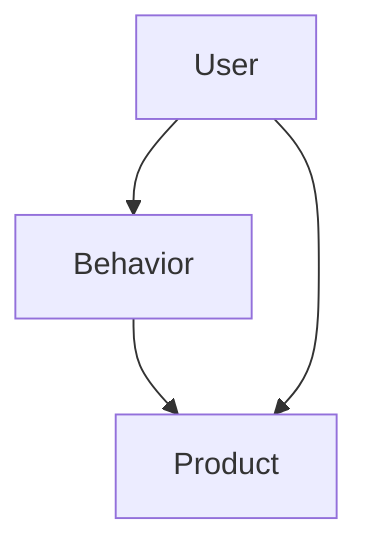

                 


# 《金融产品个性化推荐引擎》

## 关键词：
金融产品推荐，个性化推荐引擎，机器学习，大数据分析，用户行为分析，推荐算法，系统架构设计

## 摘要：
本文将详细探讨如何构建一个高效的金融产品个性化推荐引擎。通过分析金融行业的特点和用户需求，结合机器学习和大数据技术，介绍推荐引擎的核心算法和系统架构设计。从背景介绍到项目实战，全面解析推荐引擎的实现过程，帮助读者掌握构建个性化推荐系统的关键技术。

---

## 第一部分：背景介绍

### 第1章：金融产品个性化推荐引擎概述

#### 1.1 问题背景
- **金融行业的数字化转型**：金融机构通过数字化手段提升服务效率和客户体验，推荐引擎成为核心工具。
- **用户需求的多样化与个性化**：用户在选择金融产品时，需求各异，传统的通用推荐难以满足个性化需求。
- **传统推荐系统的局限性**：基于规则的推荐系统缺乏灵活性，难以应对复杂多变的用户需求。

#### 1.2 问题描述
- **金融产品的多样性**：涉及基金、股票、保险等多种产品，用户需求差异大。
- **数据量与计算复杂度**：金融数据量大且维度高，计算复杂度高，传统方法难以高效处理。
- **用户行为分析的复杂性**：用户行为受市场波动和自身风险偏好影响，行为分析复杂。

#### 1.3 问题解决
- **引入机器学习与大数据分析技术**：利用机器学习算法和大数据处理技术，提高推荐的准确性和效率。
- **个性化推荐引擎的核心目标**：通过分析用户行为和偏好，提供个性化的产品推荐。

#### 1.4 边界与外延
- **系统边界**：推荐引擎仅处理用户行为数据和产品信息，不涉及实时市场数据。
- **外延**：与其他金融系统模块如风控系统和支付系统交互。

#### 1.5 概念结构与核心要素
- **核心概念**：用户、金融产品、行为数据。
- **关系结构**：用户-产品-行为网络，用户通过行为影响推荐结果。

---

## 第二部分：核心概念与联系

### 第2章：推荐系统的核心原理

#### 2.1 推荐系统的分类与对比
- **协同过滤**：基于用户相似性推荐。
- **基于内容的推荐**：基于产品特征匹配。
- **基于模型的推荐**：利用深度学习模型捕捉复杂特征。
- **对比表格**：

| 方法 | 优点 | 缺点 |
|------|------|------|
| 协同过滤 | 简单，适合数据稀疏场景 | 对冷启动问题敏感 |
| 基于内容 | 冷启动问题缓解 | 特征提取难度大 |
| 深度学习 | 捕捉复杂特征 | 计算资源需求高 |

#### 2.2 实体关系架构
- **ER图**：用户-行为-产品关系。
- **Mermaid图示**：


---

## 第三部分：算法原理讲解

### 第3章：推荐算法的数学模型

#### 3.1 协同过滤算法
- **基于用户的协同过滤**：通过相似用户的评分预测目标用户评分。
- **矩阵分解方法**：利用矩阵分解（如交替最小二乘法）简化计算。
- **公式推导**：
  - **交替最小二乘法**：优化用户和产品特征向量。
  - **公式**：
    $$ \text{损失函数} = \sum_{i,j} (r_{i,j} - u_i^T p_j)^2 + \lambda (||u_i||^2 + ||p_j||^2) $$

#### 3.2 基于深度学习的推荐算法
- **神经网络模型**：如神经协同过滤（Neural Collaborative Filtering）。
- **模型结构**：嵌入层、注意力机制、全连接层。
- **代码示例**：
  ```python
  import tensorflow as tf
  from tensorflow.keras import layers

  model = tf.keras.Sequential([
      layers.Embedding(input_dim=1000, output_dim=64),
      layers.GlobalAveragePooling1D(),
      layers.Dense(64, activation='relu'),
      layers.Dense(1, activation='sigmoid')
  ])
  ```

---

## 第四部分：系统分析与架构设计

### 第4章：系统架构设计

#### 4.1 项目介绍
- **项目目标**：构建一个实时、个性化的金融产品推荐系统。
- **核心功能**：用户行为分析、产品推荐、实时更新。

#### 4.2 系统功能设计
- **领域模型**：
  - 用户模块：用户信息、偏好。
  - 行为模块：用户行为日志。
  - 产品模块：产品信息、分类。
- **Mermaid类图**：
  ```mermaid
  classDiagram
      class User {
          id: int
          preferences: dict
      }
      class Product {
          id: int
          category: str
      }
      class Behavior {
          user_id: int
          product_id: int
          timestamp: datetime
      }
      User --> Behavior
      Product --> Behavior
  ```

#### 4.3 系统架构设计
- **分层架构**：数据层、服务层、应用层。
- **Mermaid架构图**：
  ```mermaid
  graph TD
      Web --> API
      API --> Service
      Service --> Database
      Database --> Storage
  ```

#### 4.4 系统接口设计
- **REST API**：提供推荐结果和实时更新接口。
- **交互流程**：用户请求推荐，系统返回结果。

---

## 第五部分：项目实战

### 第5章：项目实现

#### 5.1 环境安装
- **技术栈**：Python、TensorFlow、Flask。
- **安装依赖**：
  ```bash
  pip install numpy pandas scikit-learn tensorflow flask
  ```

#### 5.2 核心实现
- **数据预处理**：清洗和特征工程。
- **模型训练**：构建并训练推荐模型。
- **代码示例**：
  ```python
  import pandas as pd
  from sklearn.metrics.pairwise import cosine_similarity

  # 数据加载
  ratings = pd.DataFrame({'user': [1,2,3], 'product': [101,102,101], 'score': [5,4,5]})

  # 协同过滤实现
  user_product_matrix = ratings.pivot('user', 'product').fillna(0)
  similarity = cosine_similarity(user_product_matrix)
  ```

#### 5.3 应用解读
- **用户行为分析**：通过分析用户的点击和购买行为，优化推荐策略。
- **模型评估**：使用准确率、召回率等指标评估推荐效果。

#### 5.4 案例分析
- **用户画像**：根据用户历史行为，生成用户画像。
- **推荐结果**：基于画像推荐相关产品。

#### 5.5 项目小结
- **经验总结**：模型选择与调优的关键性。
- **优化建议**：实时更新和模型迭代的重要性。

---

## 第六部分：最佳实践

### 第6章：注意事项

- **数据隐私**：确保用户数据的安全和隐私。
- **模型更新**：定期更新模型以适应市场变化。
- **系统性能**：优化推荐速度和响应时间。

### 第7章：小结

- **总结**：金融产品推荐引擎的核心技术与实现步骤。
- **展望**：未来可能的研究方向，如强化学习在推荐中的应用。

---

## 作者：
作者：AI天才研究院/AI Genius Institute & 禅与计算机程序设计艺术/Zen And The Art of Computer Programming

---

通过以上详细的内容结构和撰写步骤，我将逐步完成《金融产品个性化推荐引擎》的完整技术博客文章，确保每部分内容详实且符合技术要求。

