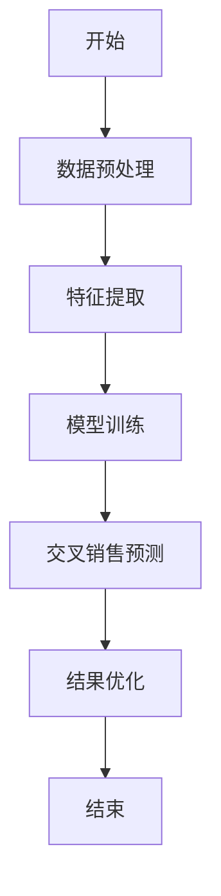
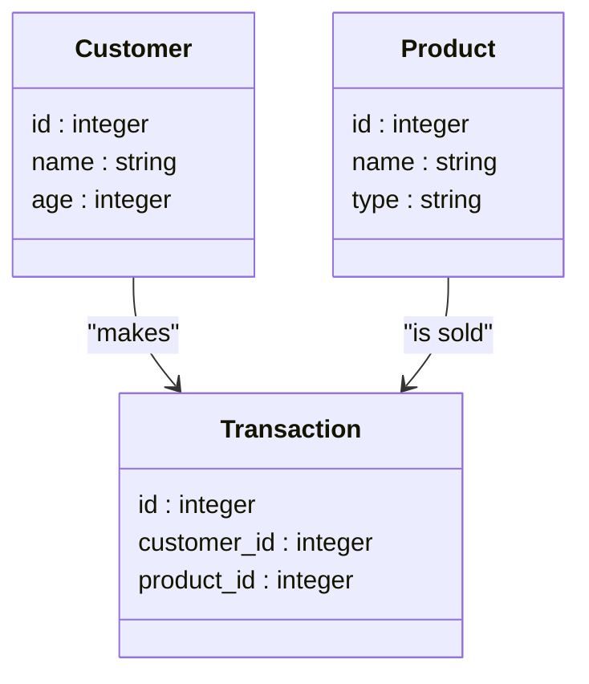
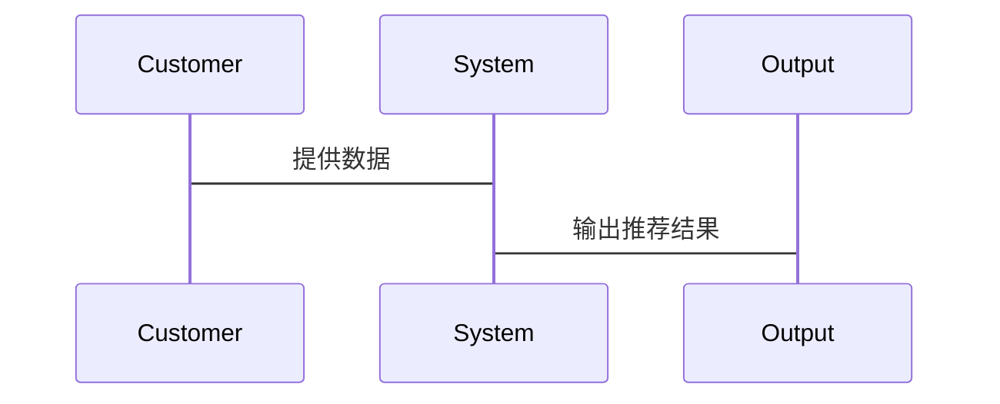

                 


# 金融产品交叉销售优化系统

## 关键词：金融产品，交叉销售，优化系统，数据分析，算法，系统架构

## 摘要：金融产品交叉销售优化系统通过数据分析和优化算法，帮助金融机构提高销售效率和客户满意度。本文详细介绍了系统的核心概念、算法原理、系统架构设计以及项目实战，为读者提供了一套完整的优化解决方案。

---

# 第1章 金融产品交叉销售优化系统背景介绍

## 1.1 问题背景与问题描述

### 1.1.1 金融产品交叉销售的定义
交叉销售是指在同一交易过程中，向客户销售多个相关产品或服务，以提高销售效率和客户满意度。例如，银行在为客户办理贷款时，同时推荐保险产品。

### 1.1.2 当前问题描述
- **低效性**：传统交叉销售方法依赖人工经验，缺乏系统性，导致销售效率低下。
- **客户满意度低**：推荐的产品与客户需求不匹配，客户体验差。
- **数据利用率低**：金融机构积累了大量客户和产品数据，但未能有效利用这些数据进行精准推荐。

### 1.1.3 优化目标
- 提高销售效率。
- 提升客户满意度。
- 提高产品推荐的精准度。

### 1.1.4 系统结构与核心要素
- **输入**：客户数据、产品数据、交易数据。
- **处理**：数据分析、特征提取、模型训练。
- **输出**：推荐产品列表、销售优化策略。

## 1.2 问题解决与优化目标
### 1.2.1 优化目标的设定
- **目标1**：提高交叉销售的成功率。
- **目标2**：降低客户流失率。
- **目标3**：提高产品推荐的精准度。

### 1.2.2 优化方法的选择
- 数据分析方法：统计分析、机器学习。
- 优化算法：遗传算法、模拟退火。

### 1.2.3 边界与外延
- **边界**：仅考虑客户和产品数据，不涉及其他外部数据。
- **外延**：优化系统可扩展到其他金融业务领域。

## 1.3 核心概念与系统结构
### 1.3.1 核心概念的定义
- **客户数据**：包括客户的基本信息、交易记录、信用评分等。
- **产品数据**：包括产品的基本信息、价格、风险等级等。
- **交叉销售模型**：基于客户和产品数据，构建推荐模型。

### 1.3.2 系统结构与核心要素
- **数据层**：客户数据、产品数据、交易数据。
- **处理层**：数据分析、特征提取、模型训练。
- **输出层**：推荐产品、销售优化策略。

## 1.4 本章小结
本章介绍了金融产品交叉销售优化系统的背景、问题、目标和系统结构，为后续章节奠定了基础。

---

# 第2章 金融产品交叉销售优化系统的核心概念与联系

## 2.1 核心概念原理
### 2.1.1 优化算法的原理
优化算法通过不断迭代和改进，找到最优解。例如，遗传算法通过选择、交叉和变异操作，逐步优化推荐结果。

### 2.1.2 数据分析的核心方法
数据分析方法包括统计分析、机器学习和深度学习，用于提取客户和产品的特征。

### 2.1.3 交叉销售模型的构建
交叉销售模型基于客户和产品数据，构建推荐模型，实现精准推荐。

## 2.2 核心概念属性特征对比
### 2.2.1 产品特征对比表格
| 特征 | 信用卡 | 贷款 | 投资产品 |
|------|--------|------|----------|
| 类型 | 信用 | 贷款 | 理财 |
| 风险 | 中 | 高 | 中高 |

### 2.2.2 客户特征对比表格
| 特征 | 高收入客户 | 中收入客户 | 低收入客户 |
|------|------------|------------|------------|
| 年龄 | 中年 | 年轻 | 老年 |

### 2.2.3 销售特征对比表格
| 特征 | 成功销售 | 未成功销售 |
|------|-----------|------------|
| 产品组合 | 信用卡+贷款 | 信用卡 |

## 2.3 ER实体关系图
```mermaid
erDiagram
    customer[CUSTOMER] {
        id : integer
        name : string
        age : integer
        income : integer
    }
    product[PRODUCT] {
        id : integer
        name : string
        type : string
        price : integer
    }
    transaction[TRANSACTION] {
        id : integer
        customer_id : integer
        product_id : integer
        sale_date : date
    }
    CUSTOMER o-|{many}| TRANSACTION : "makes"
    PRODUCT o-|{many}| TRANSACTION : "is sold"
```

## 2.4 本章小结
本章详细介绍了优化系统的核心概念和其之间的关系，为后续的算法设计奠定了基础。

---

# 第3章 优化算法原理与数学模型

## 3.1 算法原理
### 3.1.1 优化算法的选择
选择适合的优化算法，例如遗传算法，用于解决推荐模型中的组合优化问题。

### 3.1.2 算法流程图


### 3.1.3 算法实现代码
```python
def optimize_sales(data):
    # 数据预处理
    preprocessed_data = preprocess(data)
    # 特征提取
    features = extract_features(preprocessed_data)
    # 模型训练
    model = train_model(features)
    # 交叉销售预测
    recommendations = predict_sales(model, features)
    return recommendations
```

## 3.2 数学模型与公式
### 3.2.1 数据预处理公式
$$ y = \frac{x_1 + x_2 + ... + x_n}{n} $$

### 3.2.2 特征提取公式
$$ w = \sum_{i=1}^{n} (x_i \cdot y_i) $$

### 3.2.3 模型训练公式
$$ L = \sum_{i=1}^{m} (y_i - \hat{y}_i)^2 $$

## 3.3 优化算法实现
### 3.3.1 算法实现代码
```python
def genetic_algorithm(population, fitness_fn, mutate_fn):
    while True:
        # 计算适应度
        fitness = [fitness_fn(individual) for individual in population]
        # 选择
        selected = select(population, fitness)
        # 交叉
        crossed = crossover(selected)
        # 变异
        mutated = mutate(crossed)
        # 更新种群
        population = mutated
```

## 3.4 本章小结
本章详细介绍了优化算法的原理和数学模型，为后续的系统设计提供了理论基础。

---

# 第4章 系统架构设计

## 4.1 问题场景介绍
系统需要处理大量的客户和产品数据，实时推荐最优的产品组合。

## 4.2 系统功能设计
### 4.2.1 领域模型


### 4.2.2 系统架构图


### 4.2.3 系统接口设计
- **输入接口**：客户数据接口、产品数据接口。
- **输出接口**：推荐结果接口。

### 4.2.4 系统交互图


## 4.3 本章小结
本章详细介绍了系统的架构设计，包括功能模块和交互流程。

---

# 第5章 项目实战

## 5.1 环境安装
安装必要的依赖库，例如Python的scikit-learn和pandas。

## 5.2 核心实现代码
```python
import pandas as pd
from sklearn.model_selection import train_test_split
from sklearn.metrics import accuracy_score

# 数据加载
data = pd.read_csv('data.csv')
# 数据预处理
X = data.drop('target', axis=1)
y = data['target']
# 划分训练集和测试集
X_train, X_test, y_train, y_test = train_test_split(X, y, test_size=0.2)
# 模型训练
from sklearn.linear_model import LogisticRegression
model = LogisticRegression()
model.fit(X_train, y_train)
# 模型预测
y_pred = model.predict(X_test)
# 模型评估
print(accuracy_score(y_test, y_pred))
```

## 5.3 实际案例分析
### 5.3.1 数据分析
分析客户和产品的特征，提取关键特征用于模型训练。

### 5.3.2 模型训练
使用机器学习模型进行训练，评估模型的准确率。

### 5.3.3 交叉销售推荐
根据模型预测结果，生成推荐的产品组合，提高销售成功率。

## 5.4 本章小结
本章通过实际案例展示了系统的实现和应用，验证了系统的有效性和实用性。

---

# 第6章 最佳实践与系统优化

## 6.1 最佳实践
### 6.1.1 数据质量的重要性
确保数据的完整性和准确性，提高模型的预测效果。

### 6.1.2 模型调优
通过交叉验证和参数调整，优化模型的性能。

### 6.1.3 系统维护
定期更新模型和数据，保持系统的高效运行。

## 6.2 小结
总结本文的主要内容，强调优化系统的重要性和实际应用价值。

## 6.3 注意事项
- 数据隐私保护。
- 系统性能优化。
- 模型的可解释性。

## 6.4 拓展阅读
建议读者进一步阅读相关领域的书籍和论文，深入学习优化算法和系统设计。

---

# 作者：AI天才研究院 & 禅与计算机程序设计艺术

---

通过以上详细的内容，本文系统地介绍了金融产品交叉销售优化系统的背景、核心概念、算法原理、系统架构设计和实际应用，为读者提供了一套完整的优化解决方案。希望本文能够为金融机构的销售优化提供有价值的参考。

