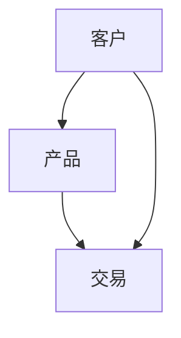
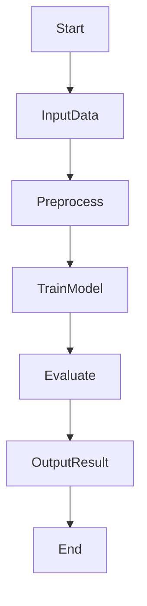
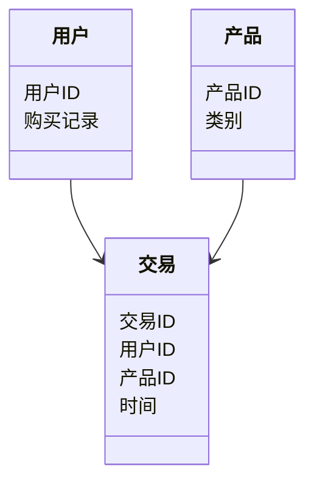
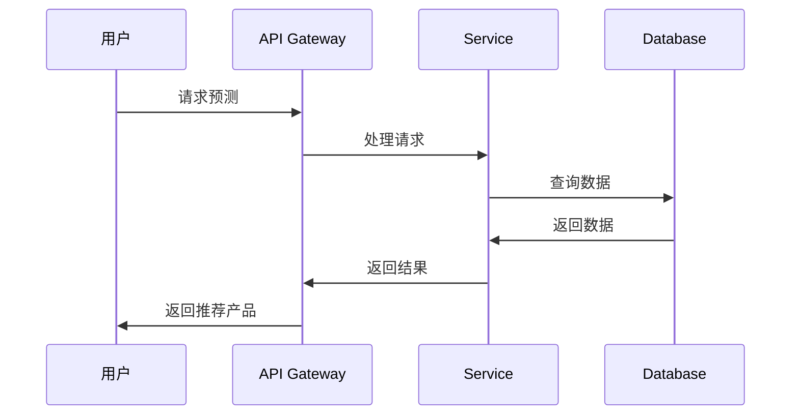

                 


# 金融产品交叉销售预测引擎

## 关键词：交叉销售预测引擎、金融产品、机器学习、协同过滤、系统架构

## 摘要：金融产品交叉销售预测引擎是一种利用机器学习技术，基于客户行为和产品关联性分析，预测客户购买行为并推荐相关产品，从而提升销售效率和客户满意度的系统。本文详细介绍了交叉销售预测引擎的核心概念、算法原理、系统架构、项目实现及最佳实践。

---

# 第1章: 金融产品交叉销售预测引擎的背景与意义

## 1.1 问题背景与描述

### 1.1.1 金融行业中的交叉销售概念
交叉销售（Cross-Selling）是指在同一客户购买过程中，推荐并销售相关产品或服务，以增加销售额和客户满意度。例如，银行客户购买贷款产品后，银行可能会推荐保险或投资理财产品。

### 1.1.2 交叉销售的核心问题与挑战
- **数据稀疏性**：客户行为数据可能不完整，导致预测困难。
- **模型准确性**：需要准确预测客户对产品的兴趣。
- **实时性要求**：在实际业务中，预测结果需要快速反馈。

### 1.1.3 交叉销售预测引擎的定义与目标
交叉销售预测引擎是一种利用数据挖掘和机器学习技术，分析客户行为和产品特征，预测客户可能购买的产品，并推荐相关产品的系统。

## 1.2 交叉销售预测引擎的解决思路

### 1.2.1 数据驱动的预测方法
通过收集和分析客户数据，提取特征，构建预测模型。

### 1.2.2 机器学习在交叉销售中的应用
- **协同过滤**：基于相似客户的行为推荐产品。
- **聚类分析**：将客户分为不同群体，针对性推荐产品。

### 1.2.3 业务目标与技术手段的结合
通过技术手段实现业务目标，如提升销售额和客户满意度。

## 1.3 交叉销售预测引擎的边界与外延

### 1.3.1 系统边界
仅关注客户与产品的关系，不涉及其他业务模块。

### 1.3.2 外延与相关领域
- **客户细分**：根据客户特征进行分组。
- **产品推荐**：基于客户偏好推荐产品。

### 1.3.3 核心要素与组成结构
- **数据源**：客户交易数据、产品数据。
- **模型**：协同过滤、聚类模型。
- **输出**：推荐产品列表。

## 1.4 本章小结
本章介绍了交叉销售预测引擎的背景、核心概念和解决思路，明确了系统的边界和外延。

---

# 第2章: 交叉销售预测引擎的核心概念

## 2.1 核心概念的原理与特征

### 2.1.1 客户行为分析
通过分析客户的交易记录，挖掘客户的购买习惯和偏好。

### 2.1.2 产品关联性分析
分析产品之间的关联性，找出哪些产品常被一起购买。

### 2.1.3 预测模型构建
基于客户和产品特征，构建预测模型，预测客户可能购买的产品。

## 2.2 核心概念的对比分析

### 2.2.1 不同预测方法的特征对比
| 方法       | 特点                          |
|------------|-------------------------------|
| 协同过滤    | 基于相似用户或物品推荐         |
| 聚类分析    | 将客户分为不同群体，针对性推荐  |

### 2.2.2 数据特征的对比分析
| 特征       | 描述                          |
|------------|-------------------------------|
| 用户ID     | 客户唯一标识                  |
| 产品ID     | 产品唯一标识                  |
| 购买记录    | 客户购买产品的记录            |

### 2.2.3 模型性能的对比评估
使用准确率、召回率等指标评估模型性能。

## 2.3 实体关系图

### 2.3.1 ER实体关系图


## 2.4 本章小结
本章详细讲解了交叉销售预测引擎的核心概念，包括客户行为分析、产品关联性分析和预测模型构建，并通过对比分析和实体关系图进一步明确了系统的组成。

---

# 第3章: 基于机器学习的交叉销售预测算法

## 3.1 算法原理概述

### 3.1.1 协同过滤算法
基于用户相似性推荐产品。

### 3.1.2 聚类算法
将客户分为不同群体，针对性推荐产品。

### 3.1.3 分类算法
基于客户特征，分类客户可能购买的产品。

## 3.2 协同过滤算法的实现

### 3.2.1 基于用户的协同过滤
- 计算用户相似度。
- 推荐相似用户购买的产品。

### 3.2.2 基于物品的协同过滤
- 计算产品相似度。
- 推荐相似产品。

### 3.2.3 混合协同过滤
结合用户和物品的相似性。

## 3.3 算法流程图



## 3.4 协同过滤算法的Python实现

### 3.4.1 协同过滤算法代码
```python
def collaborative_filtering(user_item_matrix):
    # 计算用户相似度
    similarity = cosine_similarity(user_item_matrix)
    # 预测评分
    predicted_scores = similarity.dot(user_item_matrix)
    return predicted_scores
```

### 3.4.2 协同过滤算法的数学模型
协同过滤的数学模型可以表示为：
$$ \text{预测评分} = \sum_{i=1}^{n} w_{ij} \times r_{ij} $$
其中，$w_{ij}$是用户$i$和用户$j$的相似度，$r_{ij}$是用户$j$对产品的评分。

---

# 第4章: 交叉销售预测引擎的系统架构

## 4.1 系统功能设计

### 4.1.1 领域模型



### 4.1.2 系统架构

```mermaid
graph LR
    Web --> API Gateway
    API Gateway --> Service
    Service --> Database
```

### 4.1.3 系统接口设计
- **API接口**：提供RESTful API，供前端调用。
- **数据接口**：与数据库交互。

### 4.1.4 系统交互



## 4.2 系统架构设计

### 4.2.1 分层架构
- **前端层**：用户交互。
- **服务层**：处理业务逻辑。
- **数据层**：存储数据。

### 4.2.2 微服务架构
- **用户服务**：处理用户相关请求。
- **产品服务**：处理产品相关请求。
- **交易服务**：处理交易相关请求。

---

# 第5章: 交叉销售预测引擎的项目实战

## 5.1 项目环境安装

### 5.1.1 安装Python
```bash
python --version
pip install requests numpy pandas scikit-learn
```

### 5.1.2 安装Jupyter Notebook
```bash
pip install jupyter
jupyter notebook
```

## 5.2 系统核心实现

### 5.2.1 数据预处理代码
```python
import pandas as pd
from sklearn.preprocessing import StandardScaler

data = pd.read_csv('data.csv')
scaled_data = StandardScaler().fit_transform(data)
```

### 5.2.2 模型训练代码
```python
from sklearn.cluster import KMeans

model = KMeans(n_clusters=3)
model.fit(scaled_data)
```

## 5.3 实际案例分析

### 5.3.1 数据分析
分析客户购买记录，找出高价值客户。

### 5.3.2 模型评估
评估模型准确率、召回率。

## 5.4 项目小结
本章通过实际案例，展示了如何安装环境、实现核心代码，并分析模型效果。

---

# 第6章: 交叉销售预测引擎的最佳实践

## 6.1 小结

### 6.1.1 核心概念回顾
交叉销售预测引擎的核心概念包括客户行为分析、产品关联性分析和预测模型构建。

### 6.1.2 算法选择
选择合适的算法，如协同过滤或聚类分析。

## 6.2 注意事项

### 6.2.1 数据隐私
确保客户数据隐私安全。

### 6.2.2 模型调优
通过网格搜索优化模型参数。

## 6.3 拓展阅读

### 6.3.1 推荐系统
阅读推荐系统相关书籍。

### 6.3.2 机器学习
深入学习机器学习算法。

---

# 作者：AI天才研究院/AI Genius Institute & 禅与计算机程序设计艺术 /Zen And The Art of Computer Programming

---

以上内容涵盖了交叉销售预测引擎的背景、核心概念、算法原理、系统架构、项目实战和最佳实践。通过详细讲解，读者可以全面了解如何构建和应用交叉销售预测引擎。

