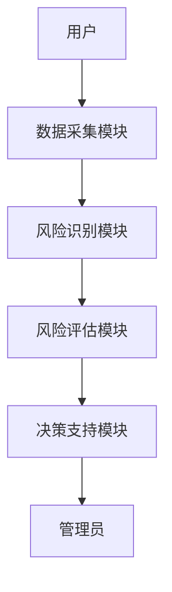
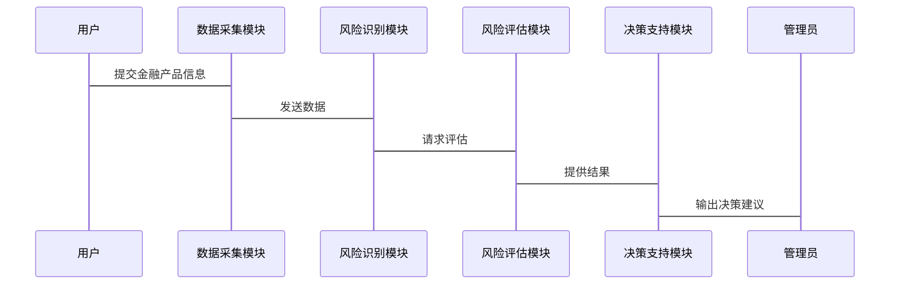

                 


# 《金融产品创新风险评估框架》

## 关键词：金融创新、风险评估、风险框架、系统性风险、金融算法、架构设计、风险管理

## 摘要：本文构建了一个系统化的金融产品创新风险评估框架，通过分析金融创新的核心概念、风险类型和评估算法，提出了一种基于数学模型和系统架构的风险评估方法。该框架能够帮助金融机构在创新过程中有效识别和管理风险，优化决策流程，降低创新失败的概率。本文结合实际案例和系统设计，详细阐述了框架的设计思路、实现方法和应用场景。

---

# 第一部分: 金融产品创新风险评估框架概述

## 第1章: 金融产品创新的背景与挑战

### 1.1 金融创新的现状与趋势

#### 1.1.1 金融创新的定义与特征
金融创新是指通过引入新的金融工具、产品、服务或技术，以满足市场多样化需求的过程。其核心特征包括多样性、复杂性和动态性。

#### 1.1.2 金融创新的驱动力
- 市场需求：客户对个性化金融产品的需求增加。
- 技术进步：人工智能、大数据等技术推动金融创新。
- 监管环境：监管政策的变化影响金融机构的创新方向。

#### 1.1.3 金融创新面临的挑战
- 市场风险：创新产品可能面临市场波动。
- 技术风险：技术实现的不确定性。
- 合规风险：创新产品可能不符合监管要求。

### 1.2 金融产品创新的风险特征

#### 1.2.1 金融产品创新的复杂性
金融创新涉及多学科知识，如金融学、经济学、技术学等，其复杂性增加了风险管理的难度。

#### 1.2.2 创新与风险的辩证关系
- 创新是风险的来源，但也是应对风险的手段。
- 高度创新的产品往往伴随着高风险。

#### 1.2.3 金融创新中的系统性风险
系统性风险是金融创新中需要重点关注的风险类型，它可能对整个金融系统造成冲击。

---

## 第2章: 风险评估框架的必要性

### 2.1 金融产品创新中的风险类型

#### 2.1.1 市场风险
市场风险是由于市场波动导致金融产品价值下降的风险。

#### 2.1.2 信用风险
信用风险是由于债务人或交易对手无法履行其义务而导致的风险。

#### 2.1.3 操作风险
操作风险是由于内部操作失误或外部事件导致的风险。

#### 2.1.4 合规风险
合规风险是由于金融产品不符合监管要求而导致的风险。

### 2.2 风险评估框架的核心目标

#### 2.2.1 提高风险识别能力
通过系统化的框架，能够更全面地识别金融创新中的风险。

#### 2.2.2 优化风险管理流程
通过框架的引导，能够更高效地管理风险。

#### 2.2.3 支持决策制定
风险评估框架为金融机构的决策提供数据支持。

### 2.3 框架的适用范围与边界

#### 2.3.1 适用的金融产品类型
- 资产管理产品
- 信贷产品
- 衍生品
- 支付工具

#### 2.3.2 框架的局限性
- 无法完全预测市场波动
- 依赖于数据的准确性和完整性

#### 2.3.3 边界与外延
- 框架主要关注系统性风险，不涉及具体操作层面的风险。

---

# 第二部分: 金融产品创新风险评估的核心概念

## 第3章: 创新与风险的核心概念

### 3.1 创新过程中的风险属性

#### 3.1.1 创新性与风险性
创新性高的产品通常伴随着较高的风险。

#### 3.1.2 创新强度与风险程度
创新强度越大，风险程度越高。

#### 3.1.3 创新周期与风险分布
创新周期的不同阶段，风险的分布和类型也不同。

### 3.2 创新风险的分类与对比

#### 3.2.1 创新风险的分类维度
- 时间维度：创新过程中的不同阶段。
- 影响范围：系统性风险和个体风险。

#### 3.2.2 不同风险类型对比分析
| 风险类型 | 主要影响 | 示例 |
|----------|----------|------|
| 市场风险 | 产品价值 | 股票价格波动 |
| 信用风险 | 偿付能力 | 债务违约 |

#### 3.2.3 创新风险与传统风险的异同
- 相同点：都可能对金融机构造成损失。
- 不同点：创新风险具有更强的不确定性。

### 3.3 创新风险的核心要素

#### 3.3.1 创新强度
创新强度是衡量产品创新程度的指标，通常包括技术创新、业务模式创新等维度。

#### 3.3.2 风险暴露程度
风险暴露程度是衡量风险对金融机构影响大小的指标。

#### 3.3.3 风险可控性
风险可控性是衡量金融机构对风险的控制能力的指标。

---

## 第4章: 风险评估框架的结构与功能

### 4.1 框架的核心组成

#### 4.1.1 数据采集模块
数据采集模块负责收集与金融创新相关的数据，包括市场数据、产品数据、客户数据等。

#### 4.1.2 风险识别模块
风险识别模块通过数据分析，识别潜在风险。

#### 4.1.3 风险评估模块
风险评估模块根据识别出的风险，评估其影响程度。

#### 4.1.4 决策支持模块
决策支持模块为金融机构的决策提供支持。

### 4.2 框架的功能特性

#### 4.2.1 数据处理能力
数据处理能力包括数据清洗、数据转换等。

#### 4.2.2 风险计算能力
风险计算能力包括风险指数计算、风险传播计算等。

#### 4.2.3 可视化能力
可视化能力包括风险分布图、风险热力图等。

#### 4.2.4 自适应能力
自适应能力包括框架的动态调整能力。

### 4.3 框架的实体关系分析

#### 4.3.1 实体关系图（ER图）
```mermaid
erDiagram
    actor 用户 {
        key string 用户ID
        string 用户名称
    }
    actor 管理员 {
        key string 管理员ID
        string 管理员名称
    }
    class 金融产品 {
        key string 产品ID
        string 产品名称
        string 产品类型
    }
    class 风险评估结果 {
        key string 结果ID
        int 风险指数
        string 评估时间
    }
    用户 --> 金融产品 : 创建产品
    管理员 --> 风险评估结果 : 生成评估结果
```

#### 4.3.2 关键实体属性分析
- 用户：用户ID、用户名称
- 管理员：管理员ID、管理员名称
- 金融产品：产品ID、产品名称、产品类型
- 风险评估结果：结果ID、风险指数、评估时间

#### 4.3.3 实体间关系的数学表达
$$ R_{\text{index}} = \alpha \cdot I + \beta \cdot C + \gamma \cdot O $$
其中，$R_{\text{index}}$ 表示风险指数，$I$ 表示创新性，$C$ 表示复杂性，$O$ 表示操作性，$\alpha, \beta, \gamma$ 为权重系数。

---

## 第5章: 风险评估的数学模型

### 5.1 创新风险指数模型

#### 5.1.1 模型的构建逻辑
创新风险指数模型通过量化创新性、复杂性和操作性，计算出一个综合风险指数。

#### 5.1.2 模型的数学表达
$$ R = \alpha \cdot I + \beta \cdot C + \gamma \cdot O $$
其中，$R$ 表示风险指数，$I$ 表示创新性，$C$ 表示复杂性，$O$ 表示操作性，$\alpha, \beta, \gamma$ 为权重系数。

### 5.2 风险传播模型

#### 5.2.1 风险传播的路径分析
风险可能通过金融产品、市场、客户等渠道传播。

#### 5.2.2 风险传播的数学表达
$$ R_{\text{total}} = \sum_{i=1}^{n} R_i \cdot W_i $$
其中，$R_i$ 表示第 $i$ 个风险的影响力，$W_i$ 表示权重系数。

---

## 第6章: 系统架构设计

### 6.1 问题场景介绍

#### 6.1.1 项目介绍
本项目旨在构建一个金融产品创新风险评估系统，帮助金融机构识别和管理创新过程中的风险。

#### 6.1.2 系统功能设计
- 数据采集模块
- 风险识别模块
- 风险评估模块
- 决策支持模块

### 6.2 系统架构设计

#### 6.2.1 系统架构图


#### 6.2.2 系统交互图


---

## 第7章: 项目实战

### 7.1 环境安装

#### 7.1.1 安装依赖
- 安装Python
- 安装NumPy和Pandas库
- 安装Matplotlib和Seaborn库

### 7.2 核心实现

#### 7.2.1 数据准备
```python
import pandas as pd
data = pd.read_csv('financial_products.csv')
```

#### 7.2.2 模型训练
```python
from sklearn import linear_model
model = linear_model.LinearRegression()
model.fit(X, y)
```

#### 7.2.3 结果分析
```python
import matplotlib.pyplot as plt
plt.scatter(X, y)
plt.plot(X, model.predict(X), color='red')
plt.show()
```

### 7.3 实际案例分析

#### 7.3.1 案例背景
假设我们有一个创新的金融产品，需要评估其市场风险。

#### 7.3.2 数据分析
```python
import pandas as pd
data = pd.read_csv('market_risk.csv')
print(data.head())
```

#### 7.3.3 模型应用
```python
from sklearn import linear_model
model = linear_model.LinearRegression()
model.fit(X, y)
print('预测结果:', model.predict(new_X))
```

### 7.4 项目小结

#### 7.4.1 核心收获
通过项目实战，我们掌握了金融产品创新风险评估的实现方法。

#### 7.4.2 改进方向
未来可以优化模型，引入更多风险因素。

---

## 第三部分: 最佳实践与总结

## 第8章: 最佳实践与总结

### 8.1 小结
通过本文的系统化分析，我们构建了一个金融产品创新风险评估框架，能够帮助金融机构有效识别和管理创新风险。

### 8.2 注意事项
- 数据的准确性和完整性是模型的基础。
- 模型的权重系数需要根据实际情况调整。

### 8.3 拓展阅读
- 《金融风险管理》
- 《人工智能在金融领域的应用》

---

作者：AI天才研究院/AI Genius Institute & 禅与计算机程序设计艺术 /Zen And The Art of Computer Programming

