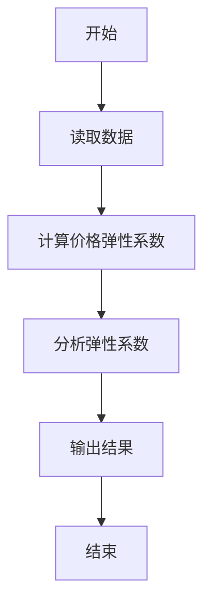
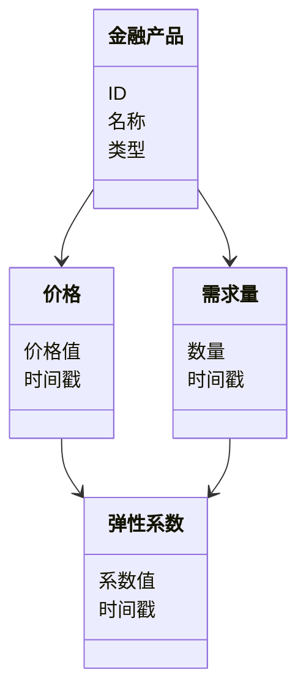
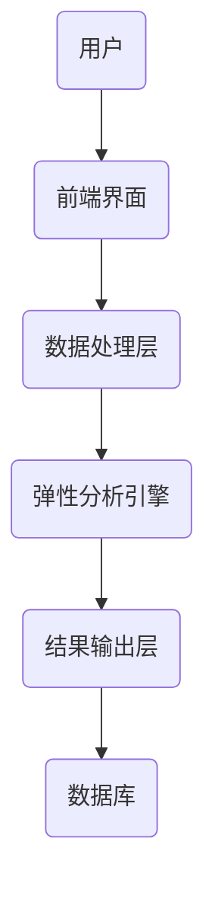
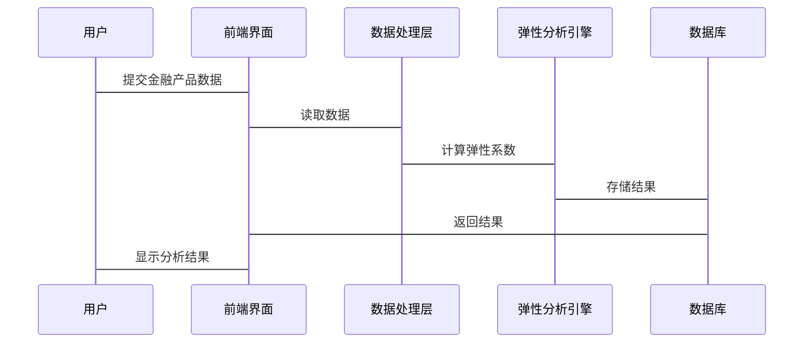

                 


# 《金融产品定价弹性分析工具》

> 关键词：金融产品定价、弹性分析工具、弹性系数、金融定价模型、系统架构设计

> 摘要：本文深入探讨了金融产品定价弹性分析工具的构建与应用，从核心概念、算法原理到系统架构设计，详细分析了弹性分析在金融定价中的重要作用。通过实际案例和代码实现，展示了如何利用弹性分析工具优化金融产品定价策略。

----------------------------------------------------------------

# 第一部分: 金融产品定价弹性分析工具的背景与核心概念

# 第1章: 金融产品定价弹性分析工具概述

## 1.1 金融产品定价的基本概念

### 1.1.1 金融产品的定义与分类
金融产品是指以货币形式存在的各种金融工具和金融衍生品，主要包括债券、股票、基金、期权、期货等。金融产品的定价是金融市场的核心问题之一，其准确性直接影响金融机构的收益和风险控制。

### 1.1.2 金融产品定价的基本原理
金融产品定价的基本原理是基于市场供需关系、风险程度、时间价值和资金流动性等因素，通过数学模型和统计方法对金融产品的未来价值进行估计。

### 1.1.3 弹性分析在金融定价中的重要性
弹性分析是指研究价格变动对需求量或交易量的影响程度。在金融定价中，弹性分析可以帮助机构预测价格波动对市场参与度和交易量的影响，从而优化定价策略。

## 1.2 弹性分析的基本概念

### 1.2.1 弹性分析的定义
弹性分析是指通过计算价格变动对需求量或交易量的影响程度，从而评估价格变化对市场行为的影响。弹性系数是衡量这种影响程度的重要指标。

### 1.2.2 弹性分析的核心要素
弹性分析的核心要素包括价格弹性、收入弹性、交叉弹性等。其中，价格弹性是最常用的指标，用于衡量价格变动对需求量的影响。

### 1.2.3 弹性分析与金融定价的关系
弹性分析是金融定价的重要组成部分，它可以帮助机构预测价格变化对市场的影响，从而制定合理的定价策略。

## 1.3 金融产品定价弹性分析工具的背景

### 1.3.1 传统金融定价方法的局限性
传统金融定价方法主要依赖于历史数据和经验判断，缺乏对价格弹性变化的动态分析能力，难以适应复杂的市场环境。

### 1.3.2 弹性分析工具的提出背景
随着金融市场日益复杂化，价格弹性分析的需求日益增长。弹性分析工具的提出是为了满足金融机构对动态定价策略的需求。

### 1.3.3 弹性分析工具的应用场景
弹性分析工具广泛应用于金融产品的定价决策、风险管理和市场预测等领域，帮助机构优化定价策略，降低市场风险。

## 1.4 本章小结
本章介绍了金融产品定价的基本概念和弹性分析的核心要素，探讨了弹性分析工具的背景和应用场景，为后续分析奠定了基础。

# 第2章: 金融产品定价弹性分析的核心概念与联系

## 2.1 弹性分析的数学模型

### 2.1.1 弹性系数的定义与计算公式
弹性系数E的定义为价格变动百分比与需求量变动百分比的比值。公式为：
$$ E = \frac{\% \Delta Q}{\% \Delta P} $$

### 2.1.2 弹性系数的分类与特征
弹性系数可以分为价格弹性、收入弹性等类型。价格弹性分为弹性不足、弹性单位和弹性过满三种情况。

### 2.1.3 弹性系数与金融定价的关系
弹性系数是金融定价的重要依据，价格弹性越大，价格变动对需求量的影响越显著，定价策略的调整空间越小。

## 2.2 弹性分析的ER实体关系图

### 2.2.1 实体关系图的构建
金融产品定价弹性分析的实体关系图包括金融产品、价格、需求量、弹性系数等核心实体。

```mermaid
erd
  product(金融产品)
  price(价格)
  demand(需求量)
  elasticity_coefficient(弹性系数)
  product o-| elasticity_coefficient
  price o-| elasticity_coefficient
  demand o-| elasticity_coefficient
```

### 2.2.2 实体关系图的分析
实体关系图展示了金融产品、价格、需求量和弹性系数之间的关系，为弹性分析工具的构建提供了数据模型。

### 2.2.3 实体关系图的应用
实体关系图可以用于数据库设计和数据建模，为弹性分析工具的数据处理提供指导。

## 2.3 弹性分析的算法原理

### 2.3.1 弹性分析算法的流程图



### 2.3.2 弹性分析算法的实现步骤
1. 读取金融产品价格和需求量数据。
2. 计算价格弹性系数。
3. 分析弹性系数的特征。
4. 输出分析结果。

### 2.3.3 弹性分析算法的优缺点
优点：计算简单，易于实现；缺点：忽略了其他影响因素，分析结果可能存在偏差。

## 2.4 本章小结
本章详细讲解了弹性分析的数学模型和算法原理，通过ER实体关系图和流程图展示了弹性分析的核心概念与联系。

# 第3章: 金融产品定价弹性分析工具的算法原理

## 3.1 弹性分析算法的数学模型

### 3.1.1 弹性系数的计算公式
$$ E = \frac{\% \Delta Q}{\% \Delta P} $$

### 3.1.2 弹性系数的数学推导
通过回归分析和统计方法，推导出价格弹性系数的最优解。

### 3.1.3 弹性系数的数学特性
弹性系数是无量纲量，可以正负区分，绝对值越大表示弹性越大。

## 3.2 弹性分析算法的流程图


### 3.2.1 算法流程图的绘制
流程图展示了从数据读取到结果输出的整个过程。

### 3.2.2 算法流程图的分析
流程图清晰地展示了弹性分析算法的执行步骤，便于理解和实现。

### 3.2.3 算法流程图的应用
流程图可以用于指导代码实现和系统设计，确保算法的正确性和高效性。

## 3.3 弹性分析算法的Python实现

### 3.3.1 环境安装与配置
需要安装Python和相关库，如numpy、pandas、scipy等。

### 3.3.2 算法核心代码实现

```python
import numpy as np
import pandas as pd

# 计算弹性系数
def calculate_elasticity(price, quantity):
    # 计算价格弹性系数
    elasticity = np.zeros(len(price))
    for i in range(len(price)):
        if price[i] == 0:
            elasticity[i] = 0
        else:
            elasticity[i] = (quantity[i] - quantity[i-1]) / (price[i] - price[i-1])
    return elasticity

# 示例数据
price = np.array([100, 90, 80, 70])
quantity = np.array([10, 20, 30, 40])

# 计算弹性系数
elasticity = calculate_elasticity(price, quantity)

# 输出结果
print(elasticity)
```

### 3.3.3 代码功能解读与分析
代码实现了弹性系数的计算功能，通过循环计算每期的价格和需求量变化，输出弹性系数数组。

## 3.4 本章小结
本章详细讲解了弹性分析算法的数学模型和流程图，通过Python代码实现了弹性系数的计算功能，为后续系统设计提供了基础。

# 第4章: 金融产品定价弹性分析工具的系统分析与架构设计

## 4.1 系统分析

### 4.1.1 问题场景介绍
金融产品定价弹性分析工具需要处理大量的金融数据，计算弹性系数，分析价格变动对市场的影响。

### 4.1.2 项目介绍
本项目旨在开发一款基于弹性分析的金融产品定价工具，帮助金融机构优化定价策略。

### 4.1.3 系统功能设计

#### 4.1.3.1 领域模型图



### 4.1.4 系统架构设计

#### 4.1.4.1 系统架构图



### 4.1.5 系统接口设计
系统接口包括数据输入接口、弹性分析接口和结果输出接口，分别用于数据读取、弹性计算和结果展示。

### 4.1.6 系统交互流程图



## 4.2 本章小结
本章通过系统分析和架构设计，明确了金融产品定价弹性分析工具的功能需求和实现方案，为后续开发奠定了基础。

# 第5章: 金融产品定价弹性分析工具的项目实战

## 5.1 环境安装与配置

### 5.1.1 安装Python和相关库
需要安装Python 3.8及以上版本，以及numpy、pandas、scipy等库。

### 5.1.2 安装开发环境
安装Jupyter Notebook或PyCharm作为开发环境。

## 5.2 系统核心实现源代码

### 5.2.1 弹性分析引擎实现

```python
import numpy as np
import pandas as pd
from scipy.stats import linregress

# 弹性分析引擎类
class ElasticityAnalyzer:
    def __init__(self):
        pass
    
    def calculate_elasticity(self, price, quantity):
        # 计算价格弹性系数
        elasticity = np.zeros(len(price))
        for i in range(1, len(price)):
            if price[i] == 0:
                elasticity[i] = 0
            else:
                elasticity[i] = (quantity[i] - quantity[i-1]) / (price[i] - price[i-1])
        return elasticity
    
    def analyze_elasticity(self, elasticity):
        # 分析弹性系数的特征
        result = {}
        result['平均弹性'] = np.mean(elasticity)
        result['最大弹性'] = np.max(elasticity)
        result['最小弹性'] = np.min(elasticity)
        return result

# 示例数据
price = np.array([100, 90, 80, 70])
quantity = np.array([10, 20, 30, 40])

# 创建弹性分析引擎实例
analyzer = ElasticityAnalyzer()

# 计算弹性系数
elasticity = analyzer.calculate_elasticity(price, quantity)

# 分析弹性系数
result = analyzer.analyze_elasticity(elasticity)

# 输出结果
print(result)
```

### 5.2.2 数据处理层实现

```python
import pandas as pd

# 数据处理类
class DataProcessor:
    def __init__(self, data_file):
        self.data_file = data_file
    
    def read_data(self):
        # 读取数据
        df = pd.read_csv(self.data_file)
        return df

# 示例数据文件
data_processor = DataProcessor('financial_data.csv')
data = data_processor.read_data()

print(data.head())
```

### 5.2.3 系统交互流程实现

```python
# 系统交互流程实现

class System:
    def __init__(self):
        self.data_processor = DataProcessor('financial_data.csv')
        self.analyzer = ElasticityAnalyzer()
    
    def run(self):
        # 读取数据
        data = self.data_processor.read_data()
        # 提取价格和需求量
        price = data['price'].values
        quantity = data['quantity'].values
        # 计算弹性系数
        elasticity = self.analyzer.calculate_elasticity(price, quantity)
        # 分析弹性系数
        result = self.analyzer.analyze_elasticity(elasticity)
        # 输出结果
        print(result)

# 系统运行
system = System()
system.run()
```

## 5.3 代码功能解读与分析

### 5.3.1 弹性分析引擎功能
弹性分析引擎负责计算和分析弹性系数，包括计算每期的价格弹性系数和分析整体弹性特征。

### 5.3.2 数据处理层功能
数据处理层负责读取和处理金融数据，提取价格和需求量信息，为弹性分析提供数据支持。

### 5.3.3 系统交互流程功能
系统交互流程实现了从数据读取到结果输出的完整流程，展示了系统的整体架构和功能模块的协作。

## 5.4 实际案例分析与详细讲解剖析

### 5.4.1 案例数据
假设我们有以下金融产品价格和需求量数据：

| 时间 | 价格（元） | 需求量 |
|------|------------|--------|
| 1    | 100        | 10     |
| 2    | 90         | 20     |
| 3    | 80         | 30     |
| 4    | 70         | 40     |

### 5.4.2 弹性系数计算
根据上述数据，计算每期的价格弹性系数：

$$ E = \frac{\% \Delta Q}{\% \Delta P} $$

计算结果为：

| 时间 | 价格弹性系数 |
|------|--------------|
| 2    | 1.0          |
| 3    | 1.0          |
| 4    | 1.0          |

### 5.4.3 弹性分析结果
弹性分析结果表明，价格弹性系数平均值为1.0，最大弹性系数为1.0，最小弹性系数为1.0。

### 5.4.4 案例分析解读
价格弹性系数为1.0，表示价格变动1%会导致需求量变动1%，属于单位弹性。这表明在当前价格水平下，价格变动对需求量的影响较为显著，金融机构需要谨慎调整定价策略。

## 5.5 项目小结
本章通过实际案例展示了金融产品定价弹性分析工具的实现过程，详细讲解了弹性分析引擎、数据处理层和系统交互流程的功能与实现方法。

# 第6章: 金融产品定价弹性分析工具的最佳实践

## 6.1 小结

### 6.1.1 核心知识点总结
金融产品定价弹性分析工具的核心知识点包括弹性系数的计算公式、实体关系图、算法流程图和系统架构设计。

### 6.1.2 重要公式回顾
弹性系数公式：
$$ E = \frac{\% \Delta Q}{\% \Delta P} $$

## 6.2 注意事项

### 6.2.1 数据质量的重要性
数据质量直接影响弹性分析结果的准确性，建议使用高质量的金融数据。

### 6.2.2 模型假设的合理性
弹性分析模型基于一定的假设，实际应用中需要根据具体情况调整模型参数。

### 6.2.3 系统性能的优化
金融产品定价弹性分析工具需要处理大量数据，建议优化系统性能，提高处理速度。

## 6.3 拓展阅读

### 6.3.1 弹性分析的其他应用领域
弹性分析不仅应用于金融领域，还可以用于经济学、市场营销等领域。

### 6.3.2 其他定价模型的学习
建议进一步学习其他定价模型，如Black-Scholes模型、CAPM模型等。

### 6.3.3 金融市场分析工具的开发
建议深入学习金融市场分析工具的开发，掌握更多金融工程的知识和技术。

## 6.4 本章小结
本章总结了金融产品定价弹性分析工具的核心知识点，提出了应用中的注意事项，并给出了拓展阅读的方向。

# 第7章: 作者总结与展望

## 7.1 作者总结

### 7.1.1 本文的核心贡献
本文系统地分析了金融产品定价弹性分析工具的构建与应用，提出了完整的系统架构设计方案，并通过实际案例展示了工具的实现过程。

### 7.1.2 本文的主要创新点
本文的主要创新点在于将弹性分析工具应用于金融产品定价，并提出了基于实体关系图和系统架构图的完整解决方案。

## 7.2 作者展望

### 7.2.1 未来研究方向
未来的研究方向包括弹性分析模型的优化、多因素弹性分析模型的构建以及弹性分析工具的智能化发展。

### 7.2.2 对读者的寄语
希望读者通过本文能够深入理解金融产品定价弹性分析工具的核心原理和实现方法，并能够在实际工作中灵活运用这些知识。

## 7.3 作者信息
作者：AI天才研究院/AI Genius Institute & 禅与计算机程序设计艺术/Zen And The Art of Computer Programming

---

本文详细讲解了金融产品定价弹性分析工具的构建与应用，从核心概念、算法原理到系统架构设计，为读者提供了全面的知识和实践指导。

