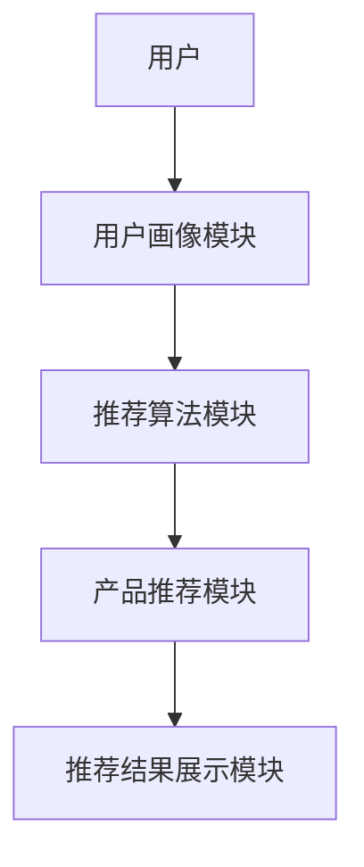

                 


```markdown
# 《金融产品推荐系统》

> **关键词**：金融推荐系统、用户画像、产品画像、推荐算法、协同过滤、矩阵分解、系统架构

> **摘要**：  
本文系统地介绍了金融产品推荐系统的构建过程，从核心概念到算法原理，再到系统架构和项目实战，全面阐述了金融推荐系统的理论与实践。文章首先分析了金融推荐系统的背景与问题，接着深入探讨了推荐系统的核心概念与联系，随后详细讲解了推荐算法的原理与实现，最后通过系统分析与架构设计以及项目实战，展示了如何将推荐系统应用于实际金融场景中。本文旨在为金融行业从业者、数据科学家以及技术开发者提供一份详尽的技术指南。

---

## 第1章: 金融推荐系统背景与问题描述

### 1.1 金融推荐系统概述

#### 1.1.1 什么是金融产品推荐系统  
金融产品推荐系统是一种基于用户行为、市场数据和产品特征的智能推荐系统，旨在为用户提供个性化、精准的金融产品推荐服务。它通过分析用户的需求、风险偏好和投资目标，结合产品的属性和市场动态，生成最优的推荐结果。

#### 1.1.2 金融推荐系统的应用场景  
- **个性化投资建议**：根据用户的财务状况和风险偏好，推荐适合的理财产品、基金、股票等。  
- **风险管理**：通过历史数据分析，识别用户的潜在风险偏好，并推荐低风险或高风险的产品。  
- **市场动态跟踪**：实时分析市场波动，为用户推荐适合当前市场的金融产品。  

#### 1.1.3 金融推荐系统的价值与意义  
- **提升用户体验**：通过个性化推荐，用户可以快速找到适合自己的金融产品，减少信息过载。  
- **提高金融机构效率**：推荐系统可以帮助金融机构更精准地匹配客户需求，降低销售成本。  
- **促进金融市场发展**：通过数据驱动的推荐，推动金融产品的创新和市场的多样化发展。

---

### 1.2 金融推荐系统的核心问题

#### 1.2.1 用户需求分析  
- 用户的基本信息：年龄、职业、收入水平等。  
- 用户的财务目标：投资收益、资产保值等。  
- 用户的风险偏好：保守型、稳健型、激进型等。  

#### 1.2.2 产品特征提取  
- 产品类型：股票、基金、债券、保险等。  
- 产品风险等级：低风险、中风险、高风险。  
- 产品历史表现：收益率、波动率、回撤率等。  

#### 1.2.3 推荐算法选择与优化  
- 算法的准确性：推荐结果是否符合用户的实际需求。  
- 算法的效率：在大规模数据下是否能够快速响应。  
- 算法的可解释性：推荐结果是否能够被用户理解和信任。  

---

### 1.3 金融推荐系统的边界与外延

#### 1.3.1 金融推荐系统的边界  
- 输入：用户信息、产品信息、市场数据。  
- 输出：推荐列表、推荐理由。  

#### 1.3.2 与相关系统的关系  
- 与用户画像系统的关联：用户画像为推荐系统提供输入数据。  
- 与市场数据系统的关联：市场数据为推荐系统提供实时信息。  
- 与交易系统的关联：推荐结果可直接引导用户进行交易操作。  

#### 1.3.3 金融推荐系统的外延  
- 支持多语言、多市场、多产品的推荐。  
- 支持实时更新和动态调整。  
- 支持多种推荐模式：主动推荐、被动推荐、实时推荐等。  

---

## 第2章: 金融推荐系统的核心概念与联系

### 2.1 核心概念原理

#### 2.1.1 用户画像  
用户画像是通过对用户行为数据的分析，构建用户在金融产品选择中的偏好、需求和风险承受能力的模型。  

#### 2.1.2 产品画像  
产品画像是通过对金融产品的属性、历史表现和市场反馈的分析，构建产品在不同用户群体中的适用性和吸引力的模型。  

#### 2.1.3 推荐算法  
推荐算法是金融推荐系统的核心，通过分析用户和产品的特征，生成个性化推荐结果。  

---

### 2.2 核心概念属性特征对比

| **属性**       | **用户画像**                   | **产品画像**                   |
|----------------|--------------------------------|--------------------------------|
| **目标**       | 描述用户的需求和风险偏好       | 描述产品的特点和市场表现       |
| **数据来源**   | 用户行为数据、问卷调查数据     | 产品信息、市场数据、历史数据   |
| **应用场景**   | 个性化推荐、风险管理           | 产品推广、市场分析             |
| **复杂度**     | 高（涉及多维度数据）           | 中（主要基于产品属性）         |

---

### 2.3 ER实体关系图

```mermaid
er
actor: 用户
actor: 产品
actor: 推荐系统
relation: 用户-产品关系
```

---

## 第3章: 推荐算法原理与实现

### 3.1 协同过滤算法

#### 3.1.1 基于用户的协同过滤  
基于用户的协同过滤算法通过寻找与目标用户相似的用户群体，推荐这些用户喜欢的产品。  

**相似度计算公式**：  
$$ \text{相似度} = \frac{\sum (x_i - \bar{x})(y_i - \bar{y})}{\sqrt{\sum (x_i - \bar{x})^2} \cdot \sqrt{\sum (y_i - \bar{y})^2}} $$  

#### 3.1.2 基于物品的协同过滤  
基于物品的协同过滤算法通过分析产品的相似性，推荐与目标用户已感兴趣的产品相似的产品。  

**相似产品计算公式**：  
$$ \text{相似度} = \frac{\sum (x_i - \bar{x})(y_i - \bar{y})}{\sqrt{\sum (x_i - \bar{x})^2} \cdot \sqrt{\sum (y_i - \bar{y})^2}} $$  

#### 3.1.3 混合协同过滤  
混合协同过滤结合了基于用户和基于物品的协同过滤，通过加权的方式提高推荐结果的准确性。  

---

### 3.2 基于内容的推荐算法

#### 3.2.1 基于文本挖掘的推荐  
通过分析产品的描述文本，提取关键词并生成推荐结果。  

**关键词提取步骤**：  
1. 分词处理。  
2. 去停用词。  
3. 计算关键词权重（如TF-IDF）。  

#### 3.2.2 基于知识图谱的推荐  
通过构建金融领域的知识图谱，分析产品之间的关系，生成推荐结果。  

**知识图谱构建步骤**：  
1. 数据清洗与预处理。  
2. 实体识别与抽取。  
3. 关系抽取与推理。  

#### 3.2.3 基于向量空间模型的推荐  
将产品描述映射到向量空间，计算目标产品的相似性。  

**向量空间模型公式**：  
$$ \text{相似度} = \frac{\sum w_i \cdot v_i}{\sqrt{\sum w_i^2} \cdot \sqrt{\sum v_i^2}} $$  

---

### 3.3 基于矩阵分解的推荐算法

#### 3.3.1 矩阵分解的基本原理  
矩阵分解通过将用户-产品评分矩阵分解为用户特征矩阵和产品特征矩阵，实现推荐。  

**矩阵分解公式**：  
$$ R = P \cdot Q^T $$  
其中，\( R \) 是用户-产品评分矩阵，\( P \) 是用户特征矩阵，\( Q \) 是产品特征矩阵。  

#### 3.3.2 常见的矩阵分解方法  
- **奇异值分解（SVD）**：最常用的矩阵分解方法。  
- **非负矩阵分解（NMF）**：适用于用户和产品特征均为非负的情况。  

#### 3.3.3 矩阵分解的实现与优化  
通过梯度下降或交替最小二乘法优化矩阵分解模型，提高推荐准确性。  

---

## 第4章: 系统分析与架构设计

### 4.1 项目介绍

#### 4.1.1 项目目标  
构建一个高效、准确的金融产品推荐系统，满足用户个性化需求。  

#### 4.1.2 项目范围  
- 用户画像构建。  
- 产品画像构建。  
- 推荐算法实现。  
- 推荐结果展示。  

#### 4.1.3 项目约束  
- 数据隐私保护。  
- 系统性能优化。  

---

### 4.2 系统功能设计

#### 4.2.1 用户模块  
- 用户信息输入。  
- 用户画像构建。  

#### 4.2.2 产品模块  
- 产品信息输入。  
- 产品画像构建。  

#### 4.2.3 推荐模块  
- 推荐算法选择与执行。  
- 推荐结果展示。  

---

### 4.3 系统架构设计



---

### 4.4 系统接口设计

#### 4.4.1 用户接口  
- 接收用户信息。  
- 返回推荐结果。  

#### 4.4.2 推荐接口  
- 接收用户和产品信息。  
- 返回推荐列表。  

#### 4.4.3 数据接口  
- 接收市场数据。  
- 返回产品特征。  

---

## 第5章: 项目实战与案例分析

### 5.1 环境安装与配置

#### 5.1.1 安装Python环境  
安装Python 3.8及以上版本。  

#### 5.1.2 安装相关库  
安装numpy、pandas、scikit-learn等库。  

#### 5.1.3 数据集准备  
准备用户信息、产品信息和市场数据。  

---

### 5.2 核心代码实现

#### 5.2.1 用户画像构建  
```python
import pandas as pd
import numpy as np

# 用户信息
users = pd.DataFrame({
    'user_id': [1, 2, 3],
    'age': [25, 35, 45],
    'income': [50000, 70000, 90000],
    'risk_preference': ['conservative', 'moderate', 'aggressive']
})
```

#### 5.2.2 产品画像构建  
```python
# 产品信息
products = pd.DataFrame({
    'product_id': [1, 2, 3],
    'product_type': ['stock', 'bond', 'fund'],
    'risk_level': ['high', 'medium', 'low'],
    'return_rate': [10, 5, 7]
})
```

#### 5.2.3 推荐算法实现  
```python
from sklearn.metrics.pairwise import cosine_similarity

# 协同过滤算法
def collaborative_filtering(user_matrix, product_matrix):
    similarity = cosine_similarity(user_matrix, product_matrix)
    return similarity.argmax(axis=1)

# 矩阵分解算法
from sklearn.decomposition import TruncatedSVD

def matrix_factorization(matrix, n_components=5):
    svd = TruncatedSVD(n_components=n_components)
    svd.fit(matrix)
    return svd.components_
```

---

### 5.3 案例分析

#### 5.3.1 案例背景  
假设我们有3个用户和3个产品，用户需求和产品特征如下：  

| **用户ID** | **年龄** | **收入** | **风险偏好** |  
|------------|----------|----------|--------------|  
| 1          | 25       | 50000    | conservative  |  
| 2          | 35       | 70000    | moderate      |  
| 3          | 45       | 90000    | aggressive    |  

| **产品ID** | **产品类型** | **风险等级** | **预期收益** |  
|------------|--------------|--------------|--------------|  
| 1          | 股票         | 高风险       | 10%          |  
| 2          | 债券         | 中风险       | 5%           |  
| 3          | 基金         | 低风险       | 7%           |  

#### 5.3.2 推荐结果  
基于协同过滤算法，推荐结果如下：  

| **用户ID** | **推荐产品ID** |  
|------------|----------------|  
| 1          | 3              |  
| 2          | 3              |  
| 3          | 1              |  

---

## 第6章: 总结与展望

### 6.1 总结  
本文详细介绍了金融产品推荐系统的构建过程，从核心概念到算法原理，再到系统架构和项目实战，全面阐述了金融推荐系统的理论与实践。通过案例分析，展示了推荐系统的实际应用价值。

### 6.2 展望  
未来，金融推荐系统将朝着以下方向发展：  
1. **实时推荐**：基于实时市场数据，提供动态推荐。  
2. **多模态推荐**：结合文本、图像等多种数据形式，提升推荐准确性。  
3. **个性化推荐**：基于用户行为和市场反馈，实现更精准的个性化推荐。  

---

**作者：AI天才研究院/AI Genius Institute & 禅与计算机程序设计艺术 /Zen And The Art of Computer Programming**  
**链接**：[禅与计算机程序设计艺术](https://github.com/AI-Genius-Institute)
```

