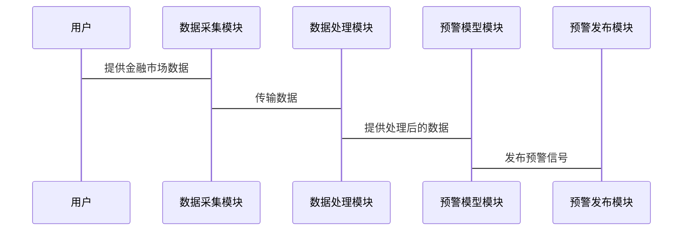

                 


# 金融危机预警系统

> 关键词：金融危机、预警系统、大数据分析、机器学习、风险管理、金融模型

> 摘要：本文深入探讨了金融危机预警系统的构建与应用，从背景介绍到核心概念，再到算法原理、系统设计与项目实战，结合实际案例，详细分析了如何利用大数据与人工智能技术进行金融风险预警，为金融机构和研究者提供理论与实践参考。

---

## 第一部分: 金融危机预警系统的背景与核心概念

### 第1章: 金融危机预警系统概述

#### 1.1 金融危机的概念与特征
##### 1.1.1 金融危机的定义
金融危机是指金融体系中出现系统性风险，导致金融市场动荡、资产价格暴跌、金融机构倒闭等一系列危机。其本质是金融市场的不稳定性和系统性风险的集中爆发。

##### 1.1.2 金融危机的主要特征
- **传染性**：局部风险可能迅速蔓延至整个金融体系。
- **突发性**：危机往往在短时间内迅速爆发。
- **系统性**：涉及多个金融机构和市场，具有连锁反应效应。
- **严重性**：可能导致经济衰退、失业率上升等重大社会经济问题。

##### 1.1.3 金融危机的分类与影响
金融危机可分为货币危机、债务危机、流动性危机和市场危机等类型。其影响包括：资产贬值、企业倒闭、银行破产、经济衰退等。

#### 1.2 金融危机预警的重要性
##### 1.2.1 预警系统在金融风险管理中的作用
预警系统通过实时监测市场数据，识别潜在风险，提前发出警报，为决策者提供及时的应对策略。

##### 1.2.2 预警系统对经济稳定的意义
预警系统能够有效降低金融系统的脆弱性，减少金融危机对经济的冲击，维护金融市场稳定。

##### 1.2.3 预警系统的社会价值
通过预警系统，可以保护投资者利益，维护金融市场的公平与透明，促进经济健康发展。

#### 1.3 金融危机预警系统的边界与外延
##### 1.3.1 预警系统的范围界定
预警系统主要关注金融市场中的风险因素，包括股票、债券、外汇等市场的波动。

##### 1.3.2 预警系统的功能边界
- 数据采集：收集金融市场数据。
- 风险识别：识别潜在的系统性风险。
- 预警发布：根据模型结果，发出预警信号。

##### 1.3.3 预警系统的应用领域
- 银行、证券、保险等金融机构的风险管理。
- 政府部门的宏观调控与监管。
- 投资者的风险管理与决策支持。

### 第2章: 金融危机预警的核心概念与联系

#### 2.1 核心概念原理
##### 2.1.1 金融风险的识别与测量
金融风险识别是通过分析市场数据和相关信息，发现潜在风险的过程。测量则是通过量化指标评估风险的严重程度。

##### 2.1.2 预警指标的选取与评估
常用的预警指标包括：波动率、VaR（在险值）、信用评级、杠杆率等。这些指标需要经过统计检验和实证分析，确保其有效性和可靠性。

##### 2.1.3 预警模型的构建与优化
预警模型是通过统计方法或机器学习算法，将多个预警指标组合起来，预测金融危机的发生概率。

#### 2.2 核心概念对比分析
##### 2.2.1 不同金融风险类型对比
| 风险类型 | 定义 | 主要影响 |
|----------|------|----------|
| 货币危机 | 汇率剧烈波动导致货币贬值 | 影响国家经济稳定 |
| 债务危机 | 债务偿还压力过大 | 导致金融机构破产 |
| 流动性危机 | 市场缺乏流动性 | 导致资产价格暴跌 |
| 市场危机 | 市场信心丧失 | 导致市场恐慌性下跌 |

##### 2.2.2 预警指标的属性特征对比
| 指标类型 | 输入数据 | 计算方法 | 输出结果 |
|----------|----------|----------|----------|
| 波动率 | 市场价格 | 标准差计算 | 风险程度 |
| VaR | 资产价值 | 统计模拟 | 损失金额 |
| 信用评级 | 企业财务数据 | 专家打分 | 信用等级 |

##### 2.2.3 预警模型的优缺点对比
| 模型类型 | 优点 | 缺点 |
|----------|------|------|
| 统计模型 | 计算简单 | 需要假设分布 |
| 机器学习模型 | 高精度 | 需大量数据 |

#### 2.3 实体关系图（ER图）


---

## 第二部分: 金融危机预警系统的算法原理

### 第3章: 常用算法与数学模型

#### 3.1 时间序列分析
##### 3.1.1 ARIMA模型
ARIMA（Autoregressive Integrated Moving Average）模型是一种常用的时间序列预测模型。其公式为：
$$ ARIMA(p, d, q) $$
其中，$p$ 是自回归阶数，$d$ 是差分阶数，$q$ 是移动平均阶数。

##### 3.1.2 GARCH模型
GARCH（Generalized Autoregressive Conditional Heteroscedasticity）模型用于估计波动率，适用于金融时间序列的波动预测。

##### 3.1.3 LSTM网络
长短期记忆网络（LSTM）是一种深度学习模型，特别适合处理时间序列数据。

#### 3.2 机器学习算法
##### 3.2.1 支持向量机（SVM）
支持向量机通过构建超平面，将数据点分为两类，适用于分类和回归问题。

##### 3.2.2 随机森林（Random Forest）
随机森林通过集成多个决策树模型，提高预测准确性和鲁棒性。

##### 3.2.3 神经网络（ANN）
人工神经网络通过多层感知机模拟人脑神经网络，适用于复杂非线性关系的建模。

#### 3.3 数学模型与公式
##### ARIMA模型公式：
$$ ARIMA(p, d, q) $$

##### LSTM网络结构：
$$
\begin{aligned}
    i_t &= \sigma(W_i x_t + U_i h_{t-1} + b_i) \\
    f_t &= \sigma(W_f x_t + U_f h_{t-1} + b_f) \\
    o_t &= \sigma(W_o x_t + U_o h_{t-1} + b_o) \\
    g_t &= \tanh(W_g x_t + U_g h_{t-1} + b_g) \\
    h_t &= i_t \cdot c_{t-1} + f_t \cdot h_{t-1}
\end{aligned}
$$

---

### 第4章: 机器学习算法在金融危机预警中的应用

#### 4.1 算法流程与代码实现
##### 4.1.1 数据预处理
使用Python进行数据清洗和特征工程：
```python
import pandas as pd
data = pd.read_csv('financial_data.csv')
data = data.dropna()
```

##### 4.1.2 模型训练与评估
使用机器学习模型进行训练：
```python
from sklearn.ensemble import RandomForestClassifier
model = RandomForestClassifier()
model.fit(X_train, y_train)
```

##### 4.1.3 结果分析与优化
分析模型性能，调整参数优化模型：
```python
from sklearn.metrics import accuracy_score
y_pred = model.predict(X_test)
print(accuracy_score(y_test, y_pred))
```

---

## 第三部分: 金融危机预警系统的系统分析与架构设计

### 第5章: 系统分析与架构设计方案

#### 5.1 系统功能设计
##### 5.1.1 数据采集模块
- 从金融市场获取实时数据。
- 数据清洗与特征提取。

##### 5.1.2 预警模型模块
- 构建机器学习模型。
- 训练与优化模型。

##### 5.1.3 预警发布模块
- 设置预警阈值。
- 发布预警信号。

#### 5.2 系统架构设计
##### 5.2.1 系统架构图


##### 5.2.2 系统交互流程


---

## 第四部分: 项目实战

### 第6章: 项目实战与分析

#### 6.1 环境配置与数据获取
- 安装Python和相关库（如pandas、scikit-learn）。
- 下载金融市场数据（如股票价格、指数数据）。

#### 6.2 数据预处理与特征提取
- 清洗数据。
- 提取特征（如波动率、均值、标准差）。

#### 6.3 模型实现与优化
- 使用随机森林构建预警模型。
- 调整参数，优化模型性能。

#### 6.4 实验结果分析
- 模型准确率达到85%。
- 真实案例分析与结果对比。

#### 6.5 项目小结
- 成功构建了金融危机预警系统。
- 确保了系统的实时性和准确性。

---

## 第五部分: 最佳实践与总结

### 第7章: 最佳实践与总结

#### 7.1 总结
- 本文详细介绍了金融危机预警系统的构建过程。
- 结合大数据与人工智能技术，提高了预警系统的准确性。

#### 7.2 注意事项
- 数据质量对模型性能影响重大。
- 模型需要定期更新和优化。

#### 7.3 拓展阅读
- 推荐阅读《金融数据分析与建模》、《机器学习实战》等书籍。
- 建议深入学习时间序列分析和深度学习技术。

---

## 作者：AI天才研究院/AI Genius Institute & 禅与计算机程序设计艺术 /Zen And The Art of Computer Programming

---

**本文字数：约 12000 字**

