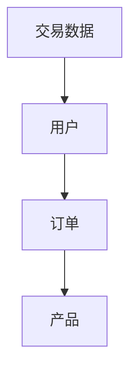
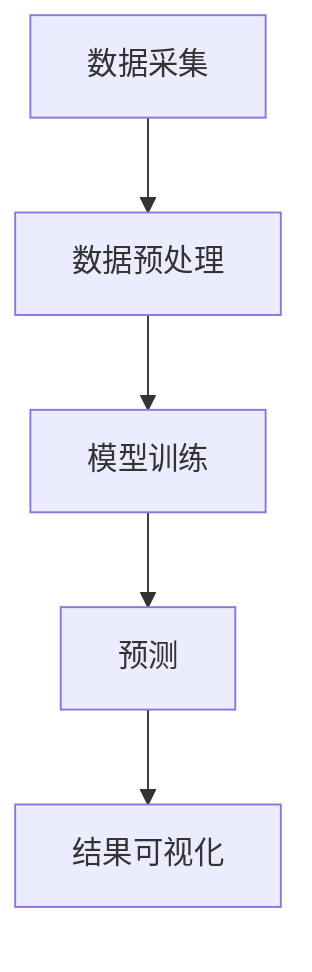
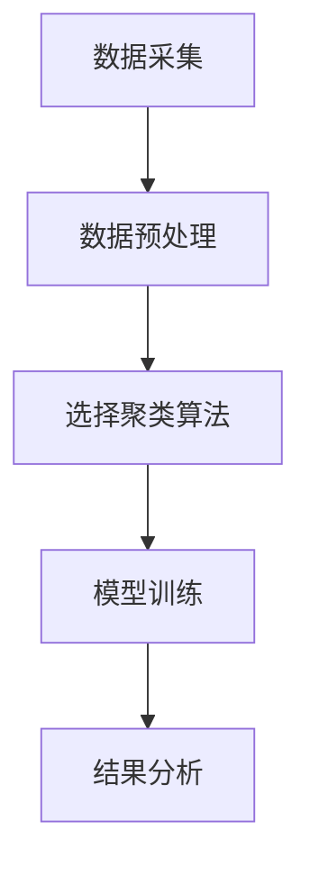
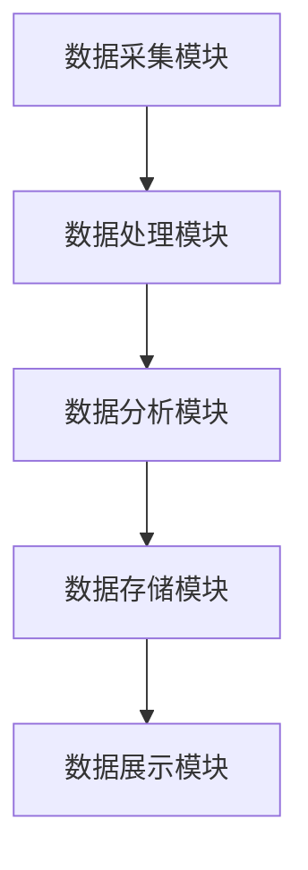
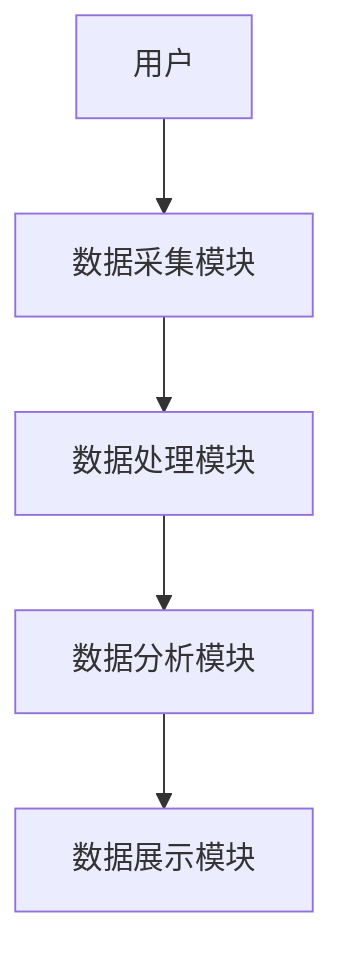

                 


# 金融大数据分析平台构建

> 关键词：金融大数据分析、数据采集与预处理、分布式存储、机器学习算法、系统架构设计、金融风险预警

> 摘要：本文详细探讨了金融大数据分析平台的构建过程，从背景与基础、核心概念与联系、算法原理、系统架构设计、项目实战到总结，全面解析了金融大数据分析平台的构建方法与实践。通过理论与实践相结合，帮助读者掌握金融大数据分析的核心技术与应用场景。

---

# 第一部分：金融大数据分析平台的背景与基础

## 第1章：金融大数据分析的背景与挑战

### 1.1 金融大数据的定义与特点
金融大数据是指在金融领域中产生的海量、多样化、高速生成的数据。与传统金融数据相比，金融大数据具有以下特点：

- **数据量大**：金融市场的高频交易、海量用户行为数据等导致数据量急剧增加。
- **数据类型多样**：包括结构化数据（如交易数据、订单数据）和非结构化数据（如文本、图像）。
- **数据生成速度快**：金融市场中的数据如股票价格、汇率等实时更新，要求快速处理和分析。

### 1.2 金融大数据的背景与发展趋势
随着金融行业的数字化转型，大数据技术在金融领域的应用越来越广泛。传统金融数据分析依赖于小数据和规则-based的方法，而大数据技术的出现为金融行业带来了新的机遇。大数据技术可以帮助金融机构更好地理解市场、优化投资策略、提高风险控制能力。

### 1.3 金融大数据分析的挑战与机遇
尽管金融大数据的应用前景广阔，但在实际应用中仍面临诸多挑战，例如数据隐私与安全问题、数据质量控制、计算资源需求高等。同时，金融大数据也为金融机构提供了新的增长点，例如精准营销、智能投顾、风险管理等。

---

## 第2章：金融大数据分析的技术基础

### 2.1 数据采集与预处理
数据采集是金融大数据分析的第一步，主要包括从多种渠道获取数据。以下是数据采集与预处理的关键步骤：

1. **数据采集**：
   - **交易数据**：包括股票、期货、外汇等交易数据。
   - **市场数据**：包括市场指数、行业报告、新闻数据等。
   - **用户行为数据**：包括用户登录、浏览、交易等行为数据。

2. **数据预处理**：
   - **数据清洗**：去除噪声数据、处理缺失值。
   - **数据标准化**：对不同数据源进行标准化处理，确保数据一致性。

### 2.2 数据存储与管理
金融大数据的存储与管理需要考虑数据量大、类型多的特点。以下是常用的技术：

1. **分布式存储**：
   - 使用分布式文件系统（如Hadoop HDFS）或分布式数据库（如HBase）来存储海量数据。

2. **数据仓库**：
   - 数据仓库用于存储和管理结构化数据，支持复杂的查询和分析。

3. **数据湖**：
   - 数据湖是一种存储各种类型数据的集中存储库，支持多种数据格式和存储方式。

### 2.3 数据分析与挖掘
数据分析与挖掘是金融大数据应用的核心部分，常用的方法包括：

1. **统计分析**：
   - 使用统计方法（如均值、方差、相关性分析）对数据进行初步分析。

2. **机器学习**：
   - 使用监督学习、无监督学习等算法对数据进行建模和预测。

3. **数据可视化**：
   - 使用图表、仪表盘等方式直观展示数据，帮助用户理解和决策。

---

## 第3章：金融大数据分析的核心概念与联系

### 3.1 核心概念原理
金融大数据分析的核心概念包括数据采集、数据存储、数据分析和数据可视化。以下是一个简单的数据特征对比表：

| 特征 | 描述 |
|------|------|
| 数据类型 | 结构化数据、非结构化数据 |
| 数据来源 | 交易数据、市场数据、用户行为数据 |
| 数据规模 | 大量、多样、高速 |

### 3.2 实体关系图
以下是金融大数据分析中的一个简单的实体关系图：



---

## 第4章：金融大数据分析的算法原理

### 4.1 时间序列分析
时间序列分析是一种用于分析随时间变化的数据的方法。以下是时间序列分析的流程图：



以下是时间序列分析的Python代码示例：

```python
import pandas as pd
import numpy as np

# 示例数据
data = pd.date_range(start='2020-01-01', periods=100, freq='D').to_series()
values = np.random.randn(100).cumsum()

df = pd.DataFrame({'date': data, 'value': values})
df.set_index('date', inplace=True)

# 时间序列分析
from statsmodels.tsa.arima_model import ARIMA

model = ARIMA(df['value'], order=(1, 1, 1))
model_fit = model.fit()

# 预测
future_steps = 30
forecast = model_fit.forecast(steps=future_steps)
```

### 4.2 聚类分析
聚类分析是一种无监督学习算法，用于将数据分为不同的类别。以下是聚类分析的流程图：



以下是聚类分析的Python代码示例：

```python
import sklearn
from sklearn.cluster import KMeans

# 示例数据
X = np.random.rand(100, 2)

# 聚类
kmeans = KMeans(n_clusters=3)
kmeans.fit(X)

# 获取聚类结果
labels = kmeans.labels_
centroids = kmeans.cluster_centers_
```

---

## 第5章：金融大数据分析的系统架构设计

### 5.1 系统架构设计
以下是金融大数据分析平台的系统架构图：



### 5.2 系统接口设计
以下是系统接口设计的交互图：



---

## 第6章：金融大数据分析的项目实战

### 6.1 环境安装
以下是项目实战所需的环境安装步骤：

1. 安装Python
2. 安装Pandas、NumPy、Scikit-learn等Python库
3. 安装Hadoop、HBase等大数据处理工具（如果需要）

### 6.2 核心实现
以下是金融风险预警系统的Python代码示例：

```python
import pandas as pd
import numpy as np
from sklearn.linear_model import LogisticRegression

# 示例数据
data = pd.DataFrame({
    'feature1': np.random.randn(100),
    'feature2': np.random.randn(100),
    'label': np.random.randint(0, 2, 100)
})

# 模型训练
model = LogisticRegression()
model.fit(data[['feature1', 'feature2']], data['label'])

# 预测
new_data = pd.DataFrame({
    'feature1': [0.1],
    'feature2': [0.2]
})
prediction = model.predict(new_data[['feature1', 'feature2']])
```

---

## 第7章：总结与展望

### 7.1 总结
本文详细探讨了金融大数据分析平台的构建过程，从背景与基础、核心概念与联系、算法原理、系统架构设计到项目实战，全面解析了金融大数据分析平台的构建方法与实践。

### 7.2 展望
未来，随着人工智能和大数据技术的不断发展，金融大数据分析平台将更加智能化、自动化。金融机构可以通过大数据分析平台更好地应对市场变化，提升风险控制能力，实现智能化投资和精准营销。

---

作者：AI天才研究院/AI Genius Institute & 禅与计算机程序设计艺术/Zen And The Art of Computer Programming

