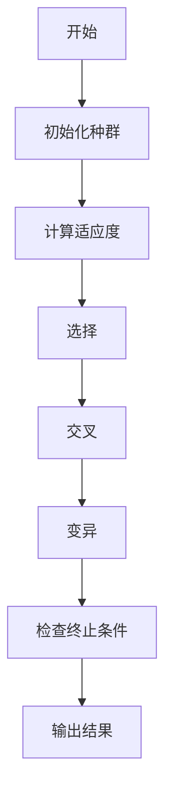
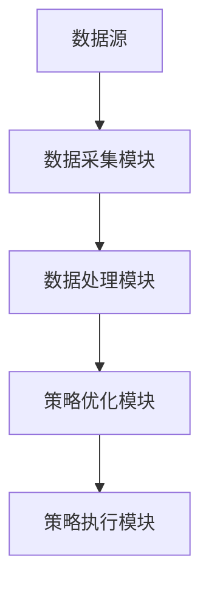
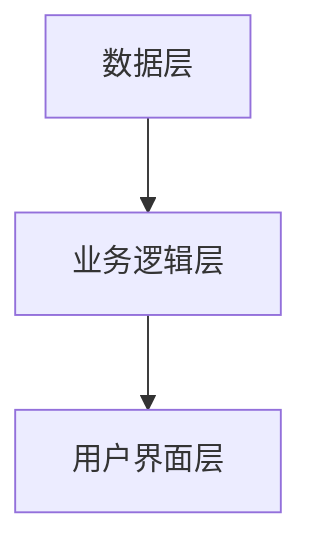

                 


# 金融市场做市商策略优化

---

## 关键词：
金融市场、做市商、策略优化、算法、数学模型、系统架构、案例分析

---

## 摘要：
本文详细探讨了金融市场中做市商策略优化的核心概念、算法实现及系统架构。从做市商的基本概念出发，分析了优化策略的必要性，并通过数学模型和算法（如遗传算法、时间序列分析）详细讲解了优化方法。同时，本文提供了系统的架构设计、接口设计及实际案例分析，帮助读者全面理解并应用这些优化策略。

---

## 第1章：金融市场做市商概述

### 1.1 做市商的基本概念与角色

做市商（Market Maker）是金融市场中的重要参与者，负责提供连续的买卖报价，维持市场的流动性。他们的主要角色包括：

- 提供买卖报价，促进交易
- 维持市场深度，确保市场稳定性
- 作为市场流动性提供者，连接买方和卖方

**图1-1：做市商在市场中的角色**


---

### 1.2 做市商的市场参与方式

做市商主要通过订单簿（Order Book）参与市场，订单簿记录了当前市场上的所有待成交订单。做市商的报价策略直接影响市场深度和买卖价差。

- **订单簿分析**：做市商需要实时监控订单簿的变化，分析市场供需情况。
- **买卖价差管理**：做市商通过调整买卖价差来优化收益。

---

### 1.3 做市商策略优化的必要性

在竞争激烈的金融市场中，优化做市商策略至关重要。优化目标包括：

- **最大化收益**：通过优化买卖价差和订单量，提高利润。
- **风险控制**：降低市场波动带来的风险。
- **提高流动性**：通过优化报价策略，吸引更多交易量。

---

## 第2章：做市商策略优化的核心概念

### 2.1 做市商策略优化的定义

策略优化是指通过数学模型和算法，调整做市商的报价策略，以实现特定目标（如最大化收益、最小化风险）。

- **目标函数**：定义优化目标，如最大化利润。
- **约束条件**：包括市场规则、交易成本等。

---

### 2.2 做市商策略优化的关键要素

优化策略涉及多个关键要素：

- **市场深度分析**：分析当前市场深度，调整订单量。
- **价格预测模型**：基于历史数据预测未来价格。
- **风险控制机制**：设定止损点，避免重大损失。

---

### 2.3 做市商策略优化的数学模型

常用的数学模型包括：

- **线性回归模型**：用于预测价格趋势。
- **时间序列分析**：分析价格波动的周期性。
- **马尔可夫链模型**：建模市场状态转移。

---

## 第3章：做市商策略优化的算法实现

### 3.1 基于遗传算法的策略优化

遗传算法（Genetic Algorithm，GA）是一种强大的优化工具，适用于复杂的金融市场环境。

- **算法步骤**：
  1. 初始化种群。
  2. 计算适应度。
  3. 选择、交叉、变异。
  4. 重复迭代。

**图3-1：遗传算法流程图**



---

### 3.2 基于时间序列分析的优化

时间序列分析用于预测价格波动，帮助做市商调整报价策略。

- **ARIMA模型**：自回归积分滑动模型，用于预测未来价格。
- **GARCH模型**：广义自回归条件异方差模型，用于估计波动性。

---

## 第4章：做市商策略优化的系统架构

### 4.1 系统功能模块划分

优化系统通常包括以下模块：

- **数据采集模块**：实时采集市场数据。
- **数据处理模块**：清洗和预处理数据。
- **策略优化模块**：应用算法优化策略。
- **策略执行模块**：执行优化后的策略。

**图4-1：系统功能模块**



---

### 4.2 系统架构设计

采用分层架构，各层功能明确：

- **数据层**：存储和管理市场数据。
- **业务逻辑层**：处理优化策略。
- **用户界面层**：展示优化结果。

**图4-2：系统架构图**



---

## 第5章：项目实战与案例分析

### 5.1 环境安装与配置

- **工具安装**：安装Python、NumPy、Pandas等库。
- **数据获取**：使用API获取市场数据。

### 5.2 核心代码实现

以下是一个简单的遗传算法实现代码：

```python
import random

def fitness(individual):
    # 计算适应度，此处简化为收益
    return sum(individual)

def mutate(individual):
    # 突变操作
    pos = random.randint(0, len(individual)-1)
    individual[pos] = 1 - individual[pos]
    return individual

def crossover(parent1, parent2):
    # 单点交叉
    point = random.randint(1, len(parent1)-1)
    child1 = parent1[:point] + parent2[point:]
    child2 = parent2[:point] + parent1[point:]
    return child1, child2

class GA:
    def __init__(self, population_size, individual_length):
        self.population = [random.choices([0,1], k=individual_length) for _ in range(population_size)]
    
    def evolve(self, generations):
        for _ in range(generations):
            fitness_scores = [fitness(ind) for ind in self.population]
            # 选择
            selected = [ind for ind, score in sorted(zip(self.population, fitness_scores), key=lambda x: -x[1])[:int(len(self.population)/2)]]
            # 交叉与变异
            new_population = []
            for i in range(0, len(selected), 2):
                p1 = selected[i]
                p2 = selected[i+1]
                child1, child2 = crossover(p1, p2)
                child1 = mutate(child1)
                child2 = mutate(child2)
                new_population.append(child1)
                new_population.append(child2)
            self.population = new_population
```

---

## 第6章：最佳实践与总结

### 6.1 最佳实践

- **数据质量**：确保数据准确、及时。
- **模型选择**：根据实际情况选择合适的算法。
- **风险控制**：设定止损点，避免过度波动。

### 6.2 小结

本文详细探讨了做市商策略优化的核心概念、算法实现及系统架构。通过理论分析和实际案例，帮助读者掌握优化策略的关键点。

---

## 作者

作者：AI天才研究院 & 禅与计算机程序设计艺术

