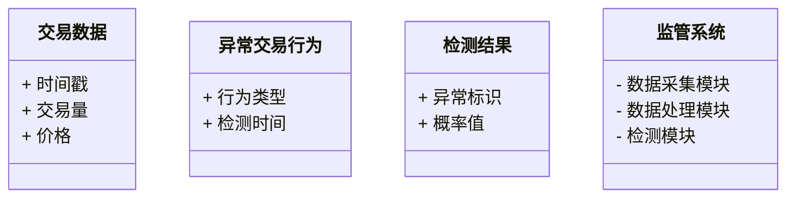

                 


# 金融市场异常交易检测系统

## 关键词：异常交易检测，金融市场，机器学习，统计方法，系统架构

## 摘要：
金融市场异常交易检测系统是维护市场公平和保护投资者利益的重要工具。本文系统地介绍了异常交易检测的核心概念、算法原理、系统架构和项目实战。通过对比统计方法和机器学习方法，详细讲解了马尔可夫链和LSTM网络的实现，并结合实际案例展示了系统的应用场景。本文还提供了系统设计的架构图和代码实现，帮助读者全面理解和掌握金融市场异常交易检测系统的设计与实现。

---

# 第一部分：金融市场异常交易检测系统背景与概念

## 第1章：异常交易检测的背景与问题

### 1.1 金融市场概述

#### 1.1.1 金融市场的基本概念
金融市场是资金流动和资产交易的主要场所，包括股票、债券、期货等多种金融工具。市场参与者包括投资者、机构、监管机构等。

#### 1.1.2 金融市场的参与者
- 投资者：个人或机构，通过买卖资产获取收益。
- 金融机构：银行、证券公司等，提供金融服务。
- 监管机构：如证监会，负责市场秩序和合规性。

#### 1.1.3 金融市场的重要性与风险
金融市场对经济发展至关重要，但也存在波动性和风险，如市场操纵、内幕交易等。

### 1.2 异常交易的定义与类型

#### 1.2.1 异常交易的定义
异常交易指违背市场规律，影响市场公平的交易行为，如操纵股价、洗盘等。

#### 1.2.2 市场操纵、内幕交易等异常行为
- 市场操纵：通过虚假交易或散布信息影响市场价格。
- 内幕交易：利用未公开信息进行交易，违反公平原则。

#### 1.2.3 异常交易的危害与影响
- 破坏市场公平，损害投资者利益。
- 影响市场稳定性，引发系统性风险。

### 1.3 异常交易检测的必要性

#### 1.3.1 保护投资者利益
通过检测异常交易，保护中小投资者不被操纵行为侵害。

#### 1.3.2 维护市场公平与秩序
确保市场透明，促进公平竞争。

#### 1.3.3 监管机构的职责与挑战
监管机构需及时发现和处理异常交易，但面临数据量大、行为隐蔽等挑战。

### 1.4 本章小结
本章介绍了金融市场的基本概念和异常交易的定义、类型及其危害，强调了检测异常交易的必要性。

---

# 第二部分：异常交易检测的核心概念与联系

## 第2章：异常交易检测的核心原理

### 2.1 异常交易检测的核心概念

#### 2.1.1 统计异常检测方法
基于统计学的异常检测方法，如均值-标准差法、马尔可夫链模型等。

#### 2.1.2 基于机器学习的异常检测
利用机器学习算法，如LSTM、随机森林等，识别复杂模式。

#### 2.1.3 时间序列分析方法
通过分析时间序列数据的波动性，识别异常交易。

### 2.2 异常交易检测的主要方法对比

#### 2.2.1 统计方法与机器学习方法的对比
| 方法 | 统计方法 | 机器学习方法 |
|------|----------|-------------|
| 优势 | 计算简单，易于解释 | 能处理复杂模式，适应性强 |
| 劣势 | 需假设数据分布，鲁棒性差 | 需大量数据，计算复杂 |

### 2.3 异常交易检测的实体关系图

```mermaid
er
actor: 监管机构
actor: 投资者
actor: 交易系统
class: 交易数据
class: 异常交易行为
class: 检测结果
```

### 2.4 本章小结
本章对比了统计方法和机器学习方法的优缺点，并通过ER图展示了异常交易检测的实体关系。

---

# 第三部分：异常交易检测的算法原理

## 第3章：基于统计的异常检测算法

### 3.1 马尔可夫链模型

#### 3.1.1 马尔可夫链的基本原理
马尔可夫链是一种描述系统状态转移的模型，假设当前状态仅依赖于前一状态。

#### 3.1.2 马尔可夫链的应用
用于分析交易行为的序列，识别异常状态转移。

#### 3.1.3 马尔可夫链的状态转移概率公式
$$ P(s_{t+1}=j | s_t=i) = \frac{C_{ij}}{\sum_{k} C_{ik}} $$
其中，$C_{ij}$表示从状态i转移到状态j的次数。

### 3.2 LSTM网络

#### 3.2.1 LSTM的基本结构
LSTM通过记忆单元和门控机制，捕捉时间序列中的长期依赖关系。

#### 3.2.2 LSTM在异常检测中的应用
用于识别时间序列中的异常波动。

#### 3.2.3 LSTM的数学模型
$$ f_t = \sigma(W_f x_t + U_f h_{t-1}) $$
其中，$f_t$是遗忘门，$\sigma$是sigmoid函数。

---

# 第四部分：系统分析与架构设计

## 第4章：系统功能设计与架构

### 4.1 问题场景介绍
- 高频交易监控
- 市场操纵检测

### 4.2 系统功能设计



### 4.3 系统架构设计


### 4.4 系统接口设计
- 数据接口：从交易系统获取实时数据。
- 检测接口：调用异常检测模块进行分析。
- 展示接口：将结果展示给监管机构。

### 4.5 本章小结
本章详细设计了系统的功能模块和架构，展示了各组件的交互关系。

---

# 第五部分：项目实战

## 第5章：异常交易检测系统实现

### 5.1 环境安装
- Python 3.8+
- NumPy、Pandas、Keras等库。

### 5.2 核心代码实现

#### 数据预处理
```python
import numpy as np
import pandas as pd

# 加载数据
data = pd.read_csv('交易数据.csv')

# 数据清洗
data.dropna(inplace=True)
data = data[['时间戳', '价格', '交易量']]
```

#### 特征提取
```python
# 计算波动率
data['波动率'] = data['价格'].diff().abs().rolling(5).mean()
```

#### 模型训练
```python
from keras.models import Sequential
from keras.layers import LSTM, Dense

model = Sequential()
model.add(LSTM(64, input_shape=(None, 2)))
model.add(Dense(1, activation='sigmoid'))
model.compile(loss='binary_crossentropy', optimizer='adam')
model.fit(X_train, y_train, epochs=10)
```

### 5.3 实际案例分析
分析某次市场操纵事件，展示系统如何识别异常行为。

### 5.4 项目小结
总结项目实现的关键点和经验教训，强调数据质量和模型调优的重要性。

---

# 第六部分：最佳实践与总结

## 第6章：最佳实践与系统优化

### 6.1 最佳实践

#### 数据质量
- 确保数据的完整性和准确性。
- 处理缺失值和异常值。

#### 模型调优
- 使用交叉验证优化参数。
- 调整模型结构以适应数据特性。

#### 系统扩展性
- 使用分布式架构处理大规模数据。
- 集成多种算法提高检测精度。

### 6.2 本章小结
总结全文，强调系统设计的要点和未来的研究方向。

---

# 作者

作者：AI天才研究院/AI Genius Institute & 禅与计算机程序设计艺术/Zen And The Art of Computer Programming

