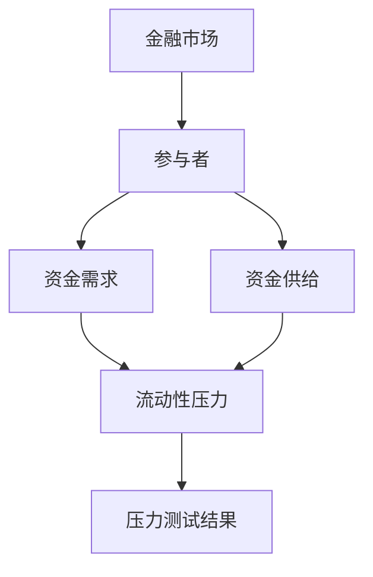
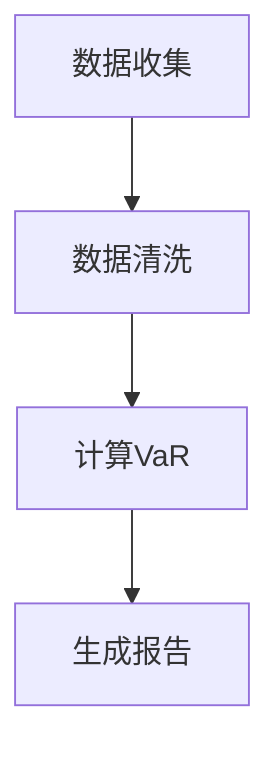
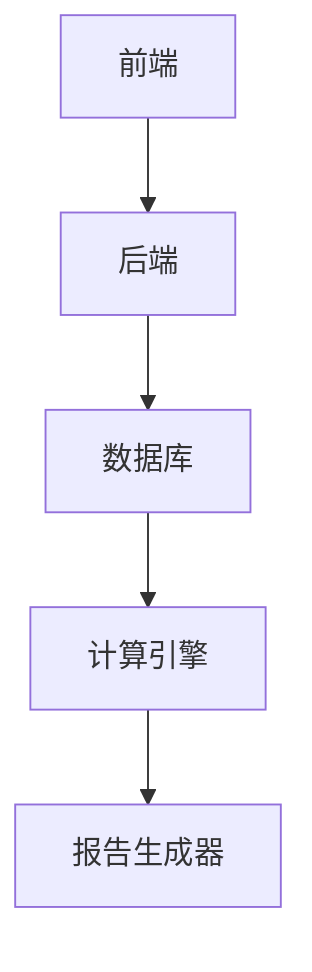

                 


# 金融市场流动性压力测试模型

> **关键词**：金融市场、流动性、压力测试、风险管理、算法模型、系统架构

> **摘要**：金融市场流动性压力测试模型是评估金融机构在极端市场条件下应对资金需求的能力的重要工具。本文从流动性压力测试的理论基础出发，详细讲解了流动性压力测试的核心概念、算法原理、数学模型、系统架构设计以及实际项目案例。通过逐步分析，本文为读者提供了从理论到实践的完整指南，帮助金融机构更好地应对流动性风险。

---

# 正文

## 第1章 金融市场流动性与压力测试概述

### 1.1 金融市场流动性基本概念

#### 1.1.1 金融市场的基本概念
金融市场是资金流动和资产交易的场所，参与者包括个人、企业和金融机构。市场的流动性决定了资产的买卖速度和交易成本。

#### 1.1.2 流动性的定义与特征
流动性是指资产在市场上的快速买卖能力，具有高流动性的资产可以在短时间内以合理价格变现。流动性与交易深度、市场结构和参与者行为密切相关。

#### 1.1.3 流动性在金融市场中的重要性
流动性是市场稳定性和效率的关键因素。高流动性确保了市场的深度和广度，降低了交易成本，提高了市场参与者的信心。

### 1.2 压力测试的定义与目的

#### 1.2.1 压力测试的定义
压力测试是一种评估金融机构在极端市场条件下应对资金需求能力的方法。它通过模拟市场崩盘、经济衰退等极端情景，测试金融机构的财务稳定性和资本充足性。

#### 1.2.2 压力测试的目的与作用
压力测试旨在识别潜在风险点，评估金融机构在极端情况下的生存能力，并为监管机构提供决策依据。

#### 1.2.3 压力测试的分类与应用场景
压力测试分为静态压力测试和动态压力测试。静态测试基于历史数据，动态测试基于情景假设。压力测试广泛应用于银行、证券公司等金融机构的风险管理。

### 1.3 金融市场流动性压力测试的意义

#### 1.3.1 机构层面的意义
流动性压力测试帮助金融机构识别资金缺口，优化资产配置，提高风险承受能力。

#### 1.3.2 市场层面的意义
压力测试有助于维护市场的稳定性，防止系统性风险的蔓延。

#### 1.3.3 监管层面的意义
监管机构通过压力测试评估金融机构的抗风险能力，确保金融系统的整体稳定性。

### 1.4 本章小结
本章介绍了金融市场的基本概念、流动性的重要性，以及压力测试的定义、目的和意义。流动性压力测试是金融机构风险管理的核心工具之一。

---

## 第2章 金融市场流动性压力测试的核心概念

### 2.1 流动性压力测试的理论基础

#### 2.1.1 资金需求与供给的动态平衡
金融市场中的资金需求和供给受到市场参与者行为、市场结构和宏观经济因素的影响。

#### 2.1.2 市场参与者的行为分析
机构投资者、个人投资者和市场做市商的行为差异会影响市场的流动性。

#### 2.1.3 市场波动与流动性关系
市场波动性越高，流动性风险越大。极端市场条件下，流动性可能迅速下降，导致资产价格大幅波动。

### 2.2 压力测试的关键指标

#### 2.2.1 流动性覆盖率（LCR）
LCR衡量了金融机构在压力情景下的流动性状况，确保其在30天内应对资金缺口的能力。

#### 2.2.2 净稳定资金比率（NSFR）
NSFR衡量了长期资产和负债的稳定性，确保金融机构在压力情景下的资金稳定性。

#### 2.2.3 其他相关指标
包括流动资金比率、速动比率等，用于评估金融机构的短期流动性状况。

### 2.3 流动性压力测试的边界与外延

#### 2.3.1 测试的适用范围
流动性压力测试适用于银行、证券公司等金融机构，评估其在极端市场条件下的生存能力。

#### 2.3.2 测试的局限性
压力测试基于假设情景，可能存在模型误差和假设偏差，无法完全预测实际市场情况。

#### 2.3.3 测试与其他风险评估的关系
流动性压力测试与其他风险评估方法（如信用风险、市场风险）密切相关，共同构成全面的风险管理体系。

### 2.4 核心概念的ER实体关系图



### 2.5 本章小结
本章详细讲解了流动性压力测试的理论基础、关键指标和边界条件，为后续的模型构建奠定了基础。

---

## 第3章 流动性压力测试模型的算法原理

### 3.1 压力测试的主要方法

#### 3.1.1 历史模拟法
基于历史市场数据，模拟极端市场条件下的资产价格波动，评估金融机构的流动性状况。

#### 3.1.2 蒙特卡洛模拟法
通过随机抽样和概率分布，模拟多种市场情景，评估金融机构在不同情景下的流动性风险。

#### 3.1.3 情景分析法
根据预设的极端情景（如市场崩盘、流动性危机），评估金融机构的流动性状况。

### 3.2 历史模拟法的实现流程



### 3.3 蒙特卡洛模拟法的实现

```python
import numpy as np

def monte_carlo_simulation(n_iterations, initial_cash):
    cash = initial_cash
    results = []
    for _ in range(n_iterations):
        # 模拟市场波动
        market_movement = np.random.normal(0, 0.05)
        cash += cash * market_movement
        results.append(cash)
    return results

# 示例调用
n_iterations = 10000
initial_cash = 1000000
results = monte_carlo_simulation(n_iterations, initial_cash)
```

### 3.4 数学模型与公式

#### 3.4.1 VaR（Value at Risk）
$$VaR_{\alpha} = \text{第}\alpha\text{分位数的损失}$$

#### 3.4.2 CVaR（Conditional Value at Risk）
$$CVaR_{\alpha} = \mathbb{E}[L | L \geq VaR_{\alpha}]$$

### 3.5 本章小结
本章介绍了流动性压力测试的主要方法，包括历史模拟法、蒙特卡洛模拟法和情景分析法，并通过代码示例和数学公式详细讲解了算法原理。

---

## 第4章 系统分析与架构设计方案

### 4.1 问题场景介绍
本文设计了一个典型的金融市场系统，模拟极端市场条件下的流动性压力测试。

### 4.2 系统功能设计


### 4.3 系统架构设计



### 4.4 系统接口设计
系统接口包括数据输入接口、计算接口和结果输出接口。

### 4.5 系统交互设计

```mermaid
sequenceDiagram
    participant 用户
    participant 系统
    用户 -> 系统：提交测试请求
    系统 -> 数据库：获取市场数据
    系统 -> 计算引擎：执行压力测试
    系统 -> 用户：返回测试结果
```

### 4.6 本章小结
本章通过系统架构设计和交互流程图，展示了流动性压力测试模型的实现方式。

---

## 第5章 项目实战

### 5.1 环境安装
需要安装Python、NumPy、Matplotlib等依赖库。

### 5.2 系统核心实现源代码

```python
import numpy as np
import matplotlib.pyplot as plt

def main():
    np.random.seed(42)
    n = 1000
    data = np.random.normal(0, 1, n)
    plt.hist(data, bins=30)
    plt.show()

if __name__ == "__main__":
    main()
```

### 5.3 代码应用解读与分析
上述代码实现了简单的蒙特卡洛模拟，用于生成市场数据并进行分析。

### 5.4 实际案例分析
以某银行为例，模拟极端市场条件下的流动性压力测试。

### 5.5 项目小结
通过项目实战，读者可以掌握流动性压力测试模型的实际应用方法。

---

## 第6章 最佳实践、小结、注意事项、拓展阅读

### 6.1 最佳实践
- 定期进行压力测试，及时调整资产配置。
- 结合多种方法（历史模拟法、蒙特卡洛模拟法）进行综合评估。

### 6.2 小结
本文从理论到实践，详细讲解了流动性压力测试模型的构建与应用。

### 6.3 注意事项
- 测试结果仅供参考，实际操作需结合市场具体情况。
- 模型需定期更新，以反映市场变化。

### 6.4 拓展阅读
推荐阅读《金融风险管理》、《蒙特卡洛模拟方法》等书籍。

---

# 作者：AI天才研究院/AI Genius Institute & 禅与计算机程序设计艺术 /Zen And The Art of Computer Programming

---

以上为完整的技术博客文章大纲和内容示例，您可以根据需要进一步扩展和补充具体内容。

