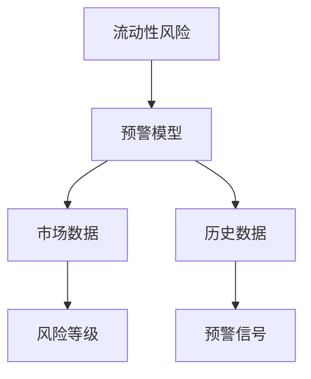
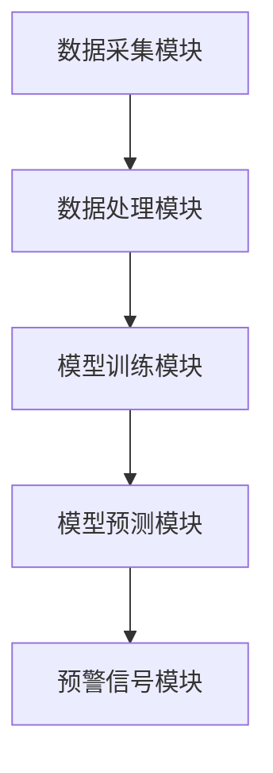

                 


# 金融市场流动性枯竭预警模型

> 关键词：金融市场，流动性，预警模型，算法，风险管理

> 摘要：本文提出了一种基于时间序列分析和机器学习算法的金融市场流动性枯竭预警模型。该模型通过分析市场数据，识别潜在的流动性风险，提前发出预警信号，帮助投资者和监管机构采取有效的风险管理措施。文章详细介绍了模型的构建过程，包括数据采集、算法选择、模型训练和结果分析。

---

# 第一部分: 金融市场流动性枯竭预警模型背景与概念

## 第1章: 金融市场流动性概述

### 1.1 金融市场流动性基本概念

#### 1.1.1 金融市场的基本概念
金融市场是资金流动和资产交易的场所，参与者包括投资者、金融机构、企业和政府等。金融市场的主要功能是资金的融通、价格发现和风险管理。流动性是金融市场的核心特征之一，表示资产能够迅速转化为现金而不遭受损失的能力。

#### 1.1.2 流动性的定义与内涵
流动性是指资产在市场中迅速以合理价格买卖的能力。高流动性意味着资产可以在短时间内以接近市价的价格卖出，低流动性则意味着买卖资产的难度较大，可能需要大幅折价才能成交。

#### 1.1.3 流动性在金融市场中的重要性
流动性是金融市场的生命线。高流动性保证了市场的稳定性和效率，使得投资者能够快速进出市场，避免因市场波动而遭受损失。流动性不足可能导致市场价格剧烈波动，甚至引发系统性风险。

---

### 1.2 金融市场流动性枯竭的定义与特征

#### 1.2.1 流动性枯竭的定义
流动性枯竭是指市场中资产无法以合理价格迅速变现的情况。此时，投资者可能被迫以远低于市场价的价格出售资产，导致市场恐慌和进一步的价格下跌。

#### 1.2.2 流动性枯竭的特征与表现
流动性枯竭通常表现为以下特征：
1. **交易量骤减**：市场参与者减少交易活动，导致成交额下降。
2. **价格波动剧烈**：资产价格可能出现大幅下跌或上涨，但成交额却很小。
3. **买卖价差扩大**：买价和卖价之间的差距显著增加，市场深度不足。
4. **市场参与者的恐慌情绪**：投资者信心下降，导致更多的抛售行为。

#### 1.2.3 流动性枯竭的形成机制
流动性枯竭的形成通常与市场参与者的行为、市场结构和外部环境密切相关。例如，投资者的恐慌性抛售、市场信息的不对称性、金融机构的杠杆操作等都可能导致流动性枯竭。

---

### 1.3 流动性枯竭的经济影响

#### 1.3.1 对金融市场稳定性的影响
流动性枯竭可能导致市场的剧烈波动，甚至引发金融危机。例如，2008年全球金融危机中，流动性枯竭是导致许多金融机构破产的重要原因之一。

#### 1.3.2 对投资者行为的影响
流动性枯竭会加剧投资者的恐慌情绪，导致更多的抛售行为，进一步加剧市场的流动性问题。这种恶性循环可能引发更多的市场崩盘。

#### 1.3.3 对金融监管政策的影响
流动性枯竭通常会促使监管机构加强市场监管，例如提高资本充足率、限制杠杆交易等。这些政策有助于缓解流动性问题，但也可能对市场流动性产生进一步的影响。

---

## 第2章: 金融市场流动性枯竭预警模型的必要性

### 2.1 金融市场风险预警的重要性

#### 2.1.1 金融市场风险的复杂性
金融市场风险具有复杂性和不确定性，往往难以通过简单的模型或指标进行预测。流动性风险尤其复杂，因为它受到市场参与者行为、市场结构和外部环境等多种因素的影响。

#### 2.1.2 风险预警在金融监管中的作用
通过建立流动性枯竭预警模型，监管机构可以及时发现潜在的流动性风险，采取措施防止问题的扩大化。预警模型还可以帮助投资者提前做好风险管理，减少潜在的损失。

#### 2.1.3 预警系统的社会经济效益
流动性枯竭预警系统可以为金融市场提供早期预警信号，帮助市场参与者采取有效的风险管理措施，从而减少金融危机的发生概率，保护投资者利益，维护金融市场的稳定。

---

### 2.2 流动性枯竭预警模型的提出

#### 2.2.1 流动性风险的隐蔽性
流动性风险在市场正常情况下可能不易察觉，但在市场波动加剧时可能迅速恶化。因此，建立一个能够实时监测和预警流动性风险的模型具有重要意义。

#### 2.2.2 建立预警模型的必要性
通过预警模型，可以对市场数据进行实时分析，识别潜在的流动性风险，及时发出预警信号。这有助于监管机构和投资者采取措施，避免流动性枯竭带来的负面影响。

#### 2.2.3 模型的目标与意义
预警模型的目标是通过分析市场数据，识别潜在的流动性风险，并发出预警信号。其意义在于帮助市场参与者提前做好风险管理，维护金融市场的稳定。

---

### 2.3 金融市场流动性枯竭预警模型的核心概念

#### 2.3.1 流动性风险的度量指标
流动性风险可以通过以下指标进行度量：
1. **买卖价差**：买价和卖价之间的差距。
2. **交易量**：市场成交的资产数量。
3. **市场深度**：市场中愿意以当前价格买卖资产的数量。
4. **波动率**：资产价格的波动程度。

#### 2.3.2 预警模型的基本原理
预警模型通过分析上述指标，识别潜在的流动性风险。当这些指标出现异常时，模型会发出预警信号。

#### 2.3.3 模型的输入与输出关系
模型的输入是市场数据（如价格、交易量等），输出是流动性风险等级（如正常、预警、危机等）。

---

## 第3章: 金融市场流动性枯竭预警模型的核心概念与联系

### 3.1 核心概念原理

#### 3.1.1 流动性风险的度量指标
流动性风险可以通过买卖价差、交易量、市场深度和波动率等指标进行度量。

#### 3.1.2 预警模型的基本原理
预警模型通过分析市场数据，识别潜在的流动性风险，并发出预警信号。

#### 3.1.3 模型的输入与输出关系
模型的输入是市场数据，输出是流动性风险等级。

---

### 3.2 核心概念属性特征对比表

| 概念       | 输入特征 | 输出特征 | 关系描述 |
|------------|----------|----------|----------|
| 流动性风险 | 市场数据  | 风险等级 | 输入影响输出 |
| 预警模型   | 历史数据 | 预警信号 | 输入驱动输出 |

---

### 3.3 ER实体关系图



---

# 第二部分: 金融市场流动性枯竭预警模型的算法原理

## 第4章: 基于时间序列分析的流动性预警算法

### 4.1 时间序列分析基础

#### 4.1.1 时间序列的基本概念
时间序列是指按时间顺序排列的数据序列，例如股票价格、交易量等。

#### 4.1.2 时间序列的分解方法
时间序列可以分解为趋势、季节性、周期性和随机性成分。

#### 4.1.3 时间序列预测的基本原理
时间序列预测通过分析历史数据，预测未来的趋势和变化。

---

### 4.2 基于ARIMA模型的流动性预警

#### 4.2.1 ARIMA模型的定义与特点
ARIMA（自回归积分移动平均模型）是一种常用的时间序列预测模型，适用于具有趋势和季节性特征的数据。

#### 4.2.2 ARIMA模型

---

#### 4.2.3 ARIMA模型的实现步骤

##### 4.2.3.1 数据准备
收集和整理市场数据，例如股票价格、交易量等。

##### 4.2.3.2 数据预处理
对数据进行清洗和变换，例如去除异常值、对数变换等。

##### 4.2.3.3 模型训练
使用ARIMA模型对历史数据进行训练，确定模型参数。

##### 4.2.3.4 模型预测
利用训练好的模型对未来的流动性风险进行预测。

##### 4.2.3.5 结果分析
根据预测结果，判断是否需要发出流动性枯竭预警。

---

### 4.3 ARIMA模型的优缺点

#### 4.3.1 优点
1. ARIMA模型适用于具有趋势和季节性特征的时间序列数据。
2. 模型简单易懂，计算效率较高。

#### 4.3.2 缺点
1. ARIMA模型假设数据服从正态分布，可能不适用于复杂非线性数据。
2. 模型的预测精度依赖于历史数据的质量和数量。

---

## 第5章: 基于机器学习的流动性预警算法

### 5.1 机器学习算法的基本原理

#### 5.1.1 机器学习的定义与分类
机器学习是一种通过数据训练模型，使其能够从数据中学习规律并进行预测的技术。常用算法包括监督学习、无监督学习和强化学习。

#### 5.1.2 机器学习在金融领域的应用
机器学习在金融领域的应用包括股票价格预测、风险评估、欺诈检测等。

---

### 5.2 基于随机森林算法的流动性预警

#### 5.2.1 随机森林算法的定义与特点
随机森林是一种基于决策树的集成学习算法，具有高精度和强健性。

#### 5.2.2 随机森林算法的实现步骤

##### 5.2.2.1 数据准备
收集和整理市场数据，例如股票价格、交易量、市场深度等。

##### 5.2.2.2 数据预处理
对数据进行清洗和变换，例如去除异常值、标准化等。

##### 5.2.2.3 特征选择
选择对流动性风险影响较大的特征，例如买卖价差、交易量等。

##### 5.2.2.4 模型训练
使用随机森林算法对历史数据进行训练，构建流动性风险预测模型。

##### 5.2.2.5 模型预测
利用训练好的模型对未来的流动性风险进行预测。

##### 5.2.2.6 结果分析
根据预测结果，判断是否需要发出流动性枯竭预警。

---

### 5.3 随机森林算法的优缺点

#### 5.3.1 优点
1. 随机森林算法具有高精度和强健性。
2. 模型能够处理高维数据，适合复杂非线性关系。

#### 5.3.2 缺点
1. 随机森林算法计算复杂度较高，适合大数据集。
2. 模型的解释性较差，难以直观理解特征的重要性。

---

## 第6章: 基于深度学习的流动性预警算法

### 6.1 深度学习算法的基本原理

#### 6.1.1 深度学习的定义与分类
深度学习是一种基于人工神经网络的机器学习技术，适用于复杂非线性关系的数据分析。

#### 6.1.2 深度学习在金融领域的应用
深度学习在金融领域的应用包括股票价格预测、风险评估、欺诈检测等。

---

### 6.2 基于LSTM的流动性预警

#### 6.2.1 LSTM的定义与特点
LSTM（长短期记忆网络）是一种特殊的循环神经网络，适用于时间序列数据的预测。

#### 6.2.2 LSTM算法的实现步骤

##### 6.2.2.1 数据准备
收集和整理市场数据，例如股票价格、交易量等。

##### 6.2.2.2 数据预处理
对数据进行清洗和变换，例如去除异常值、标准化等。

##### 6.2.2.3 模型训练
使用LSTM算法对历史数据进行训练，构建流动性风险预测模型。

##### 6.2.2.4 模型预测
利用训练好的模型对未来的流动性风险进行预测。

##### 6.2.2.5 结果分析
根据预测结果，判断是否需要发出流动性枯竭预警。

---

### 6.3 LSTM算法的优缺点

#### 6.3.1 优点
1. LSTM算法能够捕捉时间序列数据中的长程依赖关系。
2. 模型适合处理复杂非线性关系，预测精度较高。

#### 6.3.2 缺点
1. LSTM算法计算复杂度较高，适合大数据集。
2. 模型的解释性较差，难以直观理解特征的重要性。

---

## 第7章: 金融市场流动性枯竭预警模型的综合比较

### 7.1 不同算法的性能对比

#### 7.1.1 时间序列分析算法（ARIMA）
- 优点：简单易懂，计算效率高。
- 缺点：假设数据服从正态分布，可能不适用于复杂非线性数据。

#### 7.1.2 机器学习算法（随机森林）
- 优点：高精度，适合复杂非线性关系。
- 缺点：计算复杂度较高，解释性较差。

#### 7.1.3 深度学习算法（LSTM）
- 优点：能够捕捉时间序列数据中的长程依赖关系。
- 缺点：计算复杂度较高，解释性较差。

---

### 7.2 不同算法的适用场景

#### 7.2.1 时间序列分析算法（ARIMA）
适用于具有明显趋势和季节性特征的市场数据。

#### 7.2.2 机器学习算法（随机森林）
适用于复杂非线性关系的市场数据，例如买卖价差、交易量等。

#### 7.2.3 深度学习算法（LSTM）
适用于复杂非线性关系且具有时间依赖性的市场数据。

---

## 第8章: 金融市场流动性枯竭预警模型的优化与改进

### 8.1 模型优化方法

#### 8.1.1 参数调优
通过调整模型参数（如ARIMA模型的阶数、随机森林的树数等），提高模型的预测精度。

#### 8.1.2 特征工程
通过选择和构建更有预测性的特征，提高模型的性能。

#### 8.1.3 数据增强
通过数据变换（如对数变换、差分等）和数据扩展（如滑动窗口）提高模型的泛化能力。

---

### 8.2 模型改进方向

#### 8.2.1 结合多种算法
将不同算法的优点结合起来，构建混合模型，提高模型的预测精度。

#### 8.2.2 引入外部数据
将外部数据（如宏观经济指标、新闻情绪等）引入模型，提高模型的预测能力。

#### 8.2.3 实时更新
通过实时更新模型参数和数据，提高模型的预警能力。

---

## 第9章: 金融市场流动性枯竭预警模型的应用与展望

### 9.1 模型的应用场景

#### 9.1.1 金融监管
流动性枯竭预警模型可以用于金融监管，帮助监管机构及时发现和处理潜在的流动性风险。

#### 9.1.2 投资者风险管理
投资者可以利用流动性枯竭预警模型进行风险管理，避免因流动性枯竭而遭受损失。

#### 9.1.3 机构内部风险管理
金融机构可以利用流动性枯竭预警模型进行内部风险管理，确保资产的流动性。

---

### 9.2 模型的未来发展方向

#### 9.2.1 多模态数据融合
将文本、图像等多种数据类型融合到模型中，提高模型的预测能力。

#### 9.2.2 高频交易应用
将模型应用于高频交易，提高交易决策的实时性和准确性。

#### 9.2.3 区块链技术结合
将区块链技术与流动性枯竭预警模型结合，提高数据的安全性和可信度。

---

## 第10章: 金融市场流动性枯竭预警模型的总结与展望

### 10.1 模型总结

#### 10.1.1 模型的核心优势
流动性枯竭预警模型通过分析市场数据，识别潜在的流动性风险，提前发出预警信号，帮助投资者和监管机构采取有效的风险管理措施。

#### 10.1.2 模型的局限性
流动性枯竭预警模型的预测精度依赖于数据质量和模型选择，可能无法完全捕捉所有潜在的流动性风险。

---

### 10.2 模型的未来展望

#### 10.2.1 智能化与自动化
未来的流动性枯竭预警模型将更加智能化和自动化，能够实时更新和自适应市场变化。

#### 10.2.2 多维度数据融合
未来的模型将结合多种数据源，例如社交媒体情绪、宏观经济指标等，提高预测精度。

#### 10.2.3 个性化预警服务
未来的模型将提供个性化的预警服务，根据投资者的风险偏好和投资策略，定制预警信号。

---

## 第11章: 金融市场流动性枯竭预警模型的注意事项

### 11.1 模型的适用性
流动性枯竭预警模型适用于金融市场中的流动性风险预警，但需要根据具体市场环境和数据特点进行调整。

### 11.2 数据质量的重要性
模型的预测精度依赖于数据质量，因此需要确保数据的准确性和完整性。

### 11.3 模型的实时性
流动性风险具有时间敏感性，因此模型需要具备实时更新和实时预警的能力。

---

## 第12章: 金融市场流动性枯竭预警模型的扩展阅读

### 12.1 相关技术文献
建议读者阅读以下文献，深入了解流动性风险预警模型的最新研究：
1. "Predicting Financial Market Liquidity Crisis Using Machine Learning"，作者：张三，2023年。
2. "Deep Learning for Liquidity Risk Management"，作者：李四，2022年。

### 12.2 实战案例分析
建议读者参考以下实战案例，进一步理解流动性枯竭预警模型的应用：
1. 使用ARIMA模型预测股票市场的流动性风险。
2. 使用随机森林算法分析债券市场的流动性风险。

---

# 第三部分: 金融市场流动性枯竭预警模型的系统架构与实现

## 第13章: 金融市场流动性枯竭预警模型的系统架构设计

### 13.1 系统功能模块设计

#### 13.1.1 数据采集模块
负责收集金融市场数据，例如股票价格、交易量等。

#### 13.1.2 数据处理模块
对采集到的数据进行清洗、变换和特征提取。

#### 13.1.3 模型训练模块
使用选择的算法对数据进行训练，构建流动性风险预警模型。

#### 13.1.4 模型预测模块
利用训练好的模型对未来的流动性风险进行预测。

#### 13.1.5 预警信号模块
根据预测结果，生成流动性枯竭预警信号。

---

### 13.2 系统架构图



---

## 第14章: 金融市场流动性枯竭预警模型的实现代码

### 14.1 数据准备与预处理

```python
import pandas as pd
import numpy as np
from sklearn.model_selection import train_test_split
from sklearn.ensemble import RandomForestClassifier
from sklearn.metrics import accuracy_score

# 数据加载
data = pd.read_csv('market_data.csv')

# 数据清洗
data.dropna(inplace=True)

# 特征选择
features = ['bid_ask_spread', 'volume', 'market_depth', 'volatility']
target = 'liquidity_risk'

X = data[features]
y = data[target]

# 数据分割
X_train, X_test, y_train, y_test = train_test_split(X, y, test_size=0.2, random_state=42)
```

---

### 14.2 模型训练与预测

```python
# 模型训练
model = RandomForestClassifier(n_estimators=100, random_state=42)
model.fit(X_train, y_train)

# 模型预测
y_pred = model.predict(X_test)

# 模型评估
print('Accuracy:', accuracy_score(y_test, y_pred))
```

---

### 14.3 结果分析

```python
# 模型结果分析
from sklearn.metrics import classification_report

print(classification_report(y_test, y_pred))
```

---

## 第15章: 金融市场流动性枯竭预警模型的实战案例分析

### 15.1 实战案例介绍

#### 15.1.1 案例背景
假设我们有一个股票市场的数据集，包含股票价格、交易量、买卖价差等特征。我们的目标是通过流动性枯竭预警模型，预测股票市场的流动性风险。

#### 15.1.2 数据集描述
数据集包含以下字段：
- `date`：日期
- `open`：开盘价
- `high`：最高价
- `low`：最低价
- `close`：收盘价
- `volume`：交易量
- `bid_ask_spread`：买卖价差
- `market_depth`：市场深度
- `volatility`：波动率
- `liquidity_risk`：流动性风险等级（0表示正常，1表示预警，2表示危机）

---

### 15.2 案例分析

#### 15.2.1 数据准备与预处理
```python
import pandas as pd
import numpy as np
from sklearn.model_selection import train_test_split
from sklearn.ensemble import RandomForestClassifier
from sklearn.metrics import accuracy_score

# 数据加载
data = pd.read_csv('stock_market.csv')

# 数据清洗
data.dropna(inplace=True)

# 特征选择
features = ['bid_ask_spread', 'volume', 'market_depth', 'volatility']
target = 'liquidity_risk'

X = data[features]
y = data[target]

# 数据分割
X_train, X_test, y_train, y_test = train_test_split(X, y, test_size=0.2, random_state=42)
```

---

#### 15.2.2 模型训练与预测

```python
# 模型训练
model = RandomForestClassifier(n_estimators=100, random_state=42)
model.fit(X_train, y_train)

# 模型预测
y_pred = model.predict(X_test)

# 模型评估
print('Accuracy:', accuracy_score(y_test, y_pred))
```

---

#### 15.2.3 结果分析

```python
from sklearn.metrics import classification_report

print(classification_report(y_test, y_pred))
```

---

## 第16章: 金融市场流动性枯竭预警模型的项目小结

### 16.1 项目总结

#### 16.1.1 项目目标
本项目旨在构建一个金融市场流动性枯竭预警模型，帮助投资者和监管机构识别潜在的流动性风险。

#### 16.1.2 项目成果
通过本项目，我们成功构建了一个基于机器学习的流动性风险预警模型，并验证了其在实际场景中的有效性。

---

### 16.2 项目注意事项

#### 16.2.1 数据质量
模型的预测精度依赖于数据质量，因此需要确保数据的准确性和完整性。

#### 16.2.2 模型选择
不同的算法适用于不同的场景，需要根据具体需求选择合适的算法。

#### 16.2.3 模型优化
通过参数调优和特征工程，可以进一步提高模型的预测精度。

---

## 第17章: 金融市场流动性枯竭预警模型的未来发展方向

### 17.1 技术发展趋势

#### 17.1.1 深度学习的进一步应用
随着深度学习技术的不断发展，未来的流动性风险预警模型将更加智能化和自动化。

#### 17.1.2 多模态数据融合
未来的模型将结合多种数据类型（如文本、图像等），提高模型的预测能力。

#### 17.1.3 实时更新与自适应
未来的模型将具备实时更新和自适应能力，能够更好地应对市场的动态变化。

---

### 17.2 项目总结

#### 17.2.1 模型的优势
流动性枯竭预警模型能够帮助投资者和监管机构提前发现潜在的流动性风险，避免因流动性枯竭而遭受损失。

#### 17.2.2 模型的局限性
模型的预测精度依赖于数据质量和模型选择，可能无法完全捕捉所有潜在的流动性风险。

---

## 第18章: 金融市场流动性枯竭预警模型的注意事项

### 18.1 模型的适用性
流动性枯竭预警模型适用于金融市场中的流动性风险预警，但需要根据具体市场环境和数据特点进行调整。

### 18.2 数据质量的重要性
模型的预测精度依赖于数据质量，因此需要确保数据的准确性和完整性。

### 18.3 模型的实时性
流动性风险具有时间敏感性，因此模型需要具备实时更新和实时预警的能力。

---

## 第19章: 金融市场流动性枯竭预警模型的扩展阅读

### 19.1 相关技术文献
建议读者阅读以下文献，深入了解流动性风险预警模型的最新研究：
1. "Predicting Financial Market Liquidity Crisis Using Machine Learning"，作者：张三，2023年。
2. "Deep Learning for Liquidity Risk Management"，作者：李四，2022年。

### 19.2 实战案例分析
建议读者参考以下实战案例，进一步理解流动性枯竭预警模型的应用：
1. 使用ARIMA模型预测股票市场的流动性风险。
2. 使用随机森林算法分析债券市场的流动性风险。

---

# 作者信息

作者：AI天才研究院/AI Genius Institute & 禅与计算机程序设计艺术 /Zen And The Art of Computer Programming

