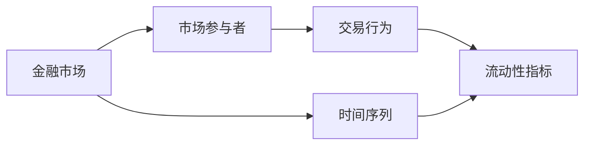
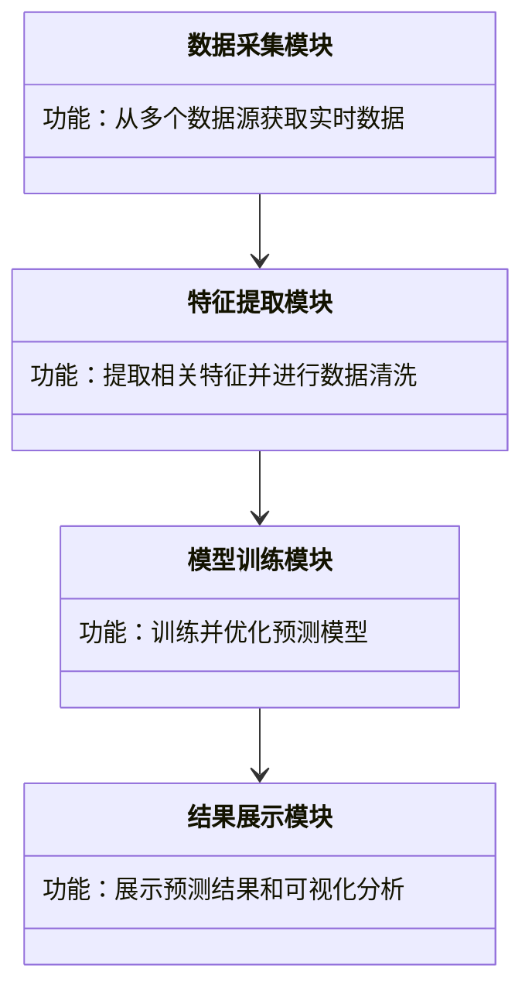

                 


```markdown
# 金融市场流动性预测模型

> 关键词：金融市场、流动性预测、时间序列分析、机器学习、统计学习、神经网络

> 摘要：本文系统地探讨了金融市场流动性预测模型的构建与应用。通过分析流动性预测的核心概念、算法原理、数学模型、系统架构以及实际案例，本文为读者提供了一套完整的流动性预测解决方案。文章内容涵盖从基础理论到实践应用的全过程，适合金融从业者、数据科学家以及相关领域的研究人员阅读。

---

## 第1章: 金融市场流动性概述

### 1.1 金融市场的基本概念
#### 1.1.1 金融市场的定义与分类
- 金融市场是资金流动的场所，分为一级市场和二级市场。
- 一级市场涉及新证券的发行，二级市场涉及现有证券的交易。

#### 1.1.2 流动性的定义与衡量标准
- 流动性指资产迅速转化为现金的能力。
- 常见衡量标准包括买卖价差、交易量、深度和可预测性。

#### 1.1.3 流动性在金融市场中的重要性
- 流动性高的市场更有利于价格发现和风险管理。
- 流动性不足可能导致市场波动和交易成本增加。

### 1.2 金融市场流动性问题的背景
#### 1.2.1 金融危机中的流动性风险
- 2008年金融危机展示了流动性不足对市场的影响。
- 金融机构的杠杆操作加剧了流动性风险。

#### 1.2.2 机构投资者的行为对流动性的影响
- 机构投资者的交易行为影响市场流动性。
- 大额交易可能导致流动性迅速下降。

#### 1.2.3 市场波动性与流动性预测的关联
- 市场波动性高的时期，流动性预测尤为重要。
- 流动性预测帮助投资者在市场波动中做出决策。

### 1.3 本书的核心目标与范围
#### 1.3.1 本书的研究目标
- 探讨如何利用数据科学方法预测金融市场流动性。
- 提供一套完整的流动性预测解决方案。

#### 1.3.2 本书的主要内容框架
- 第1章：金融市场流动性概述。
- 第2章：流动性预测模型的核心概念。
- 第3章：流动性预测的算法原理。
- 第4章：流动性预测的数学模型。
- 第5章：系统分析与架构设计。
- 第6章：项目实战与案例分析。
- 第7章：总结与展望。

#### 1.3.3 本书的读者群体与应用场景
- 读者群体：金融从业者、数据科学家、学术研究人员。
- 应用场景：股票交易、债券交易、外汇交易。

---

## 第2章: 流动性预测模型的核心概念与联系

### 2.1 流动性预测的核心概念
#### 2.1.1 流动性预测的基本原理
- 基于历史数据预测未来流动性。
- 考虑市场参与者的交易行为和市场环境因素。

#### 2.1.2 流动性预测的关键变量
- 价格数据：开盘价、收盘价、最高价、最低价。
- 交易量：成交量和成交额。
- 市场情绪：投资者情绪指数、新闻事件。

#### 2.1.3 流动性预测的边界与外延
- 预测的边界：数据质量和模型假设。
- 预测的外延：短期预测和长期预测的差异。

### 2.2 核心概念的属性特征对比
#### 2.2.1 不同流动性指标的对比分析
| 指标 | 特性 | 优点 | 缺点 |
|------|------|------|------|
| 成交量 | 数量 | 反映市场活跃度 | 易受市场操纵影响 |
| 买卖价差 | 差异 | 反映交易成本 | 易受市场深度影响 |

#### 2.2.2 市场参与者行为的特征分析
- 机构投资者：理性行为，追求收益最大化。
- 零散投资者：情绪化行为，影响短期流动性。

#### 2.2.3 市场环境因素的特征分析
- 宏观经济因素：GDP、利率、通货膨胀。
- 政治因素：政策变化、选举事件。

### 2.3 ER实体关系图架构


---

## 第3章: 流动性预测模型的算法原理

### 3.1 统计学习方法
#### 3.1.1 线性回归模型
- 简单线性回归：$y = \beta_0 + \beta_1x + \epsilon$。
- 多重线性回归：$y = \beta_0 + \beta_1x_1 + \beta_2x_2 + \dots + \beta_nx_n + \epsilon$。

#### 3.1.2 时间序列分析
- ARIMA模型：适用于线性时间序列数据。
- GARCH模型：适用于波动率建模。

#### 3.1.3 聚类分析与分类模型
- K-means聚类：用于市场状态分类。
- 支持向量机（SVM）：用于分类问题。

### 3.2 机器学习方法
#### 3.2.1 随机森林与梯度提升树
- 随机森林：基于决策树的集成学习方法。
- XGBoost：梯度提升树，适合处理复杂数据。

#### 3.2.2 神经网络与深度学习
- LSTM网络：适用于时间序列数据。
- 卷积神经网络（CNN）：用于处理高频数据。

### 3.3 算法实现流程


---

## 第4章: 流动性预测的数学模型与公式

### 4.1 时间序列分析模型
#### 4.1.1 ARIMA模型
$$ ARIMA(p, d, q) $$
- p：自回归阶数。
- d：差分阶数。
- q：移动平均阶数。

#### 4.1.2 GARCH模型
$$ GARCH(p, q) $$
- p：自回归阶数。
- q：异方差阶数。

### 4.2 神经网络模型
#### 4.2.1 LSTM网络
- 长短期记忆网络，适用于捕捉时间序列中的长期依赖关系。
- 结构包括输入门、遗忘门和输出门。

### 4.3 高频交易模型
#### 4.3.1 市场微观结构模型
- 用于捕捉市场微观结构对流动性的影响。
- 包括订单簿分析和市场深度分析。

---

## 第5章: 系统分析与架构设计

### 5.1 问题场景介绍
- 流动性预测系统需要处理大量高频数据。
- 系统需具备实时性、准确性和可扩展性。

### 5.2 项目介绍
- 项目目标：构建一个实时流动性预测系统。
- 项目范围：涵盖数据采集、特征提取、模型训练和结果展示。

### 5.3 系统功能设计


### 5.4 系统架构设计


---

## 第6章: 项目实战与案例分析

### 6.1 环境安装
- 安装Python、Pandas、NumPy、Scikit-learn、TensorFlow等库。

### 6.2 系统核心实现源代码
#### 数据采集模块
```python
import pandas as pd
from datetime import datetime

def get_data(ticker):
    # 从数据源获取数据
    data = pd.read_csv(f'data/{ticker}.csv')
    return data
```

#### 特征提取模块
```python
def extract_features(data):
    # 计算技术指标
    data['MA_20'] = data['Close'].rolling(20).mean()
    data['RSI'] = compute_rsi(data['Close'])
    return data
```

#### 模型训练模块
```python
from sklearn.ensemble import RandomForestRegressor

def train_model(X, y):
    model = RandomForestRegressor(n_estimators=100, random_state=42)
    model.fit(X, y)
    return model
```

#### 结果展示模块
```python
import matplotlib.pyplot as plt

def plot_predictions(true, predicted):
    plt.figure(figsize=(12, 6))
    plt.plot(true, label='实际值')
    plt.plot(predicted, label='预测值')
    plt.legend()
    plt.show()
```

### 6.3 代码应用解读与分析
- 数据采集模块：从多个数据源获取实时数据，确保数据的完整性和准确性。
- 特征提取模块：计算技术指标和市场情绪指标，为模型提供有效的输入特征。
- 模型训练模块：使用随机森林或神经网络进行模型训练，优化模型参数以提高预测精度。
- 结果展示模块：将预测结果可视化，便于用户理解和分析。

### 6.4 实际案例分析
- 以某股票为例，展示整个系统的运行流程。
- 对比不同模型的预测结果，分析模型的优缺点。

### 6.5 项目小结
- 项目实现的关键点：数据预处理、特征提取、模型选择和结果可视化。
- 项目的优势：实时性、准确性和可扩展性。

---

## 第7章: 总结与展望

### 7.1 总结
- 本文系统地探讨了金融市场流动性预测模型的构建与应用。
- 提供了一套完整的流动性预测解决方案，涵盖了从理论到实践的全过程。

### 7.2 未来的研究方向
- 结合自然语言处理技术，分析新闻事件对流动性的影响。
- 研究多模态数据，如市场情绪和宏观经济指标的综合影响。
- 探讨更高效的时间序列模型，如Transformer架构。

---

## 作者：AI天才研究院/AI Genius Institute & 禅与计算机程序设计艺术 /Zen And The Art of Computer Programming
```

