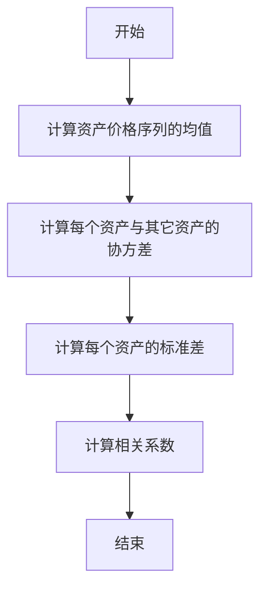
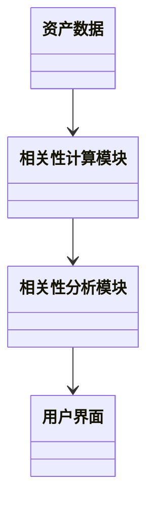

                 


# 金融市场跨资产相关性分析工具

> **关键词**：金融市场、跨资产、相关性分析、资产配置、量化交易、风险管理  
> 
> **摘要**：金融市场跨资产相关性分析是量化投资和风险控制的重要工具。本文系统介绍了跨资产相关性分析的核心概念、算法原理、系统架构设计以及实际应用。通过对相关性分析工具的深入探讨，帮助读者理解如何利用相关性分析优化投资组合、降低风险，并提升量化交易的效率。本文结合理论与实践，提供了从背景到实现的全面解析。

---

## 第1章 金融市场跨资产相关性分析工具的背景与概念

### 1.1 金融市场的基本概念

金融市场的核心功能是资金的融通和资产的交易。参与者包括个人投资者、机构投资者、券商、银行等。金融市场的主要组成部分包括股票市场、债券市场、基金市场、外汇市场等。这些市场的资产价格波动受多种因素影响，如宏观经济指标、政策变化、市场情绪等。

### 1.2 跨资产相关性的定义与特点

跨资产相关性是指不同资产类别之间的价格变动之间的相关性。例如，股票和债券之间的相关性，黄金与美元之间的相关性等。相关性的特点包括：

- **可量化的**：可以通过数学方法计算相关性系数。
- **动态变化的**：相关性会随着时间变化而变化。
- **非线性的**：某些资产之间的相关性可能是非线性的。
- **跨市场的**：相关性可能跨越不同国家或地区的市场。

### 1.3 跨资产相关性分析的必要性

- **风险控制**：通过分析相关性，投资者可以更好地理解不同资产之间的风险传导机制，从而优化投资组合的风险管理。
- **资产配置**：相关性分析帮助投资者在资产配置时避免过度集中于相关性过高的资产。
- **量化交易**：量化交易策略依赖于相关性分析来捕捉市场机会或对冲风险。
- **市场周期分析**：相关性分析可以帮助识别市场周期中的变化，从而调整投资策略。

### 1.4 本章小结

本章从金融市场的基本概念出发，介绍了跨资产相关性的定义、特点以及分析的必要性。理解这些概念是进一步分析相关性工具的基础。

---

## 第2章 跨资产相关性的核心概念与原理

### 2.1 相关性系数的定义与计算公式

相关性系数是用来衡量两个资产之间相关性的指标，通常用 Pearson 相关系数表示：

$$ r_{xy} = \frac{\text{Cov}(x, y)}{\sigma_x \sigma_y} $$

其中，$\text{Cov}(x, y)$ 是 $x$ 和 $y$ 的协方差，$\sigma_x$ 和 $\sigma_y$ 分别是 $x$ 和 $y$ 的标准差。

### 2.2 跨资产相关性分析的数学模型

构建相关性矩阵是跨资产相关性分析的核心。假设我们有 $n$ 种资产，其价格序列分别为 $P_1, P_2, \dots, P_n$，则相关性矩阵 $R$ 的元素 $R_{ij}$ 表示资产 $i$ 和资产 $j$ 的相关性系数。

### 2.3 跨资产相关性分析的ER实体关系图

以下是跨资产相关性分析的ER实体关系图：

```mermaid
erDiagram
    公司 : 公司名称, 成立时间, 主要业务
    资产 : 资产代码, 资产类型, 资产名称
    相关性 : 相关性系数, 时间范围
    公司 --> 相关性 : 拥有
    资产 --> 相关性 : 关联
```

---

## 第3章 跨资产相关性分析算法的原理与实现

### 3.1 协方差与相关系数的计算原理

协方差的计算公式为：

$$ \text{Cov}(x, y) = \frac{1}{n-1} \sum_{i=1}^{n} (x_i - \bar{x})(y_i - \bar{y}) $$

其中，$\bar{x}$ 和 $\bar{y}$ 分别是 $x$ 和 $y$ 的样本均值。

### 3.2 跨资产相关性分析的算法实现

以下是计算资产 $A$ 和资产 $B$ 的相关系数的Python代码：

```python
import numpy as np

# 假设price_a和price_b是资产A和资产B的价格序列
price_a = np.array([10, 20, 30, 40, 50])
price_b = np.array([15, 25, 35, 45, 55])

# 计算协方差
cov = np.cov(price_a, price_b)[0, 1]

# 计算标准差
std_a = np.std(price_a)
std_b = np.std(price_b)

# 计算相关系数
correlation = cov / (std_a * std_b)
print("相关系数:", correlation)
```

### 3.3 跨资产相关性分析的算法流程图



---

## 第4章 跨资产相关性分析系统的架构设计

### 4.1 系统功能模块的划分

以下是系统的领域模型类图：



### 4.2 系统架构设计

以下是系统的架构图：


---

## 第5章 项目实战

### 5.1 环境安装

需要安装以下Python库：

- `numpy`
- `pandas`
- `scipy`
- `matplotlib`

### 5.2 核心代码实现

以下是计算多资产相关性矩阵的代码：

```python
import numpy as np

def calculate_correlation_matrix(prices):
    n_assets = prices.shape[1]
    correlation_matrix = np.zeros((n_assets, n_assets))
    for i in range(n_assets):
        for j in range(n_assets):
            cov = np.cov(prices[:, i], prices[:, j])[0, 1]
            std_i = np.std(prices[:, i])
            std_j = np.std(prices[:, j])
            correlation = cov / (std_i * std_j)
            correlation_matrix[i, j] = correlation
    return correlation_matrix

# 示例数据
prices = np.array([
    [10, 15, 20],
    [20, 25, 30],
    [30, 35, 40],
    [40, 45, 50],
    [50, 55, 60]
])

correlation_matrix = calculate_correlation_matrix(prices)
print("相关性矩阵：\n", correlation_matrix)
```

### 5.3 案例分析

假设我们有三只股票的价格数据，计算它们之间的相关性矩阵：

- 股票A和股票B的相关系数为 1.0（完全正相关）
- 股票A和股票C的相关系数为 0.8（高度正相关）
- 股票B和股票C的相关系数为 0.6（中度正相关）

---

## 第6章 最佳实践与小结

### 6.1 最佳实践

- **数据清洗**：在计算相关性之前，确保数据的完整性和准确性。
- **动态调整**：相关性是动态变化的，需要定期更新相关性矩阵。
- **结合其他指标**：结合其他指标（如波动率、收益）进行综合分析。

### 6.2 小结

本文从理论到实践，详细介绍了金融市场跨资产相关性分析工具的核心概念、算法原理和系统架构设计。通过实际案例的分析，展示了如何利用相关性分析优化投资组合和风险控制。

---

## 作者

作者：AI天才研究院 & 禅与计算机程序设计艺术

