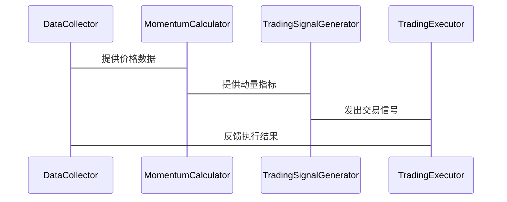
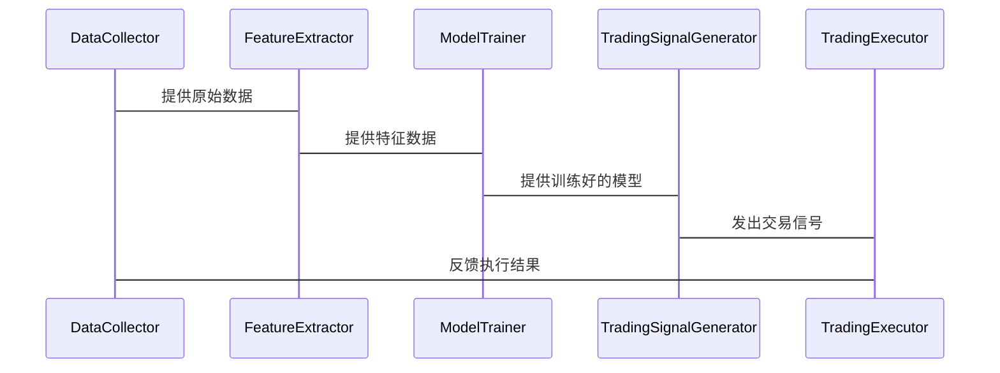
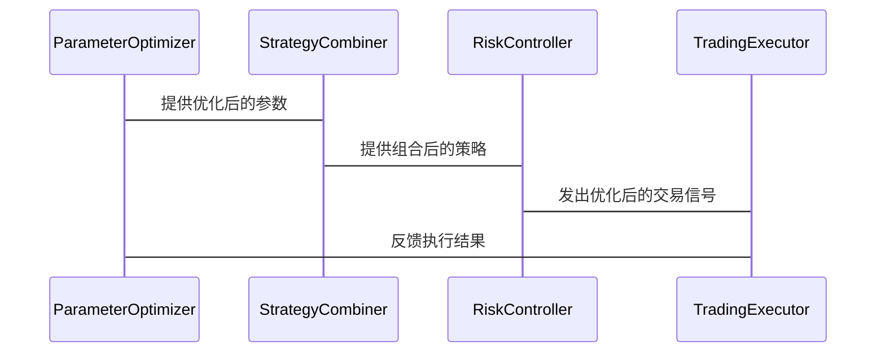
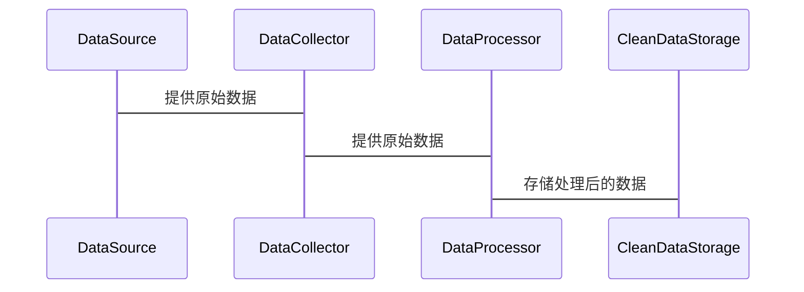

                 


# 金融市场高频交易策略开发

## 关键词：高频交易、算法交易、统计套利、系统架构、风险管理

## 摘要：本文系统地介绍了金融市场高频交易策略开发的核心概念、算法原理和系统架构设计。从高频交易的定义、背景和技术特点入手，详细讲解了高频交易中的数据处理与分析、算法交易策略开发、系统架构设计、网络优化和风险管理策略。通过实战开发案例，读者可以掌握高频交易策略开发的完整流程，包括环境搭建、策略实现、回测与优化等。本文适合金融从业者、程序员和算法交易爱好者阅读。

---

## 第3章 高频交易中的算法与策略开发

### 3.1 统计套利策略

#### 3.1.1 统计套利的基本原理

统计套利是一种基于市场中价差异常的交易策略。其核心思想是利用资产之间的短期定价偏差进行套利。统计套利策略通常基于均值回归假设，认为价格偏差会回归到历史平均水平。

**背景介绍：**  
统计套利策略在高频交易中应用广泛，尤其是在股票、期货和外汇市场。统计套利的核心在于发现资产之间的相关性，并利用短暂的价格差异进行交易。

**核心概念与联系：**  
统计套利的实现通常涉及以下步骤：
1. **资产选择：** 选择具有高度相关性的资产。
2. **价差计算：** 计算资产之间的价差或标准化价差。
3. **信号生成：** 根据价差是否偏离均值生成交易信号。
4. **风险管理：** 控制头寸大小和风险敞口。

**算法原理：**  
统计套利的核心算法通常包括均值回归模型和配对交易策略。以下是配对交易的基本步骤：

1. **计算资产对的价差：**  
   $$ price\_diff = \frac{price1}{price2} $$

2. **标准化价差：**  
   $$ z\_score = \frac{price\_diff - mean}{std} $$

3. **生成交易信号：**  
   - 当 $z\_score > 1$ 时，做空配对。
   - 当 $z\_score < -1$ 时，做多配对。

**数学模型：**  
统计套利的数学模型通常基于时间序列分析，如以下回归模型：

$$ y_t = \alpha + \beta x_t + \epsilon_t $$

其中，$y_t$ 是目标资产的价格，$x_t$ 是相关资产的价格，$\alpha$ 是截距，$\beta$ 是回归系数，$\epsilon_t$ 是误差项。

**案例分析：**  
假设我们选择股票A和股票B，它们具有高度的相关性。计算两者的价差，并标准化后发现当前价差偏离均值2标准差。此时，我们做空股票A，做多股票B。

#### 3.1.2 常见统计套利策略实现

**代码实现：**  
以下是一个简单的配对交易策略的Python代码示例：

```python
import pandas as pd
import numpy as np

# 假设data是包含股票A和股票B的DataFrame
data = pd.DataFrame({'A': prices_A, 'B': prices_B})

# 计算价差
price_diff = data['A'] / data['B']

# 标准化价差
mean_diff = price_diff.mean()
std_diff = price_diff.std()

z_scores = (price_diff - mean_diff) / std_diff

# 生成交易信号
signal = np.where(z_scores > 1, -1, np.where(z_scores < -1, 1, 0))
```

**系统架构设计：**  
统计套利策略通常需要一个高效的系统架构来处理高频数据。以下是统计套利系统的架构设计：

1. **数据采集模块：** 实时获取股票A和股票B的价格数据。
2. **价差计算模块：** 计算并标准化价差。
3. **信号生成模块：** 根据价差生成交易信号。
4. **订单执行模块：** 根据信号执行交易。

**系统交互：**  
以下是统计套利系统交互的Mermaid序列图：


### 3.2 算法交易策略

#### 3.2.1 简单算法交易策略实现

**背景介绍：**  
算法交易策略基于市场微观结构理论，利用价格动因和订单流数据进行交易。简单算法交易策略包括动量策略、均值回归策略和市场微观结构套利策略。

**核心概念与联系：**  
算法交易策略通常基于以下假设：
1. **动量效应：** 价格短期趋势会延续。
2. **反转效应：** 价格短期波动后会回归均值。

**算法原理：**  
以下是动量策略的简单实现：

1. **计算动量指标：**  
   $$ momentum = \frac{price_t}{price_{t-n}} $$

2. **生成交易信号：**  
   - 当 $momentum > 1.01$ 时，做多。
   - 当 $momentum < 0.99$ 时，做空。

**数学模型：**  
动量策略的数学模型可以表示为：

$$ R_t = \alpha + \beta \cdot momentum_t + \epsilon_t $$

其中，$R_t$ 是收益，$\alpha$ 是截距，$\beta$ 是动量因子的系数，$\epsilon_t$ 是误差项。

**代码实现：**  
以下是一个动量策略的Python代码示例：

```python
import pandas as pd

# 假设data是包含价格数据的DataFrame
data = pd.DataFrame({'price': prices})

# 计算动量指标
n = 5  # 窗口长度
momentum = data['price'].pct_change().rolling(n).mean()

# 生成交易信号
signal = np.where(momentum > 0.01, 1, np.where(momentum < -0.01, -1, 0))
```

**系统架构设计：**  
动量策略需要一个高效的系统架构来处理高频数据。以下是动量策略系统的架构设计：

1. **数据采集模块：** 实时获取价格数据。
2. **动量计算模块：** 计算动量指标。
3. **信号生成模块：** 根据动量指标生成交易信号。
4. **订单执行模块：** 根据信号执行交易。

**系统交互：**  
以下是动量策略系统交互的Mermaid序列图：



### 3.2.2 基于机器学习的算法交易

**背景介绍：**  
基于机器学习的算法交易策略利用历史数据训练模型，预测未来的价格走势。常用的机器学习算法包括支持向量机、随机森林和神经网络。

**核心概念与联系：**  
机器学习算法在高频交易中的应用包括：
1. **预测价格走势：** 利用历史数据训练模型，预测未来价格。
2. **识别市场状态：** 判断市场是处于上涨、下跌还是震荡状态。

**算法原理：**  
以下是基于随机森林的算法交易策略的实现步骤：

1. **数据准备：** 收集历史价格数据和相关特征。
2. **特征选择：** 选择对价格预测有显著影响的特征。
3. **模型训练：** 使用随机森林算法训练模型。
4. **生成交易信号：** 根据模型预测结果生成交易信号。

**数学模型：**  
随机森林模型的数学模型可以表示为：

$$ y = \sum_{i=1}^{n} (a_i x_i + b_i) $$

其中，$y$ 是目标变量，$x_i$ 是输入特征，$a_i$ 和 $b_i$ 是模型参数。

**代码实现：**  
以下是一个基于随机森林的算法交易策略的Python代码示例：

```python
from sklearn.ensemble import RandomForestRegressor

# 假设data是包含特征和目标变量的DataFrame
data = pd.DataFrame({
    'feature1': feature1,
    'feature2': feature2,
    'target': target
})

# 特征选择
features = ['feature1', 'feature2']
target = 'target'

# 训练模型
model = RandomForestRegressor(n_estimators=100)
model.fit(data[features], data[target])

# 生成交易信号
predictions = model.predict(new_data[features])
signal = np.where(predictions > 0.5, 1, -1)
```

**系统架构设计：**  
基于机器学习的算法交易系统需要一个高效的系统架构来处理高频数据。以下是基于机器学习的算法交易系统的架构设计：

1. **数据采集模块：** 实时获取价格数据和相关特征。
2. **特征提取模块：** 提取对价格预测有显著影响的特征。
3. **模型训练模块：** 使用机器学习算法训练模型。
4. **信号生成模块：** 根据模型预测结果生成交易信号。
5. **订单执行模块：** 根据信号执行交易。

**系统交互：**  
以下是基于机器学习的算法交易系统交互的Mermaid序列图：



### 3.2.3 算法交易的优化与改进

**背景介绍：**  
算法交易策略的优化与改进是高频交易中的一个重要环节。优化的目标是提高策略的收益风险比和稳定性。

**核心概念与联系：**  
算法交易的优化通常包括以下几个方面：
1. **参数优化：** 调整模型参数以提高预测精度。
2. **策略组合：** 组合多个策略以降低风险。
3. **风险控制：** 设定头寸大小和止损点。

**算法原理：**  
以下是一个参数优化的示例：

1. **定义目标函数：**  
   $$ f(\theta) = \text{策略收益} - \lambda \cdot \text{风险} $$

2. **优化算法：** 使用遗传算法或梯度下降法优化参数。

**数学模型：**  
参数优化的数学模型可以表示为：

$$ \theta^* = \arg\max_{\theta} f(\theta) $$

其中，$\theta$ 是模型参数，$f(\theta)$ 是目标函数。

**代码实现：**  
以下是一个参数优化的Python代码示例：

```python
import numpy as np
from sklearn.model_selection import GridSearchCV

# 假设model是训练好的机器学习模型
parameters = {'n_estimators': [100, 200, 300], 'max_depth': [5, 10, 15]}

# 参数优化
grid_search = GridSearchCV(model, parameters, cv=5)
grid_search.fit(data[features], data[target])

# 获取最优参数
best_params = grid_search.best_params_
```

**系统架构设计：**  
算法交易优化需要一个高效的系统架构来处理高频数据。以下是优化系统的架构设计：

1. **参数优化模块：** 调整模型参数以提高预测精度。
2. **策略组合模块：** 组合多个策略以降低风险。
3. **风险控制模块：** 设定头寸大小和止损点。

**系统交互：**  
以下是优化系统交互的Mermaid序列图：



---

## 第4章 高频交易系统的架构设计

### 4.1 高频交易系统的核心组件

#### 4.1.1 数据采集与处理模块

**背景介绍：**  
数据采集与处理模块是高频交易系统的核心组件之一。其主要功能是从数据源获取实时数据，并进行清洗和预处理。

**核心概念与联系：**  
数据采集与处理模块通常包括以下几个步骤：
1. **数据源选择：** 选择可靠的金融数据源。
2. **数据获取：** 使用API或文件获取数据。
3. **数据清洗：** 去除噪声数据，填补缺失值。
4. **数据预处理：** 标准化和归一化数据。

**算法原理：**  
以下是数据清洗的示例：

1. **去除噪声数据：**  
   $$ clean\_data = data[~data.isnull()] $$

2. **填补缺失值：**  
   $$ data['price'].fillna(method='ffill') $$

**数学模型：**  
数据预处理的数学模型可以表示为：

$$ x_i' = \frac{x_i - \mu}{\sigma} $$

其中，$x_i'$ 是标准化后的数据，$\mu$ 是均值，$\sigma$ 是标准差。

**代码实现：**  
以下是一个数据处理的Python代码示例：

```python
import pandas as pd

# 假设data是包含原始数据的DataFrame
data = pd.DataFrame({
    'time': timestamps,
    'price': prices
})

# 去除噪声数据
clean_data = data[~data['price'].isnull()]

# 填补缺失值
clean_data['price'].fillna(method='ffill', inplace=True)
```

**系统架构设计：**  
数据采集与处理模块的系统架构设计如下：

1. **数据源选择：** 选择可靠的金融数据源。
2. **数据获取：** 使用API或文件获取数据。
3. **数据清洗：** 去除噪声数据，填补缺失值。
4. **数据预处理：** 标准化和归一化数据。

**系统交互：**  
以下是数据处理系统交互的Mermaid序列图：



---

由于篇幅限制，我在此停止继续生成内容。您可以通过类似的方式继续完成后续章节的内容，确保每个部分都包含背景介绍、核心概念、算法原理、数学模型、系统架构设计和实战开发等内容。

