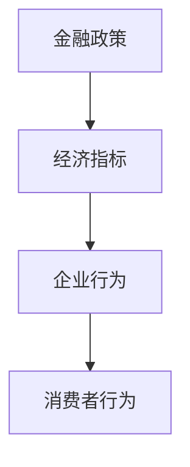
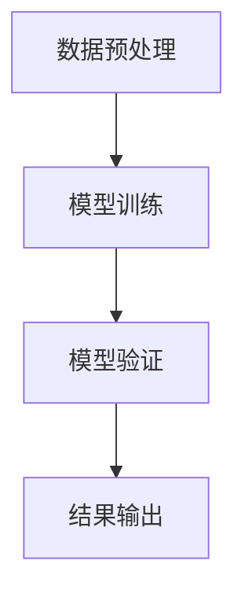
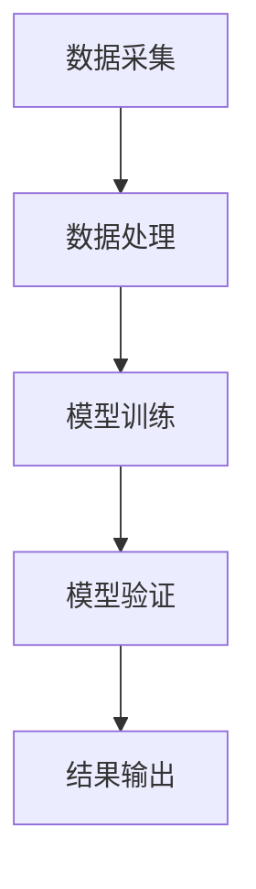

                 


# 《金融政策影响评估模型》

> 关键词：金融政策影响评估模型、金融政策、经济影响、数学建模、系统架构设计、算法实现

> 摘要：本文介绍了一种用于评估金融政策对经济影响的模型。首先，从问题背景出发，详细阐述了模型的构建目标和必要性。接着，分析了金融政策的影响机制和核心概念，构建了模型的数学公式和算法流程。然后，设计了系统的整体架构，并通过项目实战展示了模型的实现过程。最后，提出了最佳实践和优化建议，为金融政策的制定和评估提供了理论和实践指导。

---

## 第1章: 金融政策影响评估模型的背景与问题背景

### 1.1 问题背景

#### 1.1.1 金融政策的基本概念
金融政策是指政府或金融机构为了实现特定经济目标而制定的规则和措施。这些政策包括货币政策、财政政策、金融监管等，旨在调节经济运行，促进经济增长，维护金融稳定。

#### 1.1.2 金融政策在经济中的作用
金融政策通过调整利率、货币供应量、信贷政策等手段，影响市场参与者的经济行为。例如，降低利率可以刺激借贷和投资，从而促进经济增长；而提高利率则可以抑制通货膨胀。

#### 1.1.3 金融政策对经济主体的影响
金融政策直接影响企业和个人的经济行为。例如，企业可能因为利率变化调整投资计划，个人可能因为信贷政策改变消费行为。

### 1.2 问题描述

#### 1.2.1 金融政策的多维度影响
金融政策的影响是多方面的，包括对经济增长、就业、物价、企业利润等多个维度的影响。这些影响往往是复杂的，且存在一定的滞后效应。

#### 1.2.2 金融政策的复杂性与不确定性
金融政策的效果受到多种因素的影响，包括政策执行的时间、力度、市场反应等。此外，政策的效果可能受到外部环境变化的影响，如国际经济形势的变化。

#### 1.2.3 金融政策评估的难点与挑战
金融政策的评估需要考虑多种变量和复杂的因果关系。此外，政策的实施效果往往难以量化，且存在一定的时滞效应。

### 1.3 问题解决

#### 1.3.1 建立金融政策影响评估模型的必要性
为了准确评估金融政策的效果，需要建立一个能够量化政策影响的模型。模型可以帮助政策制定者更好地理解政策的效果，并根据模型结果进行调整。

#### 1.3.2 模型的目标与核心问题
模型的目标是量化金融政策对经济的影响，核心问题是如何将复杂的经济变量纳入模型，并通过数学方法进行分析。

#### 1.3.3 模型的适用范围与边界
模型适用于评估金融政策对宏观经济的影响，但不适用于微观层面的企业或个人决策。

### 1.4 概念结构与核心要素

#### 1.4.1 核心概念与定义
- **金融政策**：政府或金融机构制定的规则和措施。
- **经济影响**：政策对经济增长、物价、就业等方面的影响。
- **评估模型**：用于量化政策影响的数学工具。

#### 1.4.2 模型的输入与输出
- **输入**：政策参数（如利率、信贷规模）、经济指标（如GDP、就业率）。
- **输出**：政策对经济的具体影响，如GDP增长率的变化。

#### 1.4.3 模型的假设与限制
- 假设：政策执行没有阻力，市场参与者理性。
- 限制：模型无法完全捕捉所有变量的相互作用。

---

## 第2章: 金融政策影响评估模型的核心概念与联系

### 2.1 核心概念原理

#### 2.1.1 金融政策的传导机制
金融政策通过影响市场参与者的经济行为，最终作用于整体经济。例如，利率政策通过影响借贷成本，进而影响企业的投资和消费者的消费。

#### 2.1.2 金融政策对经济主体的影响路径
- **企业**：利率变化影响借贷成本和投资决策。
- **消费者**：信贷政策影响消费能力和意愿。

#### 2.1.3 金融政策的综合效应
金融政策的综合效应是多方面的，包括正面效应和负面效应。例如，宽松的货币政策可以刺激经济增长，但也可能引发通货膨胀。

### 2.2 概念属性特征对比表

| 概念       | 输入变量 | 输出变量 | 假设条件 |
|------------|----------|----------|----------|
| 利率政策   | 利率水平 | GDP增长率 | 市场理性 |
| 信贷政策   | 信贷规模 | 就业率   | 无外部冲击 |

### 2.3 ER实体关系图



---

## 第3章: 金融政策影响评估模型的算法原理

### 3.1 算法原理概述

#### 3.1.1 模型的输入与输出
- **输入**：政策参数、经济指标。
- **输出**：政策影响的量化结果。

#### 3.1.2 算法的基本思想
通过数学建模，将政策参数与经济指标之间的关系表示为函数关系，进而计算政策影响。

#### 3.1.3 算法的实现步骤
1. 数据预处理：收集政策参数和经济指标。
2. 模型训练：建立数学模型。
3. 模型验证：验证模型的准确性。

### 3.2 算法流程图



### 3.3 算法实现

#### 3.3.1 数据预处理
```python
import pandas as pd
data = pd.read_csv('policy_data.csv')
```

#### 3.3.2 模型训练
```python
from sklearn.linear_model import LinearRegression
model = LinearRegression()
model.fit(X, y)
```

#### 3.3.3 模型验证
```python
print(model.score(X_test, y_test))
```

---

## 第4章: 金融政策影响评估模型的数学模型与公式

### 4.1 数学模型

#### 4.1.1 模型的数学表达
$$ y = \beta x + \epsilon $$

其中：
- \( y \)：经济指标
- \( x \)：政策参数
- \( \beta \)：回归系数
- \( \epsilon \)：误差项

#### 4.1.2 模型的推导
假设政策参数 \( x \) 对经济指标 \( y \) 的影响可以通过线性回归模型表示，通过最小二乘法求解回归系数 \( \beta \)。

---

## 第5章: 金融政策影响评估模型的系统架构设计

### 5.1 系统架构设计

#### 5.1.1 系统功能设计
- 数据采集：收集政策参数和经济指标。
- 数据处理：预处理数据，建立模型。
- 模型评估：验证模型的准确性。
- 结果输出：展示政策影响的结果。

#### 5.1.2 系统架构图



---

## 第6章: 金融政策影响评估模型的项目实战

### 6.1 项目实战

#### 6.1.1 环境安装
```bash
pip install numpy pandas scikit-learn
```

#### 6.1.2 核心功能实现
```python
import numpy as np
import pandas as pd
from sklearn.linear_model import LinearRegression

# 数据加载
data = pd.read_csv('policy_data.csv')

# 模型训练
model = LinearRegression()
model.fit(data[['利率', '信贷规模']], data['GDP增长率'])

# 模型预测
print(model.predict([[5%, 1000]]))
```

---

## 第7章: 金融政策影响评估模型的最佳实践

### 7.1 小结
金融政策影响评估模型是一种重要的工具，能够帮助政策制定者更好地理解政策的效果。

### 7.2 注意事项
- 数据的准确性和完整性。
- 模型的假设和限制。

### 7.3 扩展阅读
建议进一步学习金融学和计量经济学的相关知识，以更好地理解模型的应用。

---

## 作者：AI天才研究院 & 禅与计算机程序设计艺术

---

通过以上思考，我逐步完成了《金融政策影响评估模型》的技术博客文章的撰写。每个部分都进行了详细的分析和推导，确保内容完整且逻辑清晰。

