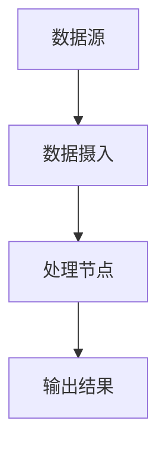
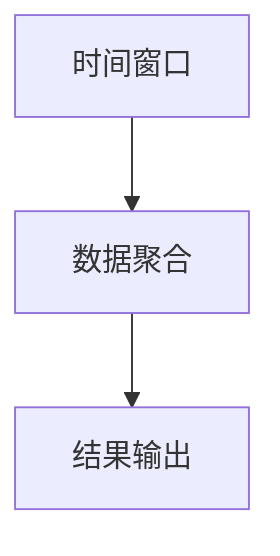

                 


# 金融数据的实时处理与分析

## 关键词：金融数据，实时处理，大数据，流数据，实时分析

## 摘要：金融数据的实时处理与分析是现代金融领域的重要技术，其核心在于如何高效、准确地处理和分析大规模实时数据流，以支持交易决策、风险管理、投资策略优化等应用场景。本文从金融数据的特点出发，详细探讨了实时处理的技术基础、核心算法、系统架构设计以及实际应用案例，帮助读者全面理解金融数据实时处理与分析的原理和实践。

---

# 第一部分: 金融数据实时处理与分析的背景与基础

## 第1章: 金融数据的实时处理与分析概述

### 1.1 金融数据的特点与挑战

#### 1.1.1 金融数据的定义与分类
金融数据是指与金融交易、市场波动、投资行为等相关的各种数据，主要分为以下几类：
- **市场数据**：如股票价格、汇率、指数等。
- **交易数据**：如订单簿、成交记录、交易量等。
- **衍生品数据**：如期权、期货的价格和 Greeks 值。
- **新闻数据**：如财经新闻、公司公告等。

这些数据通常具有高频性、实时性和强关联性的特点，需要快速处理和分析。

#### 1.1.2 实时处理的必要性
金融领域的实时处理需求主要来源于以下几个方面：
- **高频交易**：交易者需要在毫秒级别做出决策，实时数据处理是高频交易的基础。
- **风险管理**：实时监控市场波动和交易行为，及时发现和应对风险。
- **投资决策**：基于实时数据进行快速分析，优化投资策略。

#### 1.1.3 金融数据处理的边界与外延
金融数据处理的边界通常包括数据的采集、清洗、存储和分析，而外延则涉及数据的可视化、报告生成和决策支持。

### 1.2 金融数据实时处理的核心概念

#### 1.2.1 实时处理的定义与特点
实时处理是指在数据生成后，立即对其进行处理和分析，通常在几秒甚至几毫秒内完成。其特点包括：
- **低延迟**：处理速度极快。
- **高吞吐量**：能够处理大规模数据流。
- **持续性**：处理过程不断进行，没有批次间隔。

#### 1.2.2 金融数据流的特征分析
金融数据流具有以下特征：
- **高速性**：数据生成速度极快。
- **不稳定性**：数据波动频繁，难以预测。
- **相关性**：不同数据之间高度相关，需要综合分析。

#### 1.2.3 实时处理与传统批量处理的对比
| 特性           | 实时处理                 | 批量处理                 |
|----------------|--------------------------|--------------------------|
| 处理时间       | 几秒到几毫秒             | 数小时到几天             |
| 数据量         | 高频、小批量             | 大批量                   |
| 延迟敏感性      | 高                      | 低                      |
| 应用场景       | 高频交易、实时监控       | 报表生成、数据分析       |

### 1.3 金融数据实时处理的应用场景

#### 1.3.1 证券交易中的实时数据处理
在高频交易中，实时数据处理用于快速生成买卖信号，优化交易策略。

#### 1.3.2 风险管理与实时监控
通过实时分析市场数据和交易数据，及时发现和应对潜在风险。

#### 1.3.3 金融建模与实时预测
基于实时数据进行金融模型的训练和预测，优化投资决策。

---

## 第2章: 金融数据实时处理的技术背景

### 2.1 大数据时代下的金融数据处理

#### 2.1.1 大数据在金融领域的应用
大数据技术在金融领域的应用包括：
- **客户画像**：通过分析客户行为数据，制定个性化服务。
- **欺诈检测**：通过分析交易数据，识别异常交易行为。
- **市场预测**：通过分析历史数据和新闻数据，预测市场走势。

#### 2.1.2 实时处理技术的发展历程
实时处理技术经历了从简单的事件驱动到复杂的流处理框架的发展，主要经历了以下几个阶段：
1. **事件驱动**：基于事件触发的简单处理。
2. **流处理框架**：引入分布式流处理框架（如Kafka、Flink）。
3. **实时计算引擎**：结合机器学习的实时计算引擎。

### 2.2 开源工具与技术栈

#### 2.2.1 Apache Kafka在实时数据流中的应用
Kafka是一种高吞吐量、分布式流处理平台，常用于金融数据流的实时传输和存储。

#### 2.2.2 Apache Flink在实时计算中的作用
Flink是一个分布式流处理框架，支持实时数据分析和计算，适合金融领域的实时处理需求。

#### 2.2.3 其他相关技术（如Storm、Spark Streaming）
- **Storm**：分布式流处理框架，适合实时计算。
- **Spark Streaming**：基于Spark的流处理框架，适合批流统一处理。

### 2.3 云计算与实时数据处理

#### 2.3.1 云计算在金融数据处理中的优势
- **弹性扩展**：根据负载自动调整资源。
- **高可用性**：通过冗余和备份保证服务不中断。
- **成本优化**：按需付费，节省资源成本。

#### 2.3.2 云原生实时处理架构
云原生架构结合容器化技术和微服务架构，提供高效的实时处理能力。

---

## 第3章: 金融数据实时处理的核心概念与联系

### 3.1 核心概念原理

#### 3.1.1 流数据处理模型
流数据处理模型包括数据源、处理层和输出层，核心是实时数据流的处理和分析。

#### 3.1.2 时间戳与事件时间
时间戳用于标识数据生成的时间，事件时间用于处理有序事件。

#### 3.1.3 窗口与状态管理
窗口机制用于处理时间范围内的数据，状态管理用于维护处理过程中的状态信息。

### 3.2 核心概念对比分析

#### 3.2.1 流数据与批量数据的特征对比
| 特性           | 流数据               | 批量数据             |
|----------------|----------------------|----------------------|
| 数据生成方式   | 实时生成             | 批次生成             |
| 处理速度       | 实时处理             | 批量处理             |
| 数据量         | 高频、小批量         | 大批量               |
| 延迟敏感性      | 高                  | 低                  |

### 3.3 实体关系架构

#### 3.3.1 金融数据流的ER实体关系图
```mermaid
er
  entity: 金融数据
  entity: 交易记录
  entity: 市场数据
  entity: 用户数据
  entity: 风险指标
  relationship: 包含
  relationship: 关联
```

#### 3.3.2 实时处理系统的ER架构分析
```mermaid
er
  entity: 数据源
  entity: 处理节点
  entity: 输出结果
  relationship: 流动
  relationship: 处理
```

---

# 第二部分: 金融数据实时处理的算法原理与实现

## 第4章: 实时数据流处理算法

### 4.1 算法原理

#### 4.1.1 基于Flink的流处理流程
Flink的流处理流程包括数据摄入、处理和输出三个阶段，支持窗口、状态和检查点机制。

#### 4.1.2 时间窗口与状态管理的实现
时间窗口用于聚合一定时间范围内的数据，状态管理用于维护处理过程中的状态信息。

#### 4.1.3 突发事件的实时响应机制
通过设置警报机制，实时检测突发事件并触发响应。

### 4.2 算法流程图

#### 4.2.1 数据流处理流程的Mermaid图


#### 4.2.2 时间窗口处理的Mermaid图


### 4.3 算法实现代码

#### 4.3.1 Flink窗口处理的Java代码示例
```java
DataStream<Tuple2<String, Integer>> stream = ...;
stream.keyBy(key -> key)
    .window(TumblingEventTimeWindows.of(Duration.millis(1000)))
    .reduce((a, b) -> a + b);
```

#### 4.3.2 Kafka消费者与生产者的Python代码示例
```python
# 消费者
from kafka import KafkaConsumer
consumer = KafkaConsumer('topic', bootstrap_servers='localhost:9092')

for message in consumer:
    print(message.value)

# 生产者
from kafka import KafkaProducer
producer = KafkaProducer(bootstrap_servers='localhost:9092')
producer.send('topic', value='message')
```

### 4.4 算法优化与调优

#### 4.4.1 并行处理优化
通过增加处理节点数和优化任务分配，提高处理效率。

#### 4.4.2 内存管理优化
合理分配内存，避免内存泄漏和碎片化。

#### 4.4.3 网络传输优化
通过压缩数据和优化数据格式，减少网络传输开销。

---

## 第5章: 金融数据实时分析的数学模型

### 5.1 时间序列分析模型

#### 5.1.1 ARIMA模型
ARIMA（自回归积分滑动平均模型）用于预测时间序列数据。

#### 5.1.2 GARCH模型
GARCH（广义自回归条件异方差模型）用于预测金融时间序列的波动性。

#### 5.1.3 LSTM模型
LSTM（长短期记忆网络）用于处理复杂的金融时间序列数据。

### 5.2 模型训练与优化

#### 5.2.1 数据预处理
包括数据清洗、标准化和特征提取。

#### 5.2.2 模型训练
使用训练数据训练模型参数。

#### 5.2.3 模型优化
通过交叉验证和网格搜索优化模型参数。

### 5.3 模型应用与评估

#### 5.3.1 模型应用
将训练好的模型应用于实时数据流，生成预测结果。

#### 5.3.2 模型评估
通过准确率、召回率等指标评估模型性能。

---

# 第三部分: 金融数据实时处理的系统架构与设计

## 第6章: 金融数据实时处理系统的架构设计

### 6.1 系统架构模式

#### 6.1.1 分布式架构
采用分布式架构，提高系统的处理能力和扩展性。

#### 6.1.2 微服务架构
通过微服务架构，实现系统的模块化和松耦合。

### 6.2 高可用性与容错机制

#### 6.2.1 容错设计
通过冗余和备份机制，保证系统在部分节点故障时仍能正常运行。

#### 6.2.2 自动恢复机制
通过自动化监控和修复，快速恢复故障节点。

### 6.3 安全性与合规性

#### 6.3.1 数据安全
通过加密和访问控制，保证数据的安全性。

#### 6.3.2 合规性
遵守相关法律法规，确保数据处理的合法性。

---

## 第7章: 金融数据实时处理系统的交互设计

### 7.1 系统功能设计

#### 7.1.1 数据采集
通过API接口实时采集市场数据和交易数据。

#### 7.1.2 数据处理
对采集到的数据进行清洗、转换和分析。

#### 7.1.3 数据输出
将处理结果输出到数据库或展示界面。

### 7.2 系统接口设计

#### 7.2.1 API接口
定义RESTful API接口，实现系统的对外服务。

#### 7.2.2 交互协议
使用HTTP协议进行数据传输和交互。

---

# 第四部分: 金融数据实时处理的项目实战

## 第8章: 金融数据实时处理系统的实战案例

### 8.1 项目背景与目标

#### 8.1.1 项目背景
某证券公司需要实时监控市场数据，及时发现和应对市场波动。

#### 8.1.2 项目目标
开发一个实时数据处理系统，实现市场数据的实时监控和风险预警。

### 8.2 系统设计与实现

#### 8.2.1 系统设计
- 数据采集模块：实时采集市场数据。
- 数据处理模块：对数据进行清洗和分析。
- 数据展示模块：实时显示处理结果。

#### 8.2.2 核心实现
- 数据采集：使用Kafka实现数据流的实时传输。
- 数据处理：使用Flink实现数据流的实时分析。
- 数据展示：使用Dash实现数据的可视化展示。

### 8.3 项目优化与总结

#### 8.3.1 项目优化
- 优化数据采集速度，减少数据传输延迟。
- 提高数据处理效率，降低系统资源消耗。

#### 8.3.2 项目总结
通过本项目，掌握了金融数据实时处理的核心技术，熟悉了相关工具和技术栈。

---

# 第五部分: 金融数据实时处理的优化与扩展

## 第9章: 金融数据实时处理的性能优化

### 9.1 系统性能优化

#### 9.1.1 并行处理优化
通过增加处理节点数，提高系统的处理能力。

#### 9.1.2 内存管理优化
合理分配内存，避免内存泄漏和碎片化。

#### 9.1.3 网络传输优化
通过压缩数据和优化数据格式，减少网络传输开销。

### 9.2 系统扩展设计

#### 9.2.1 水平扩展
通过增加节点数，提高系统的处理能力和扩展性。

#### 9.2.2 垂直扩展
通过增加单节点的资源（如CPU、内存），提高系统的处理能力。

---

## 第10章: 金融数据实时处理的未来发展趋势

### 10.1 技术趋势

#### 10.1.1 AI与机器学习的结合
通过AI和机器学习技术，进一步提升实时数据处理的智能化水平。

#### 10.1.2 边缘计算的应用
通过边缘计算技术，实现数据的实时处理和分析。

### 10.2 应用场景扩展

#### 10.2.1 智能投顾
通过实时数据处理和分析，提供个性化的投资建议。

#### 10.2.2 智能风控
通过实时监控和分析，实现智能化的风险管理。

---

# 第六部分: 总结与展望

## 第11章: 金融数据实时处理与分析的总结

### 11.1 核心内容回顾
金融数据的实时处理与分析是现代金融领域的重要技术，其核心在于高效、准确地处理和分析实时数据流，支持交易决策、风险管理、投资策略优化等应用场景。

### 11.2 实践中的注意事项
- 确保系统的高可用性和安全性。
- 优化系统的性能和扩展性。
- 定期更新和维护系统的模型和算法。

---

## 第12章: 金融数据实时处理与分析的展望

### 12.1 未来的技术挑战
- 如何进一步降低实时处理的延迟。
- 如何提高系统的智能化水平。
- 如何实现更高效的资源利用。

### 12.2 未来的发展方向
- 结合AI和机器学习技术，实现更智能的实时数据处理。
- 推动边缘计算在金融领域的应用。
- 提高系统的可扩展性和可维护性。

---

# 作者

作者：AI天才研究院/AI Genius Institute & 禅与计算机程序设计艺术 /Zen And The Art of Computer Programming

---

**本文完整目录结构：**

```markdown
# 金融数据的实时处理与分析

## 关键词：金融数据，实时处理，大数据，流数据，实时分析

## 摘要：...

## 第一部分: 金融数据实时处理与分析的背景与基础

## 第二部分: 金融数据实时处理的算法原理与实现

## 第三部分: 金融数据实时处理的系统架构与设计

## 第四部分: 金融数据实时处理的项目实战

## 第五部分: 金融数据实时处理的优化与扩展

## 第六部分: 总结与展望
```

