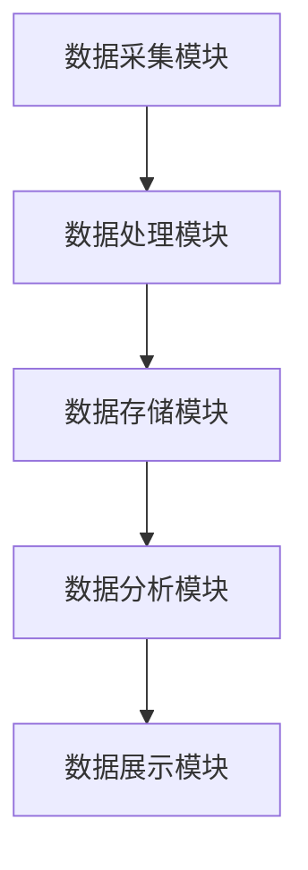
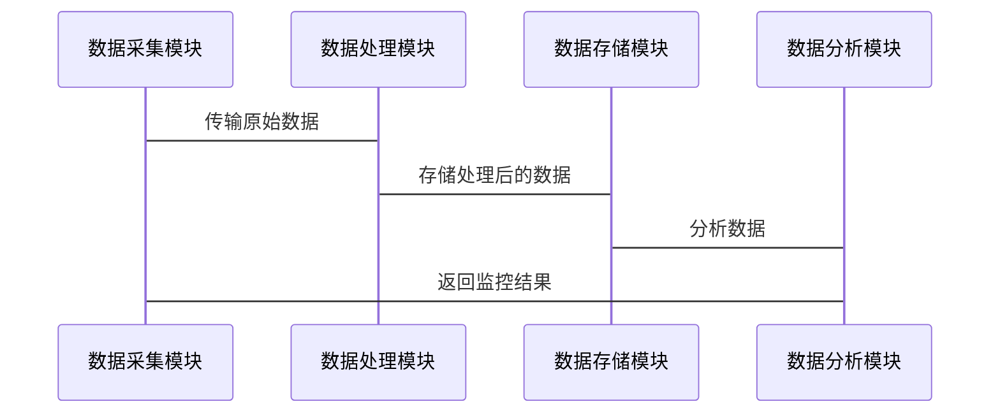

                 


# 《金融数据质量控制系统》

**关键词**：金融数据、数据质量管理、数据清洗、数据验证、数据监控、系统架构

**摘要**：金融数据质量控制系统是一套用于确保金融数据准确性和完整性的系统，涵盖数据清洗、验证、监控和系统设计等关键环节。本文将详细探讨金融数据质量管理的核心概念、数据清洗与验证技术、数据质量监控方法，以及系统架构设计和项目实战案例，为读者提供全面的解决方案和实践指导。

---

## 目录大纲

### 第1章：金融数据质量控制的背景与重要性
1.1 金融数据的特性与重要性
    - 数据准确性
    - 数据完整性
    - 数据一致性
    - 数据及时性
    - 数据安全性

1.2 数据质量管理的定义与目标
    - 数据质量管理的定义
    - 数据质量管理的目标
    - 数据质量管理的边界与外延

1.3 金融数据质量控制的必要性
    - 金融监管的需要
    - 金融机构内部管理的需要
    - 金融创新与数字化转型的需要

1.4 本章小结

---

### 第2章：金融数据质量控制的核心概念与联系
2.1 数据质量管理的核心概念
    - 数据准确性
    - 数据完整性
    - 数据一致性
    - 数据及时性
    - 数据安全性

2.2 数据质量管理的核心要素对比
    - 数据准确性与完整性的对比分析
    - 数据一致性与及时性的对比分析
    - 数据安全性的特殊性

2.3 数据质量管理的ER实体关系图
```mermaid
erDiagram
    customer[客户] {
        +id: int
        +name: string
    }
```

---

### 第3章：金融数据清洗技术与算法实现
3.1 数据清洗的定义与目标
    - 数据清洗的定义
    - 数据清洗的目标

3.2 数据清洗的核心算法与实现
    - 缺失值处理算法
    - 重复数据处理算法
    - 异常值检测与处理算法

3.3 数据清洗的数学模型与公式
    - 均值填充法
    - 中位数填充法
    - 随机填充法

3.4 数据清洗的Python实现
    ```python
    import pandas as pd
    data = pd.DataFrame({
        'id': [1, 2, 3, 4, 5],
        'value': [10, pd.NA, 20, 30, 40]
    })
    # 使用均值填充法处理缺失值
    data['value'].fillna(data['value'].mean(), inplace=True)
    ```

---

### 第4章：金融数据验证与校验技术
4.1 数据验证的定义与目标
    - 数据验证的定义
    - 数据验证的目标

4.2 数据验证的核心算法与实现
    - 正则表达式校验
    - 数据范围校验
    - 数据格式校验

4.3 数据验证的数学模型与公式
    - 正则表达式校验的实现逻辑
    - 数据范围校验的边界条件

4.4 数据验证的Python实现
    ```python
    import re
    def validate_credit_card(card_number):
        if re.match(r'^\d{16}$', card_number):
            return True
        return False
    ```

---

### 第5章：金融数据质量监控系统设计与实现
5.1 数据质量监控的定义与目标
    - 数据质量监控的定义
    - 数据质量监控的目标

5.2 数据质量监控的核心算法与实现
    - 实时数据监控算法
    - 数据质量报告生成算法

5.3 数据质量监控的系统架构设计


5.4 数据质量监控的Python实现
    ```python
    import pandas as pd
    from datetime import datetime

    def monitor_data_quality(data):
        # 检查数据完整性
        if data.isnull().any():
            print("存在缺失值")
        # 检查数据一致性
        if data.duplicated().any():
            print("存在重复值")
        # 检查数据及时性
        if max(data['timestamp']) < datetime.now():
            print("数据延迟")
    ```

---

### 第6章：金融数据质量控制系统架构与实现
6.1 系统架构设计
    - 数据采集模块
    - 数据处理模块
    - 数据存储模块
    - 数据分析模块
    - 数据展示模块

6.2 系统接口设计
    - 数据输入接口
    - 数据输出接口
    - 数据监控接口

6.3 系统交互设计


---

### 第7章：金融数据质量控制项目实战
7.1 项目背景与目标
    - 项目背景
    - 项目目标

7.2 项目环境与工具安装
    - Python环境配置
    - 数据处理库安装（如pandas、numpy）
    - 数据可视化库安装（如matplotlib、seaborn）

7.3 项目核心代码实现
    - 数据清洗与处理
    - 数据验证与校验
    - 数据质量监控

7.4 项目案例分析与解读
    - 案例一：信用卡交易数据质量控制
    - 案例二：股票市场数据质量控制

7.5 项目小结与经验总结

---

### 第8章：总结与展望
8.1 本章总结
    - 核心内容回顾
    - 关键技术总结

8.2 数据质量管理的未来发展方向
    - 数据隐私保护
    - 数据质量管理的智能化
    - 数据质量管理的标准化

8.3 最佳实践与注意事项
    - 数据质量管理的关键点
    - 数据质量管理的误区与解决方案

---

**作者：AI天才研究院/AI Genius Institute & 禅与计算机程序设计艺术 /Zen And The Art of Computer Programming**

