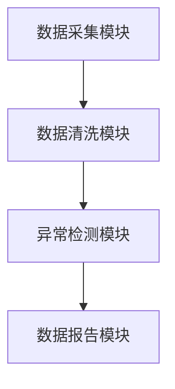

                 


# 金融数据质量自动化监控系统

## 关键词：金融数据，数据质量，自动化监控，数据清洗，异常检测

## 摘要：  
金融数据的高质量对于金融机构的决策至关重要。本文详细探讨了金融数据质量监控的重要性、核心概念、实现技术、系统架构设计以及实际应用案例。通过结合数据清洗、预处理、异常检测等技术，本文提出了一种自动化监控系统的解决方案，并通过代码实现和案例分析，展示了如何有效提升金融数据质量。

---

# 第一部分：金融数据质量监控的背景与问题

## 第1章：金融数据质量监控的背景与问题

### 1.1 数据质量管理的重要性

#### 1.1.1 数据在金融领域的核心地位
金融领域的决策高度依赖数据，数据的质量直接影响金融机构的信誉、风险控制能力以及盈利能力。例如，股票交易系统依赖实时数据进行决策，任何数据偏差都可能导致巨大损失。

#### 1.1.2 数据质量问题对企业的影响
数据质量问题可能导致以下问题：
- **决策失误**：基于错误数据的决策可能导致重大损失。
- **合规风险**：不符合监管要求的数据可能导致法律问题。
- **客户信任**：数据错误可能损害客户信任，影响业务发展。

#### 1.1.3 金融数据质量的定义与特征
金融数据质量可以从多个维度进行评估，包括：
- **完整性**：数据是否齐全，无缺失。
- **准确性**：数据是否真实反映实际情况。
- **一致性**：数据是否在不同系统中保持一致。
- **及时性**：数据是否及时更新。

### 1.2 金融数据质量问题的背景

#### 1.2.1 金融数据来源的多样性
金融数据来源多样，包括：
- **内部数据**：如交易记录、客户信息。
- **外部数据**：如市场数据、新闻数据。

数据来源的多样性增加了数据质量管理的难度。

#### 1.2.2 数据采集中的常见问题
- **数据缺失**：部分数据未采集或丢失。
- **数据污染**：数据中存在错误或噪声。
- **数据格式不一致**：不同数据源的格式差异。

#### 1.2.3 数据处理中的挑战
- **数据清洗**：如何有效清洗数据是关键。
- **数据转换**：如何将数据转换为一致的格式。

### 1.3 数据质量监控的必要性

#### 1.3.1 数据驱动决策的需求
金融机构需要基于高质量数据进行决策，例如：
- **风险评估**：基于客户数据评估信用风险。
- **交易决策**：基于市场数据进行交易决策。

#### 1.3.2 数据质量问题对金融业务的影响
- **交易损失**：错误数据可能导致交易错误。
- **合规风险**：数据错误可能导致合规问题。

#### 1.3.3 数据质量监控的目标与意义
- **目标**：发现并修复数据问题，确保数据质量。
- **意义**：提高决策准确性，降低风险，提升客户信任。

### 1.4 本章小结
本章介绍了金融数据质量监控的重要性和必要性，指出了数据质量管理的关键维度和挑战。

---

# 第二部分：数据质量的核心概念与框架

## 第2章：数据质量的核心概念与框架

### 2.1 数据质量的定义与维度

#### 2.1.1 数据质量的多维定义
数据质量可以从多个维度进行评估，包括：
- **完整性**：数据是否齐全。
- **准确性**：数据是否真实。
- **一致性**：数据是否一致。
- **及时性**：数据是否及时。

#### 2.1.2 数据完整性、准确性、一致性等维度的对比
| 维度   | 定义                                                                 |
|--------|------------------------------------------------------------------|
| 完整性 | 数据是否齐全，无缺失。                                             |
| 准确性 | 数据是否真实反映实际情况。                                         |
| 一致性 | 数据在不同系统中是否保持一致。                                     |

#### 2.1.3 数据质量评估的指标体系
数据质量评估的指标体系包括：
- **完整性指标**：如缺失值比例。
- **准确性指标**：如数据与实际值的偏差。
- **一致性指标**：如数据在不同系统中的差异率。

### 2.2 数据质量管理框架

#### 2.2.1 数据质量管理的生命周期
数据质量管理的生命周期包括：
1. 数据收集。
2. 数据清洗。
3. 数据验证。
4. 数据存储。
5. 数据使用。

#### 2.2.2 数据质量管理的组织架构
数据质量管理的组织架构包括：
- **数据质量管理团队**：负责数据质量管理的规划和实施。
- **数据使用部门**：数据的使用部门需要配合数据质量管理团队。

#### 2.2.3 数据质量管理的实施步骤
数据质量管理的实施步骤包括：
1. 明确数据质量管理目标。
2. 制定数据质量标准。
3. 实施数据清洗和预处理。
4. 数据验证和评估。

### 2.3 数据质量问题的分类与解决思路

#### 2.3.1 数据质量问题的分类
数据质量问题可以分为：
- **结构性问题**：如数据格式不一致。
- **内容性问题**：如数据错误。
- **时间性问题**：如数据延迟。

#### 2.3.2 数据质量问题的解决方法
数据质量问题的解决方法包括：
- **数据清洗**：清洗数据，去除错误。
- **数据转换**：转换数据格式，确保一致性。

#### 2.3.3 数据质量管理的边界与外延
数据质量管理的边界包括：
- **数据范围**：只关注特定数据集。
- **数据类型**：只关注结构化数据。

### 2.4 本章小结
本章详细介绍了数据质量的核心概念和框架，明确了数据质量管理的生命周期和组织架构。

---

# 第三部分：数据清洗与预处理技术

## 第3章：数据清洗与预处理技术

### 3.1 数据清洗的基本概念

#### 3.1.1 数据清洗的定义与目标
数据清洗的定义：通过识别和修复数据中的错误或不一致，提高数据质量。
目标：确保数据的完整性、准确性和一致性。

#### 3.1.2 数据清洗的常见方法
数据清洗的常见方法包括：
- **删除重复数据**：去除重复记录。
- **填充缺失值**：使用均值、中位数等方法填充缺失值。
- **转换数据格式**：将数据转换为一致的格式。

#### 3.1.3 数据清洗的流程与步骤
数据清洗的流程包括：
1. 识别数据问题。
2. 分析数据问题。
3. 清洗数据。
4. 验证数据清洗效果。

### 3.2 数据预处理的关键技术

#### 3.2.1 数据标准化与归一化
- **数据标准化**：将数据按比例缩放到相同范围。
- **数据归一化**：将数据标准化到[0,1]范围。

#### 3.2.2 数据去重与合并
- **数据去重**：去除重复记录。
- **数据合并**：将多个数据源合并为一个数据集。

#### 3.2.3 数据格式转换与补充
- **数据格式转换**：将数据转换为统一格式。
- **数据补充**：填充缺失值。

### 3.3 数据清洗的实现方案

#### 3.3.1 数据清洗的编程实现
使用Python进行数据清洗，代码示例：
```python
import pandas as pd

# 读取数据
data = pd.read_csv('data.csv')

# 删除重复数据
data.drop_duplicates(inplace=True)

# 填充缺失值
data['age'].fillna(data['age'].mean(), inplace=True)

# 转换数据格式
data['date'] = pd.to_datetime(data['date'])
```

#### 3.3.2 数据清洗的流程优化
数据清洗的流程优化包括：
- **自动化检测**：使用自动化工具检测数据问题。
- **批量处理**：对大规模数据进行批量处理。

### 3.4 本章小结
本章介绍了数据清洗的基本概念、常见方法和实现方案，强调了数据清洗在提高数据质量中的重要性。

---

# 第四部分：异常检测算法

## 第4章：异常检测算法

### 4.1 异常检测的基本概念

#### 4.1.1 异常检测的定义与目标
异常检测的定义：识别数据中的异常值或异常模式。
目标：发现数据中的异常，提高数据质量。

#### 4.1.2 异常检测的分类
异常检测的分类包括：
- **基于统计的方法**：如Z-score方法。
- **基于机器学习的方法**：如Isolation Forest算法。

#### 4.1.3 异常检测的应用场景
异常检测的应用场景包括：
- **欺诈检测**：检测交易中的异常行为。
- **系统监控**：监控系统运行状态。

### 4.2 异常检测算法的原理

#### 4.2.1 基于统计的异常检测
- **Z-score方法**：计算数据点与均值的偏离程度。
公式：
$$ Z = \frac{X - \mu}{\sigma} $$
其中，$\mu$ 是均值，$\sigma$ 是标准差。

#### 4.2.2 基于机器学习的异常检测
- **Isolation Forest算法**：通过随机森林算法隔离异常点。
代码示例：
```python
from sklearn.ensemble import IsolationForest

# 训练模型
model = IsolationForest(random_state=42)
model.fit(X)

# 预测异常点
y_pred = model.predict(X)
```

### 4.3 异常检测算法的实现

#### 4.3.1 异常检测算法的流程
异常检测算法的流程包括：
1. 数据预处理。
2. 选择算法。
3. 训练模型。
4. 预测异常点。

#### 4.3.2 异常检测算法的优化
异常检测算法的优化包括：
- **参数调优**：优化算法参数。
- **数据特征选择**：选择有效的特征。

### 4.4 本章小结
本章介绍了异常检测的基本概念和算法原理，详细讲解了基于统计和机器学习的异常检测方法。

---

# 第五部分：系统架构设计

## 第5章：系统架构设计

### 5.1 系统功能设计

#### 5.1.1 系统功能模块
系统功能模块包括：
- **数据采集模块**：采集数据。
- **数据清洗模块**：清洗数据。
- **异常检测模块**：检测异常。
- **数据报告模块**：生成数据质量报告。

#### 5.1.2 系统功能流程
系统功能流程：
1. 数据采集模块采集数据。
2. 数据清洗模块清洗数据。
3. 异常检测模块检测异常。
4. 数据报告模块生成报告。

### 5.2 系统架构设计

#### 5.2.1 系统架构图
使用Mermaid绘制系统架构图：


#### 5.2.2 系统接口设计
系统接口设计包括：
- **数据采集接口**：接收数据。
- **数据清洗接口**：清洗数据。
- **异常检测接口**：检测异常。

#### 5.2.3 系统交互流程
系统交互流程：
1. 用户调用数据采集接口，采集数据。
2. 数据清洗模块调用数据清洗接口，清洗数据。
3. 异常检测模块调用异常检测接口，检测异常。
4. 数据报告模块生成报告。

### 5.3 本章小结
本章详细设计了系统的架构和功能模块，明确了各模块之间的交互流程。

---

# 第六部分：项目实战

## 第6章：项目实战

### 6.1 项目背景与目标

#### 6.1.1 项目背景
本项目旨在开发一个金融数据质量自动化监控系统，解决金融数据中的数据质量问题。

#### 6.1.2 项目目标
- **数据采集**：采集金融数据。
- **数据清洗**：清洗数据。
- **异常检测**：检测异常。
- **生成报告**：生成数据质量报告。

### 6.2 项目实施

#### 6.2.1 项目环境安装
项目环境安装包括：
- **Python**：安装Python 3.8及以上版本。
- **依赖库**：安装pandas、scikit-learn等库。

#### 6.2.2 核心代码实现
核心代码实现包括：
```python
import pandas as pd
from sklearn.ensemble import IsolationForest

# 数据采集
data = pd.read_csv('data.csv')

# 数据清洗
data.dropna(inplace=True)

# 异常检测
model = IsolationForest(random_state=42)
model.fit(data[['age', 'income']])
y_pred = model.predict(data[['age', 'income']])

# 生成报告
report = pd.DataFrame({
    'id': data.index,
    'is_outlier': y_pred == -1
})
report.to_csv('report.csv', index=False)
```

#### 6.2.3 项目案例分析
案例分析：使用某金融机构的客户数据进行数据质量监控。

### 6.3 项目总结

#### 6.3.1 项目成果
- **数据清洗**：成功清洗了数据。
- **异常检测**：检测到异常点。
- **生成报告**：生成了数据质量报告。

#### 6.3.2 项目经验
- **数据清洗的重要性**：数据清洗是数据质量管理的关键步骤。
- **异常检测的有效性**：基于机器学习的异常检测方法效果显著。

### 6.4 本章小结
本章通过一个实际项目展示了金融数据质量自动化监控系统的实现过程，验证了系统设计的有效性。

---

# 第七部分：最佳实践与总结

## 第7章：最佳实践与总结

### 7.1 最佳实践

#### 7.1.1 数据质量管理的关键点
- **数据清洗**：确保数据清洗的全面性。
- **异常检测**：选择合适的异常检测方法。
- **数据报告**：生成详细的报告。

#### 7.1.2 系统设计的注意事项
- **模块化设计**：系统模块化设计，便于维护。
- **性能优化**：优化系统性能，提高处理速度。

### 7.2 小结

#### 7.2.1 项目总结
本项目开发了一个金融数据质量自动化监控系统，解决了金融数据中的数据质量问题。

#### 7.2.2 未来展望
未来可以进一步优化系统，例如：
- **实时监控**：实现数据实时监控。
- **自动化修复**：实现数据自动修复。

### 7.3 注意事项

#### 7.3.1 数据安全
注意数据安全，确保数据不被泄露。

#### 7.3.2 系统性能
优化系统性能，确保系统高效运行。

### 7.4 拓展阅读

#### 7.4.1 数据质量管理的深入研究
建议深入研究数据质量管理的相关文献。

#### 7.4.2 异常检测算法的研究
建议研究更多异常检测算法，如基于深度学习的异常检测方法。

---

# 作者：AI天才研究院/AI Genius Institute & 禅与计算机程序设计艺术 /Zen And The Art of Computer Programming

