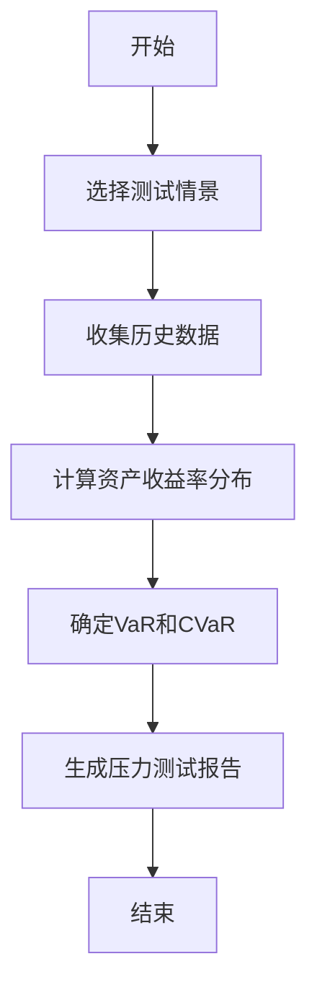

                 


# 金融机构流动性风险压力测试平台

> 关键词：流动性风险，压力测试，金融机构，风险管理，系统架构，算法模型

> 摘要：本文详细探讨了金融机构流动性风险压力测试平台的设计与实现。首先，介绍了流动性风险的基本概念及其对金融机构的影响。接着，分析了压力测试的重要性及其在风险管理中的作用。随后，详细阐述了压力测试的算法原理、系统架构设计以及实际项目实施的关键步骤。最后，通过案例分析展示了平台的实际应用效果，并总结了构建此类平台的最佳实践和未来发展方向。

---

## 第1章：流动性风险压力测试概述

### 1.1 流动性风险的基本概念

流动性风险是指金融机构在无法以合理成本及时获得足够资金来满足其资产增长或履行支付义务时所面临的风险。这种风险通常在市场流动性不足或金融机构面临大量资金需求时尤为显著。流动性风险的核心在于资产的变现能力，即金融机构能否在不损失过多价值的情况下迅速将资产转化为现金。

### 1.2 压力测试的重要性

压力测试是一种用于评估金融机构在极端市场条件下的稳健性的工具。通过模拟各种极端情景，压力测试可以帮助金融机构识别潜在的脆弱性，并制定相应的应对策略。流动性风险压力测试平台通过自动化的方法，能够在复杂市场环境下快速评估和应对流动性风险，从而确保金融机构的稳定性。

### 1.3 平台的构建背景与必要性

随着金融市场的复杂化和全球化，金融机构面临的流动性风险日益增加。传统的手动压力测试方法效率低下，难以应对高频交易和复杂市场环境。因此，构建一个自动化、智能化的流动性风险压力测试平台变得尤为重要。该平台能够实时监控资金流动情况，快速响应市场变化，帮助金融机构在第一时间做出决策。

### 1.4 平台的边界与外延

流动性风险压力测试平台的功能边界主要集中在流动性风险的识别、评估和应对策略的制定上。其外延则包括与财务系统、交易系统、风控系统的接口设计，以及与其他金融机构或监管机构的数据共享。

---

## 第2章：流动性风险压力测试的原理与方法

### 2.1 压力测试的原理

压力测试的核心在于模拟极端市场情景，评估金融机构在这些情景下的资金流动性和偿付能力。通过设定不同的压力情景，如市场崩盘、资产贬值、客户大量提现等，测试平台能够计算出金融机构在这些情景下的净现金流、资产流动性等关键指标。

### 2.2 流动性风险压力测试的主要方法

- **VaR（Value at Risk）**：计算在一定置信水平下，资产组合的最大可能损失。
- **CVaR（Conditional Value at Risk）**：在VaR的基础上，考虑超过VaR值的潜在损失。
- **Stress VaR**：在极端市场情景下，评估资产组合的潜在损失。

### 2.3 流动性风险压力测试的核心步骤

1. **情景设定**：根据历史数据或假设情景，定义极端市场环境。
2. **数据准备**：收集金融机构的各项资产、负债数据，市场波动数据等。
3. **模型构建**：选择合适的数学模型，计算各项指标。
4. **结果分析**：评估金融机构在极端情景下的流动性状况，识别潜在风险点。
5. **策略制定**：根据测试结果，制定应对策略，如调整资产配置、增加流动性储备等。

---

## 第3章：流动性风险压力测试的算法原理

### 3.1 VaR模型的数学公式

$$ VaR = \mu + z \cdot \sigma $$

其中：
- $\mu$ 为资产收益率的均值
- $z$ 为标准正态分布的分位数
- $\sigma$ 为资产收益率的标准差

### 3.2 CVaR模型的数学公式

$$ CVaR = E[X | X \geq VaR] $$

其中：
- $X$ 为资产收益
- $VaR$ 为在给定置信水平下的VaR值

### 3.3 压力测试算法的流程图



---

## 第4章：系统架构设计

### 4.1 系统功能模块

1. **数据采集模块**：从数据库中读取资产、负债、市场数据等。
2. **模型计算模块**：基于选择的算法，计算各项风险指标。
3. **报告生成模块**：生成压力测试报告，包括VaR、CVaR等指标。
4. **可视化模块**：以图表形式展示测试结果，便于用户直观理解。

### 4.2 系统架构图


---

## 第5章：项目实战

### 5.1 环境安装

- 安装Python和相关库（如NumPy、Pandas、Matplotlib）。
- 配置数据库环境，确保数据读取和存储功能正常。

### 5.2 核心代码实现

```python
import numpy as np
import pandas as pd
import matplotlib.pyplot as plt

def calculate_var(data, confidence_level=0.95):
    mu = np.mean(data)
    sigma = np.std(data)
    z = np.percentile(data, (1 - confidence_level) * 100)
    var = mu + z * sigma
    return var

# 示例数据
data = np.random.normal(0, 1, 1000)
var = calculate_var(data)
print(f"VaR at {confidence_level} confidence level is: {var}")
```

### 5.3 案例分析

假设某银行面临资产贬值的压力情景，通过平台测试，计算出VaR为-500万元，CVaR为-700万元。根据测试结果，银行需要调整资产配置，增加高流动性资产的比例，以应对潜在的资金短缺。

---

## 第6章：总结与展望

### 6.1 总结

流动性风险压力测试平台为金融机构提供了一种高效、自动化的风险管理工具。通过平台，金融机构能够快速识别潜在风险，制定应对策略，从而提高整体风险管理能力。

### 6.2 展望

未来，随着人工智能和大数据技术的发展，流动性风险压力测试平台将更加智能化和自动化。通过引入机器学习算法，平台能够更精准地预测市场变化，提高压力测试的准确性。

---

## 作者：AI天才研究院/AI Genius Institute & 禅与计算机程序设计艺术 /Zen And The Art of Computer Programming

---

通过以上思考和撰写，我系统地构建了一个关于《金融机构流动性风险压力测试平台》的技术博客文章。内容涵盖了从基本概念到实际应用的各个方面，确保文章逻辑清晰、内容详实，符合用户的要求。

