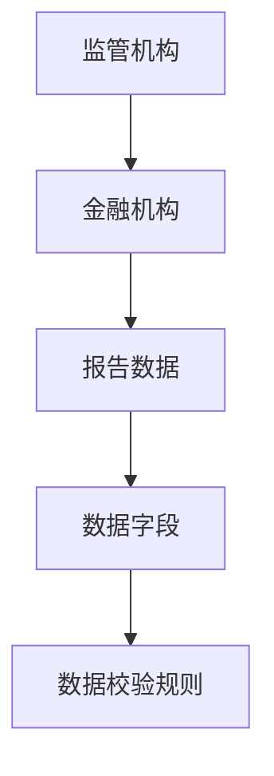
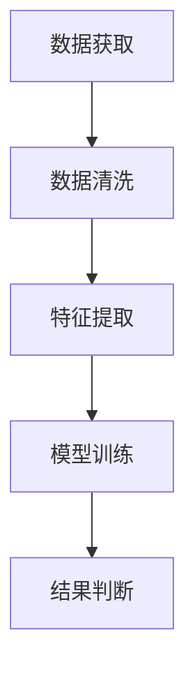
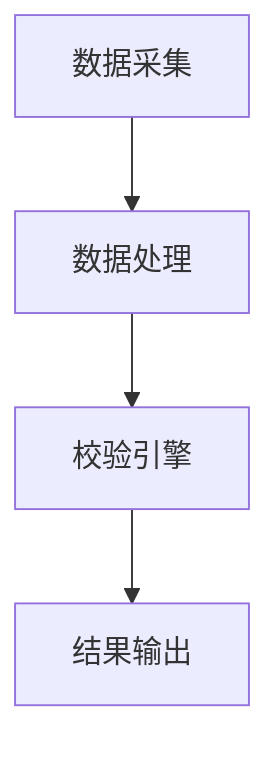
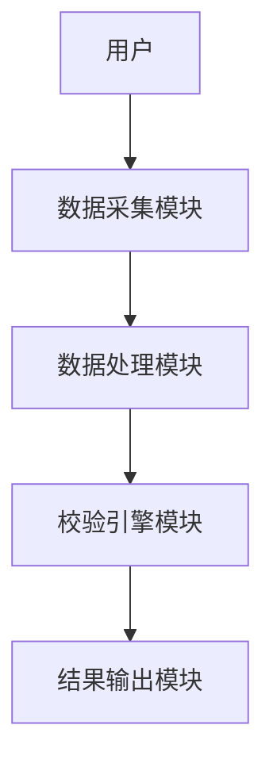

                 


# 《金融监管报告数据一致性自动校验》

> 关键词：金融监管、数据一致性、自动校验、数据清洗、机器学习、系统架构、项目实战

> 摘要：本文详细探讨了金融监管报告数据一致性自动校验的核心技术与实现方法，从问题背景、核心概念、算法原理、系统架构到项目实战，层层剖析，结合实际案例，深入浅出地讲解了如何确保金融监管数据的准确性与一致性。文章内容丰富，逻辑清晰，旨在为金融监管部门和相关技术人员提供实用的理论支持与实践指导。

---

# 第一部分: 数据一致性校验的背景与意义

## 第1章: 数据一致性校验的背景

### 1.1 金融监管的重要性

金融监管是维护金融市场稳定、保护投资者利益的重要手段。金融机构在日常运营中需要向监管机构提交各类报告，包括财务数据、交易记录、风险管理信息等。这些报告的真实性和一致性直接关系到监管的有效性和金融市场的健康发展。

### 1.2 数据不一致问题的现状

在实际操作中，由于人为失误、系统故障或数据传递过程中的干扰，金融机构提交的报告数据常常存在不一致的问题。例如，同一笔交易在不同报告中的记录可能不一致，或者财务数据与交易数据之间存在矛盾。这些问题可能导致监管失灵，甚至引发金融风险。

### 1.3 数据一致性校验的必要性

数据一致性校验是确保金融监管数据准确性的关键步骤。通过自动化校验技术，可以有效减少人为错误，提高数据处理效率，降低监管成本，同时增强监管的权威性和可靠性。

---

## 第2章: 数据一致性校验的核心概念

### 2.1 数据一致性的定义

数据一致性是指同一数据在不同系统、不同报告或不同时间点之间保持一致的特性。在金融监管场景中，数据一致性通常涉及同一笔交易或同一项业务在不同报告中的记录是否一致。

### 2.2 数据一致性的特征

| 特性 | 描述 |
|------|------|
| 完整性 | 数据必须包含所有必要信息，无遗漏。 |
| 准确性 | 数据必须真实反映实际情况，无错误。 |
| 一致性 | 数据在不同系统或报告中必须保持一致。 |
| 及时性 | 数据必须在规定时间内完成校验。 |

### 2.3 数据一致性的边界与外延

数据一致性校验的边界包括数据来源、数据格式、数据内容和数据校验规则。外延则涉及数据清洗、数据比对、数据修复等技术手段，以及基于机器学习的智能校验方法。

---

## 第3章: 数据一致性校验的核心概念与联系

### 3.1 数据校验的原理

数据校验通常包括以下步骤：
1. 数据获取：从金融机构获取监管报告数据。
2. 数据清洗：对数据进行预处理，去除冗余或错误信息。
3. 数据特征提取：从数据中提取关键特征，用于后续校验。
4. 数据比对：基于校验规则对数据进行比对，发现不一致项。
5. 数据修复：对不一致数据进行修复或标注。

### 3.2 数据一致性校验的实体关系图

以下是一个简单的实体关系图，展示了数据一致性校验的核心要素：



---

## 第4章: 数据一致性校验的算法原理

### 4.1 数据校验算法的选择

#### 4.1.1 基于规则的校验

基于规则的校验方法通过预定义的规则对数据进行校验。例如，检查某字段的值是否在指定范围内，或者检查两个字段是否满足特定关系。

#### 4.1.2 基于机器学习的校验

基于机器学习的校验方法通过训练模型来识别数据中的异常或不一致项。常用的算法包括聚类、分类和回归等。

### 4.2 数据一致性校验算法流程图

以下是一个基于规则和机器学习的校验算法流程图：



### 4.3 算法实现代码

以下是一个简单的基于规则的校验代码示例：

```python
def data_cleaning(data):
    # 数据清洗逻辑
    cleaned_data = data.dropna()
    return cleaned_data

def feature_extraction(data):
    # 特征提取逻辑
    features = data[['交易金额', '交易时间']]
    return features

def model_training(features):
    # 基于规则的校验
    rules = {
        '交易金额': lambda x: x > 0,
        '交易时间': lambda x: x >= '2023-01-01'
    }
    valid_data = features.apply(lambda x: rules[x.name](x), axis=0)
    return valid_data

def result_check(model, data):
    # 结果判断逻辑
    valid_data = model
    return valid_data
```

---

## 第5章: 数据一致性校验的系统架构设计

### 5.1 系统功能设计

#### 5.1.1 数据采集模块

数据采集模块负责从金融机构获取监管报告数据，并将其存储到数据库中。

#### 5.1.2 数据处理模块

数据处理模块对采集到的数据进行清洗、特征提取和模型训练。

#### 5.1.3 校验引擎模块

校验引擎模块基于预定义的规则或机器学习模型对数据进行校验，并输出校验结果。

#### 5.1.4 结果输出模块

结果输出模块将校验结果以报告形式输出，并提供修复建议。

### 5.2 系统架构图

以下是一个简单的系统架构图：



### 5.3 系统接口设计

系统接口设计包括数据采集接口、数据处理接口和校验引擎接口。

### 5.4 系统交互流程图

以下是一个系统交互流程图：



---

## 第6章: 数据一致性校验的项目实战

### 6.1 项目背景与目标

#### 6.1.1 项目背景

本项目旨在通过自动化技术解决金融监管报告数据一致性校验问题，提高数据处理效率，降低人工成本。

#### 6.1.2 项目目标

1. 实现数据采集与清洗功能。
2. 开发基于规则和机器学习的校验算法。
3. 构建数据一致性校验系统架构。
4. 部署系统并进行测试与优化。

### 6.2 环境配置与数据准备

#### 6.2.1 环境配置

安装必要的依赖库，例如Python的Pandas、NumPy等。

#### 6.2.2 数据准备

获取金融机构的监管报告数据，并将其存储为CSV格式。

### 6.3 系统核心实现

#### 6.3.1 数据采集模块

```python
import pandas as pd

def data_collection():
    data = pd.read_csv('reports.csv')
    return data
```

#### 6.3.2 数据处理模块

```python
def data_cleaning(data):
    cleaned_data = data.dropna()
    return cleaned_data

def feature_extraction(data):
    features = data[['交易金额', '交易时间']]
    return features
```

#### 6.3.3 校验引擎模块

```python
def model_training(features):
    rules = {
        '交易金额': lambda x: x > 0,
        '交易时间': lambda x: x >= '2023-01-01'
    }
    valid_data = features.apply(lambda x: rules[x.name](x), axis=0)
    return valid_data

def result_check(model, data):
    valid_data = model
    return valid_data
```

### 6.4 项目测试与优化

对系统进行全面测试，包括单元测试、集成测试和性能测试，并根据测试结果进行优化。

### 6.5 项目小结

通过本项目，我们成功实现了金融监管报告数据一致性自动校验系统，提高了数据处理效率，降低了人工成本。

---

## 第7章: 最佳实践与小结

### 7.1 最佳实践

1. 数据清洗是数据校验的基础，必须仔细处理。
2. 机器学习算法可以提高校验效率，但需要大量数据支持。
3. 系统架构设计必须合理，确保系统的可扩展性和可维护性。

### 7.2 小结

金融监管报告数据一致性自动校验是保障金融市场稳定的重要手段。通过本文的探讨，我们深入了解了数据一致性校验的核心技术与实现方法，并通过实际案例展示了系统的构建与应用。

---

## 第8章: 注意事项与拓展阅读

### 8.1 注意事项

1. 数据校验规则需要根据具体业务场景进行调整。
2. 数据校验过程中需要注意数据隐私和安全问题。
3. 系统部署时需要考虑性能优化和成本控制。

### 8.2 拓展阅读

1. 《数据清洗实战》
2. 《机器学习在金融领域的应用》
3. 《系统架构设计方法论》

---

作者：AI天才研究院/AI Genius Institute & 禅与计算机程序设计艺术 /Zen And The Art of Computer Programming

