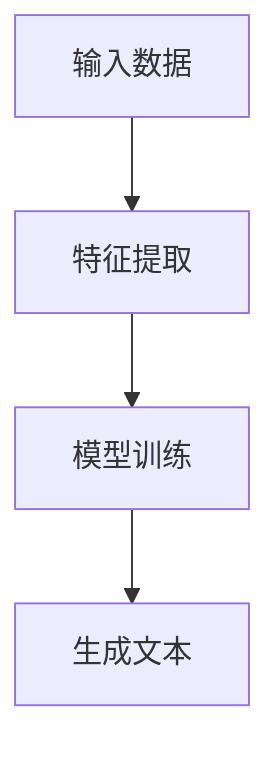
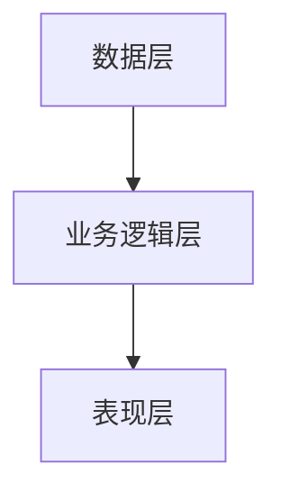

                 


# 金融监管报告自动化生成工具

## 关键词
- 金融监管
- 自动化生成
- 自然语言处理
- 机器学习
- 系统架构

## 摘要
金融监管是保障金融市场健康运行的重要环节，传统的监管报告生成方式存在效率低、易出错等问题。本文提出了一种基于自然语言处理和机器学习的金融监管报告自动化生成工具，详细介绍了其核心概念、算法原理、系统架构及实际应用，为金融监管的自动化提供了新的思路。

---

# 第一部分: 问题背景与核心概念

## 第1章: 问题背景与核心概念

### 1.1 问题背景
#### 1.1.1 金融监管的重要性
金融监管是维护金融市场秩序、保护投资者利益的重要手段。随着金融市场的复杂化，监管机构需要处理大量数据，传统的手动报告生成方式效率低下，容易出错。

#### 1.1.2 传统监管报告生成的痛点
- 数据量大，人工处理耗时长
- 易受人为因素影响，准确性差
- 报告格式不统一，难以标准化

#### 1.1.3 自动化监管报告生成的必要性
通过自动化工具，可以提高报告生成的效率和准确性，降低人为错误，满足监管机构日益增长的需求。

### 1.2 核心概念与定义
#### 1.2.1 金融监管的定义
金融监管是指监管机构对金融机构及其市场行为进行监督、管理，以确保金融市场稳定运行。

#### 1.2.2 监管报告的类型与结构
- **定期报告**：如月报、季报、年报
- **实时报告**：如交易监控报告
- **风险评估报告**：如压力测试报告

#### 1.2.3 自动化生成工具的定义与特点
- **定义**：基于人工智能技术，自动从数据中提取信息并生成报告的工具。
- **特点**：
  - 高效性：快速处理大量数据
  - 准确性：减少人为错误
  - 智能性：能够适应数据变化

---

## 第2章: 核心概念与联系

### 2.1 金融监管与自动化生成工具的关系
#### 2.1.1 金融监管的流程
1. 数据收集
2. 数据分析
3. 报告生成
4. 报告审核
5. 报告提交

#### 2.1.2 自动化生成工具在监管中的作用
- 数据收集与预处理
- 自动分析与生成报告
- 报告审核与优化

#### 2.1.3 工具与监管目标的匹配
自动化工具通过提高效率和准确性，帮助监管机构更好地实现监管目标。

### 2.2 核心概念对比表
#### 表2.1: 传统监管 vs 自动化监管的核心要素对比
| 要素         | 传统监管 | 自动化监管 |
|--------------|----------|------------|
| 数据处理     | 手动     | 自动        |
| 时间效率     | 低       | 高          |
| 准确性       | 易错     | 高          |
| 适应性       | 差       | 好          |

### 2.3 ER实体关系图
```mermaid
er
    actor: 监管机构
    report: 监管报告
    tool: 自动化生成工具
    actor --> report: 提交
    actor --> tool: 使用
    tool --> report: 生成
```

---

## 第3章: 算法原理与数学模型

### 3.1 自然语言处理算法
#### 3.1.1 文本分类算法
- **任务**：将监管报告分类到不同类别（如风险报告、合规报告）。
- **算法**：使用支持向量机（SVM）或随机森林（Random Forest）进行分类。

#### 3.1.2 生成模型
- **任务**：根据输入数据生成符合要求的监管报告。
- **算法**：使用循环神经网络（RNN）或变种的Transformer模型（如GPT）进行文本生成。

#### 3.1.3 基于深度学习的文本生成流程图


### 3.2 数学模型与公式
#### 3.2.1 文本相似度计算公式
$$ \text{相似度} = \frac{\sum_{i=1}^{n} w_i \cdot s_i}{\sum_{i=1}^{n} w_i} $$

#### 3.2.2 生成模型的损失函数
$$ \mathcal{L} = -\sum_{i=1}^{n} \log p(x_i|y_i) $$

---

## 第4章: 系统分析与架构设计

### 4.1 系统功能设计
#### 4.1.1 数据采集模块
- 从多种数据源（如数据库、API）获取监管数据。
- 数据清洗与预处理。

#### 4.1.2 数据分析模块
- 使用NLP和机器学习算法对数据进行分析。
- 生成初步报告草稿。

#### 4.1.3 报告生成模块
- 根据分析结果生成最终报告。
- 支持多种格式输出（如PDF、Excel）。

#### 4.1.4 报告审核模块
- 自动生成审核日志，记录审核结果。
- 提供反馈机制，优化生成模型。

### 4.2 系统架构设计
#### 4.2.1 分层架构
- **数据层**：数据采集与存储。
- **业务逻辑层**：数据处理与分析。
- **表现层**：用户交互与报告展示。

#### 4.2.2 系统架构图


---

## 第5章: 项目实战

### 5.1 环境安装
#### 5.1.1 安装Python
```bash
python --version
pip install --upgrade pip
```

#### 5.1.2 安装相关库
```bash
pip install numpy
pip install pandas
pip install scikit-learn
pip install transformers
```

### 5.2 核心代码实现
#### 5.2.1 数据预处理
```python
import pandas as pd

def preprocess_data(data):
    # 假设data是一个DataFrame
    data.dropna(inplace=True)
    data['text'] = data['text'].apply(lambda x: x.strip())
    return data
```

#### 5.2.2 文本生成模型
```python
from transformers import GPT2LMHeadModel, GPT2Tokenizer

tokenizer = GPT2Tokenizer.from_pretrained('gpt2')
model = GPT2LMHeadModel.from_pretrained('gpt2')

def generate_report(prompt):
    inputs = tokenizer.encode(prompt, return_tensors='pt')
    outputs = model.generate(inputs, max_length=500, temperature=0.7)
    report = tokenizer.decode(outputs[0], skip_special_tokens=True)
    return report
```

### 5.3 实际案例分析
#### 5.3.1 案例背景
某银行需要生成季度财务报告，数据来源包括财务报表和交易记录。

#### 5.3.2 数据分析与生成
使用预训练的生成模型，根据输入数据生成符合格式的财务报告。

### 5.4 项目小结
通过实际案例，验证了自动化生成工具的有效性，提高了报告生成的效率和准确性。

---

## 第6章: 总结与展望

### 6.1 最佳实践
- 定期优化模型，适应数据变化。
- 提供用户反馈机制，持续改进生成效果。

### 6.2 小结
本文详细介绍了金融监管报告自动化生成工具的核心概念、算法原理和系统架构，展示了其在实际应用中的优势。

### 6.3 注意事项
- 数据隐私保护
- 模型的可解释性
- 系统的稳定性与可靠性

### 6.4 拓展阅读
- 《深度学习在金融领域的应用》
- 《自然语言处理技术与金融监管》

---

## 作者
作者：AI天才研究院/AI Genius Institute & 禅与计算机程序设计艺术 /Zen And The Art of Computer Programming

---

# 结语
金融监管报告的自动化生成是未来监管技术发展的重要方向，通过本文的介绍，读者可以深入了解其技术细节和实际应用，为金融监管的智能化发展提供参考。

