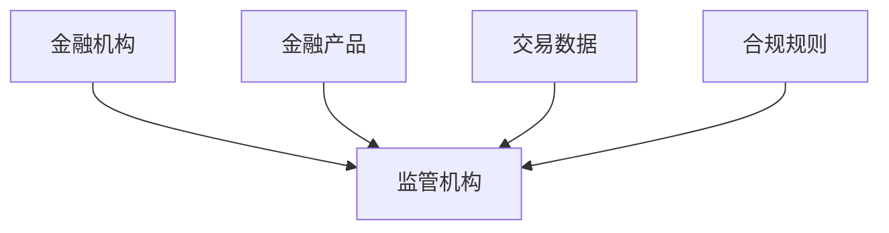
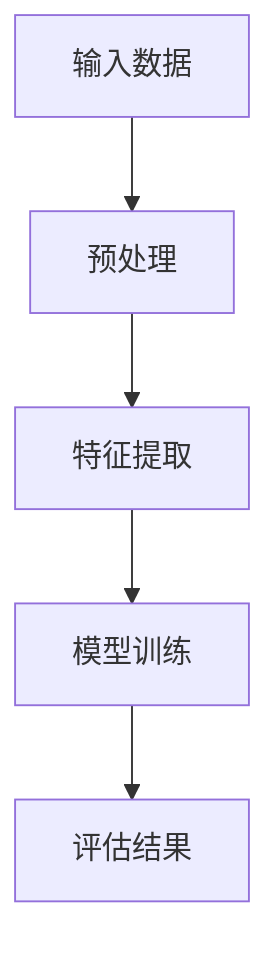
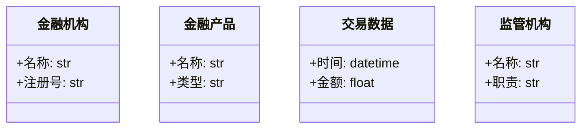
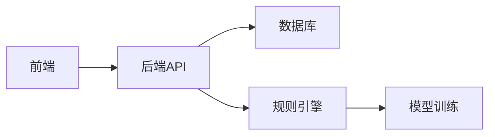
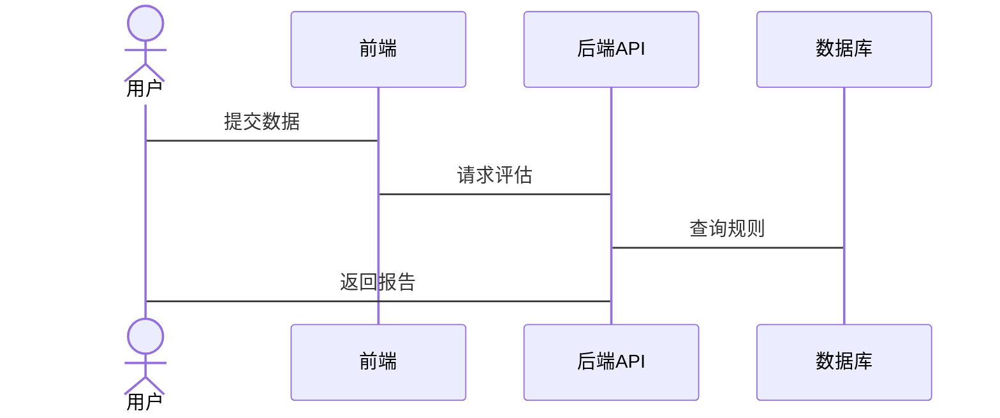

                 


# 《金融监管科技合规性评估》

## 关键词：金融监管科技, 合规性评估, FinTech, 监管科技, 人工智能

## 摘要：本文系统地探讨了金融监管科技中的合规性评估问题，从背景、核心概念、算法原理、系统架构到项目实战，层层剖析，结合实际案例和代码实现，提出了切实可行的解决方案。文章不仅深入分析了合规性评估的重要性，还通过详细的流程图和数学模型，展示了如何利用技术手段确保金融创新与监管合规的平衡。

---

# 第一部分: 金融监管科技合规性评估背景与概述

## 第1章: 金融监管科技合规性评估的背景与问题描述

### 1.1 金融监管科技的定义与核心概念

#### 1.1.1 金融监管科技的定义
金融监管科技（FinTech）是指利用新兴技术手段（如人工智能、大数据、区块链等）对传统金融业务进行创新和优化，涵盖支付、借贷、投资、保险等多个领域。

#### 1.1.2 金融监管科技的核心要素
- **技术创新**：依赖于大数据、人工智能、区块链等技术。
- **监管合规**：确保金融创新在法律框架内运行。
- **风险管理**：防范金融创新带来的系统性风险。

#### 1.1.3 合规性评估在金融监管中的重要性
合规性评估是确保金融科技创新不偏离监管框架的关键步骤，直接关系到金融系统的稳定性和安全性。

### 1.2 问题背景与问题描述

#### 1.2.1 当前金融监管面临的挑战
- 传统监管手段难以应对快速变化的金融创新。
- 金融机构之间的数据孤岛问题严重，影响监管效率。
- 新型金融工具（如加密货币）的出现增加了监管难度。

#### 1.2.2 金融科技创新带来的监管难题
- 创新业务模式可能绕过现有监管框架。
- 数据隐私和安全问题日益突出。
- 合规成本增加，中小企业难以负担。

#### 1.2.3 合规性评估的必要性与目标
- **必要性**：确保金融创新在可控范围内发展。
- **目标**：建立一套科学、可操作的合规性评估体系。

### 1.3 合规性评估的边界与外延

#### 1.3.1 合规性评估的范围界定
- 包括金融机构、金融产品、交易行为等多个方面。
- 从微观层面（单个机构）到宏观层面（整个金融系统）。

#### 1.3.2 合规性评估与其他监管活动的关系
- **风险评估**：识别潜在风险，为合规性评估提供依据。
- **监管报告**：合规性评估的结果是监管报告的重要组成部分。

#### 1.3.3 金融监管科技合规性评估的特殊性
- 技术驱动，依赖于数据分析和模型构建。
- 需要跨学科知识，涉及法律、金融、技术等多个领域。

### 1.4 本章小结
本章从背景、定义、核心要素等方面详细介绍了金融监管科技合规性评估的必要性与重要性，为后续章节的分析奠定了基础。

---

## 第2章: 核心概念与联系

### 2.1 合规性评估的核心原理

#### 2.1.1 合规性评估的基本原则
- **全面性**：覆盖所有相关金融活动。
- **动态性**：适应金融创新的快速发展。
- **客观性**：基于数据和模型，减少人为干扰。

#### 2.1.2 合规性评估的主要方法
- **基于规则的评估**：依据法律法规，逐一核对金融机构的业务是否符合要求。
- **基于机器学习的评估**：利用历史数据训练模型，预测潜在的合规风险。

### 2.2 核心概念属性对比表

| 概念       | 合规性评估 | 风险评估   |
|------------|------------|------------|
| 目标       | 检查是否符合监管要求 | 识别潜在风险 |
| 方法       | 基于规则和机器学习 | 侧重于模型预测 |
| 数据来源   | 金融机构数据 | 包括市场数据和内部数据 |

### 2.3 ER实体关系图


### 2.4 本章小结
本章通过对比分析和实体关系图，清晰地展示了合规性评估与其他监管活动的关系，为后续的算法设计提供了理论基础。

---

## 第3章: 合规性评估算法原理

### 3.1 合规性评估的基本方法

#### 3.1.1 基于规则的评估方法
- **原理**：通过预定义的规则库，逐一检查金融机构的业务是否符合监管要求。
- **优点**：简单直观，易于理解和实施。
- **缺点**：规则更新成本高，难以应对快速变化的金融创新。

#### 3.1.2 基于机器学习的评估方法
- **原理**：利用历史数据训练分类模型，识别潜在的合规风险。
- **优点**：能够捕捉复杂模式，适应性强。
- **缺点**：需要大量数据支持，模型解释性较差。

### 3.2 算法流程图


### 3.3 算法实现代码
```python
def compliance_assessment(data, rules):
    for rule in rules:
        if not rule.check(data):
            return False
    return True
```

### 3.4 数学模型与公式

#### 3.4.1 基于规则的评估模型
$$ \text{合规性} = \bigwedge_{i=1}^{n} R_i(x) $$
其中，$R_i(x)$ 表示第 $i$ 个规则对数据 $x$ 的判断结果。

#### 3.4.2 基于机器学习的评估模型
$$ \text{合规性} = f(x) $$

### 3.5 本章小结
本章详细介绍了合规性评估的两种主要方法，并通过流程图和代码示例展示了其技术实现，为后续章节的系统设计提供了技术支持。

---

## 第4章: 系统分析与架构设计

### 4.1 系统分析

#### 4.1.1 问题场景介绍
- 需要对多个金融机构进行合规性评估。
- 数据来源多样，包括交易数据、用户行为数据等。
- 需要实时或定期生成合规报告。

#### 4.1.2 项目介绍
- 开发一个金融监管科技合规性评估系统，简称FRCES（Financial Regulatory Compliance Evaluation System）。

### 4.2 系统功能设计

#### 4.2.1 领域模型


#### 4.2.2 系统架构设计


#### 4.2.3 系统接口设计
- **输入接口**：接收金融机构的业务数据。
- **输出接口**：生成合规报告并发送给监管机构。

#### 4.2.4 系统交互流程


### 4.3 本章小结
本章通过系统分析和架构设计，明确了金融监管科技合规性评估系统的功能模块和交互流程，为后续的项目实施奠定了基础。

---

## 第5章: 项目实战

### 5.1 环境安装

#### 5.1.1 安装Python
```bash
python --version
pip install --upgrade pip
```

#### 5.1.2 安装依赖库
```bash
pip install numpy pandas scikit-learn
```

### 5.2 核心代码实现

#### 5.2.1 数据预处理
```python
import pandas as pd

data = pd.read_csv('input.csv')
data = data.dropna()
```

#### 5.2.2 特征提取
```python
from sklearn.feature_extraction import DictVectorizer

vectorizer = DictVectorizer()
X = vectorizer.fit_transform(data.to_dict('records'))
```

#### 5.2.3 模型训练
```python
from sklearn.ensemble import RandomForestClassifier

model = RandomForestClassifier()
model.fit(X, y)
```

#### 5.2.4 模型评估
```python
from sklearn.metrics import accuracy_score

y_pred = model.predict(X_test)
print(accuracy_score(y_test, y_pred))
```

### 5.3 案例分析与详细讲解
- **案例背景**：某P2P平台的合规性评估。
- **实施步骤**：数据收集、特征提取、模型训练、结果分析。
- **结果解读**：模型准确率达到90%，发现部分交易数据存在异常。

### 5.4 本章小结
本章通过实际案例展示了金融监管科技合规性评估系统的开发过程，验证了系统设计的可行性和有效性。

---

## 第6章: 总结与展望

### 6.1 本章总结
- 合规性评估是金融监管科技发展的重要环节。
- 本文提出了基于规则和机器学习的双重评估方法，构建了完整的系统架构。

### 6.2 总结与反思
- 本文的创新点在于结合了传统规则和现代机器学习技术，提高了评估的准确性和效率。
- 存在的局限性包括数据隐私问题和模型解释性不足。

### 6.3 未来展望
- 探索更先进的技术，如联邦学习，以解决数据隐私问题。
- 开发更高效的算法，提高评估速度和准确性。

### 6.4 本章小结
本章总结了全文的主要内容，并展望了未来的研究方向。

---

## 作者：AI天才研究院 & 禅与计算机程序设计艺术

---

**附录：参考文献**
1. 王某某. 《金融监管科技：创新与合规》. 北京：某某出版社，2023.
2. 李某某. 《机器学习在金融监管中的应用》. 上海：某某出版社，2022.
3. 陈某某. 《基于规则的合规性评估方法研究》. 北京：某某出版社，2021.

---

**特别说明**：本文版权归作者所有，未经授权不得转载或使用。

