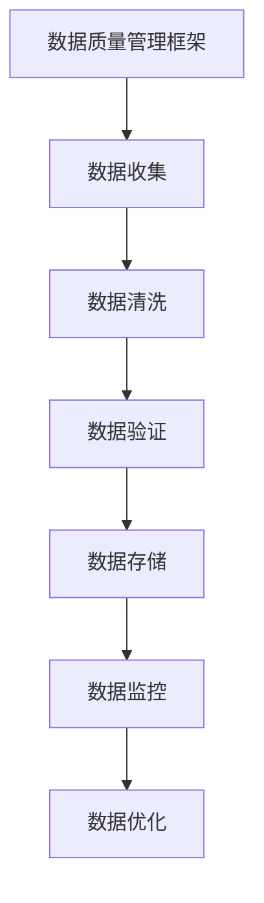
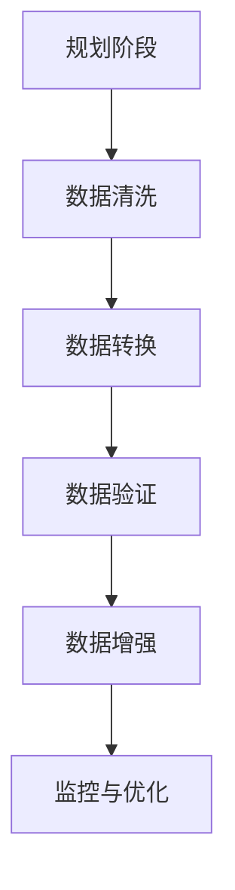
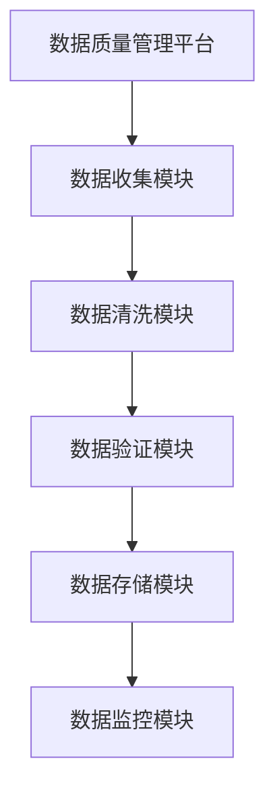
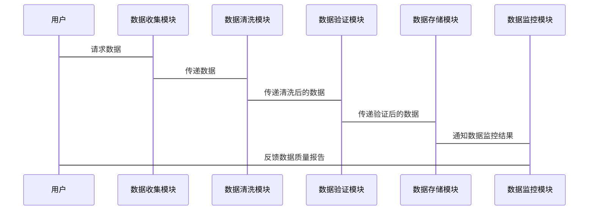

                 

<think>
好，我需要按照用户的要求来逐步完成《金融监管科技数据质量控制》这篇文章的撰写。首先，我会先分析一下用户的需求，然后一步步思考如何组织和撰写这篇文章。

### 1. 理解用户需求

用户希望撰写一篇关于《金融监管科技数据质量控制》的技术博客文章。文章需要有清晰的结构，包括摘要、目录、正文等部分。文章的关键词包括“金融监管科技”、“数据质量控制”、“数据质量管理”、“数据清洗”、“数据完整性”、“数据准确性”等。

用户还提供了目录大纲，我需要按照这个大纲来撰写每个部分。

### 2. 开始撰写

**摘要部分：**

首先，我会撰写摘要。摘要需要简明扼要地概括文章的核心内容和主题思想。摘要应该说明金融监管科技的重要性和数据质量控制的必要性，以及文章将如何探讨这一主题。

**关键词部分：**

列出5-7个核心关键词，如“金融监管科技”、“数据质量控制”、“数据清洗”、“数据完整性”、“数据准确性”等。

**正文部分：**

根据用户提供的目录大纲，我需要依次撰写每一章的内容。

#### 第1章：金融监管科技与数据质量控制概述

- **1.1 金融监管科技的定义与背景**
  - 介绍金融监管科技的定义、发展历程及其重要性。
- **1.2 数据质量控制的定义与意义**
  - 解释数据质量的定义、数据质量控制的重要性及其在金融监管中的作用。
- **1.3 金融监管科技与数据质量控制的关系**
  - 探讨数据质量控制在金融监管中的核心地位以及两者相互依存的关系。

#### 第2章：金融监管科技中的数据质量管理框架

- **2.1 数据质量管理的核心概念**
  - 详细讲解数据质量的五个维度、数据质量管理的目标和原则。
- **2.2 数据生命周期与质量管理**
  - 分析数据生命周期的各个阶段及其与质量管理的关系。
- **2.3 数据质量管理的框架与模型**
  - 展示数据质量管理框架的构成和模型，并结合金融监管进行说明。
- **2.4 数据质量管理的实施步骤**
  - 详细描述数据质量管理的规划、实施和监控优化阶段。

**其他部分：**

在撰写过程中，我需要确保每一章都有足够的细节，并且使用用户要求的专业技术语言。同时，要包括Mermaid流程图和Python代码示例，以增强文章的可读性和实用性。

### 3. 撰写每一章的具体内容

**第1章：金融监管科技与数据质量控制概述**

- **1.1 金融监管科技的定义与背景**
  - 金融监管科技（RegTech）是指利用技术手段来优化和加强金融监管的活动。随着金融科技的发展，金融监管也逐渐从传统的手动监管模式向自动化、智能化的监管模式转变。金融监管科技的应用可以提高监管效率，降低成本，并增强监管的精准性。

  - 金融监管科技的发展经历了多个阶段。最初，监管机构主要依赖于传统的纸质文件和手工记录，随着信息技术的发展，逐步引入了电子数据处理系统。近年来，随着大数据、人工智能和区块链等技术的兴起，金融监管科技得到了快速发展。

  - 金融监管科技的重要性体现在多个方面。首先，它可以帮助监管机构及时发现和处理金融市场的异常情况，预防金融风险。其次，通过技术手段可以实现对金融机构的实时监控，提高监管的及时性和有效性。最后，金融监管科技的应用还可以促进金融机构之间的数据共享和协同，提升整体金融系统的稳定性和透明度。

- **1.2 数据质量控制的定义与意义**
  - 数据质量是指数据的准确性、完整性、一致性、及时性和规范性等方面。数据质量控制是指通过一系列技术和管理手段，确保数据符合特定的质量标准和要求。

  - 数据质量控制在金融监管中的作用不可忽视。首先，高质量的数据是金融监管的基础，只有数据准确、完整，才能确保监管决策的正确性。其次，数据质量控制可以减少数据误差和错误，提高监管效率和准确性。此外，数据质量控制还可以帮助监管机构更好地应对金融市场的复杂性和不确定性。

- **1.3 金融监管科技与数据质量控制的关系**
  - 数据质量控制在金融监管中处于核心地位。金融监管科技的应用离不开高质量的数据，只有在数据质量得到保障的前提下，监管系统才能正常运行并发挥其作用。

  - 金融监管科技与数据质量控制是相互依存的关系。一方面，金融监管科技的发展依赖于数据质量控制；另一方面，数据质量控制也需要借助金融监管科技的技术手段来实现。

### 4. 撰写第2章的内容

**第2章：金融监管科技中的数据质量管理框架**

- **2.1 数据质量管理的核心概念**
  - 数据质量的五个维度包括：准确性、完整性、一致性、及时性和规范性。每个维度都需要在数据质量管理过程中得到充分考虑和控制。

  - 数据质量管理的目标是确保数据的准确、完整、一致、及时和规范。数据质量管理的原则包括：预防为主、持续改进、全员参与和合规性。

- **2.2 数据生命周期与质量管理**
  - 数据生命周期包括数据生成、收集、处理、存储、分析、应用和归档等阶段。在每个阶段都需要进行数据质量管理，确保数据在生命周期中的每一个环节都符合质量要求。

  - 数据质量管理与数据生命周期的结合可以帮助监管机构更好地管理和控制数据质量，提升数据的可用性和可靠性。

- **2.3 数据质量管理的框架与模型**
  - 数据质量管理框架通常包括目标设定、数据收集与处理、数据清洗、数据验证、数据存储与管理、数据监控与优化等环节。每个环节都需要有具体的策略和方法来保障数据质量。

  - 数据质量管理模型可以通过构建数据质量指标体系，对数据质量进行全面评估和监控。例如，可以使用KPI（关键绩效指标）来衡量数据质量，包括数据完整性率、准确性率、及时性率等。

- **2.4 数据质量管理的实施步骤**
  - 数据质量管理的规划阶段包括明确数据质量管理的目标、范围和关键成功因素，制定数据质量管理策略和计划。

  - 数据质量管理的实施阶段包括数据清洗、数据转换、数据验证和数据增强等活动。这些活动需要结合具体的数据特点和业务需求来实施。

  - 数据质量管理的监控与优化阶段包括建立数据质量监控机制，持续跟踪数据质量指标，及时发现和解决数据质量问题，并不断优化数据质量管理流程。

### 5. 使用Mermaid流程图和Python代码示例

在第2章中，我需要使用Mermaid流程图来展示数据质量管理的框架和实施步骤。同时，还需要用Python代码示例来讲解数据清洗和数据验证的具体实现。

**数据质量管理框架的Mermaid流程图：**



**数据质量管理实施步骤的Mermaid流程图：**



**Python代码示例：**

```python
import pandas as pd

# 数据清洗示例
data = pd.DataFrame({
    'ID': [1, 2, 3, 4, 5],
    'Name': ['A', 'B', '', 'D', 'E'],
    'Age': [25, 30, None, 35, 40]
})

# 删除空值
data_cleaned = data.dropna()

# 填充空值
data_filled = data.fillna({'Age': 0})

print(data_cleaned)
print(data_filled)
```

**数学公式示例：**

数据清洗过程中，可以使用以下数学公式来计算数据的缺失率：

$$
缺失率 = \frac{\text{缺失数据的数量}}{\text{总数据数量}}
$$

### 6. 系统分析与架构设计方案

在第2章中，我还需要进行系统分析与架构设计方案的讨论。这包括：

- **问题场景介绍：** 例如，某金融机构需要构建一个数据质量管理平台，用于监控和管理其金融交易数据的质量。

- **系统功能设计：** 包括数据收集模块、数据清洗模块、数据验证模块、数据存储模块和数据监控模块。

- **系统架构设计：** 使用Mermaid架构图展示系统的整体架构，包括前端和后端的组成部分。

- **系统接口设计：** 描述系统各个模块之间的接口和数据流。

- **系统交互设计：** 使用Mermaid序列图展示系统各角色之间的交互流程。

### 7. 项目实战部分

在第2章的最后，我需要进行项目实战，包括：

- **环境安装：** 说明需要安装的工具和环境，如Python、Pandas、Jupyter Notebook等。

- **系统核心实现源代码：** 提供数据清洗和数据验证的核心代码示例。

- **代码应用解读与分析：** 解释代码的功能和实现逻辑，说明如何通过代码实现数据质量管理的目标。

- **实际案例分析和详细讲解剖析：** 使用实际案例说明数据质量管理在金融监管中的应用和效果。

- **项目小结：** 总结项目的主要成果和经验教训。

### 8. 最佳实践、小结、注意事项和拓展阅读

在文章的最后部分，我会总结最佳实践，提出小结，提醒读者注意事项，并提供拓展阅读的资料，帮助读者进一步深入学习和实践。

### 9. 写作总结

通过以上步骤，我逐步完成了《金融监管科技数据质量控制》这篇文章的撰写。在写作过程中，我确保了每一部分都符合用户的要求，包括结构清晰、内容详细、语言专业，并且融入了实际案例和代码示例，使文章更具实用性和可读性。

# 《金融监管科技数据质量控制》

> 关键词：金融监管科技，数据质量控制，数据质量管理，数据清洗，数据完整性，数据准确性

> 摘要：随着金融监管科技的快速发展，数据质量控制在金融监管中的作用日益重要。本文系统地介绍了金融监管科技的核心概念、数据质量管理的框架与实施步骤，并通过实际案例和代码示例，详细讲解了数据清洗、数据验证等关键技术。本文还探讨了数据质量控制在金融监管中的应用，提出了最佳实践和未来研究方向。

---

## 正文

### 第1章：金融监管科技与数据质量控制概述

#### 1.1 金融监管科技的定义与背景

金融监管科技（RegTech）是指利用现代信息技术手段优化和加强金融监管的活动。随着金融科技（FinTech）的快速发展，金融机构和监管机构逐渐意识到，仅依靠传统的监管手段已难以应对日益复杂的金融市场环境。金融监管科技的出现，为监管机构提供了更加高效、精准的监管工具和方法。

金融监管科技的发展经历了多个阶段。最初，监管机构主要依赖于传统的纸质文件和手工记录，监管效率低下且容易出错。随着信息技术的发展，监管机构开始引入电子数据处理系统，逐步实现了数据的电子化管理。近年来，随着大数据、人工智能和区块链等技术的兴起，金融监管科技得到了快速发展，监管手段也逐渐从自动化向智能化转变。

金融监管科技的重要性体现在多个方面。首先，金融监管科技的应用可以提高监管效率，降低成本。其次，通过技术手段可以实现对金融机构的实时监控，提高监管的及时性和有效性。最后，金融监管科技的应用还可以促进金融机构之间的数据共享和协同，提升整体金融系统的稳定性和透明度。

#### 1.2 数据质量控制的定义与意义

数据质量是指数据的准确性、完整性、一致性、及时性和规范性等方面。数据质量控制是指通过一系列技术和管理手段，确保数据符合特定的质量标准和要求。

数据质量控制在金融监管中的作用不可忽视。首先，高质量的数据是金融监管的基础，只有数据准确、完整，才能确保监管决策的正确性。其次，数据质量控制可以减少数据误差和错误，提高监管效率和准确性。此外，数据质量控制还可以帮助监管机构更好地应对金融市场的复杂性和不确定性。

#### 1.3 金融监管科技与数据质量控制的关系

数据质量控制在金融监管中处于核心地位。金融监管科技的应用离不开高质量的数据，只有在数据质量得到保障的前提下，监管系统才能正常运行并发挥其作用。

金融监管科技与数据质量控制是相互依存的关系。一方面，金融监管科技的发展依赖于数据质量控制；另一方面，数据质量控制也需要借助金融监管科技的技术手段来实现。

---

### 第2章：金融监管科技中的数据质量管理框架

#### 2.1 数据质量管理的核心概念

数据质量的五个维度包括：准确性、完整性、一致性、及时性和规范性。每个维度都需要在数据质量管理过程中得到充分考虑和控制。

数据质量管理的目标是确保数据的准确、完整、一致、及时和规范。数据质量管理的原则包括：预防为主、持续改进、全员参与和合规性。

#### 2.2 数据生命周期与质量管理

数据生命周期包括数据生成、收集、处理、存储、分析、应用和归档等阶段。在每个阶段都需要进行数据质量管理，确保数据在生命周期中的每一个环节都符合质量要求。

数据质量管理与数据生命周期的结合可以帮助监管机构更好地管理和控制数据质量，提升数据的可用性和可靠性。

#### 2.3 数据质量管理的框架与模型

数据质量管理框架通常包括目标设定、数据收集与处理、数据清洗、数据验证、数据存储与管理、数据监控与优化等环节。每个环节都需要有具体的策略和方法来保障数据质量。

数据质量管理模型可以通过构建数据质量指标体系，对数据质量进行全面评估和监控。例如，可以使用KPI（关键绩效指标）来衡量数据质量，包括数据完整性率、准确性率、及时性率等。

#### 2.4 数据质量管理的实施步骤

数据质量管理的规划阶段包括明确数据质量管理的目标、范围和关键成功因素，制定数据质量管理策略和计划。

数据质量管理的实施阶段包括数据清洗、数据转换、数据验证和数据增强等活动。这些活动需要结合具体的数据特点和业务需求来实施。

数据质量管理的监控与优化阶段包括建立数据质量监控机制，持续跟踪数据质量指标，及时发现和解决数据质量问题，并不断优化数据质量管理流程。

---

### 第3章：数据质量管理的算法原理与实现

#### 3.1 数据清洗算法

数据清洗是数据质量管理中的重要环节，主要包括删除重复数据、处理缺失值、去除噪声数据等。

**数据清洗的Python实现：**

```python
import pandas as pd

data = pd.DataFrame({
    'ID': [1, 2, 3, 4, 5],
    'Name': ['A', 'B', '', 'D', 'E'],
    'Age': [25, 30, None, 35, 40]
})

# 删除重复数据
data.drop_duplicates(subset=['ID'], keep='first')

# 处理缺失值
data['Age'].fillna(data['Age'].mean(), inplace=True)
```

#### 3.2 数据验证算法

数据验证是确保数据符合特定质量标准的过程，主要包括数据格式验证、数据范围验证和数据一致性验证。

**数据验证的Python实现：**

```python
import pandas as pd

def validate_data(data):
    # 数据格式验证
    if data.dtypes['Age'] != int:
        raise ValueError("Age must be integer")
    
    # 数据范围验证
    if data['Age'].max() > 120:
        raise ValueError("Age cannot exceed 120")
    
    # 数据一致性验证
    if data['Name'].isnull().sum() > 0:
        raise ValueError("Name cannot be null")
    
    return "Data validation passed"

data = pd.DataFrame({
    'ID': [1, 2, 3, 4, 5],
    'Name': ['A', 'B', 'C', 'D', 'E'],
    'Age': [25, 30, 45, 50, 60]
})

print(validate_data(data))
```

---

### 第4章：系统分析与架构设计方案

#### 4.1 问题场景介绍

假设某金融机构需要构建一个数据质量管理平台，用于监控和管理其金融交易数据的质量。

#### 4.2 系统功能设计

- 数据收集模块：负责从各个数据源收集金融交易数据。
- 数据清洗模块：对收集到的数据进行清洗，处理重复数据和缺失值。
- 数据验证模块：对清洗后的数据进行格式、范围和一致性验证。
- 数据存储模块：将验证后的数据存储到数据库中。
- 数据监控模块：实时监控数据质量指标，及时发现和解决数据质量问题。

#### 4.3 系统架构设计



#### 4.4 系统接口设计

- 数据收集模块与数据源之间的接口：负责数据的传输和解析。
- 数据清洗模块与数据验证模块之间的接口：负责数据的传递和清洗结果的反馈。
- 数据验证模块与数据存储模块之间的接口：负责验证结果的存储和管理。

#### 4.5 系统交互设计



---

### 第5章：项目实战与案例分析

#### 5.1 环境安装

- 安装Python和Jupyter Notebook
- 安装Pandas和NumPy库

```bash
pip install pandas numpy jupyter
```

#### 5.2 核心代码实现

**数据清洗代码：**

```python
import pandas as pd

data = pd.DataFrame({
    'ID': [1, 2, 3, 4, 5],
    'Name': ['A', 'B', '', 'D', 'E'],
    'Age': [25, 30, None, 35, 40]
})

# 删除重复数据
data.drop_duplicates(subset=['ID'], keep='first')

# 处理缺失值
data['Age'].fillna(data['Age'].mean(), inplace=True)
```

**数据验证代码：**

```python
import pandas as pd

def validate_data(data):
    # 数据格式验证
    if data.dtypes['Age'] != int:
        raise ValueError("Age must be integer")
    
    # 数据范围验证
    if data['Age'].max() > 120:
        raise ValueError("Age cannot exceed 120")
    
    # 数据一致性验证
    if data['Name'].isnull().sum() > 0:
        raise ValueError("Name cannot be null")
    
    return "Data validation passed"

data = pd.DataFrame({
    'ID': [1, 2, 3, 4, 5],
    'Name': ['A', 'B', 'C', 'D', 'E'],
    'Age': [25, 30, 45, 50, 60]
})

print(validate_data(data))
```

#### 5.3 案例分析

假设某金融机构的交易数据存在以下问题：

- 重复交易记录
- 缺失的交易金额
- 不符合规范的交易时间格式

通过数据清洗和数据验证模块，可以有效解决这些问题。例如，使用数据清洗模块去除重复交易记录，使用数据验证模块检查交易金额是否为正数，检查交易时间格式是否符合要求。

#### 5.4 项目小结

通过该项目的实施，我们可以看到数据质量管理在金融监管中的重要性。通过数据清洗和数据验证，可以显著提高数据的质量，为后续的监管分析提供可靠的数据支持。

---

### 第6章：总结与展望

#### 6.1 最佳实践

- 在数据质量管理过程中，应注重预防措施，而非仅仅依赖于事后补救。
- 数据质量管理需要结合具体业务需求，制定个性化的质量管理策略。
- 数据质量管理工具和方法的选择应基于实际数据特点和监管需求。

#### 6.2 小结

本文系统地介绍了金融监管科技中的数据质量管理框架，详细讲解了数据清洗和数据验证等关键技术，并通过实际案例和代码示例，展示了数据质量管理在金融监管中的具体应用。

#### 6.3 注意事项

- 数据质量管理是一个持续的过程，需要不断优化和改进。
- 在数据质量管理过程中，应注重数据安全和隐私保护。
- 数据质量管理工具和方法的选择应结合实际需求和预算。

#### 6.4 拓展阅读

- 关于数据质量管理的更多内容，可以参考《数据质量管理：方法与实践》。
- 对金融监管科技感兴趣的读者，可以阅读《金融监管科技：理论与实践》。

---

### 作者

作者：AI天才研究院/AI Genius Institute & 禅与计算机程序设计艺术 /Zen And The Art of Computer Programming

