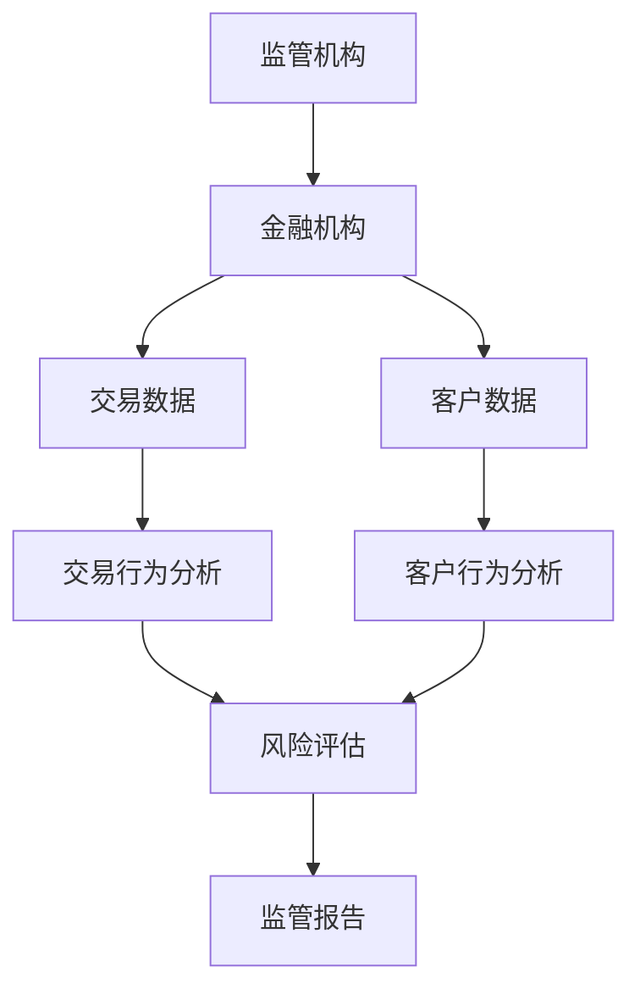
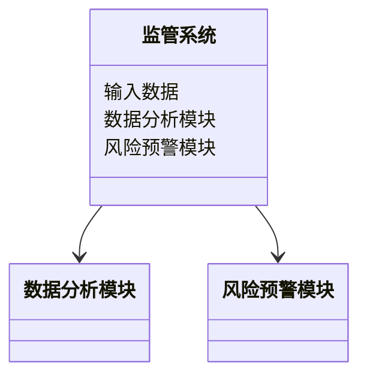
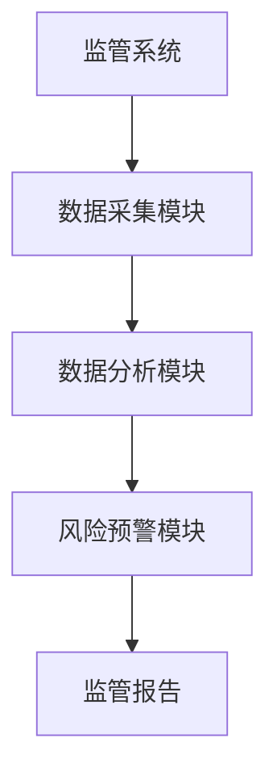

                 


# 《金融监管科技解决方案》

## 关键词：金融监管科技，RegTech，人工智能，大数据，区块链，监管合规，风险控制

## 摘要：  
随着金融行业的快速发展，监管科技（RegTech）作为一门新兴的交叉学科，正在成为提升金融监管效率和准确性的关键技术。本文详细探讨了金融监管科技的核心概念、技术原理、系统设计和实际应用，通过具体案例分析和代码实现，为读者提供一套完整的金融监管科技解决方案。文章内容涵盖从背景介绍到项目实战的全过程，旨在帮助金融机构和监管机构更好地理解和应用RegTech技术，提升金融监管的智能化和数字化水平。

---

# 第1章: 金融监管科技的背景与挑战

## 1.1 金融监管科技的定义与背景

### 1.1.1 什么是金融监管科技
金融监管科技（Regulatory Technology，简称RegTech）是指利用新兴技术手段（如人工智能、大数据、区块链等）来优化和自动化金融监管流程的一门技术。RegTech的核心目标是提高监管效率、降低合规成本，并增强金融市场的透明度和安全性。

### 1.1.2 金融监管科技的发展背景
随着金融科技（FinTech）的快速发展，金融机构的业务模式和产品创新日益复杂，传统的监管手段已难以应对新的挑战。金融监管机构需要更高效、更精准的工具来监控市场风险、打击金融犯罪、确保合规性。RegTech的出现正是为了满足这一需求。

### 1.1.3 金融监管科技的核心目标
- 提高监管效率：通过自动化技术减少人工干预，提升监管流程的效率。
- 降低合规成本：帮助金融机构更轻松地满足监管要求，减少合规成本。
- 增强透明度：通过技术手段提升市场透明度，降低信息不对称。
- 风险控制：实时监控市场风险，提前预警潜在问题。

---

## 1.2 金融监管科技的关键技术

### 1.2.1 人工智能在金融监管中的应用
人工智能（AI）通过机器学习算法分析大量数据，识别异常交易、欺诈行为和市场风险。例如，监督学习可以用于分类交易类型，无监督学习可以用于发现潜在的异常模式。

### 1.2.2 大数据技术在金融监管中的作用
大数据技术可以帮助监管机构收集和分析海量数据，提取有价值的信息，用于风险评估、市场分析和合规检查。例如，通过分析交易数据，可以识别洗钱行为。

### 1.2.3 区块链技术在金融监管中的潜力
区块链技术的透明性和不可篡改性可以用于构建可信的监管数据共享平台，确保数据的真实性和一致性。例如，区块链可以用于监管跨境支付的透明性。

---

## 1.3 金融监管科技的主要挑战

### 1.3.1 数据隐私与安全问题
RegTech需要处理大量的敏感数据，如何在保证数据隐私的前提下进行分析是一个重要挑战。

### 1.3.2 技术标准与规范的缺失
目前，RegTech领域缺乏统一的技术标准和规范，不同机构之间的技术互联互通存在困难。

### 1.3.3 监管机构的技术能力不足
传统监管机构的技术能力较弱，难以直接应用先进的RegTech技术。

---

## 1.4 本章小结
本章介绍了金融监管科技的定义、背景和核心目标，并探讨了其在人工智能、大数据和区块链等技术中的应用。同时，也分析了RegTech在实际应用中面临的主要挑战。

---

# 第2章: 金融监管科技的核心概念与联系

## 2.1 金融监管科技的核心概念

### 2.1.1 监管科技的基本原理
RegTech通过技术手段实现金融监管的自动化和智能化，包括数据收集、分析、决策和执行。

### 2.1.2 监管科技的主要特征
- 数据驱动：基于大量数据进行分析和决策。
- 智能化：利用机器学习等技术实现自动化监管。
- 可扩展性：能够适应不同规模和类型的金融机构。

### 2.1.3 监管科技的关键技术要素
- 数据采集与处理
- 模型构建与训练
- 决策与执行

---

## 2.2 金融监管科技的核心概念对比

### 2.2.1 监管科技与金融科技的对比
| 特性             | 金融科技（FinTech）                 | 监管科技（RegTech）                 |
|------------------|------------------------------------|------------------------------------|
| 核心目标         | 提供高效的金融服务                 | 提高金融监管效率                   |
| 技术手段         | 支付、借贷、投资等                 | AI、大数据、区块链等               |
| 服务对象         | 金融机构和消费者                   | 监管机构和金融机构                 |

### 2.2.2 监管科技与传统监管方式的对比
| 特性             | 传统监管方式                       | 监管科技（RegTech）                 |
|------------------|------------------------------------|------------------------------------|
| 数据处理能力     | 人工处理，效率低                   | 自动化处理，效率高                 |
| 成本             | 高                                 | 低                                 |
| 精准度           | 低                                 | 高                                 |

### 2.2.3 监管科技与区块链技术的对比
| 特性             | 监管科技（RegTech）                 | 区块链技术                         |
|------------------|------------------------------------|------------------------------------|
| 核心目标         | 提高监管效率                       | 提供透明、可信的交易记录           |
| 主要应用领域     | 金融监管                           | 跨界支付、智能合约                 |
| 技术特点         | 数据分析、机器学习                 | 去中心化、不可篡改                 |

---

## 2.3 金融监管科技的实体关系图



---

## 2.4 本章小结
本章通过对比分析，明确了金融监管科技的核心概念及其与其他技术的区别。通过实体关系图，展示了RegTech在金融监管中的整体架构和数据流。

---

# 第3章: 金融监管科技的核心算法与原理

## 3.1 金融监管科技中的算法原理

### 3.1.1 监管科技中的监督学习
监督学习是一种机器学习方法，通过训练数据中的标签信息来预测新数据的标签。例如，可以用于分类交易类型。

### 3.1.2 监管科技中的无监督学习
无监督学习是一种机器学习方法，用于发现数据中的潜在结构。例如，可以用于发现异常交易模式。

### 3.1.3 监管科技中的强化学习
强化学习是一种通过试错方式优化决策的机器学习方法。例如，可以用于动态调整监管策略。

---

## 3.2 金融监管科技中的数学模型

### 3.2.1 监管科技中的线性回归模型
线性回归是一种统计学方法，用于预测目标变量与多个自变量之间的线性关系。

$$ y = \beta_0 + \beta_1 x_1 + \beta_2 x_2 + \dots + \beta_n x_n $$

### 3.2.2 监管科技中的决策树模型
决策树是一种树状结构，用于分类和回归问题。

### 3.2.3 监管科技中的随机森林模型
随机森林是一种基于决策树的集成学习方法，通过组合多个决策树来提高模型的准确性和稳定性。

---

## 3.3 金融监管科技中的算法实现

### 3.3.1 监管科技中的算法实现步骤
1. 数据预处理：清洗、归一化、特征选择。
2. 模型训练：选择合适的算法，训练模型。
3. 模型评估：验证模型的准确性和稳定性。
4. 模型部署：将模型应用于实际监管场景。

### 3.3.2 监管科技中的算法实现代码
```python
import pandas as pd
from sklearn.model_selection import train_test_split
from sklearn.ensemble import RandomForestClassifier
from sklearn.metrics import accuracy_score

# 加载数据
data = pd.read_csv('reg_data.csv')

# 分割数据
X = data.drop('label', axis=1)
y = data['label']

X_train, X_test, y_train, y_test = train_test_split(X, y, test_size=0.2)

# 训练模型
model = RandomForestClassifier()
model.fit(X_train, y_train)

# 预测与评估
y_pred = model.predict(X_test)
print("Accuracy:", accuracy_score(y_test, y_pred))
```

---

## 3.4 本章小结
本章详细介绍了金融监管科技中的核心算法，包括监督学习、无监督学习和强化学习，并通过数学公式和代码示例，展示了这些算法在实际监管中的应用。

---

# 第4章: 金融监管科技的系统分析与架构设计

## 4.1 问题场景介绍

### 4.1.1 问题背景
金融机构需要实时监控交易数据，识别异常行为和潜在风险。

### 4.1.2 项目介绍
设计一个基于人工智能的金融监管系统，实现交易数据的实时分析和风险预警。

---

## 4.2 系统功能设计

### 4.2.1 系统功能模块
1. 数据采集模块：实时采集交易数据。
2. 数据分析模块：分析数据，识别异常交易。
3. 风险预警模块：根据分析结果，发出预警信号。

### 4.2.2 领域模型


---

## 4.3 系统架构设计

### 4.3.1 系统架构图


---

## 4.4 本章小结
本章通过系统分析和架构设计，展示了如何将RegTech技术应用于实际的金融监管场景中，确保系统的高效性和稳定性。

---

# 第5章: 金融监管科技的项目实战

## 5.1 环境安装

### 5.1.1 安装Python和相关库
```bash
pip install numpy pandas scikit-learn
```

---

## 5.2 系统核心实现

### 5.2.1 交易数据分析
```python
import pandas as pd
from sklearn.ensemble import RandomForestClassifier
from sklearn.metrics import accuracy_score

# 加载数据
data = pd.read_csv('transaction_data.csv')

# 分割数据
X = data.drop('label', axis=1)
y = data['label']

X_train, X_test, y_train, y_test = train_test_split(X, y, test_size=0.2)

# 训练模型
model = RandomForestClassifier()
model.fit(X_train, y_train)

# 预测与评估
y_pred = model.predict(X_test)
print("Accuracy:", accuracy_score(y_test, y_pred))
```

---

## 5.3 案例分析与详细讲解

### 5.3.1 案例背景
某银行需要实时监控交易数据，识别异常交易行为。

### 5.3.2 案例分析
通过训练随机森林模型，识别出异常交易，并发出预警信号。

---

## 5.4 项目小结
本章通过实际案例，展示了如何将RegTech技术应用于交易数据分析，帮助金融机构实现风险控制和合规管理。

---

# 第6章: 金融监管科技的最佳实践与小结

## 6.1 最佳实践

### 6.1.1 数据隐私与安全
确保数据的隐私性和安全性，采用加密技术和访问控制。

### 6.1.2 技术标准与规范
积极参与行业标准的制定，推动技术的互联互通。

### 6.1.3 技术能力提升
加强技术能力的培养，提升监管机构的技术能力。

---

## 6.2 小结
金融监管科技作为一门新兴技术，正在改变金融监管的方式和效率。通过本文的探讨，读者可以更好地理解和应用RegTech技术，提升金融监管的智能化和数字化水平。

---

## 注意事项
- 本文中的代码示例仅供参考，实际应用中需结合具体需求进行调整。
- 数据隐私和安全问题需要特别注意，确保符合相关法律法规。

---

## 拓展阅读
- 《金融监管科技：理论与实践》
- 《人工智能在金融监管中的应用》

---

## 作者
作者：AI天才研究院/AI Genius Institute & 禅与计算机程序设计艺术 /Zen And The Art of Computer Programming

---

以上就是《金融监管科技解决方案》的完整目录和内容概要，涵盖从背景介绍到项目实战的全过程，旨在帮助读者全面理解和应用RegTech技术。

