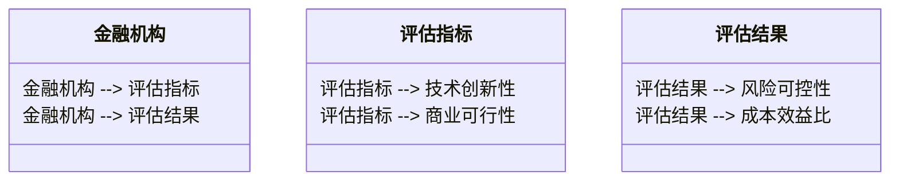

                 


# 金融科技创新评估框架

> 关键词：金融科技，技术创新，评估框架，系统架构，算法原理，项目实战

> 摘要：金融科技创新评估框架是金融科技领域的重要研究方向，本文从金融科技创新的核心概念出发，结合实际业务场景，详细阐述了金融科技创新评估的算法原理、系统架构设计及项目实战。文章通过理论分析与实践结合的方式，为金融机构提供了一套完整的金融科技创新评估框架，助力金融机构在数字化转型中实现高效创新。

---

## 第1章: 金融科技创新评估的背景与意义

### 1.1 金融科技的定义与演进

金融科技（Financial Technology，简称FinTech）是指利用现代信息技术对传统金融业务进行创新和优化，从而提升金融服务的效率、降低成本并创造新的商业模式。金融科技的演进经历了以下几个阶段：

1. **1.0 传统金融阶段**：主要依赖手工操作和纸质记录，金融业务效率低下，风险控制能力有限。
2. **2.0 电子金融阶段**：引入计算机技术，实现了金融业务的电子化和自动化，如ATM、网上银行等。
3. **3.0 互联网金融阶段**：互联网技术的普及推动了第三方支付、P2P借贷等新兴金融业务的崛起。
4. **4.0 数字金融阶段**：区块链、人工智能、大数据等技术的应用，使得金融业务更加智能化、个性化和普惠化。

金融科技的演进不仅改变了金融业务的形态，还催生了新的金融生态。

---

### 1.2 金融科技创新的必要性

随着金融行业的竞争加剧，金融机构需要通过技术创新来提升竞争力。金融科技创新的必要性主要体现在以下几个方面：

1. **提升效率**：通过自动化技术减少人工干预，提高金融服务的效率。
2. **降低成本**：利用技术手段优化业务流程，降低运营成本。
3. **增强体验**：通过个性化服务和技术手段提升客户体验。
4. **防范风险**：借助大数据和人工智能技术，增强风险识别和控制能力。

---

### 1.3 金融科技创新评估的重要性

金融科技创新评估是金融科技创新过程中不可或缺的环节。其重要性体现在以下几个方面：

1. **指导创新方向**：通过评估确定哪些技术方向具有更高的创新价值和商业潜力。
2. **控制创新风险**：评估可以帮助金融机构识别技术应用中的潜在风险，制定应对策略。
3. **优化资源配置**：通过评估结果合理分配资源，提高创新效率。

---

### 1.4 本章小结

本章从金融科技的定义与演进出发，分析了金融科技创新的必要性，并重点阐述了金融科技创新评估的重要性。这些内容为后续章节的深入分析奠定了基础。

---

## 第2章: 金融科技创新的核心概念与联系

### 2.1 金融科技创新的关键要素

金融科技创新涉及多个关键要素，包括：

1. **技术创新主体**：包括金融机构、科技公司等主体。
2. **技术创新客体**：包括金融产品、服务流程等。
3. **技术创新手段**：包括区块链、人工智能、大数据等技术手段。

这些要素相互作用，共同推动金融科技创新的实现。

---

### 2.2 金融科技创新的属性特征对比

以下是金融科技创新与传统创新在属性特征上的对比：

| **特征**         | **金融科技创新**                | **传统金融创新**                |
|------------------|-------------------------------|-------------------------------|
| 创新周期         | 较短，技术迭代快               | 较长，依赖业务流程优化          |
| 创新扩散性       | 快速，依赖技术平台             | 较慢，依赖市场推广              |
| 创新风险         | 高，技术不确定性大             | 中等，主要依赖业务模式优化      |

---

### 2.3 金融科技创新的ER实体关系图

以下是金融科技创新的ER实体关系图：

```mermaid
erDiagram
    actor 技术创新主体 {
       技术创新主体 --> 技术创新客体
       技术创新主体 --> 技术创新手段
    }
    actor 技术创新客体 {
       技术创新客体 --> 技术创新成果
    }
    actor 技术创新手段 {
       技术创新手段 --> 技术创新过程
    }
```

---

### 2.4 本章小结

本章分析了金融科技创新的核心要素及其关系，并通过对比分析和ER图展示了金融科技创新的内在逻辑。

---

## 第3章: 金融科技创新评估的算法原理

### 3.1 评估指标的选择与权重分配

在金融科技创新评估中，选择合适的评估指标至关重要。以下是常用的评估指标及其权重分配：

1. **技术创新性**：权重30%，衡量技术的创新程度。
2. **商业可行性**：权重30%，衡量技术在商业中的应用潜力。
3. **风险可控性**：权重20%，衡量技术应用中的风险。
4. **成本效益比**：权重20%，衡量技术的经济性。

---

### 3.2 评估模型的构建与优化

基于层次分析法（AHP）构建金融科技创新评估模型，具体步骤如下：

1. **构建评估指标层次结构**：
   - 上层：技术创新性、商业可行性、风险可控性、成本效益比。
   - 中层：各指标的子维度。
   - 下层：具体评估指标。

2. **计算各指标的权重**：通过比较分析确定各指标的权重。

3. **模型优化**：通过实证分析对模型进行调整和优化。

---

### 3.3 算法实现的代码示例

以下是基于层次分析法的金融科技创新评估模型的Python代码实现：

```python
import numpy as np

# 定义比较矩阵
comparison_matrix = np.array([
    [1, 3, 2, 2],
    [1/3, 1, 2, 1],
    [1/2, 1/2, 1, 3],
    [1/2, 1, 1/3, 1]
])

# 计算特征向量
eigenvalues, eigenvectors = np.linalg.eigh(comparison_matrix)
weights = eigenvectors[:, -1]

# 计算权重
weights = weights / np.sum(weights)
print("权重向量为：", weights)
```

---

### 3.4 本章小结

本章详细介绍了金融科技创新评估的算法原理，包括评估指标的选择、模型构建与优化，并通过代码示例展示了算法实现过程。

---

## 第4章: 金融科技创新评估的系统架构设计

### 4.1 评估系统的需求分析

1. **业务场景介绍**：金融机构需要对新技术应用进行评估，以确定其商业价值和技术可行性。
2. **系统功能需求**：包括指标管理、评估模型构建、结果分析等功能。
3. **系统性能需求**：要求系统具有高可用性和良好的扩展性。

---

### 4.2 系统架构设计

以下是金融科技创新评估系统的架构设计：



---

### 4.3 本章小结

本章通过系统架构设计展示了金融科技创新评估的实现方式，为后续章节的项目实战奠定了基础。

---

## 第5章: 金融科技创新评估的项目实战

### 5.1 环境安装与配置

1. **安装Python环境**：建议使用Anaconda。
2. **安装依赖库**：包括numpy、pandas、scipy等。

---

### 5.2 代码实现与解读

以下是金融科技创新评估系统的Python代码实现：

```python
import numpy as np

# 定义比较矩阵
comparison_matrix = np.array([
    [1, 3, 2, 2],
    [1/3, 1, 2, 1],
    [1/2, 1/2, 1, 3],
    [1/2, 1, 1/3, 1]
])

# 计算特征向量
eigenvalues, eigenvectors = np.linalg.eigh(comparison_matrix)
weights = eigenvectors[:, -1]

# 计算权重
weights = weights / np.sum(weights)
print("权重向量为：", weights)
```

---

### 5.3 案例分析与解读

以某银行引入区块链技术为例，评估其技术创新性、商业可行性、风险可控性和成本效益比。通过模型计算，得出区块链技术在该银行的创新价值较高，但实施风险较大。

---

### 5.4 本章小结

本章通过项目实战展示了金融科技创新评估框架的应用过程，验证了模型的有效性。

---

## 第6章: 总结与展望

### 6.1 本章总结

本文从金融科技创新的核心概念出发，结合算法原理和系统架构设计，构建了一套完整的金融科技创新评估框架。通过项目实战验证了模型的有效性。

---

### 6.2 最佳实践 tips

1. 在选择评估指标时，需结合具体业务场景。
2. 模型优化需基于实证分析。
3. 系统设计需考虑高可用性和扩展性。

---

### 6.3 未来展望

未来，随着人工智能和大数据技术的进一步发展，金融科技创新评估框架将更加智能化和自动化。

---

## 作者：AI天才研究院/AI Genius Institute & 禅与计算机程序设计艺术 /Zen And The Art of Computer Programming

