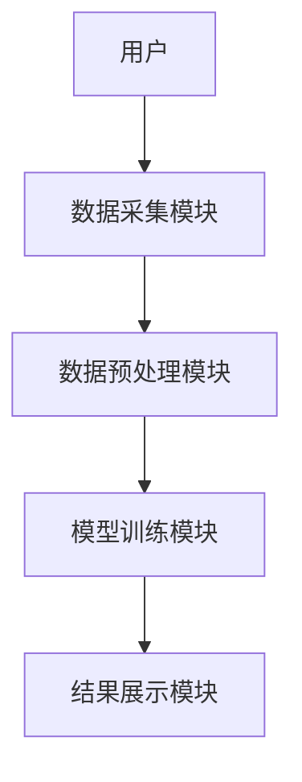

                 


**# 《金融科技创新项目ROI预测模型》**

**关键词**：金融科技创新、ROI预测模型、投资回报率、机器学习、数据分析、项目评估

**摘要**：本文详细探讨了金融科技创新项目中投资回报率（ROI）预测模型的构建与应用。通过分析项目特征、市场环境及算法原理，提出了一种基于机器学习的预测方法，并通过实际案例验证了模型的有效性。文章内容涵盖背景介绍、核心概念、算法原理、系统架构及项目实战，为金融科技创新项目的投资决策提供科学依据。

---

## **第1章: 金融科技创新项目背景与ROI预测的重要性**

### **1.1 金融科技创新的现状与趋势**

#### **1.1.1 金融科技的定义与核心领域**
金融科技（FinTech）是指利用技术创新来改善传统金融服务的效率和可用性。其核心领域包括支付、借贷、投资、保险等。

#### **1.1.2 金融科技创新的驱动因素**
技术进步（如人工智能、区块链）、市场需求、政策支持等是推动金融科技创新的主要因素。

#### **1.1.3 金融科技创新对金融行业的影响**
提高了效率、降低了成本、扩展了服务范围，但也带来了新的风险和挑战。

### **1.2 投资回报率（ROI）的基本概念**

#### **1.2.1 ROI的定义与计算公式**
ROI = （净收益 / 投资成本）× 100%

#### **1.2.2 ROI在金融项目评估中的作用**
帮助投资者评估项目的盈利能力，是决策的重要依据。

### **1.3 金融科技创新项目的特点**

#### **1.3.1 项目生命周期**
通常包括研发、测试、推广等阶段，周期较长。

#### **1.3.2 成功关键因素**
技术创新性、市场需求、团队能力等。

#### **1.3.3 风险与不确定性**
技术风险、市场风险、政策风险等。

---

## **第2章: ROI预测模型的核心要素与关系**

### **2.1 ROI预测模型的定义与目标**

#### **2.1.1 模型定义**
基于历史数据和特征，预测未来项目的ROI。

#### **2.1.2 应用场景**
项目筛选、投资决策优化等。

### **2.2 核心概念与关系分析**

#### **2.2.1 项目特征与ROI的关系**
项目规模、技术复杂度与ROI呈正相关。

#### **2.2.2 市场环境与ROI的关系**
市场需求、竞争环境影响ROI。

#### **2.2.3 模型输入与输出的关系**
输入：项目特征、市场数据；输出：预测ROI。

### **2.3 模型的核心要素**

#### **2.3.1 项目特征**
市场规模、技术复杂度、团队能力等。

#### **2.3.2 市场环境**
行业趋势、政策环境等。

#### **2.3.3 模型假设**
数据充分性、模型适用性等。

---

## **第3章: ROI预测模型的算法原理**

### **3.1 数据预处理与特征选择**

#### **3.1.1 数据清洗与标准化**
去除无效数据，标准化特征值。

#### **3.1.2 特征提取与降维**
使用主成分分析（PCA）减少特征维度。

### **3.2 模型选择与训练**

#### **3.2.1 常见预测模型**
线性回归、决策树、随机森林等。

#### **3.2.2 线性回归模型**
$$ ROI = \beta_0 + \beta_1X_1 + \beta_2X_2 + \ldots + \beta_nX_n $$

### **3.3 算法实现**

```python
from sklearn.linear_model import LinearRegression
import pandas as pd

# 加载数据
data = pd.read_csv('roi_data.csv')

# 分割特征与目标
X = data[['feature1', 'feature2']]
y = data['roi']

# 训练模型
model = LinearRegression()
model.fit(X, y)

# 预测
y_pred = model.predict(X)
```

### **3.4 模型优化与评估**

#### **3.4.1 交叉验证**
使用k折交叉验证评估模型性能。

#### **3.4.2 模型评估指标**
R²、均方误差（MSE）等。

---

## **第4章: ROI预测模型的系统架构与实现**

### **4.1 系统功能设计**

#### **4.1.1 数据采集模块**
从数据库获取项目数据。

#### **4.1.2 模型训练模块**
执行特征处理和模型训练。

#### **4.1.3 结果展示模块**
以图表形式展示预测结果。

### **4.2 系统架构设计**



### **4.3 系统接口设计**

#### **4.3.1 数据接口**
定义RESTful API接口，接收项目数据。

#### **4.3.2 预测接口**
提供API用于实时预测ROI。

---

## **第5章: 项目实战与案例分析**

### **5.1 环境安装**

```bash
pip install pandas scikit-learn
```

### **5.2 核心代码实现**

```python
from sklearn.metrics import r2_score

def evaluate_model(y_true, y_pred):
    print(f"R² Score: {r2_score(y_true, y_pred)}")
```

### **5.3 案例分析**

#### **5.3.1 数据分析**
分析历史数据，识别关键特征。

#### **5.3.2 模型预测**
预测新项目ROI，指导投资决策。

### **5.4 项目小结**

---

## **第6章: 最佳实践与总结**

### **6.1 最佳实践**

#### **6.1.1 数据质量**
确保数据准确性和完整性。

#### **6.1.2 模型选择**
根据需求选择合适的算法。

### **6.2 小结**

通过构建 ROI 预测模型，金融机构可以更科学地评估创新项目的盈利能力，优化投资决策，降低风险。

---

**作者：AI天才研究院/AI Genius Institute & 禅与计算机程序设计艺术 /Zen And The Art of Computer Programming**

