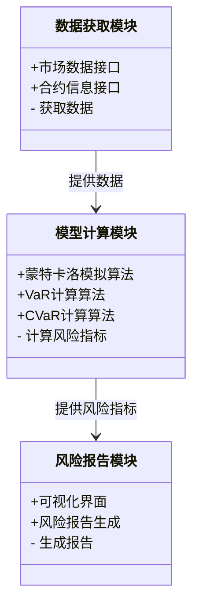
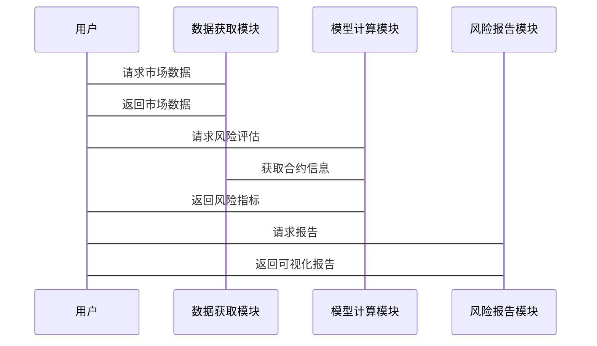

                 


# 《金融衍生品风险评估模型》

---

## 关键词：
金融衍生品、风险评估、VaR、CVaR、蒙特卡洛模拟、风险管理

---

## 摘要：
本文系统地探讨了金融衍生品风险评估模型的核心概念、算法原理、系统设计与实际应用。首先，我们介绍了金融衍生品的基本概念及其在现代金融市场中的重要性，随后分析了风险评估的关键挑战与应用场景。接着，我们深入讲解了模型的核心概念，包括风险类型、模型输入与输出、假设条件等。随后，我们详细阐述了蒙特卡洛模拟、VaR（Value at Risk）和CVaR（Conditional Value at Risk）等关键算法的原理与实现方法，并通过Python代码示例展示了这些算法的实际应用。此外，我们还探讨了系统的整体架构设计，包括功能模块划分、系统架构图和交互流程图。最后，我们通过一个具体的实战案例，展示了如何利用这些模型进行风险评估，并总结了最佳实践与未来发展方向。

---

## 第一部分：金融衍生品风险评估模型概述

---

### 第1章：金融衍生品与风险概述

#### 1.1 金融衍生品的基本概念

##### 1.1.1 金融衍生品的定义与分类

金融衍生品（Financial Derivatives）是基于基础资产（如股票、债券、商品等）的价格波动而产生的金融工具。其本质是通过合同形式约定在未来某个时间点或时间段内，以约定价格买卖资产或进行其他金融交易的权利或义务。衍生品的主要类型包括：

- **期权（Options）**：买方有权在特定时间内以特定价格买入或卖出标的资产。
- **期货（Futures）**：买方和卖方约定在未来特定时间以特定价格买入或卖出标的资产。
- **掉期（Swaps）**：双方约定在未来特定时间交换现金流的协议。
- **远期合约（Forwards）**：类似于期货，但通常在场外市场交易。

##### 1.1.2 金融衍生品的主要类型

金融衍生品可以按照不同的标准进行分类：

1. **按基础资产分类**：
   - 股权衍生品（基于股票）
   - 债权衍生品（基于债券）
   - 商品衍生品（基于商品）
   - 外汇衍生品（基于汇率）

2. **按执行方式分类**：
   - 期权（Call/Put）
   - 期货
   - 掉期

3. **按交易场所分类**：
   - 场内交易（如期货交易所）
   - 场外交易（Over-the-Counter, OTC）

##### 1.1.3 金融衍生品的市场特点与发展趋势

- **市场特点**：
  - 高杠杆性：衍生品通常允许投资者以小博大。
  - 复杂性：衍生品的交易和结算涉及复杂的法律、金融和市场操作。
  - 风险性：衍生品价格波动大，可能导致重大损失。

- **发展趋势**：
  - 数字化：随着区块链和智能合约的发展，衍生品交易正在向数字化转型。
  - 机构化：大型机构投资者在衍生品市场中占据主导地位。
  - 产品创新：衍生品的设计日益复杂，以满足多样化的市场需求。

#### 1.2 风险评估的基本概念

##### 1.2.1 风险的定义与分类

风险是指在特定条件下，某一事件发生可能导致的损失或收益的不确定性。在金融衍生品中，风险主要表现为：

1. **市场风险（Market Risk）**：由于市场价格波动导致的损失。
2. **信用风险（Credit Risk）**：由于交易对手无法履行合同义务导致的损失。
3. **流动性风险（Liquidity Risk）**：由于无法在合理时间内以合理价格买卖资产导致的损失。
4. **操作风险（Operational Risk）**：由于内部操作失误或外部事件导致的损失。

##### 1.2.2 金融衍生品中的主要风险类型

- **市场风险**：衍生品价格波动直接影响其价值，是衍生品的主要风险来源。
- **信用风险**：交易对手违约的风险在衍生品交易中尤为突出。
- **流动性风险**：某些衍生品可能难以迅速变现，导致流动性风险。

##### 1.2.3 风险评估的重要性与应用场景

- **重要性**：
  - 保护投资者和金融机构的资产安全。
  - 维持金融市场的稳定。
  - 优化投资决策。

- **应用场景**：
  - 金融机构的风险管理。
  - 投资者的资产配置。
  - 监管机构的市场监控。

#### 1.3 本章小结

- 金融衍生品是现代金融市场的重要组成部分，具有高杠杆性和复杂性。
- 风险评估是衍生品交易中的核心环节，需要综合考虑市场风险、信用风险等多种风险类型。
- 本章为后续模型的构建奠定了基础，明确了风险评估的关键目标和应用场景。

---

## 第二部分：金融衍生品风险评估模型的核心概念与联系

---

### 第2章：金融衍生品风险评估模型的核心概念与联系

#### 2.1 模型的核心概念

##### 2.1.1 风险评估的基本原理

风险评估模型通过量化分析，确定衍生品在特定市场条件下的潜在损失。其基本原理包括：

1. **输入变量**：
   - 标的资产价格历史数据。
   - 利率、波动率等市场参数。
   - 合约条款（如行权价、到期日）。

2. **处理过程**：
   - 计算衍生品的理论价值。
   - 评估价格波动对衍生品价值的影响。

3. **输出结果**：
   - 风险值（如VaR、CVaR）。
   - 模型的假设条件与边界。

##### 2.1.2 模型的输入变量与输出结果

- **输入变量**：
  - 标的资产价格数据。
  - 市场波动率。
  - 利率曲线。
  - 合约条款。

- **输出结果**：
  - Value at Risk (VaR)。
  - Conditional Value at Risk (CVaR)。
  - 模型的置信区间。

##### 2.1.3 模型的假设条件与边界

- **假设条件**：
  - 市场参数的稳定性。
  - 标的资产价格服从某种概率分布（如正态分布）。
  - 无交易成本和滑点。

- **边界**：
  - 模型的有效时间范围。
  - 数据的完整性与可靠性。

#### 2.2 核心概念的联系

##### 2.2.1 风险类型与模型输入的关系

- 市场风险与标的资产价格波动直接相关。
- 信用风险与交易对手的信用状况相关。
- 流动性风险与市场的深度和广度相关。

##### 2.2.2 模型输出与实际风险控制的关联

- VaR为风险管理部门提供了每日可能的最大损失。
- CVaR提供了在VaR基础上的更严格的风险度量。

##### 2.2.3 模型参数调整对结果的影响

- 参数调整（如波动率的调整）会影响模型输出的结果。
- 不同的假设条件会导致不同的风险评估结果。

#### 2.3 本章小结

- 本章详细阐述了金融衍生品风险评估模型的核心概念，包括输入、处理过程和输出。
- 强调了模型假设与参数调整对风险评估结果的影响。
- 为后续的算法实现奠定了理论基础。

---

## 第三部分：金融衍生品风险评估模型的算法原理

---

### 第3章：金融衍生品风险评估模型的算法原理

#### 3.1 蒙特卡洛模拟（Monte Carlo Simulation）

##### 3.1.1 蒙特卡洛模拟的原理

蒙特卡洛模拟通过随机数生成，模拟标的资产的价格路径，计算衍生品在不同路径下的价值，进而评估其风险。

步骤：
1. 生成标的资产价格的随机路径。
2. 计算每条路径下衍生品的价值。
3. 统计分析这些价值，计算VaR、CVaR等风险指标。

##### 3.1.2 蒙特卡洛模拟的实现步骤

1. **设定输入参数**：
   - 标的资产初始价格。
   - 无风险利率。
   - 波动率。
   - 时间跨度。

2. **生成随机数**：
   - 使用随机数生成器模拟价格波动。

3. **模拟价格路径**：
   - 使用随机游走模型生成多条价格路径。

4. **计算衍生品价值**：
   - 对每条价格路径，计算衍生品的理论价值。

5. **统计分析**：
   - 计算VaR、CVaR等风险指标。

##### 3.1.3 蒙特卡洛模拟的Python代码实现

```python
import numpy as np

def monte_carlo_simulation(S0, r, sigma, T, N=10000):
    # 生成随机数
    np.random.seed(42)
    random_numbers = np.random.standard_normal(N)
    
    # 计算标的资产的价格路径
    delta_t = T / 252  # 假设T为年份，252为交易日数量
    price_paths = S0 * np.exp((r - 0.5 * sigma**2) * delta_t + sigma * np.sqrt(delta_t) * random_numbers)
    
    return price_paths

# 示例
S0 = 100  # 标的资产初始价格
r = 0.05  # 无风险利率
sigma = 0.2  # 波动率
T = 1  # 时间跨度
N = 10000  # 模拟次数

price_paths = monte_carlo_simulation(S0, r, sigma, T, N)
print("Price Paths:", price_paths)
```

---

#### 3.2 VaR（Value at Risk）与CVaR（Conditional Value at Risk）

##### 3.2.1 VaR的原理与实现

VaR是指在一定置信水平下，可能的最大损失。例如，95%置信水平下，VaR表示在95%的情况下，损失不会超过VaR值。

计算步骤：
1. 模拟衍生品的价值变化。
2. 排序这些变化。
3. 根据置信水平选择相应的分位数作为VaR。

##### 3.2.2 CVaR的原理与实现

CVaR是在VaR基础上，考虑超过VaR的平均损失。CVaR用于更严格的风险度量。

计算步骤：
1. 计算VaR对应的损失值。
2. 计算VaR以上损失的平均值。

##### 3.2.3 VaR与CVaR的比较

- VaR提供的是在特定置信水平下的最大损失。
- CVaR提供的是在VaR以上的平均损失，更能反映极端损失的情况。

##### 3.2.4 VaR和CVaR的Python代码实现

```python
import numpy as np

def calculate VaR_and_CVaR(values, confidence_level=0.95):
    # 排序值
    sorted_values = np.sort(values)
    # 累积概率
    cumulative_prob = np.cumsum(np.ones_like(sorted_values) / len(sorted_values))
    # 找到VaR的位置
    var_index = np.argmax(cumulative_prob >= confidence_level)
    VaR = sorted_values[var_index]
    # 计算CVaR
    cvar_values = sorted_values[var_index:]
    CVaR = np.mean(cvar_values)
    return VaR, CVaR

# 示例
values = np.array([...])  # 模拟的衍生品价值变化
VaR, CVaR = calculate VaR_and_CVaR(values, 0.95)
print("VaR:", VaR)
print("CVaR:", CVaR)
```

---

#### 3.3 本章小结

- 蒙特卡洛模拟是金融衍生品风险评估的重要工具，适用于复杂金融工具的定价与风险评估。
- VaR和CVaR是常用的金融风险度量指标，各有优缺点。
- 本章通过Python代码示例，展示了这些算法的实现过程，为后续的系统设计奠定了基础。

---

## 第四部分：金融衍生品风险评估模型的系统分析与架构设计

---

### 第4章：金融衍生品风险评估模型的系统分析与架构设计

#### 4.1 问题场景介绍

金融衍生品交易涉及复杂的市场环境和多样化的风险类型。构建一个高效的风险评估系统，需要考虑以下问题：

- 如何实时获取市场数据？
- 如何处理复杂的衍生品合约？
- 如何选择合适的风险度量方法？
- 如何保证系统的高可用性？

#### 4.2 项目介绍

本项目旨在构建一个基于蒙特卡洛模拟的金融衍生品风险评估系统，支持多种衍生品类型的风险评估，并提供实时的风险报告。

#### 4.3 系统功能设计

##### 4.3.1 系统功能模块划分

- **数据获取模块**：实时获取市场数据和衍生品合约信息。
- **模型计算模块**：执行蒙特卡洛模拟，计算VaR和CVaR。
- **风险报告模块**：生成风险报告，提供可视化界面。

##### 4.3.2 系统功能设计的领域模型（Mermaid类图）



#### 4.4 系统架构设计

##### 4.4.1 系统架构（Mermaid架构图）

```mermaid
container 客户端 {
    include 可视化界面
}

container 服务端 {
    include 数据获取模块
    include 模型计算模块
    include 风险报告模块
}

客户端 --> 服务端: 发送请求
服务端 --> 客户端: 返回报告
```

##### 4.4.2 系统交互流程（Mermaid序列图）



#### 4.5 本章小结

- 本章通过系统功能设计和架构设计，展示了如何构建一个高效的风险评估系统。
- 类图和序列图清晰地描绘了系统的各个模块及其交互关系。
- 为后续的系统实现奠定了架构基础。

---

## 第五部分：金融衍生品风险评估模型的项目实战

---

### 第5章：金融衍生品风险评估模型的项目实战

#### 5.1 环境安装与配置

##### 5.1.1 环境要求

- Python 3.8+
- NumPy库
- Matplotlib库
- Scipy库

##### 5.1.2 安装步骤

```bash
pip install numpy matplotlib scipy
```

#### 5.2 系统核心实现源代码

##### 5.2.1 数据获取模块

```python
import numpy as np
import pandas as pd
import requests

def get_market_data(ticker, start_date, end_date):
    # 示例：从API获取市场数据
    url = f"https://api.example.com/historical_data/{ticker}"
    params = {
        'start': start_date,
        'end': end_date
    }
    response = requests.get(url, params=params)
    data = response.json()
    df = pd.DataFrame(data)
    return df['Close'].values
```

##### 5.2.2 模型计算模块

```python
def monte_carlo_simulation(S0, r, sigma, T, N=10000):
    np.random.seed(42)
    delta_t = T / 252
    random_numbers = np.random.standard_normal(N)
    price_paths = S0 * np.exp((r - 0.5 * sigma**2) * delta_t + sigma * np.sqrt(delta_t) * random_numbers)
    return price_paths

def calculate VaR(values, confidence_level=0.95):
    sorted_values = np.sort(values)
    cumulative_prob = np.cumsum(np.ones_like(sorted_values) / len(sorted_values))
    var_index = np.argmax(cumulative_prob >= confidence_level)
    return sorted_values[var_index]

def calculate CVaR(values, confidence_level=0.95):
    var = calculate VaR(values, confidence_level)
    mask = values <= var
    cvar = np.mean(values[~mask])
    return cvar
```

##### 5.2.3 风险报告模块

```python
import matplotlib.pyplot as plt

def generate_report(values, VaR, CVaR):
    plt.figure(figsize=(10, 6))
    plt.hist(values, bins=50, alpha=0.7)
    plt.axvline(x=VaR, color='r', linestyle='--', label=f'VaR at {VaR}')
    plt.axvline(x=CVaR, color='k', linestyle='--', label=f'CVaR at {CVaR}')
    plt.xlabel('Value')
    plt.ylabel('Frequency')
    plt.legend()
    plt.show()
```

#### 5.3 代码应用解读与分析

##### 5.3.1 数据获取模块的实现

- 使用`requests`库从API获取市场数据。
- 将数据转换为`Pandas DataFrame`进行处理。

##### 5.3.2 模型计算模块的实现

- `monte_carlo_simulation`函数生成标的资产的价格路径。
- `calculate VaR`和`calculate CVaR`函数分别计算VaR和CVaR。

##### 5.3.3 风险报告模块的实现

- 使用`matplotlib`绘制直方图，展示风险分布。
- 在图中添加VaR和CVaR的垂直线，直观显示风险值。

#### 5.4 实际案例分析与详细解读

##### 5.4.1 案例背景

假设我们有一个期权合约，标的资产为某股票，执行价格为100元，到期时间为1年。我们需要评估该期权的风险。

##### 5.4.2 数据获取与处理

```python
# 获取市场数据
S0 = 100  # 标的资产初始价格
r = 0.05  # 无风险利率
sigma = 0.2  # 波动率
T = 1  # 时间跨度
N = 10000  # 模拟次数

price_paths = monte_carlo_simulation(S0, r, sigma, T, N)
```

##### 5.4.3 计算VaR和CVaR

```python
# 计算VaR和CVaR
values = price_paths - S0  # 计算收益
VaR = calculate VaR(values, 0.95)
CVaR = calculate CVaR(values, 0.95)
```

##### 5.4.4 生成风险报告

```python
generate_report(values, VaR, CVaR)
```

#### 5.5 项目小结

- 本章通过实际案例，展示了如何使用Python代码实现金融衍生品风险评估模型。
- 从数据获取、模型计算到风险报告生成，完整地演示了整个流程。
- 读者可以基于此代码进一步优化和扩展，以适应不同的衍生品类型和市场环境。

---

## 第六部分：金融衍生品风险评估模型的最佳实践与小结

---

### 第6章：最佳实践与小结

#### 6.1 最佳实践

##### 6.1.1 数据质量的重要性

- 确保数据的准确性和完整性。
- 数据清洗与预处理是关键步骤。

##### 6.1.2 模型选择的策略

- 根据具体需求选择合适的模型。
- 结合实际市场情况调整模型参数。

##### 6.1.3 风险报告的可视化

- 使用图表直观展示风险结果。
- 提供多维度的可视化分析。

#### 6.2 小结

- 本文系统地探讨了金融衍生品风险评估模型的构建与应用。
- 从理论基础到算法实现，再到系统设计，全面覆盖了风险评估的关键环节。
- 通过实际案例展示了模型的实用性，为读者提供了宝贵的经验。

#### 6.3 注意事项

- 模型的选择和调整需要根据实际市场情况。
- 数据质量和模型假设对结果影响重大。
- 风险评估结果应结合市场环境进行动态调整。

#### 6.4 拓展阅读

- 推荐阅读《金融风险管理》（John C. Hull）。
- 学习相关金融数学与统计学知识。
- 关注金融市场动态与新技术的发展。

---

## 作者：AI天才研究院/AI Genius Institute & 禅与计算机程序设计艺术/Zen And The Art of Computer Programming

--- 

以上是《金融衍生品风险评估模型》的完整目录与内容框架，希望对您有所帮助！

